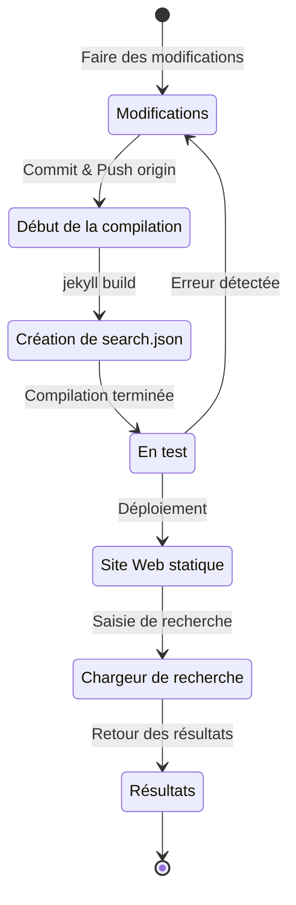

## Aperçu
Il y a environ 4 mois, début juillet 2024, j'ai ajouté le support multilingue à ce blog hébergé sur GitHub Pages en utilisant Jekyll en appliquant le plugin [Polyglot](https://github.com/untra/polyglot).
Cette série partage les bugs rencontrés lors de l'application du plugin Polyglot au thème Chirpy, leur processus de résolution, ainsi que la méthode pour écrire l'en-tête html et le sitemap.xml en tenant compte du SEO.
La série se compose de deux articles, et celui que vous lisez est le deuxième de la série.
- Partie 1 : [Application du plugin Polyglot & Implémentation des balises alt hreflang, du sitemap et du bouton de sélection de langue](/posts/how-to-support-multi-language-on-jekyll-blog-with-polyglot-1)
- Partie 2 : Résolution des problèmes de compilation du thème Chirpy et des erreurs de recherche (cet article)

## Exigences
- [x] Pouvoir fournir les résultats de la compilation (pages web) séparés par chemin linguistique (ex. `/posts/ko/`{: .filepath}, `/posts/ja/`{: .filepath}).
- [x] Pour minimiser le temps et l'effort supplémentaires nécessaires au support multilingue, pouvoir reconnaître automatiquement la langue en fonction du chemin local où se trouve le fichier markdown original (ex. `/_posts/ko/`{: .filepath}, `/_posts/ja/`{: .filepath}) lors de la compilation, sans avoir à spécifier manuellement les balises 'lang' et 'permalink' dans le YAML front matter de chaque fichier markdown écrit.
- [x] L'en-tête de chaque page du site doit inclure les balises meta Content-Language et hreflang alternatives appropriées pour répondre aux directives SEO de Google pour la recherche multilingue.
- [x] Pouvoir fournir tous les liens des pages supportant chaque langue sur le site sans omission dans `sitemap.xml`{: .filepath}, et `sitemap.xml`{: .filepath} lui-même ne doit exister qu'une seule fois dans le chemin racine sans duplication.
- [x] Toutes les fonctionnalités fournies par le [thème Chirpy](https://github.com/cotes2020/jekyll-theme-chirpy) doivent fonctionner normalement sur chaque page linguistique, sinon elles doivent être modifiées pour fonctionner correctement.
  - [x] Fonctionnement normal des fonctionnalités 'Recently Updated', 'Trending Tags'
  - [x] Pas d'erreur lors du processus de compilation utilisant GitHub Actions
  - [x] Fonctionnement normal de la fonction de recherche de posts en haut à droite du blog

## Avant de commencer
Cet article fait suite à la [partie 1](/posts/how-to-support-multi-language-on-jekyll-blog-with-polyglot-1), donc si vous ne l'avez pas encore lue, il est recommandé de la lire d'abord.

## Résolution des problèmes ('relative_url_regex': target of repeat operator is not specified)
Après avoir terminé les étapes précédentes, lorsque j'ai exécuté la commande `bundle exec jekyll serve` pour tester la compilation, une erreur s'est produite avec le message `'relative_url_regex': target of repeat operator is not specified`, et la compilation a échoué.

```shell
...(début omis)
                    ------------------------------------------------
      Jekyll 4.3.4   Please append `--trace` to the `serve` command 
                     for any additional information or backtrace. 
                    ------------------------------------------------
/Users/yunseo/.gem/ruby/3.2.2/gems/jekyll-polyglot-1.8.1/lib/jekyll/polyglot/
patches/jekyll/site.rb:234:in `relative_url_regex': target of repeat operator 
is not specified: /href="?\/((?:(?!*.gem)(?!*.gemspec)(?!tools)(?!README.md)(
?!LICENSE)(?!*.config.js)(?!rollup.config.js)(?!package*.json)(?!.sass-cache)
(?!.jekyll-cache)(?!gemfiles)(?!Gemfile)(?!Gemfile.lock)(?!node_modules)(?!ve
ndor\/bundle\/)(?!vendor\/cache\/)(?!vendor\/gems\/)(?!vendor\/ruby\/)(?!en\/
)(?!ko\/)(?!es\/)(?!pt-BR\/)(?!ja\/)(?!fr\/)(?!de\/)[^,'"\s\/?.]+\.?)*(?:\/[^
\]\[)("'\s]*)?)"/ (RegexpError)

...(fin omise)
```

Après avoir recherché si un problème similaire avait déjà été signalé, j'ai trouvé [exactement le même problème](https://github.com/untra/polyglot/issues/204) enregistré dans le dépôt Polyglot, et une solution existait également.

Dans le fichier [`_config.yml`{: .filepath}](https://github.com/cotes2020/jekyll-theme-chirpy/blob/master/_config.yml) du [thème Chirpy](https://github.com/cotes2020/jekyll-theme-chirpy) appliqué à ce blog, il existe la clause suivante :

```yml
exclude:
  - "*.gem"
  - "*.gemspec"
  - docs
  - tools
  - README.md
  - LICENSE
  - "*.config.js"
  - package*.json
```
{: file='_config.yml'}

La cause du problème réside dans le fait que les expressions régulières des deux fonctions suivantes incluses dans le fichier [`site.rb`{: .filepath}](https://github.com/untra/polyglot/blob/master/lib/jekyll/polyglot/patches/jekyll/site.rb) de Polyglot ne traitent pas correctement les motifs de globbing incluant des jokers comme `"*.gem"`, `"*.gemspec"`, `"*.config.js"` ci-dessus.


```ruby
    # a regex that matches relative urls in a html document
    # matches href="baseurl/foo/bar-baz" href="/foo/bar-baz" and others like it
    # avoids matching excluded files.  prepare makes sure
    # that all @exclude dirs have a trailing slash.
    def relative_url_regex(disabled = false)
      regex = ''
      unless disabled
        @exclude.each do |x|
          regex += "(?!#{x})"
        end
        @languages.each do |x|
          regex += "(?!#{x}\/)"
        end
      end
      start = disabled ? 'ferh' : 'href'
      %r{#{start}="?#{@baseurl}/((?:#{regex}[^,'"\s/?.]+\.?)*(?:/[^\]\[)("'\s]*)?)"}
    end

    # a regex that matches absolute urls in a html document
    # matches href="http://baseurl/foo/bar-baz" and others like it
    # avoids matching excluded files.  prepare makes sure
    # that all @exclude dirs have a trailing slash.
    def absolute_url_regex(url, disabled = false)
      regex = ''
      unless disabled
        @exclude.each do |x|
          regex += "(?!#{x})"
        end
        @languages.each do |x|
          regex += "(?!#{x}\/)"
        end
      end
      start = disabled ? 'ferh' : 'href'
      %r{(?<!hreflang="#{@default_lang}" )#{start}="?#{url}#{@baseurl}/((?:#{regex}[^,'"\s/?.]+\.?)*(?:/[^\]\[)("'\s]*)?)"}
    end
```
{: file='(chemin racine de polyglot)/lib/jekyll/polyglot/patches/jekyll/site.rb'}


Il existe deux façons de résoudre ce problème.

### 1. Forker Polyglot, modifier la partie problématique et l'utiliser
Au moment de la rédaction de cet article (novembre 2024), la [documentation officielle de Jekyll](https://jekyllrb.com/docs/configuration/options/#global-configuration) indique que le paramètre `exclude` prend en charge l'utilisation de motifs de globbing de noms de fichiers.

>"This configuration option supports Ruby's File.fnmatch filename globbing patterns to match multiple entries to exclude."

En d'autres termes, la cause du problème ne réside pas dans le thème Chirpy mais dans les deux fonctions `relative_url_regex()` et `absolute_url_regex()` de Polyglot, donc la solution fondamentale consiste à les modifier pour qu'elles ne posent plus de problème.

Comme ce bug n'a pas encore été résolu dans Polyglot, vous pouvez forker le dépôt Polyglot en vous référant à [cet article de blog](https://hionpu.com/posts/github_blog_4#4-polyglot-%EC%9D%98%EC%A1%B4%EC%84%B1-%EB%AC%B8%EC%A0%9C) et à [la réponse donnée au problème GitHub précédent](https://github.com/untra/polyglot/issues/204#issuecomment-2143270322), puis modifier la partie problématique comme suit et l'utiliser à la place du Polyglot original.


```ruby
    def relative_url_regex(disabled = false)
      regex = ''
      unless disabled
        @exclude.each do |x|
          escaped_x = Regexp.escape(x)
          regex += "(?!#{escaped_x})"
        end
        @languages.each do |x|
          escaped_x = Regexp.escape(x)
          regex += "(?!#{escaped_x}\/)"
        end
      end
      start = disabled ? 'ferh' : 'href'
      %r{#{start}="?#{@baseurl}/((?:#{regex}[^,'"\s/?.]+\.?)*(?:/[^\]\[)("'\s]*)?)"}
    end

    def absolute_url_regex(url, disabled = false)
      regex = ''
      unless disabled
        @exclude.each do |x|
          escaped_x = Regexp.escape(x)
          regex += "(?!#{escaped_x})"
        end
        @languages.each do |x|
          escaped_x = Regexp.escape(x)
          regex += "(?!#{escaped_x}\/)"
        end
      end
      start = disabled ? 'ferh' : 'href'
      %r{(?<!hreflang="#{@default_lang}" )#{start}="?#{url}#{@baseurl}/((?:#{regex}[^,'"\s/?.]+\.?)*(?:/[^\]\[)("'\s]*)?)"}
    end
```
{: file='(chemin racine de polyglot)/lib/jekyll/polyglot/patches/jekyll/site.rb'}


### 2. Remplacer les motifs de globbing par des noms de fichiers exacts dans le fichier de configuration '_config.yml' du thème Chirpy
En réalité, la méthode orthodoxe et idéale serait que le correctif ci-dessus soit intégré au flux principal de Polyglot. Cependant, en attendant, il faudrait utiliser la version forkée à la place, ce qui serait fastidieux de suivre et refléter chaque mise à jour du flux amont de Polyglot sans les manquer. C'est pourquoi j'ai utilisé une autre méthode.

Si l'on vérifie les fichiers situés dans le chemin racine du projet dans le [dépôt du thème Chirpy](https://github.com/cotes2020/jekyll-theme-chirpy) correspondant aux motifs `"*.gem"`, `"*.gemspec"`, `"*.config.js"`, il n'y en a de toute façon que 3 :
- `jekyll-theme-chirpy.gemspec`{: .filepath}
- `purgecss.config.js`{: .filepath}
- `rollup.config.js`{: .filepath}

Par conséquent, si l'on supprime les motifs de globbing dans la clause `exclude` du fichier `_config.yml`{: .filepath} et qu'on les remplace comme suit, Polyglot pourra les traiter sans problème.

```yml
exclude: # Modifié en référence au problème https://github.com/untra/polyglot/issues/204.
  # - "*.gem"
  - jekyll-theme-chirpy.gemspec # - "*.gemspec"
  - tools
  - README.md
  - LICENSE
  - purgecss.config.js # - "*.config.js"
  - rollup.config.js
  - package*.json
```
{: file='_config.yml'}

## Modification de la fonction de recherche
Après avoir terminé les étapes précédentes, presque toutes les fonctionnalités du site fonctionnaient de manière satisfaisante comme prévu. Cependant, j'ai découvert tardivement qu'il y avait un problème : la barre de recherche située en haut à droite de la page appliquant le thème Chirpy n'indexait pas les pages dans des langues autres que `site.default_lang` (l'anglais dans le cas de ce blog), et lors d'une recherche dans une langue autre que l'anglais, elle affichait également les pages en anglais dans les résultats de recherche.

Pour comprendre la cause, examinons quels sont les fichiers impliqués dans la fonction de recherche et où le problème se produit.

### '_layouts/default.html'
En vérifiant le fichier [`_layouts/default.html`{: .filepath}](https://github.com/cotes2020/jekyll-theme-chirpy/blob/master/_layouts/default.html) qui constitue le cadre de toutes les pages du blog, on peut voir qu'il charge le contenu de `search-results.html`{: .filepath} et `search-loader.html`{: .filepath} à l'intérieur de l'élément `<body>`.


```liquid
  <body>
    

    <div id="main-wrapper" class="d-flex justify-content-center">
      <div class="container d-flex flex-column px-xxl-5">
        
        (...omission...)

        
      </div>

      <aside aria-label="Scroll to Top">
        <button id="back-to-top" type="button" class="btn btn-lg btn-box-shadow">
          <i class="fas fa-angle-up"></i>
        </button>
      </aside>
    </div>

    (...omission...)

    
  </body>
```
{: file='_layouts/default.html'}


### '_includes/search-result.html'
[`_includes/search-result.html`{: .filepath}](https://github.com/cotes2020/jekyll-theme-chirpy/blob/master/_includes/search-results.html) constitue le conteneur `search-results` pour stocker les résultats de recherche pour le mot-clé saisi dans la barre de recherche.


```html
<!-- The Search results -->

<div id="search-result-wrapper" class="d-flex justify-content-center d-none">
  <div class="col-11 content">
    <div id="search-hints">
      
    </div>
    <div id="search-results" class="d-flex flex-wrap justify-content-center text-muted mt-3"></div>
  </div>
</div>
```
{: file='_includes/search-result.html'}


### '_includes/search-loader.html'
[`_includes/search-loader.html`{: .filepath}](https://github.com/cotes2020/jekyll-theme-chirpy/blob/master/_includes/search-loader.html) est la partie centrale qui implémente la recherche basée sur la bibliothèque [Simple-Jekyll-Search](https://github.com/christian-fei/Simple-Jekyll-Search). On peut voir qu'elle fonctionne côté client en exécutant JavaScript dans le navigateur du visiteur pour trouver les parties correspondant au mot-clé saisi dans le contenu du fichier d'index [`search.json`{: .filepath}](#assetsjsdatasearchjson) et renvoyer le lien du post correspondant sous forme d'élément `<article>`.


```js

  <article class="px-1 px-sm-2 px-lg-4 px-xl-0">
    <header>
      <h2><a href="{url}">{title}</a></h2>
      <div class="post-meta d-flex flex-column flex-sm-row text-muted mt-1 mb-1">
        {categories}
        {tags}
      </div>
    </header>
    <p>{snippet}</p>
  </article>


<p class="mt-5">{{ site.data.locales[include.lang].search.no_results }}</p>

<script>
   Note: dependent library will be loaded in `js-selector.html` 
  document.addEventListener('DOMContentLoaded', () => {
    SimpleJekyllSearch({
      searchInput: document.getElementById('search-input'),
      resultsContainer: document.getElementById('search-results'),
      json: '{{ '/assets/js/data/search.json' | relative_url }}',
      searchResultTemplate: '{{ result_elem | strip_newlines }}',
      noResultsText: '{{ not_found }}',
      templateMiddleware: function(prop, value, template) {
        if (prop === 'categories') {
          if (value === '') {
            return `${value}`;
          } else {
            return `<div class="me-sm-4"><i class="far fa-folder fa-fw"></i>${value}</div>`;
          }
        }

        if (prop === 'tags') {
          if (value === '') {
            return `${value}`;
          } else {
            return `<div><i class="fa fa-tag fa-fw"></i>${value}</div>`;
          }
        }
      }
    });
  });
</script>
```
{: file='_includes/search-loader.html'}


### '/assets/js/data/search.json'

```liquid
---
layout: compress
swcache: true
---

[
  
  {
    "title": {{ post.title | jsonify }},
    "url": {{ post.url | relative_url | jsonify }},
    "categories": {{ post.categories | join: ', ' | jsonify }},
    "tags": {{ post.tags | join: ', ' | jsonify }},
    "date": "{{ post.date }}",
    
    
    "snippet": {{ _content | truncate: 200 | jsonify }},
    "content": {{ _content | jsonify }}
  },
  
]
```
{: file='/assets/js/data/search.json'}


Il définit un fichier JSON contenant le titre, l'URL, les informations de catégorie et de tags, la date de création, un extrait des 200 premiers caractères du contenu, et le contenu complet de tous les posts du site en utilisant la syntaxe Liquid de Jekyll.

### Structure de fonctionnement de la fonction de recherche et identification de la partie problématique
En résumé, lors de l'hébergement du thème Chirpy sur GitHub Pages, la fonction de recherche fonctionne selon le processus suivant :



J'ai confirmé que `search.json`{: .filepath} est créé par Polyglot pour chaque langue comme suit :
- `/assets/js/data/search.json`{: .filepath}
- `/ko/assets/js/data/search.json`{: .filepath}
- `/es/assets/js/data/search.json`{: .filepath}
- `/pt-BR/assets/js/data/search.json`{: .filepath}
- `/ja/assets/js/data/search.json`{: .filepath}
- `/fr/assets/js/data/search.json`{: .filepath}
- `/de/assets/js/data/search.json`{: .filepath}

Par conséquent, la partie qui cause le problème est le "Chargeur de recherche". Le problème de non-recherche des pages dans des langues autres que l'anglais se produit parce que `_includes/search-loader.html`{: .filepath} charge statiquement uniquement le fichier d'index en anglais (`/assets/js/data/search.json`{: .filepath}), indépendamment de la langue de la page actuellement visitée.

> - Cependant, contrairement aux fichiers markdown ou html, pour les fichiers JSON, le wrapper Polyglot fonctionne pour les variables fournies par Jekyll telles que `post.title`, `post.content`, etc., mais la fonction [Relativized Local Urls](https://github.com/untra/polyglot?tab=readme-ov-file#relativized-local-urls) ne semble pas fonctionner.
> - De même, j'ai confirmé lors du processus de test que dans le modèle de fichier JSON, il n'est pas possible d'accéder aux [balises liquid `{{ site.default_lang }}`, `{{ site.active_lang }}` fournies en plus par Polyglot](https://github.com/untra/polyglot?tab=readme-ov-file#features) en dehors des variables fournies par défaut par Jekyll.
>
> Par conséquent, bien que les valeurs telles que `title`, `snippet`, `content` dans le fichier d'index soient générées différemment pour chaque langue, la valeur `url` renvoie le chemin par défaut sans tenir compte de la langue, et un traitement approprié doit être ajouté dans la partie "Chargeur de recherche".
{: .prompt-warning }

### Résolution du problème
Pour résoudre cela, il faut modifier le contenu de `_includes/search-loader.html`{: .filepath} comme suit :


```

  <article class="px-1 px-sm-2 px-lg-4 px-xl-0">
    <header>
      
      <h2><a href="/{{ site.active_lang }}{url}">{title}</a></h2>
      
      <h2><a href="{url}">{title}</a></h2>
      

(...omission...)

<script>
   Note: dependent library will be loaded in `js-selector.html` 
  document.addEventListener('DOMContentLoaded', () => {
    
    
      
    
    
    SimpleJekyllSearch({
      searchInput: document.getElementById('search-input'),
      resultsContainer: document.getElementById('search-results'),
      json: '{{ search_path | relative_url }}',
      searchResultTemplate: '{{ result_elem | strip_newlines }}',

(...suite omise)
```
{: file='_includes/search-loader.html'}


- J'ai modifié la partie liquid de `` pour ajouter le préfixe `"/{{ site.active_lang }}"` devant l'URL du post chargée depuis le fichier JSON lorsque `site.active_lang` (langue de la page actuelle) et `site.default_lang` (langue par défaut du site) sont différentes.
- De la même manière, j'ai modifié la partie `<script>` pour désigner `search_path` comme le chemin par défaut (`/assets/js/data/search.json`{: .filepath}) si la langue de la page actuelle et la langue par défaut du site sont identiques lors du processus de compilation, sinon le chemin correspondant à cette langue (par exemple, `/ko/assets/js/data/search.json`{: .filepath}).

Après avoir effectué ces modifications et recompilé le site web, j'ai confirmé que les résultats de recherche s'affichent correctement pour chaque langue.

> Comme `{url}` est l'emplacement où la valeur URL lue depuis le fichier JSON sera insérée ultérieurement et non l'URL elle-même, Polyglot ne la reconnaît pas comme cible de localisation, donc elle doit être traitée directement selon la langue. Le problème est que `"/{{ site.active_lang }}{url}"` ainsi traité est reconnu comme une URL, et bien que la localisation soit déjà terminée, Polyglot ne le sait pas et essaie de la localiser en double (par exemple, `"/ko/ko/posts/example-post"`{: .filepath}). Pour empêcher cela, j'ai spécifié la [balise ``](https://github.com/untra/polyglot?tab=readme-ov-file#disabling-url-relativizing).
{: .prompt-tip }
