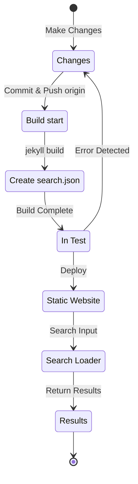

## Aperçu
Début juillet 12024, j'ai ajouté l'implémentation du support multilingue en appliquant le plugin [Polyglot](https://github.com/untra/polyglot) à ce blog basé sur Jekyll et hébergé via GitHub Pages.
Cette série partage les bugs rencontrés lors de l'application du plugin Polyglot au thème Chirpy et leur processus de résolution, ainsi que les méthodes de rédaction des en-têtes HTML et du sitemap.xml en tenant compte du SEO.
La série se compose de 3 articles, et celui que vous lisez est le troisième.
- Partie 1 : [Application du plugin Polyglot & modification des en-têtes HTML et du sitemap](/posts/how-to-support-multi-language-on-jekyll-blog-with-polyglot-1)
- Partie 2 : [Implémentation du bouton de sélection de langue & localisation de la mise en page](/posts/how-to-support-multi-language-on-jekyll-blog-with-polyglot-2)
- Partie 3 : Résolution des problèmes de compilation du thème Chirpy et des erreurs de recherche (cet article)

> À l'origine composée de 2 parties, la série a été étendue à 3 parties suite à plusieurs enrichissements de contenu qui ont considérablement augmenté le volume.
{: .prompt-info }

## Exigences
- [x] Le résultat du build (page web) doit pouvoir être fourni en séparant les chemins par langue (ex. `/posts/ko/`{: .filepath}, `/posts/ja/`{: .filepath}).
- [x] Pour minimiser autant que possible le temps et les efforts supplémentaires requis pour le support multilingue, il doit être possible de reconnaître automatiquement la langue selon le chemin local où se trouve le fichier (ex. `/_posts/ko/`{: .filepath}, `/_posts/ja/`{: .filepath}) lors du build, sans avoir à spécifier manuellement les balises 'lang' et 'permalink' dans le YAML front matter du fichier markdown original écrit.
- [x] La partie en-tête de chaque page du site doit inclure les balises méta Content-Language appropriées, les balises alternatives hreflang et les liens canoniques pour répondre aux directives SEO Google pour la recherche multilingue.
- [x] Il doit être possible de fournir tous les liens de pages par version linguistique du site sans omission via `sitemap.xml`{: .filepath}, et `sitemap.xml`{: .filepath} lui-même ne doit exister qu'une seule fois dans le chemin racine sans duplication.
- [x] Toutes les fonctionnalités fournies par le [thème Chirpy](https://github.com/cotes2020/jekyll-theme-chirpy) doivent fonctionner normalement sur chaque page linguistique, sinon elles doivent être corrigées pour fonctionner normalement.
  - [x] Fonctionnement normal des fonctionnalités 'Recently Updated' et 'Trending Tags'
  - [x] Aucune erreur ne doit se produire lors du processus de build utilisant GitHub Actions
  - [x] Fonctionnement normal de la fonction de recherche de posts en haut à droite du blog

## Avant de commencer
Cet article fait suite à la [première partie](/posts/how-to-support-multi-language-on-jekyll-blog-with-polyglot-1) et à la [deuxième partie](/posts/how-to-support-multi-language-on-jekyll-blog-with-polyglot-2), donc si vous ne les avez pas encore lues, je vous recommande de les lire d'abord.

## Résolution de problèmes ('relative_url_regex': target of repeat operator is not specified)
Après avoir terminé les étapes précédentes, j'ai exécuté la commande `bundle exec jekyll serve` pour tester la compilation, mais elle a échoué avec l'erreur `'relative_url_regex': target of repeat operator is not specified`.

```shell
...(début omis)
                    ------------------------------------------------
      Jekyll 4.3.4   Please append `--trace` to the `serve` command 
                     for any additional information or backtrace. 
                    ------------------------------------------------
/Users/yunseo/.gem/ruby/3.2.2/gems/jekyll-polyglot-1.8.1/lib/jekyll/polyglot/
patches/jekyll/site.rb:234:in `relative_url_regex': target of repeat operator 
is not specified: /href="?\/((?:(?!*.gem)(?!*.gemspec)(?!tools)(?!README.md)(
?!LICENSE)(?!*.config.js)(?!rollup.config.js)(?!package*.json)(?!.sass-cache)
(?!.jekyll-cache)(?!gemfiles)(?!Gemfile)(?!Gemfile.lock)(?!node_modules)(?!ve
ndor\/bundle\/)(?!vendor\/cache\/)(?!vendor\/gems\/)(?!vendor\/ruby\/)(?!en\/
)(?!ko\/)(?!es\/)(?!pt-BR\/)(?!ja\/)(?!fr\/)(?!de\/)[^,'"\s\/?.]+\.?)*(?:\/[^
\]\[)("'\s]*)?)"/ (RegexpError)

...(fin omise)
```

Après avoir recherché si un problème similaire avait été signalé, j'ai trouvé [exactement le même problème](https://github.com/untra/polyglot/issues/204) déjà enregistré dans le dépôt Polyglot, avec une solution.

Le fichier [`_config.yml`{: .filepath}](https://github.com/cotes2020/jekyll-theme-chirpy/blob/master/_config.yml) du thème Chirpy que j'utilise contient la syntaxe suivante :

```yml
exclude:
  - "*.gem"
  - "*.gemspec"
  - docs
  - tools
  - README.md
  - LICENSE
  - "*.config.js"
  - package*.json
```
{: file='\_config.yml'}

Le problème vient des expressions régulières dans les deux fonctions du fichier [`site.rb`{: .filepath}](https://github.com/untra/polyglot/blob/master/lib/jekyll/polyglot/patches/jekyll/site.rb) de Polyglot qui ne traitent pas correctement les modèles de globbing contenant des caractères génériques comme `"*.gem"`, `"*.gemspec"`, `"*.config.js"`.


```ruby
    # a regex that matches relative urls in a html document
    # matches href="baseurl/foo/bar-baz" href="/foo/bar-baz" and others like it
    # avoids matching excluded files.  prepare makes sure
    # that all @exclude dirs have a trailing slash.
    def relative_url_regex(disabled = false)
      regex = ''
      unless disabled
        @exclude.each do |x|
          regex += "(?!#{x})"
        end
        @languages.each do |x|
          regex += "(?!#{x}\/)"
        end
      end
      start = disabled ? 'ferh' : 'href'
      %r{#{start}="?#{@baseurl}/((?:#{regex}[^,'"\s/?.]+\.?)*(?:/[^\]\[)("'\s]*)?)"}
    end

    # a regex that matches absolute urls in a html document
    # matches href="http://baseurl/foo/bar-baz" and others like it
    # avoids matching excluded files.  prepare makes sure
    # that all @exclude dirs have a trailing slash.
    def absolute_url_regex(url, disabled = false)
      regex = ''
      unless disabled
        @exclude.each do |x|
          regex += "(?!#{x})"
        end
        @languages.each do |x|
          regex += "(?!#{x}\/)"
        end
      end
      start = disabled ? 'ferh' : 'href'
      %r{(?<!hreflang="#{@default_lang}" )#{start}="?#{url}#{@baseurl}/((?:#{regex}[^,'"\s/?.]+\.?)*(?:/[^\]\[)("'\s]*)?)"}
    end
```
{: file='(polyglot root path)/lib/jekyll/polyglot/patches/jekyll/site.rb'}


Il existe deux façons de résoudre ce problème.

### 1. Forker Polyglot et modifier les parties problématiques
Au moment de la rédaction de cet article (11.12024), la [documentation officielle de Jekyll](https://jekyllrb.com/docs/configuration/options/#global-configuration) indique que le paramètre `exclude` prend en charge les modèles de globbing pour les noms de fichiers.

>"This configuration option supports Ruby's File.fnmatch filename globbing patterns to match multiple entries to exclude."

Le problème ne vient donc pas du thème Chirpy mais des fonctions `relative_url_regex()` et `absolute_url_regex()` de Polyglot, donc la solution fondamentale est de les modifier pour éviter ce problème.

Comme ce bug n'est pas encore résolu dans Polyglot, vous pouvez forker le dépôt Polyglot en vous référant ~~à [ce billet de blog](https://hionpu.com/posts/github_blog_4#4-polyglot-%EC%9D%98%EC%A1%B4%EC%84%B1-%EB%AC%B8%EC%A0%9C)(site supprimé) et~~ à [la réponse dans l'issue GitHub mentionnée](https://github.com/untra/polyglot/issues/204#issuecomment-2143270322), puis modifier les parties problématiques comme suit et utiliser cette version au lieu de Polyglot original.


```ruby
    def relative_url_regex(disabled = false)
      regex = ''
      unless disabled
        @exclude.each do |x|
          escaped_x = Regexp.escape(x)
          regex += "(?!#{escaped_x})"
        end
        @languages.each do |x|
          escaped_x = Regexp.escape(x)
          regex += "(?!#{escaped_x}\/)"
        end
      end
      start = disabled ? 'ferh' : 'href'
      %r{#{start}="?#{@baseurl}/((?:#{regex}[^,'"\s/?.]+\.?)*(?:/[^\]\[)("'\s]*)?)"}
    end

    def absolute_url_regex(url, disabled = false)
      regex = ''
      unless disabled
        @exclude.each do |x|
          escaped_x = Regexp.escape(x)
          regex += "(?!#{escaped_x})"
        end
        @languages.each do |x|
          escaped_x = Regexp.escape(x)
          regex += "(?!#{escaped_x}\/)"
        end
      end
      start = disabled ? 'ferh' : 'href'
      %r{(?<!hreflang="#{@default_lang}" )#{start}="?#{url}#{@baseurl}/((?:#{regex}[^,'"\s/?.]+\.?)*(?:/[^\]\[)("'\s]*)?)"}
    end
```
{: file='(polyglot root path)/lib/jekyll/polyglot/patches/jekyll/site.rb'}


### 2. Remplacer les modèles de globbing par des noms de fichiers exacts dans le fichier '\_config.yml' du thème Chirpy
La méthode idéale serait que ce correctif soit intégré au flux principal de Polyglot. Mais en attendant, il faudrait utiliser une version forkée, ce qui peut être fastidieux car il faut suivre les mises à jour de Polyglot. J'ai donc opté pour une autre approche.

En examinant les fichiers à la racine du [dépôt du thème Chirpy](https://github.com/cotes2020/jekyll-theme-chirpy), on constate que les modèles `"*.gem"`, `"*.gemspec"`, `"*.config.js"` ne correspondent qu'à 3 fichiers :
- `jekyll-theme-chirpy.gemspec`{: .filepath}
- `purgecss.config.js`{: .filepath}
- `rollup.config.js`{: .filepath}

On peut donc supprimer les modèles de globbing dans la section `exclude` du fichier `_config.yml`{: .filepath} et les remplacer comme suit pour que Polyglot puisse les traiter sans problème.

```yml
exclude: # Modifié en référence à l'issue https://github.com/untra/polyglot/issues/204
  # - "*.gem"
  - jekyll-theme-chirpy.gemspec # - "*.gemspec"
  - tools
  - README.md
  - LICENSE
  - purgecss.config.js # - "*.config.js"
  - rollup.config.js
  - package*.json
```
{: file='\_config.yml'}

## Modification de la fonction de recherche
Après avoir terminé les étapes précédentes, presque toutes les fonctionnalités du site fonctionnaient comme prévu. Cependant, j'ai découvert que la barre de recherche située en haut à droite de la page avec le thème Chirpy n'indexait pas les pages dans des langues autres que `site.default_lang` (l'anglais dans le cas de ce blog), et affichait des liens vers des pages en anglais même lors de recherches depuis d'autres pages linguistiques.

Pour comprendre la cause, examinons les fichiers impliqués dans la fonction de recherche et où le problème se produit.

### '\_layouts/default.html'
En examinant le fichier [`_layouts/default.html`{: .filepath}](https://github.com/cotes2020/jekyll-theme-chirpy/blob/master/_layouts/default.html) qui structure toutes les pages du blog, on constate qu'il charge le contenu de `search-results.html`{: .filepath} et de `search-loader.html`{: .filepath} dans l'élément `<body>`.


```liquid
  <body>
    

    <div id="main-wrapper" class="d-flex justify-content-center">
      <div class="container d-flex flex-column px-xxl-5">
        
        (...omis...)

        
      </div>

      <aside aria-label="Scroll to Top">
        <button id="back-to-top" type="button" class="btn btn-lg btn-box-shadow">
          <i class="fas fa-angle-up"></i>
        </button>
      </aside>
    </div>

    (...omis...)

    
  </body>
```
{: file='\_layouts/default.html'}


### '\_includes/search-result.html'
[`_includes/search-result.html`{: .filepath}](https://github.com/cotes2020/jekyll-theme-chirpy/blob/master/_includes/search-results.html) crée le conteneur `search-results` pour stocker les résultats de recherche.


```html
<!-- The Search results -->

<div id="search-result-wrapper" class="d-flex justify-content-center d-none">
  <div class="col-11 content">
    <div id="search-hints">
      
    </div>
    <div id="search-results" class="d-flex flex-wrap justify-content-center text-muted mt-3"></div>
  </div>
</div>
```
{: file='\_includes/search-result.html'}


### '\_includes/search-loader.html'
[`_includes/search-loader.html`{: .filepath}](https://github.com/cotes2020/jekyll-theme-chirpy/blob/master/_includes/search-loader.html) est la partie essentielle qui implémente la recherche basée sur la bibliothèque [Simple-Jekyll-Search](https://github.com/christian-fei/Simple-Jekyll-Search). Elle exécute un JavaScript côté client qui trouve les correspondances avec les mots-clés saisis dans le fichier d'index [`search.json`{: .filepath}](#assetsjsdatasearchjson) et renvoie les liens des articles correspondants sous forme d'éléments `<article>`.


```js

  <article class="px-1 px-sm-2 px-lg-4 px-xl-0">
    <header>
      <h2><a href="{url}">{title}</a></h2>
      <div class="post-meta d-flex flex-column flex-sm-row text-muted mt-1 mb-1">
        {categories}
        {tags}
      </div>
    </header>
    <p>{snippet}</p>
  </article>


<p class="mt-5">{{ site.data.locales[include.lang].search.no_results }}</p>

<script>
   Note: dependent library will be loaded in `js-selector.html` 
  document.addEventListener('DOMContentLoaded', () => {
    SimpleJekyllSearch({
      searchInput: document.getElementById('search-input'),
      resultsContainer: document.getElementById('search-results'),
      json: '{{ '/assets/js/data/search.json' | relative_url }}',
      searchResultTemplate: '{{ result_elem | strip_newlines }}',
      noResultsText: '{{ not_found }}',
      templateMiddleware: function(prop, value, template) {
        if (prop === 'categories') {
          if (value === '') {
            return `${value}`;
          } else {
            return `<div class="me-sm-4"><i class="far fa-folder fa-fw"></i>${value}</div>`;
          }
        }

        if (prop === 'tags') {
          if (value === '') {
            return `${value}`;
          } else {
            return `<div><i class="fa fa-tag fa-fw"></i>${value}</div>`;
          }
        }
      }
    });
  });
</script>
```
{: file='\_includes/search-loader.html'}


### '/assets/js/data/search.json'

```liquid
---
layout: compress
swcache: true
---

[
  
  {
    "title": {{ post.title | jsonify }},
    "url": {{ post.url | relative_url | jsonify }},
    "categories": {{ post.categories | join: ', ' | jsonify }},
    "tags": {{ post.tags | join: ', ' | jsonify }},
    "date": "{{ post.date }}",
    
    
    "snippet": {{ _content | truncate: 200 | jsonify }},
    "content": {{ _content | jsonify }}
  },
  
]
```
{: file='/assets/js/data/search.json'}


Ce fichier utilise la syntaxe Liquid de Jekyll pour définir un fichier JSON contenant le titre, l'URL, les catégories et tags, la date de création, un extrait des 200 premiers caractères du contenu, et le contenu complet de tous les articles du site.

### Structure de fonctionnement de la recherche et identification du problème
En résumé, la fonction de recherche sur GitHub Pages avec le thème Chirpy fonctionne selon le processus suivant :



J'ai constaté que Polyglot génère `search.json`{: .filepath} pour chaque langue comme suit :
- `/assets/js/data/search.json`{: .filepath}
- `/ko/assets/js/data/search.json`{: .filepath}
- `/ja/assets/js/data/search.json`{: .filepath}
- `/zh-TW/assets/js/data/search.json`{: .filepath}
- `/es/assets/js/data/search.json`{: .filepath}
- `/pt-BR/assets/js/data/search.json`{: .filepath}
- `/fr/assets/js/data/search.json`{: .filepath}
- `/de/assets/js/data/search.json`{: .filepath}

Le problème se situe donc dans le "Search Loader". Les pages dans des langues autres que l'anglais ne sont pas trouvées car `_includes/search-loader.html`{: .filepath} charge statiquement uniquement le fichier d'index anglais (`/assets/js/data/search.json`{: .filepath}), quelle que soit la langue de la page visitée.

> - Contrairement aux fichiers markdown ou html, pour les fichiers JSON, le wrapper Polyglot fonctionne pour les variables Jekyll comme `post.title`, `post.content`, mais la fonctionnalité [Relativized Local Urls](https://github.com/untra/polyglot?tab=readme-ov-file#relativized-local-urls) ne semble pas fonctionner.
> - De même, dans les templates de fichiers JSON, on ne peut pas accéder aux balises liquid [fournies par Polyglot `{{ site.default_lang }}`, `{{ site.active_lang }}`](https://github.com/untra/polyglot?tab=readme-ov-file#features) en plus des variables standard de Jekyll.
>
> Par conséquent, les valeurs comme `title`, `snippet`, `content` dans le fichier d'index sont générées différemment selon la langue, mais la valeur `url` renvoie le chemin de base sans tenir compte de la langue, et un traitement approprié doit être ajouté dans la partie "Search Loader".
{: .prompt-warning }

### Résolution du problème
Pour résoudre ce problème, il faut modifier le contenu de `_includes/search-loader.html`{: .filepath} comme suit :


```

  <article class="px-1 px-sm-2 px-lg-4 px-xl-0">
    <header>
      
      <h2><a href="/{{ site.active_lang }}{url}">{title}</a></h2>
      
      <h2><a href="{url}">{title}</a></h2>
      

(...omis...)

<script>
   Note: dependent library will be loaded in `js-selector.html` 
  document.addEventListener('DOMContentLoaded', () => {
    
    
      
    
    
    SimpleJekyllSearch({
      searchInput: document.getElementById('search-input'),
      resultsContainer: document.getElementById('search-results'),
      json: '{{ search_path | relative_url }}',
      searchResultTemplate: '{{ result_elem | strip_newlines }}',

(...suite)
```
{: file='\_includes/search-loader.html'}


- J'ai modifié la syntaxe liquid dans la partie `` pour ajouter le préfixe `"/{{ site.active_lang }}"` devant l'URL du post chargée depuis le fichier JSON lorsque `site.active_lang` (langue de la page actuelle) est différente de `site.default_lang` (langue par défaut du site).
- De même, j'ai modifié la partie `<script>` pour définir `search_path` comme le chemin par défaut (`/assets/js/data/search.json`{: .filepath}) si la langue de la page actuelle est identique à la langue par défaut du site, ou comme le chemin correspondant à cette langue (par exemple, `/ko/assets/js/data/search.json`{: .filepath}) si elles sont différentes.

Après ces modifications et une nouvelle compilation du site web, j'ai confirmé que les résultats de recherche s'affichent correctement pour chaque langue.

> `{url}` est un emplacement où sera insérée ultérieurement par JS la valeur URL lue depuis le fichier JSON lors de l'exécution de la recherche, et n'est pas une URL valide au moment de la compilation, donc Polyglot ne le reconnaît pas comme cible de localisation et doit être traité directement selon la langue. Le problème est que le template `"/{{ site.active_lang }}{url}"` ainsi traité est reconnu comme une URL relative lors de la compilation, et bien que la localisation soit déjà terminée, Polyglot ne le sait pas et tente de la localiser à nouveau (par exemple, `"/ko/ko/posts/example-post"`{: .filepath}). Pour éviter cela, j'ai spécifié la balise [``](https://github.com/untra/polyglot?tab=readme-ov-file#disabling-url-relativizing).
{: .prompt-tip }
