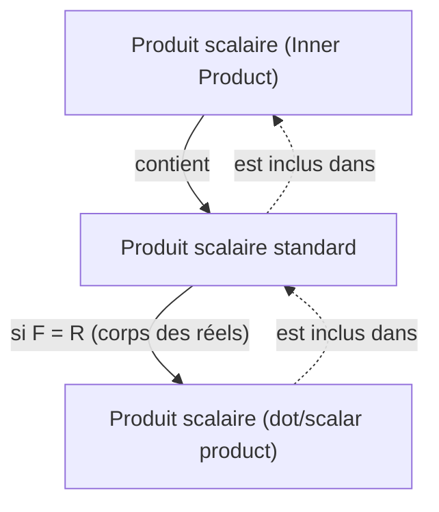

## Prérequis
- [Vecteurs et combinaisons linéaires](/posts/vectors-and-linear-combinations/)

## Produit scalaire

La définition générale d’un **produit scalaire (inner product)** sur un $F$-espace vectoriel est la suivante.

> **Définition du produit scalaire (inner product) et de l’espace à produit scalaire (inner product space)**  
> Considérons un $F$-espace vectoriel $\mathbb{V}$. Un **produit scalaire (inner product)** $\langle \mathbf{x},\mathbf{y} \rangle$ sur $\mathbb{V}$ est une application qui associe à toute paire ordonnée de vecteurs $\mathbf{x}$ et $\mathbf{y}$ de $\mathbb{V}$ un scalaire de $F$, et qui satisfait les propriétés suivantes.
>
> Pour tous $\mathbf{x},\mathbf{y},\mathbf{z} \in \mathbb{V}$ et tout $c \in F$:
> 1. $\langle \mathbf{x}+\mathbf{z}, \mathbf{y} \rangle = \langle \mathbf{x}, \mathbf{y} \rangle + \langle \mathbf{z}, \mathbf{y} \rangle$
> 2. $\langle c\mathbf{x}, \mathbf{y} \rangle = c \langle \mathbf{x}, \mathbf{y} \rangle$
> 3. $\overline{\langle \mathbf{x}, \mathbf{y} \rangle} = \langle \mathbf{y}, \mathbf{x} \rangle$ (la barre désigne le conjugué complexe)
> 4. Si $\mathbf{x} \neq \mathbf{0}$, alors $\langle \mathbf{x}, \mathbf{x} \rangle$ est strictement positif.
>
> Un $F$-espace vectoriel $\mathbb{V}$ muni d’un produit scalaire est appelé **espace à produit scalaire (inner product space)**. En particulier, si $F=\mathbb{C}$ on parle d’**espace à produit complexe (complex inner product space)**, et si $F=\mathbb{R}$ d’**espace à produit scalaire réel (real inner product space)**.
{: .prompt-info }

En particulier, le produit suivant est appelé **produit scalaire standard**. On vérifie qu’il satisfait bien les quatre propriétés ci-dessus.

> **Définition du produit scalaire standard**  
> Pour deux vecteurs de $F^n$, $\mathbf{x}=(a_1, a_2, \dots, a_n)$ et $\mathbf{y}=(b_1, b_2, \dots, b_n)$, on définit le **produit scalaire standard** sur $F^n$ par
>
> $$\langle \mathbf{x}, \mathbf{y} \rangle = \sum_{i=1}^n a_i \overline{b_i} $$
>
{: .prompt-info }

Si $F=\mathbb{R}$, le conjugué d’un réel étant lui-même, le produit scalaire standard devient $\sum_{i=1}^n a_i b_i$. Dans ce cas particulier, on le note $\langle \mathbf{x}, \mathbf{y} \rangle$ ou $\mathbf{x} \cdot \mathbf{y}$ et on l’appelle **produit scalaire (dot product)**.

> **Définition du produit scalaire (dot product)**  
> Pour $\mathbf{v}=(v_1, v_2, \dots, v_n)$ et $\mathbf{w}=(w_1, w_2, \dots, w_n)$ dans $\mathbb{R}^n$, le **produit scalaire (dot product)** sur $\mathbb{R}^n$ est défini par
>
> $$ \mathbf{v} \cdot \mathbf{w} = \sum_{i=1}^n v_i w_i = v_1 w_1 + v_2 w_2 + \cdots + v_n w_n $$
> 
{: .prompt-info }

> Ici, le « produit scalaire » est une opération entre vecteurs, distincte de l’« opération entre un scalaire et un vecteur » traitée dans [Vecteurs et combinaisons linéaires](/posts/vectors-and-linear-combinations/), à savoir la « multiplication scalaire (scalar multiplication) ». Les expressions anglaises se ressemblent et, [selon la terminologie coréenne normalisée par la Société mathématique de Corée, elles portent exactement le même nom](https://www.kms.or.kr/mathdict/list.html?key=kname&keyword=%EC%8A%A4%EC%B9%BC%EB%9D%BC%EA%B3%B1); attention à ne pas les confondre.
>
> Pour éviter toute confusion, nous emploierons autant que possible le terme **dot product**.
{: .prompt-warning }

> Dans un espace euclidien, le produit scalaire (inner product) coïncide avec le dot product; lorsqu’il n’y a pas d’ambiguïté, il est courant d’appeler ce dernier simplement produit scalaire. Stricto sensu toutefois, le produit scalaire est une notion plus générale qui inclut le dot product.
{: .prompt-tip }

## Longueur/norme d’un vecteur

Pour un vecteur $\mathbf{v}=(v_1, v_2, \dots, v_n)$ de $\mathbb{R}^n$, la longueur euclidienne de $\mathbf{v}$ se définit via le produit scalaire par

$$ \| \mathbf{v} \| = \sqrt{\mathbf{v} \cdot \mathbf{v}} = \left[ \sum_{i=1}^n |v_i|^2 \right]^{1/2} = \sqrt{v_1^2 + v_2^2 + \cdots + v_n^2} $$

Plus généralement, dans un espace à produit scalaire arbitraire, on définit la **longueur (length)** ou **norme (norm)** d’un vecteur par

$$ \| \mathbf{x} \| = \sqrt{\langle \mathbf{x}, \mathbf{x} \rangle} $$

Dans un espace à produit scalaire quelconque, la norme vérifie les propriétés fondamentales suivantes.

> **Théorème**  
> Soient $\mathbb{V}$ un espace à produit scalaire sur $F$, $\mathbf{x}, \mathbf{y} \in \mathbb{V}$ et $c \in F$. Alors
> 1. $\\|c\mathbf{x}\\| = \|c\| \cdot \\|\mathbf{x}\\|$
> 2. Les deux assertions suivantes sont vraies:
>    - $\\|\mathbf{x}\\| = 0 \iff \mathbf{x}=\mathbf{0}$
>    - $\\|\mathbf{x}\\| \geq 0 \ \forall \mathbf{x}$
> 3. **Inégalité de Cauchy–Schwarz (Cauchy–Schwarz inequality)**: $\| \langle \mathbf{x}, \mathbf{y} \rangle \| \leq \\|\mathbf{x}\\| \cdot \\|\mathbf{y}\\|$ (avec égalité si l’un des deux est un multiple scalaire de l’autre)
> 4. **Inégalité triangulaire (triangle inequality)**: $\\| \mathbf{x} + \mathbf{y} \\| \leq \\|\mathbf{x}\\| + \\|\mathbf{y}\\|$ (avec égalité si l’un est un multiple scalaire de l’autre et, de plus, de même direction)
{: .prompt-info }

## Angle entre vecteurs et vecteur unitaire

Un vecteur de longueur $1$ est appelé **vecteur unitaire (unit vector)**. Pour deux vecteurs $\mathbf{v}=(v_1, v_2, \dots, v_n)$ et $\mathbf{w}=(w_1, w_2, \dots, w_n)$ dans $\mathbb{R}^n$, on a $\mathbf{v} \cdot \mathbf{w} = \\|\mathbf{v}\\| \cdot \\|\mathbf{w}\\| \cos\theta$, d’où l’on peut déduire l’angle $\theta$ ($0 \leq \theta \leq \pi$) entre $\mathbf{v}$ et $\mathbf{w}$:

$$ \theta = \arccos{\frac{\mathbf{v} \cdot \mathbf{w}}{\|\mathbf{v}\| \cdot \|\mathbf{w}\|}} $$

Si $\mathbf{v} \cdot \mathbf{w} = 0$, on dit que les deux vecteurs sont **perpendiculaires (perpendicular)** ou **orthogonaux (orthogonal)**.

> Si deux vecteurs $\mathbf{v}$ et $\mathbf{w}$ sont perpendiculaires,
>
> $$ \begin{align*}
> \| \mathbf{v} + \mathbf{w} \|^2 &= (\mathbf{v} + \mathbf{w}) \cdot (\mathbf{v} + \mathbf{w}) \\
> &= \mathbf{v} \cdot \mathbf{v} + \mathbf{v} \cdot \mathbf{w} + \mathbf{w} \cdot \mathbf{v} + \mathbf{w} \cdot \mathbf{w} \\
> &= \mathbf{v} \cdot \mathbf{v} + \mathbf{w} \cdot \mathbf{w} \\
> &= \|\mathbf{v}\|^2 + \|\mathbf{w}\|^2.
> \end{align*} $$
>
{: .prompt-tip }

En généralisant à un espace à produit scalaire arbitraire, on obtient ce qui suit.

> **Définition**  
> Considérons un espace à produit scalaire $\mathbb{V}$. Pour des vecteurs $\mathbf{x}, \mathbf{y} \in \mathbb{V}$, si $\langle \mathbf{x}, \mathbf{y} \rangle = 0$, on dit que $\mathbf{x}$ et $\mathbf{y}$ sont **orthogonaux (orthogonal)** ou **perpendiculaires (perpendicular)**. De plus,
> 1. Pour une partie $S \subset \mathbb{V}$, si deux vecteurs distincts quelconques de $S$ sont orthogonaux, alors $S$ est un **ensemble orthogonal (orthogonal set)**.
> 2. Un vecteur $\mathbf{x} \in \mathbb{V}$ tel que $\\|\mathbf{x}\\|=1$ est appelé **vecteur unitaire (unit vector)**.
> 3. Si une partie $S \subset \mathbb{V}$ est un ensemble orthogonal et ne contient que des vecteurs unitaires, on l’appelle **ensemble orthonormé (orthonormal set)**.
{: .prompt-info }

Une condition nécessaire et suffisante pour que $S = \{ \mathbf{v}_1, \mathbf{v}_2, \dots \}$ soit un ensemble orthonormé est que $\langle \mathbf{v}\_i, \mathbf{v}\_j \rangle = \delta\_{ij}$. Multiplier un vecteur par un scalaire non nul ne change pas l’orthogonalité.

Pour tout vecteur non nul $\mathbf{x}$, le vecteur $\cfrac{\mathbf{x}}{\\|\mathbf{x}\\|}$ est un vecteur unitaire; multiplier un vecteur non nul par l’inverse de sa longueur pour obtenir un vecteur unitaire s’appelle la **normalisation (normalizing)**.
