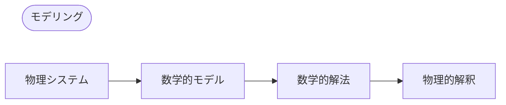

## モデリング(Modeling)
- **モデル(model)**: 解決したい工学問題を変数、関数、方程式などを通じて数学的な式として公式化したもの
- **数学的モデリング(mathematical modeling)** または **モデリング(modeling)**: モデルを立て、それを数学的に解き、その結果を解釈するプロセス

速度や加速度のような多くの物理的概念が導関数であるため、モデルは未知関数の導関数を含む方程式、つまり**微分方程式(differential equation)**の形になることが多い。

## 常微分方程式(ODE)と偏微分方程式(PDE)
### 常微分方程式(ODE)
**常微分方程式(ordinary differential equation; ODE)**: 未知関数の$n$階導関数を含む方程式

例)

$$y' = \cos x$$

$$ y'' + 9y = e^{-2x} $$

$$ y'y''' - \frac{3}{2}y'^{2} = 0 $$

### 偏微分方程式(PDE)
**偏微分方程式(partial differential equation; PDE)**: 2つ以上の変数を持つ未知関数の偏導関数を含む方程式

例)

$$ \frac{\partial^2 u}{\partial x^2} + \frac{\partial^2 u}{\partial y^2} = 0 $$

## 解(Solution)
関数$h(x)$がある開区間$(a, b)$で定義され微分可能であり、$y$と$y'$をそれぞれ$h$と$h'$に置き換えたとき、与えられた常微分方程式が恒等式になる場合、関数

$$ y = h(x) $$

を区間$(a, b)$で与えられた常微分方程式の**解(solution)**、$h$の曲線を**解曲線(solution curve)**と呼ぶ。

例)

$$ y'=\cos x \Leftrightarrow y=\sin x+c $$

$$ y'=0.2y \Leftrightarrow y=ce^{0.2t} $$

このように任意の定数$c$を含む解を常微分方程式の**一般解(general solution)**と呼ぶ。

幾何学的に常微分方程式の一般解は無限に多くの解曲線の集合であり、定数$c$のそれぞれの値に1つの曲線が対応する。特定の定数$c$を選択すると、常微分方程式の**特殊解(particular solution)**が得られる。

## 初期値問題(Initial Value Problem)
与えられた問題の特殊解を得るためには任意の定数$c$の値を決定する必要があるが、多くの場合$y(x_{0})=y_{0}$または$y(t_{0})=y_{0}$のような**初期条件(initial condition)**を通じて知ることができる（独立変数が時間でない場合や$t_{0}\neq0$であっても初期条件と呼ぶ）。初期条件を持つ常微分方程式を**初期値問題(initial value problem)**という。

例)

$$ y'=f(x,y),\qquad y(x_{0})=y_{0} $$

## モデリング例：放射性物質の指数的減衰
放射性物質の量が0.5gで与えられたとき、その後の時間に残っている量を求めよ。
> 実験によると、放射性物質は毎瞬間、残っている物質の量に比例する速度で分解され、したがって時間とともに減衰する。
{: .prompt-info }

### 1. 数学的モデルの設定
時間$t$で残っている物質の量を$y(t)$で表す。$y'(t)$は$y(t)$に比例するので、**1階常微分方程式**

$$ \frac {dy}{dt} = -ky$$ 

を得る（定数$k>0$）。

また**初期条件**$y(0)=0.5$を知っている。したがって、数学的モデルを次のような**初期値問題**として設定できる。

$$ \frac {dy}{dt} = -ky, \qquad y(0)=0.5 $$

### 2. 数学的解法
先ほど立てた常微分方程式の一般解は次のようになる（[変数分離法](/posts/Separation-of-Variables/#モデリング例放射性炭素年代測定法radiocarbon-dating)参照）。

$$ y(t)=ce^{-kt} $$

$y(0)=c$なので、初期条件から$y(0)=c=0.5$を得る。したがって、求めたい特殊解は

$$ y(t)=0.5e^{-kt} \quad(k>0)$$

となる。

### 3. 解の物理的解釈
先ほど求めた解は任意の時間$t$での放射性物質の量を表す。放射性物質の量は初期値0.5(g)から始まり、時間とともに減少し、$t \to \infty$のとき$y$の極限値は$0$である。
