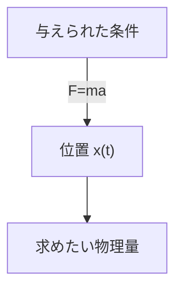
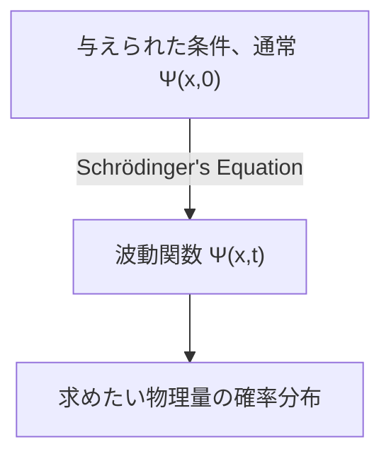

## TL;DR
> - (時間依存)シュレーディンガー方程式：
>
> $$ i\hbar\frac{\partial \Psi}{\partial t} = - \frac{\hbar^2}{2m}\frac{\partial^2 \Psi}{\partial x^2} + V\Psi $$
>
> - 波動関数 $\Psi(x,t)$ の統計的解釈（Born解釈）：波動関数の絶対値の二乗 $\|\Psi(x,t)\|^2$ は時間 $t$、位置 $x$ で粒子を見つける**確率密度関数**である。
> - 波動関数の規格化：
>   - $\int_{-\infty}^{\infty} \|\Psi(x,t)\|^2 dx = 1$
>   - $\Psi(x,t)$ がシュレーディンガー方程式の解であれば、任意の複素数定数 $A$ に対して $A\Psi(x,t)$ も同様に解であり、このとき上式を満たすように定数 $A$ を決定することを規格化（normalization）という
>   - **規格化できない解（non-normalizable solutions）**は粒子を表すことができないため有効な波動関数ではなく、**二乗可積分（square-integrable）**な解のみが物理的に可能な状態である
>   - ある時点で規格化された波動関数は、時間が経過して $\Psi$ が変化しても、継続して規格化された状態を維持する
> - 確率流：
>   - $J(x,t) \equiv \cfrac{i\hbar}{2m}\left(\Psi\cfrac{\partial \Psi^\*}{\partial x}-\Psi^\*\cfrac{\partial \Psi}{\partial x}\right)$
>   - 粒子を見つける確率が点 $x$ を通過して流れる流量（単位時間あたりの確率）
>   - 時間 $t$、領域 $a<x<b$ で粒子を見つける確率を $P_{ab}(t)$ とすると $\cfrac{dP_{ab}}{dt} = J(a,t) - J(b,t)$
{: .prompt-info }

## Prerequisites
- 連続確率分布と確率密度

## シュレーディンガー方程式（Schrödinger equation）
質量 $m$ の粒子が与えられた力 $F(x,t)$ を受けながら $x$ 軸上で動く状況を考えてみよう。

古典力学では主な目標はニュートンの運動方程式 $F=ma$ を適用して任意の時間における粒子の位置 $x(t)$ を決定することである。このプロセスは大まかに次のようなダイアグラムで表現できる。

量子力学では同じ問題を非常に異なる方法でアプローチする。量子力学のアプローチは次の**シュレーディンガー方程式（Schrödinger equation）**を解いて粒子の**波動関数** $\Psi(x,t)$ を求めることである。

$$ \begin{gather*}
i\hbar\frac{\partial \Psi}{\partial t} = - \frac{\hbar^2}{2m}\frac{\partial^2 \Psi}{\partial x^2} + V\Psi. \label{eqn:schrodinger_eqn}\tag{1}\\
\text{(} i=\sqrt{-1}\text{, } \hbar=\frac{h}{2\pi}=1.054573\times10^{-34}\text{, } h\text{: プランク定数, } V(x)\text{: ポテンシャルエネルギー)}
\end{gather*} $$

> *画像出典*
> - 作者：ウィキメディアユーザー Xcodexif
> - ライセンス：[CC BY-SA 4.0](https://creativecommons.org/licenses/by-sa/4.0/)

## 波動関数 $\Psi(x,t)$ の統計的解釈（Born解釈）
古典力学における粒子は一点に位置するのに対し、量子力学で粒子の状態を表す波動関数は与えられた $t$ における $x$ の関数であり、つまり空間に広がっている。これの物理的意味をどのように解釈すべきだろうか？

ボルン（Born）の**統計的解釈**によれば、波動関数の絶対値の二乗 $\|\Psi(x,t)\|^2$ は時間 $t$、位置 $x$ で粒子を見つける確率密度関数である。波動関数 $\Psi$ 自体は複素数だが、$\|\Psi\|^2=\Psi^\*\Psi$（$\Psi^\*$ は $\Psi$ の複素共役）は0以上の実数であるため、このような解釈が成立する。つまり、次のように表現できる。

$$ \int_a^b |\Psi(x,t)|^2 dx = \text{時間 }t\text{において }a\text{と }b\text{ の間で粒子を見つけることができる確率}. \tag{2}$$

このような統計的解釈は、量子力学が一種の**不確定性（indeterminacy）**を内包していることを意味する。粒子についてのすべて（波動関数）を知っていても、可能な結果の確率分布だけを知ることができ、特定の値を決定することはできない。

これは直感的に受け入れがたいものであったため、自然にこのような不確定性が量子力学の欠点によるものなのか、あるいは本質的な自然の特性なのかという疑問が提起された。

## 量子力学的不確定性（quantum indeterminacy）を見る視点
ある粒子の位置を測定してこの粒子が点 $C$ にあることがわかったとしよう。では測定する直前、粒子はどこにあったのか？

### 実在論的（realist）立場

> 「神はサイコロを振らない」（"God does not play dice."）  
> *by Albert Einstein*

粒子はもともと $C$ にあった。これはアインシュタイン（Einstein）とシュレーディンガー（Schrödinger）の視点でもある。しかし、この視点から見ると、実際には粒子が正確に $C$ にあったのに理論の限界で測定するまで粒子の位置を確率分布としてしか知ることができないため、量子力学は不完全な理論である。つまり、この観点によれば、不確定性は本質的な自然の性質ではなく量子力学の限界によるものであり、$\Psi$ 以外の何らかの隠れた変数が追加的に存在し、それまで知らなければ粒子を完全に記述することができない。

> シュレーディンガー（Schrödinger）はアインシュタイン（Einstein）の弟子として一時期その下で助手として働いたこともあり、その後もアインシュタインと交流していたが、シュレーディンガーの実在論的かつ決定論的な立場もその影響である可能性が高い。
{: .prompt-info }

### 正統的（orthodox）立場

> 「神がサイコロで何をしようと気にするな」（"Stop telling God what to do with his dice."）  
> *by Niels Bohr, In answer to Einstein's earlier quote*
>
> 「観測は測定対象に干渉するだけでなく、作り出す」（"Observations not only disturb what is to be measured, they produce it"）  
> ...  
> 「我々が特定の位置を持つように強制しているのだ」（"We compel to assume a definite position."）  
> *by Pascual Jordan*

測定直前まで粒子は確率分布の形でのみ存在し、どこにもなく、測定行為をしたときに初めて粒子がある一つの位置に現れる。このような解釈を**コペンハーゲン解釈**と呼び、コペンハーゲン大学でボーア（Bohr）とハイゼンベルク（Heisenberg）を中心に提案された解釈である。

> 面白いことに、アインシュタインとシュレーディンガーの関係と同様に、ハイゼンベルク（Heisenberg）もボーア（Bohr）の弟子であるということだ。
{: .prompt-info }

### 不可知論的（agnostic）立場

> 「針の先にはどれだけ多くの天使が座ることができるかという古い質問のように、何も全く知ることができないものが、それでも存在するかどうか考えて頭を悩ます必要はない」（"One should no more rack one's brain about the problem of whether something one cannot know anything about exists all the same, than about the ancient question of how many angels are able to sit on the point of a needle."）  
> *by Wolfgang Pauli*

回答を拒否する。測定する前の粒子の状態について何を主張しても、その主張が正しいかどうかを確認する唯一の方法が測定だけならば、それはもはや「測定以前」ではなくなってしまうのに何の意味があるのか？本質的に試すことができず、知ることができない何かについて議論することは形而上学に過ぎない。

### 今日の通念
[人類紀元](https://en.wikipedia.org/wiki/Holocene_calendar)11964年にジョン・ベル（John Bell）が測定の前後を問わず粒子が正確な位置に存在するかどうかによって観測可能な違いがあることを証明したことで、まず不可知論的立場は排除され、その後の実験を通じてコペンハーゲン解釈が主流となった。したがって、特に言及がなければ、通常量子力学について扱う際にはこのようなコペンハーゲン解釈を前提とする。

> 非局所的隠れ変数理論（nonlocal hidden variable theories）や多世界解釈（many worlds interpretation）のような、コペンハーゲン解釈以外の正しい可能性のある他の解釈も依然として存在する。
{: .prompt-info }

## 測定と波動関数の崩壊
粒子は測定するまで正確な位置を持っておらず、測定を通じて初めて $C$ という特定の位置（後で別の記事で扱うが、実際にはハイゼンベルクの不確定性原理により、この位置も完全に正確な値ではなく、若干の誤差範囲を持つ）を持つようになる。ただし、この最初の測定を行った直後にすぐに追加測定を行った場合、測定するたびに異なる値を得るのではなく、必ず同じ結果を得る。これは次のように説明される。

最初の測定を行う瞬間、測定対象の波動関数が激しく変化して点 $C$ 付近に集中した狭く尖った形の $\|\Psi(x,t)\|^2$ グラフを形成する。これを波動関数が測定によって点 $C$ に**崩壊（collapse）**したという。

つまり、物理過程は異なる二種類に分けることができる。
- シュレーディンガー方程式によって波動関数がゆっくりと変化する一般的な（ordinary）過程
- $\Psi$ が突然かつ不連続に崩壊する測定（measurement）過程

> 測定によって崩壊した波動関数は時間が経つとシュレーディンガー方程式に従って再び空間的に広がっていく。したがって、同じ測定結果を再現するには二回目の測定をすぐに行う必要がある。
{: .prompt-tip }

## 波動関数の規格化（Normalization）
波動関数の絶対値の二乗 $\|\Psi(x,t)\|^2$ は時間 $t$、位置 $x$ で粒子を見つける確率密度であるため、すべての $x$ について $\|\Psi\|^2$ を積分すると1になるはずである。

$$ \int_{-\infty}^{\infty} |\Psi(x,t)|^2 dx = 1. \label{eqn:wavefunction_norm}\tag{3} $$

式（$\ref{eqn:schrodinger_eqn}$）において $\Psi(x,t)$ が解であれば、任意の複素数定数 $A$ に対して $A\Psi(x,t)$ も解であることがわかる。したがって、式（$\ref{eqn:wavefunction_norm}$）を満たすようにこの $A$ を決定する必要があり、このプロセスを波動関数の規格化（normalization）という。シュレーディンガー方程式のいくつかの解は積分すると無限大に発散し、この場合、式（$\ref{eqn:wavefunction_norm}$）を満たす定数 $A$ は存在しない。自明解（trivial solution）$\Psi=0$ の場合も同様である。このような**規格化できない解（non-normalizable solutions）**は粒子を表すことができないため、有効な波動関数ではない。物理的に可能な状態はシュレーディンガー方程式の**二乗可積分（square-integrable）**な解に対応する。

また、シュレーディンガー方程式の重要な性質は、<u>ある時点で規格化された波動関数は、時間が経過して $\Psi$ が変化しても、継続して規格化された状態（$\int_{-\infty}^{\infty} |\Psi(x,t)|^2 dx = 1$）を維持する</u>ということである。波動関数を毎時点で異なる $A$ 値で規格化しなければならないとすれば、$A$ は定数ではなく時間 $t$ の関数となるため、もはやシュレーディンガー方程式の解を求めることができなくなるが、この性質により初期条件（$t=0$）で規格化した $A$ 値は時間 $t$ に関係なく継続して保存される。

### 証明

$$ \frac{d}{dt}\int_{-\infty}^{\infty} |\Psi(x,t)|^2 dx = \int_{-\infty}^{\infty} \frac{\partial}{\partial t}|\Psi(x,t)|^2 dx. \label{eqn:norm_proof_1}\tag{4} $$

> $\|\Psi\|^2$ を $x$ について積分した結果は $t$ だけの関数であるため、左辺では全微分（$d/dt$）を使うが、$\|\Psi\|^2$ 自体は $x$ と $t$ の二変数関数であるため、右辺では偏微分（$\partial/\partial t$）を使う。
{: .prompt-tip }

上式を積の微分規則に従って次のように書き換えることができる。

$$ \frac{\partial}{\partial t}|\Psi|^2 = \frac{\partial}{\partial t}(\Psi^*\Psi) = \Psi^*\frac{\partial \Psi}{\partial t} + \frac{\partial \Psi^*}{\partial t}\Psi. \label{eqn:norm_proof_2}\tag{5}$$

式（$\ref{eqn:schrodinger_eqn}$）のシュレーディンガー方程式の両辺に $-\cfrac{i}{\hbar}$ をかけると

$$ \frac{\partial \Psi}{\partial t} = \frac{i\hbar}{2m}\frac{\partial^2 \Psi}{\partial x^2}-\frac{i}{\hbar}V\Psi \label{eqn:norm_proof_3}\tag{6}$$

と書くことができ、上式から $\cfrac{\partial \Psi}{\partial t}$ の複素共役をとると

$$ \frac{\partial \Psi^*}{\partial t} = -\frac{i\hbar}{2m}\frac{\partial^2 \Psi^*}{\partial x^2}+\frac{i}{\hbar}V\Psi^* \label{eqn:norm_proof_4}\tag{7}$$

を得る。ここで式（$\ref{eqn:norm_proof_2}$）に（$\ref{eqn:norm_proof_3}$）と（$\ref{eqn:norm_proof_4}$）を代入すると

$$\begin{align*}
\frac{\partial}{\partial t}|\Psi|^2 &= \frac{i\hbar}{2m}\left(\Psi^*\frac{\partial^2\Psi}{\partial x^2}-\frac{\partial^2\Psi^*}{\partial x^2}\Psi\right) \\
&= \frac{\partial}{\partial x}\left[\frac{i\hbar}{2m}\left(\Psi^*\frac{\partial\Psi}{\partial x}-\frac{\partial\Psi^*}{\partial x}\Psi \right) \right] 
\end{align*} \label{eqn:norm_proof_5}\tag{8}$$

となり、これを最初の式（$\ref{eqn:norm_proof_1}$）の右辺に代入すると

$$ \frac{d}{dt}\int_{-\infty}^{\infty} |\Psi(x,t)|^2 dx = \frac{i\hbar}{2m}\left(\Psi^*\frac{\partial\Psi}{\partial x}-\frac{\partial\Psi^*}{\partial x}\Psi \right)\Bigg|_{-\infty}^{\infty}. \label{eqn:norm_proof_6}\tag{9} $$

しかし、波動関数が規格化されて物理的に有効であるためには、$x$ が $\pm\infty$ に向かうとき $\Psi(x,t)$ は $0$ に収束しなければならない。したがって

$$ \frac{d}{dt}\int_{-\infty}^{\infty} |\Psi(x,t)|^2 dx = 0 \label{eqn:norm_proof_fin}\tag{10} $$

となるため、$\int_{-\infty}^{\infty} \|\Psi(x,t)\|^2 dx$ は時間に関係なく一定である。

$$ \therefore \Psi \text{がある時点 }t\text{で規格化されていれば、他のすべての時点 }t\text{についても規格化されている。 } \blacksquare $$

## 確率流（probability current）
今度は時間 $t$、領域 $a<x<b$ で粒子を見つける確率を $P_{ab}(t)$ としよう。すると

$$ P_{ab}(t) = \int_a^b |\Psi(x,t)|^2 dx \tag{11}$$

であり、

$$ \begin{align*}
\frac{dP_{ab}}{dt} &= \frac{d}{dt}\int_a^b |\Psi(x,t)|^2 dx \\
&= \int_a^b \frac{\partial}{\partial t}|\Psi(x,t)|^2 dx \quad \text{(}\because\text{式 }\ref{eqn:norm_proof_1}\text{ 参照)}\\
&= \int_a^b \left(\frac{\partial \Psi^*}{\partial t}\Psi + \Psi^*\frac{\partial \Psi}{\partial t} \right)dx \quad \text{(}\because\text{式 }\ref{eqn:norm_proof_2}\text{ 参照)} \\
&= \frac{i\hbar}{2m}\int_a^b \left(\Psi^*\frac{\partial^2\Psi}{\partial x^2}-\frac{\partial^2\Psi^*}{\partial x^2}\Psi\right)dx \\
&= \frac{i\hbar}{2m}\int_a^b\frac{\partial}{\partial x}\left(\Psi^*\frac{\partial\Psi}{\partial x}-\frac{\partial\Psi^*}{\partial x}\Psi \right)dx \quad \text{(}\because\text{式 }\ref{eqn:norm_proof_3},\ref{eqn:norm_proof_4},\ref{eqn:norm_proof_5}\text{ 参照)}\\
&= \frac{i\hbar}{2m}\left(\Psi^*\frac{\partial \Psi}{\partial x}-\frac{\partial \Psi^*}{\partial x}\Psi \right)\Bigg|^b_a \\
&= \frac{i\hbar}{2m}\left(\Psi\frac{\partial \Psi^*}{\partial x}-\Psi^*\frac{\partial \Psi}{\partial x} \right)\Bigg|^a_b
\end{align*} $$

である。ここで

$$ J(x,t) \equiv \frac{i\hbar}{2m}\left(\Psi\frac{\partial \Psi^*}{\partial x}-\Psi^*\frac{\partial \Psi}{\partial x}\right) \label{eqn:probability_current}\tag{12}$$

とおくと、

$$ \frac{dP_{ab}}{dt} = J(a,t) - J(b,t) \label{eqn:probability_over_time}\tag{13}$$

となる。

式（$\ref{eqn:probability_current}$）のように定義した $J(x,t)$ を**確率流（probability current）**と呼び、粒子を見つける確率が点 $x$ を通過して流れる流量\*（つまり、単位時間あたりの確率）を意味する。式（$\ref{eqn:probability_over_time}$）において、特定の時点 $t$ に一方の端から流れ込む確率流 $J(a,t)$ が他方から流れ出る確率流 $J(b,t)$ より大きければ $P_{ab}$ は増加し、逆の場合には減少する。

> *流体力学の流量（flow rate）において流体の質量または体積がここでは確率に置き換わったと考えればよい。
{: .prompt-info }
