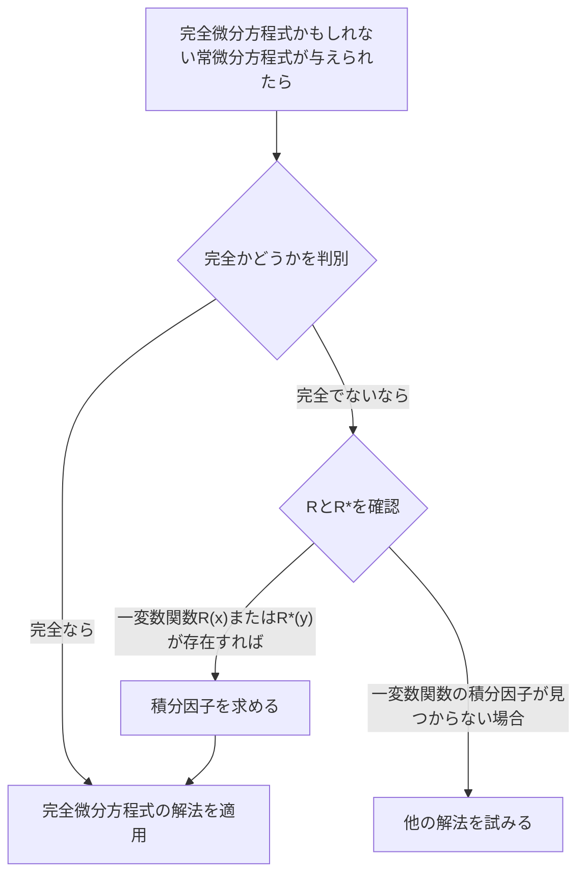

## TL;DR

## 完全微分方程式(Exact Differential Equation)
1階常微分方程式 $M(x,y)+N(x,y)y'=0$ は

$$ M(x,y)dx+N(x,y)dy=0 \tag{1} $$

と書くことができる。もし

$$ \exists u(x,y): \frac{\partial u}{\partial x}=M(x,y) \land \frac{\partial u}{\partial y}=N(x,y) \tag{2} $$

ならば

$$ M(x,y)dx+N(x,y)dy=\frac{\partial u}{\partial x}dx+\frac{\partial u}{\partial y}dy=du \tag{3} $$

となり、このとき常微分方程式 $M(x,y)dx+N(x,y)dy=0$ を**完全微分方程式(exact differential equation)**と呼ぶ。すると、この常微分方程式は

$$ du=0 $$

と書くことができ、積分すると

$$ u(x,y)=c \tag{4} $$

の形で一般解をすぐに得ることができる。

## 完全微分方程式の判別
$xy$ 平面上の、自身と交差しない閉曲線を境界とする閉領域で、$M$と$N$およびそれぞれの1階偏導関数が連続であるとする。条件(2)を再度見てみると次のようになる。

$$ \begin{align*}
\frac {\partial u}{\partial x}&=M(x,y) \tag{2a}
\\ \frac {\partial u}{\partial y}&=N(x,y) \tag{2b}
\end{align*}$$

上の式を偏微分すると

$$ \begin{align*}
\frac {\partial M}{\partial y} &= \frac{\partial^2 u}{\partial y \partial x}
\\ \frac {\partial N}{\partial x} &= \frac{\partial^2 u}{\partial x \partial y}
\end{align*}$$

連続性を仮定したので、2つの2階偏導関数は互いに等しい。

$$ \therefore \frac {\partial M}{\partial y}=\frac {\partial N}{\partial x} \tag{5}$$

したがって、条件(5)は常微分方程式(1)が完全微分方程式となるための必要条件であることがわかり、ここでは証明していないが実際には十分条件でもある。つまり、この条件を満たすかどうかを確認することで完全微分方程式かどうかを判別できる。

## 完全微分方程式の解法
式(2a)を、$y$を定数とみなして$x$に関して積分すると

$$ u = \int M(x,y) dx + k(y) \tag{6} $$

となる。$y$を定数とみなしたので、ここで$k(y)$は積分定数の役割を果たす。次に$x$を定数とみなして式(6)を$y$で微分し、次のように$\partial u/\partial y$を求める。

$$ \frac{\partial u}{\partial y} = \frac{\partial}{\partial y}\int M(x,y) dx + \frac{dk}{dy} $$

ここで上の式を式(2b)と比較して$dk/dy$を求めることができる。

$$ \frac{\partial}{\partial y}\int M(x,y) dx + \frac{dk}{dy} = N(x,y) $$

$$ \frac{dk}{dy} = N(x,y) - \frac{\partial}{\partial y}\int M(x,y) dx $$

最後に、上の式を積分して$k(y)$を決定し、式(6)に代入すると陰関数解$u(x,y)=c$を求めることができる。

$$ k(y) = \int N(x,y)dy - \int \left(\frac{\partial}{\partial y}\int Mdx\right)dy + c^* $$

$$ \int M(x,y)dx + \int N(x,y)dy - \int \left(\frac{\partial}{\partial y}\int Mdx\right)dy = c $$

> この一般解の形を公式として暗記して適用するよりも、どのような過程を経て解くかを知ることが重要である。
{: .prompt-tip }

## 積分因子(Integrating Factor)
ある不完全な(Inexact)常微分方程式が与えられたとする。

$$ P(x,y)dx+Q(x,y)dy = 0 \quad \left( \frac {\partial P}{\partial y} \neq \frac {\partial Q}{\partial x} \right) \tag{7} $$

もし

$$ \exists F(x,y): \frac {\partial}{\partial y}(FP) = \frac {\partial}{\partial x}(FQ) \tag{8} $$

ならば、与えられた常微分方程式(7)に関数$F$をかけて次の完全微分方程式を得ることができる。

$$ FP\ dx+FQ\ dy = 0 \tag{9} $$

このとき関数$F(x,y)$を式(7)の**積分因子(integrating factor)**と呼ぶ。

## 積分因子を求める方法
式(8)に積の微分法を適用し、偏導関数を下付き文字で表すと次のようになる。

$$ F_y P + FP_y = F_x Q + FQ_x $$

多くの実際的な場合において、1つの変数にのみ依存する積分因子が存在する。$F=F(x)$とすると$F_y=0$で$F_x=F'=dF/dx$なので、以下の式を得る。

$$ FP_y = F'Q + FQ_x $$

両辺を$FQ$で割り、項を整理すると、

$$ \begin{align*}
\frac{1}{F} \frac{dF}{dx} &= \frac{P_y}{Q} - \frac{Q_x}{Q}
\\ &= \frac{1}{Q}\left(\frac{\partial P}{\partial y}-\frac{\partial Q}{\partial x} \right)
\end{align*} \tag{10} $$

となる。したがって、次が成り立つ。

> 与えられた常微分方程式(7)に対して、式(10)の右辺$R$が$x$のみの関数である場合、式(7)は積分因子$F=F(x)$を持つ。
>
> $$ F(x)=e^{\int R(x)dx}, \quad \text{ただし }R=\frac{1}{Q}\left(\frac{\partial P}{\partial y}-\frac{\partial Q}{\partial x} \right) \tag{11} $$
{: .prompt-info }

同様に$F^\*=F^\*(y)$の場合、式(10)の代わりに

$$ \frac{1}{F^*} \frac{dF^*}{dy} = \frac{1}{P}\left(\frac{\partial Q}{\partial x}-\frac{\partial P}{\partial y} \right) \tag{12} $$

を得て、したがって次が成り立つ。

> 与えられた常微分方程式(7)に対して、式(12)の右辺$R^*$が$y$のみの関数である場合、式(7)は積分因子$F^\*=F^\*(y)$を持つ。
>
> $$ F^*(y)=e^{\int R^*(y)dy}, \quad \text{ただし }R^*=\frac{1}{P}\left(\frac{\partial Q}{\partial x}-\frac{\partial P}{\partial y} \right) \tag{13} $$
{: .prompt-info }