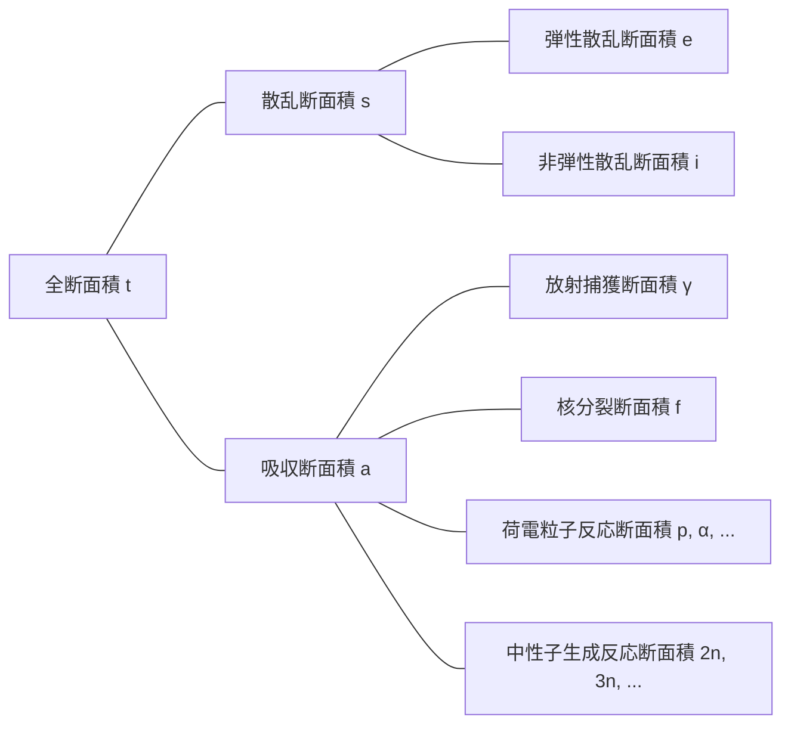

## 断面積(cross-section)またはミクロ断面積(microscopic cross-section)
単一エネルギー中性子ビームが（非常に薄い）厚さ$\tau$と面積$A$の標的に入射し、このとき毎秒単位面積当たり標的に入射する中性子数を$I\ \text{neutrons/cm}^2\cdot \text{s}$とする。原子において原子核が占める体積の割合は非常に小さく、標的が非常に薄いと仮定したので、中性子のほとんどは原子核と反応せずに標的を通過する。すると毎秒単位面積当たり原子核と衝突する中性子数は中性子ビームの強度$I$、標的の厚さ$\tau$、標的の原子密度$N$に比例する。

$$ \Delta I \propto I\tau N $$

比例定数$\sigma$を導入すると次のように表現できる。

$$ \Delta I = \sigma I\tau N\ \mathrm{[neutrons/cm^2\cdot s]} \label{eqn:microscopic_cross_section}\tag{1} $$

標的に入射する中性子のうち原子核と衝突する中性子の割合を求めると次のようになる。

$$ p = \frac {\Delta I}{I} = \sigma\tau N = \frac {\sigma}{A} A\tau N = \frac {\sigma}{A} N_t \label{eqn:collision_rate}\tag{2} $$

($N_t$：標的の総原子数)

この式から$\sigma$は面積の単位を持つことがわかる。この比例定数$\sigma$を*断面積(cross-section)*または*ミクロ断面積(microscopic cross-section)*と呼ぶ。断面積は物理的に原子核が中性子と反応できる有効断面積を意味する。

## ミクロ断面積の単位
cm$^2$はミクロ断面積を表現するには大きすぎる単位なので、一般的に*バーン(barn)*という単位を使用する。

$$ 1\ \text{b} = 10^{-24}\ \text{cm}^2 \label{eqn:barn}\tag{3}$$

## ミクロ断面積の種類
- 全(total)断面積：$\sigma_t$
  - 散乱(scattering)断面積：$\sigma_s$
    - 弾性散乱(elastic scattering)断面積：$\sigma_e$
    - 非弾性散乱(inelastic scattering)断面積：$\sigma_i$
  - 吸収(absorption)断面積：$\sigma_a$
    - 放射捕獲(radiative capture)断面積：$\sigma_\gamma$
    - 核分裂(fission)断面積：$\sigma_f$
    - 荷電粒子反応(charged-particle reactions)断面積：$\sigma_p, \sigma_\alpha, \cdots$
    - 中性子生成反応(neutron-producing reactions)断面積：$\sigma_{2n}, \sigma_{3n}, \cdots$

## 中性子相互作用
中性子は電気的に中性であるため、原子内の電子または原子核の正電荷による電気的影響を受けない。したがって、中性子は原子の電子雲を通過して原子核と直接反応することができる。

### 複合核形成
ほとんどの物質と中性子間の反応は2段階で行われる。
1. 中性子と原子核が合体して複合核(compound nucleus)を形成
2. 複合核が様々な方法で崩壊

$$ \begin{align*}
\mathrm{^A Z} + \mathrm{n} \to \left( \mathrm{^{A+1}Z} \right)^*
&\to \mathrm{^A Z} + \mathrm{n} \text{ (弾性散乱)} \\
&\to \mathrm{^A Z} + \mathrm{n}^\prime \text{ (非弾性散乱)} \\
&\to \mathrm{^{A+1}Z} + \gamma \text{ (放射捕獲)} \\
&\qquad \vdots
\end{align*} $$

原子核はその構成核子の配置によって様々な量子化されたエネルギー準位を持ち、入射中性子のエネルギーが対象核の励起状態の一つに対応する場合、複合核がより形成されやすくなる。したがって、特定エネルギーを持つ中性子に対して断面積が極大化され、この現象を*共鳴(resonance)*という。

### 弾性散乱(elastic scattering)
- 中性子が原子核に衝突後はじき返される
- 原子核はエネルギー変化なく基底状態を維持
- $(\mathrm{n}, \mathrm{n})$と表記

入射中性子エネルギーの関数として弾性散乱断面積を表すとき、大きく3つの異なる領域に区分できる。

> **炭素-12の弾性散乱断面積と全断面積**  
> - グラフ提供：韓国原子力研究院核データセンター(Nuclear Data Center at KAERI)、核図表 (<https://atom.kaeri.re.kr/nuchart/>)

> **U-238の弾性散乱断面積と全断面積**  
> - グラフ提供：韓国原子力研究院核データセンター(Nuclear Data Center at KAERI)、核図表 (<https://atom.kaeri.re.kr/nuchart/>)

#### 低エネルギー領域 (low-energy region)
この領域での弾性散乱断面積は近似的に定数である。この領域では複合核は形成されず、原子核がその周囲を通過する中性子に力を及ぼし、わずかな散乱現象が起こる。これをポテンシャル散乱(potential scattering)と呼び、原子半径を$R$とするとポテンシャル散乱断面積は

$$ \sigma_e = 4\pi R^2 \label{eqn:potential_scattering}\tag{4}$$

で与えられる。

> **極低エネルギー帯で散乱断面積が定数でない理由**  
> 上記の近似式は炭素-12基準で約0.02eVから0.01MeVのエネルギー領域で有効であり、それより低い極低エネルギー帯では$\sigma_e \propto 1/E$であることを上記の実際のデータから確認できる。
>
> **ラムザウアーモデル(Ramsauer model)**によれば低エネルギー帯での散乱断面積と中性子エネルギー間には次の関係式が成立する。
>
> $$ \sigma(E) \propto \left(R+\lambda(E)\right)^2. $$
>
> [中性子のドブロイ波長式](/posts/Mass-and-Energy-Particles-and-Waves/#相対論的効果を無視する場合例中性子)により、ここで$\lambda(E) \propto \cfrac{1}{\sqrt{E}}$である。通常$\lambda(E) \ll R$なので$\lambda(E)$を無視して$\sigma(E) \propto R^2$と近似できるが、非常に低いエネルギー帯では中性子が粒子より波動に近い振る舞いをし、ドブロイ波長が原子半径より大きくなるにつれて$\lambda(E)$がむしろ支配的な項となり、$\sigma(E) \propto \lambda(E)^2 \propto \cfrac{1}{E}$となる。
{: .prompt-info }

#### 共鳴領域 (resonance region)
この領域から原子核が中性子を一時的に吸収して複合核を形成した後、入射中性子と同じエネルギーの中性子を再放出する弾性共鳴散乱(elastic resonance scattering)を起こす。対象原子核のエネルギー準位差に対応する中性子に対して共鳴が起こるため、特定のエネルギー値に対して中性子断面積が大きく現れることがわかる。

核種が重いほど共鳴領域はより低い中性子エネルギーで現れる。ウラン-238の共鳴領域は炭素-12よりはるかに低い6 eVから始まり、約1 keVまで続く。

#### 高エネルギー領域 (smooth region)
高エネルギー領域では、原子核の各エネルギー準位間隔が非常に小さくなるにつれて個々の共鳴が区別できなくなる。この領域では$\sigma_e$は中性子エネルギーに応じてわずかずつ、緩やかに変化する連続関数の形をとる。

### 非弾性散乱(inelastic scattering)
- 中性子が原子核に衝突後はじき返される
- 弾性散乱と異なり、原子核が中性子のエネルギーの一部を吸収して励起状態になる([吸熱反応](/posts/nuclear-reactions-and-binding-energy/#発熱反応exothermic-reaction吸熱反応endothermic-reaction))
- 原子核が取りうるエネルギー準位が量子化されているため、該当原子核の二つのエネルギー準位間の差以上のエネルギーを持つ中性子が衝突した場合に起こりうる
  - 重い核種ほどエネルギー準位が細分化されており容易に起こり、軽い核種では起こりにくい
  - 炭素の非弾性散乱閾値エネルギー(threshold energy)が4.80 MeVであるのに対し、ウラン-238の非弾性散乱閾値エネルギーは44 keVであることを下のグラフで確認できる
- 閾値エネルギーを超えるエネルギーに対しては、非弾性散乱断面積$\sigma_i$は概ね弾性散乱断面積$\sigma_e$と同程度
- $(\mathrm{n}, \mathrm{n}^{\prime})$と表記
- 励起原子核はその後ガンマ線を放出して基底状態に戻るが、このとき発生するガンマ線を*非弾性ガンマ線(inelastic $\gamma$-ray)*と呼ぶ

> **C-12の弾性散乱断面積と非弾性散乱断面積**  
> - グラフ提供：韓国原子力研究院核データセンター(Nuclear Data Center at KAERI)、核図表 (<https://atom.kaeri.re.kr/nuchart/>)

> **U-238の弾性散乱断面積と非弾性散乱断面積**  
> - グラフ提供：韓国原子力研究院核データセンター(Nuclear Data Center at KAERI)、核図表 (<https://atom.kaeri.re.kr/nuchart/>)

### 放射捕獲(radiative capture)
- 原子核が中性子を捕獲して一つ以上のガンマ線を放出([発熱反応](/posts/nuclear-reactions-and-binding-energy/#発熱反応exothermic-reaction吸熱反応endothermic-reaction))
- $(\mathrm{n}, \gamma)$と表記
- このとき発生するガンマ線を*捕獲ガンマ線(capture $\gamma$-ray)*と呼ぶ
- 衝突した中性子は原子核内部に吸収されるため、吸収反応の一種

[弾性散乱](#弾性散乱elastic-scattering)と同様に、放射捕獲断面積$\sigma_\gamma$も3つの領域に区分できる。

> **Au-197の放射捕獲断面積**  
> - グラフ提供：韓国原子力研究院核データセンター(Nuclear Data Center at KAERI)、核図表 (<https://atom.kaeri.re.kr/nuchart/>)

#### 低エネルギー領域 ($1/v$ 領域)
低エネルギー領域ではほとんどの核種の$\sigma_\gamma$は$1/\sqrt{E}$、つまり$1/v$に比例する。上記のlog-logスケールで描いた金-197の放射捕獲断面積グラフで傾き$-1/2$の直線部分を確認できる。

一部の主要核種の場合、$\sigma_\gamma$が低い中性子エネルギー領域で正確に$1/v$挙動を示さないことがあり、このような核種を非-$1/v$吸収体(non-$1/v$ absorber)と呼ぶ。

#### 共鳴領域
$1/v$領域を超えると散乱反応と同じエネルギー領域で共鳴領域が観察される。エネルギー$E_r$で共鳴が起こるとき、その共鳴付近での$\sigma_\gamma$は次のようなブライト-ウィグナー(Breit-Wigner) 1段階公式によって与えられる。

$$ \sigma_\gamma = \frac{\gamma_r^2 g}{4\pi}\frac{\Gamma_n\Gamma_g}{(E-E_r)^2 + \Gamma^2/4} \label{eqn:breit_wigner}\tag{5}$$

- $\gamma_r$：エネルギー$E_r$の中性子の[ドブロイ波長](/posts/Mass-and-Energy-Particles-and-Waves/#相対論的効果を無視する場合例中性子)
- $g$：*統計的因子(statistical factor)*、定数
- $\Gamma \ (=\Gamma_n + \Gamma_\gamma)$：*全幅(total width)*、定数
  - $\Gamma_n$：*中性子幅(neutron width)*、定数
  - $\Gamma_\gamma$：*放射線幅(radiation width)*、定数

> $\sigma_\gamma(E_r \pm \Gamma/2) = \cfrac{1}{2}\sigma_\gamma(E_r)$で、断面積が最大値の半分になる二点を基準とした共鳴幅が$\Gamma$となる。これが*幅(width)*という用語の由来となった。
{: .prompt-tip }

#### 高エネルギー領域 (above the resonance region)
共鳴領域を超えてより高いエネルギー領域（重い核種では約1 keV以上、軽い核種ほどより高いエネルギー領域で現れる）では、$\sigma_\gamma$が最初に急激に減少した後、非常に小さな値で徐々に減少する。

### 荷電粒子反応 (charged-particle reactions)
- 原子核が中性子を捕獲してアルファ粒子($\alpha$)や陽子($\mathrm{p}$)などの荷電粒子を放出
- $(\mathrm{n}, \alpha)$、$(\mathrm{n}, \mathrm{p})$などと表記
- 場合によっては[発熱反応](/posts/nuclear-reactions-and-binding-energy/#発熱反応exothermic-reaction吸熱反応endothermic-reaction)の場合も、[吸熱反応](/posts/nuclear-reactions-and-binding-energy/#発熱反応exothermic-reaction吸熱反応endothermic-reaction)の場合もあるが通常は[吸熱反応](/posts/nuclear-reactions-and-binding-energy/#発熱反応exothermic-reaction吸熱反応endothermic-reaction)
- 閾値エネルギー未満では発生せず、閾値エネルギー以上でも断面積は概して小さい（特に重い核ではこの傾向が顕著）

このように荷電粒子反応は閾値エネルギーを超えなければ起こらず、断面積も概して小さい。しかし、軽い核で起こるいくつかの重要な荷電粒子反応がある。

#### 発熱反応
##### $^{10}\mathrm{B}(\mathrm{n},\alpha){^7\mathrm{Li}}$

> **$^{10}\mathrm{B}(\mathrm{n},\alpha){^7\mathrm{Li}}$反応の断面積**  
> - グラフ提供：韓国原子力研究院核データセンター(Nuclear Data Center at KAERI)、核図表 (<https://atom.kaeri.re.kr/nuchart/>)

- $100\ \mathrm{keV}$以下のエネルギー領域で$\sigma_\alpha \propto 1/v$であることが確認できる
- $\sigma_\alpha$が低い中性子エネルギー領域で非常に大きいことがわかり、この特性を応用して低エネルギー中性子を吸収するために頻繁に使用される

> 水を冷却材および減速材として使用する原子炉で反応を制御したり、緊急停止が必要な場合に減速材にホウ素を混ぜて余分な中性子を吸収させるといった形で活用される。
{: .prompt-tip }

##### $^{6}\mathrm{Li}(\mathrm{n},\alpha){^3\mathrm{H}}$

> **$^{6}\mathrm{Li}(\mathrm{n},\alpha){^3\mathrm{H}}$反応の断面積**  
> - グラフ提供：韓国原子力研究院核データセンター(Nuclear Data Center at KAERI)、核図表 (<https://atom.kaeri.re.kr/nuchart/>)

- 同様に約$100\ \mathrm{keV}$以下のエネルギー領域で$\sigma_\alpha \propto 1/v$であることが確認できる
- 三重水素($^3\mathrm{H}$)を生成するために使用される

> 特にこの反応は核融合炉のブランケット(blanket)で重要に活用される。[三重水素は半減期が短く自然にはほとんど存在しないため](/posts/Nuclear-Stability-and-Radioactive-Decay/#三重水素)、核融合炉で自ら生産する必要がある。そのため核融合反応容器をリチウムブランケットで囲み、核融合反応から出る中性子を吸収したブランケット内のリチウムがこの反応を起こして三重水素に変換されると、これを集めて核融合燃料として活用する。  
> またこの反応は発熱反応であるため、核融合反応から出た中性子のエネルギーの一部がこの反応を通じて熱エネルギーに変わり、核融合発電ではその熱エネルギーを電気エネルギーに変換する。
{: .prompt-tip }

#### 吸熱反応
##### $^{16}\mathrm{O}(\mathrm{n},\mathrm{p}){^{16}\mathrm{N}}$

> **$^{16}\mathrm{O}(\mathrm{n},\mathrm{p}){^{16}\mathrm{N}}$反応の断面積**  
> - グラフ提供：韓国原子力研究院核データセンター(Nuclear Data Center at KAERI)、核図表 (<https://atom.kaeri.re.kr/nuchart/>)

- ウラン-235の核分裂反応から発生する中性子の平均エネルギー(2-3 MeV)に比べて大幅に高い9 MeV程度の閾値エネルギーを持ち、したがって反応頻度は数千個の中性子につき1個程度と低い
- それにもかかわらず、水を冷却材および減速材として使用する原子炉で水が放射化する主な原因であるため重要
  - 水分子を構成する$^{16}\mathrm{O}$がこの反応を通じて$^{16}\mathrm{N}$に変わるが、$^{16}\mathrm{N}$は約7秒程度の半減期で[ベータ崩壊](/posts/Nuclear-Stability-and-Radioactive-Decay/#ベータ崩壊beta-decay)し、6-7 MeVの[ガンマ線も放出する](/posts/Nuclear-Stability-and-Radioactive-Decay/#異性体転移isomeric-transition)

### 中性子生成反応 (neutron-producing reactions)
- 高エネルギーの中性子と原子核が衝突して2個以上の中性子を新たに放出(吸熱反応)
- (n, 2n)、(n, 3n)などと表記
- (n, 2n)反応は重水またはベリリウムを含む原子炉で特に重要で、$^2\text{H}$と$^9\text{Be}$の中性子は結合エネルギーが小さいため低いエネルギーの中性子と衝突しても容易に放出される

> **$\mathrm{D}(\mathrm{n},\mathrm{2n})\mathrm{p}$反応と$^{9}\mathrm{Be}(\mathrm{n},\mathrm{2n}){^{8}\mathrm{Be}}$反応の断面積**  
> - グラフ提供：韓国原子力研究院核データセンター(Nuclear Data Center at KAERI)、核図表 (<https://atom.kaeri.re.kr/nuchart/>)

### 核分裂(fission)
- 中性子がある原子核と衝突してその原子核を二つ以上の娘核に分裂させる

> 核分裂と核分裂断面積については別の記事でまとめる予定。
{: .prompt-info }

### 全断面積
#### 低エネルギー領域

$$ \sigma_t = 4\pi R^2 + \frac{C}{\sqrt{E}} \label{eqn:total_cross_section}\tag{6}$$

- 第一項は[弾性散乱断面積](#低エネルギー領域-low-energy-region)を、第二項は[放射捕獲](#低エネルギー領域-1v-領域)およびそのエネルギーで可能なすべての発熱反応に対する断面積を意味する
- 第一項が支配的であれば低エネルギー領域で定数となり、逆の場合は$1/v$挙動を示す

#### 共鳴領域
[$\sigma_s$](#共鳴領域-resonance-region)と[$\sigma_\gamma$](#共鳴領域)に現れる共鳴を含み、これら二つの断面積と同じエネルギーで共鳴領域が現れる。軽い核種ほど高く広いエネルギー領域で共鳴が起こり、重い核種ほど比較的低く狭いエネルギー領域で共鳴領域が現れる。

#### 高エネルギー領域
共鳴領域を超える高いエネルギー領域では$\sigma_t$はエネルギーに応じて緩やかに減少する。

## 水素と重水素の断面積
多くの原子炉で$^1\mathrm{H}$と$^2\mathrm{H}$核が多量に存在\*するが、これらの核は他の核とはやや異なる様相で中性子と反応する。
- [複合核](#複合核形成)を形成しない
- [共鳴領域](#共鳴領域-1)がない
  - [弾性散乱断面積は定数](#低エネルギー領域-low-energy-region)
  - [放射捕獲断面積はすべての中性子エネルギーで$1/v$挙動を示す](#低エネルギー領域-1v-領域)
- 特に$^1\mathrm{H}$の場合、たった1個の陽子で構成され励起状態がないため、[非弾性散乱](#非弾性散乱inelastic-scattering)も発生しない

> \* 通常、水を冷却材および減速材として使用する原子炉で軽水($\mathrm{H_2O}$)または重水($\mathrm{D_2O}$)の形で主に存在する。
{: .prompt-info }

> **H-1の断面積**  
> - グラフ提供：韓国原子力研究院核データセンター(Nuclear Data Center at KAERI)、核図表 (<https://atom.kaeri.re.kr/nuchart/>)

> **H-2の断面積**  
> - グラフ提供：韓国原子力研究院核データセンター(Nuclear Data Center at KAERI)、核図表 (<https://atom.kaeri.re.kr/nuchart/>)

## マクロ断面積(macroscopic cross-section)
式($\ref{eqn:collision_rate}$)から中性子ビームの単位距離あたりの衝突率を求めると次のようになる。

$$ \frac {p}{\tau} = \frac {1}{\tau} \frac {\Delta I}{I} = \sigma N \equiv \Sigma\ \text{[cm}^{-1}\text{]} \label{eqn:macroscopic_cross_section}\tag{7}$$

*マクロ断面積(macroscopic cross-section)*は上記のように原子密度$N$と[断面積](#断面積cross-sectionまたはミクロ断面積microscopic-cross-section)の積として定義される。マクロ断面積は物理的にある標的内での中性子の進行距離あたりの衝突率を意味する。ミクロ断面積と同様に次のように細分できる。

- マクロ全断面積$\Sigma_t=N\sigma_t$
  - マクロ散乱断面積$\Sigma_s=N\sigma_s$
  - マクロ吸収断面積$\Sigma_a=N\sigma_a$

一般的に、ある反応に対するマクロ断面積$\Sigma_{reaction}=N\sigma_{reaction}$である。

## 衝突密度(collision density)、すなわち反応率(reaction rate)
*衝突密度(collision density)*、*反応率(reaction rate)*は標的での単位時間、単位体積あたりの衝突回数を意味する。式($\ref{eqn:microscopic_cross_section}$)、($\ref{eqn:macroscopic_cross_section}$)から次のように定義できる。

$$ F = \frac {\Delta I}{\tau} = I\sigma N = I\Sigma \label{eqn:reaction_rate}\tag{8} $$
