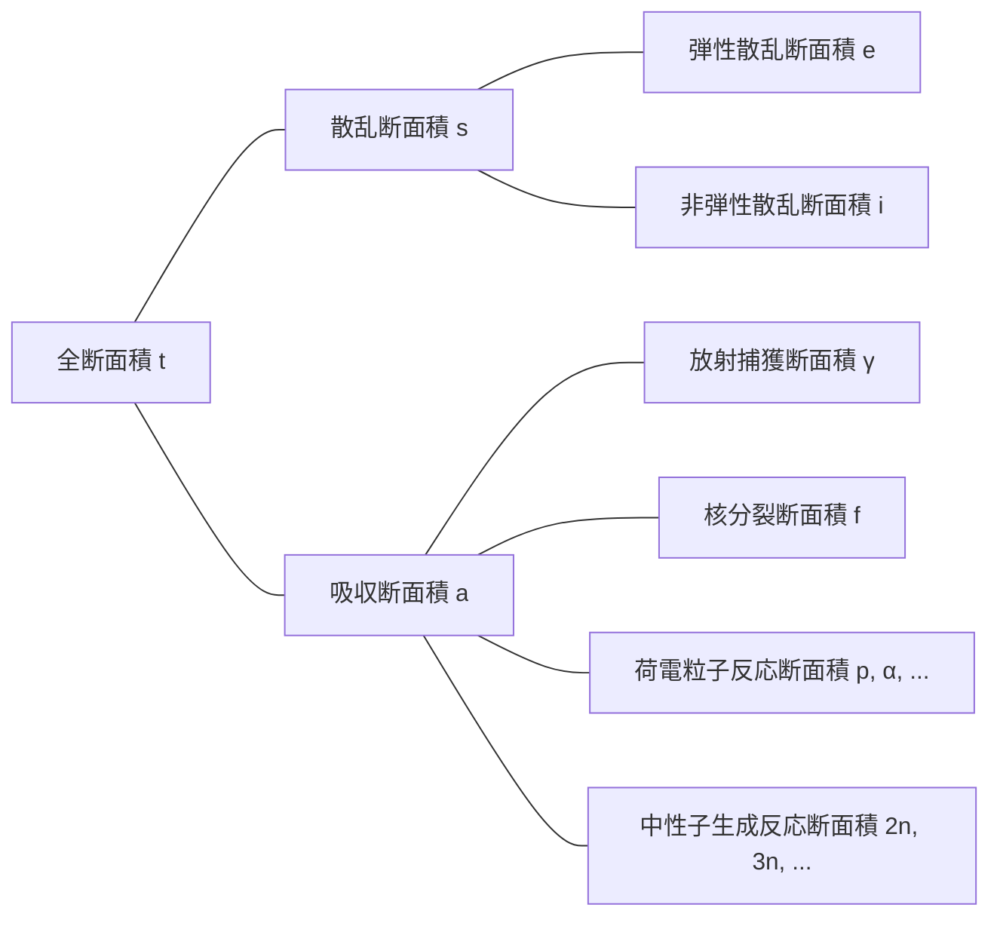

## 中性子相互作用
中性子は電気的に中性であるため、原子内の電子または原子核の正電荷による電気的影響を受けない。したがって、中性子は原子の電子雲を通過して原子核と直接反応することができる。

### 弾性散乱（elastic scattering）
- 中性子が原子核に衝突後、はじき返される
- 原子核はエネルギー変化なく基底状態を維持
- (n, n)と表示

### 非弾性散乱（inelastic scattering）
- 中性子が原子核に衝突後、はじき返される
- 弾性散乱と異なり、原子核が中性子のエネルギーの一部を吸収して励起状態になる（吸熱反応）
- (n, n′)と表示
- 励起された原子核はガンマ線を放出して基底状態に戻るが、このとき発生するガンマ線を*非弾性ガンマ線（inelastic $\gamma$-ray）*と呼ぶ

### 放射捕獲（radiative capture）
- 原子核が中性子を捕獲し、1つ以上のガンマ線を放出（発熱反応）
- (n, $\gamma$)と表示
- このとき発生するガンマ線を*捕獲ガンマ線（capture $\gamma$-ray）*と呼ぶ

### 荷電粒子反応
- 原子核が中性子を捕獲し、アルファ粒子（$\alpha$）や陽子（p）などの荷電粒子を放出
- (n, $\alpha$)、(n, p)などと表示
- 場合によっては発熱反応にも、吸熱反応にもなりうる

### 中性子生成反応
- 高エネルギーの中性子と原子核が衝突し、2個以上の中性子を新たに放出（吸熱反応）
- (n, 2n)、(n, 3n)などと表示
- (n, 2n)反応は重水またはベリリウムを含む原子炉で特に重要で、$^2\text{H}$と$^9\text{Be}$の中性子は結合エネルギーが小さいため、低エネルギーの中性子との衝突でも容易に放出されるため

### 核分裂（fission）
- 中性子がある原子核と衝突し、その原子核を2つ以上の娘核に分裂させる

## 断面積（cross-section）または微視的断面積（microscopic cross-section）
単一エネルギー中性子ビームが（非常に薄い）厚さ$\tau$と面積$A$のターゲットに入射し、このとき毎秒単位面積当たりターゲットに入射する中性子数を$I\ \text{neutrons/cm}^2\cdot \text{s}$とする。原子において原子核が占める体積の割合は非常に小さく、ターゲットが非常に薄いと仮定したので、中性子のほとんどは原子核と反応せずにターゲットを通過する。すると、毎秒単位面積当たり原子核と衝突する中性子数は中性子ビームの強度$I$、ターゲットの厚さ$\tau$、ターゲットの原子密度$N$に比例する。

$$ \Delta I \propto I\tau N $$

比例定数$\sigma$を導入すると、次のように表現できる。

$$ \Delta I = \sigma I\tau N\ \text{[neutrons/cm}^2\cdot\text{s]} \tag{1} $$

ターゲットに入射する中性子のうち原子核と衝突する中性子の割合を求めると次のようになる。

$$ p = \frac {\Delta I}{I} = \sigma\tau N = \frac {\sigma}{A} A\tau N = \frac {\sigma}{A} N_t \tag{2} $$

（$N_t$：ターゲットの総原子数）

この式から$\sigma$は面積の単位を持つことがわかる。この比例定数$\sigma$を*断面積（cross-section）*または*微視的断面積（microscopic cross-section）*と呼ぶ。断面積は物理的に原子核が中性子と反応できる有効断面積を意味する。

## 微視的断面積の単位
cm$^2$は微視的断面積を表現するには大きすぎる単位なので、一般的に*バーン（barn）*という単位を使用する。

$$ 1\ \text{b} = 10^{-24}\ \text{cm}^2 $$

## 微視的断面積の種類
- 全断面積（total）：$\sigma_t$
  - 散乱断面積（scattering）：$\sigma_s$
    - 弾性散乱断面積（elastic scattering）：$\sigma_e$
    - 非弾性散乱断面積（inelastic scattering）：$\sigma_i$
  - 吸収断面積（absorption）：$\sigma_a$
    - 放射捕獲断面積（radiative capture）：$\sigma_\gamma$
    - 核分裂断面積（fission）：$\sigma_f$
    - 荷電粒子反応断面積：$\sigma_p, \sigma_\alpha, \cdots$
    - 中性子生成反応断面積：$\sigma_{2n}, \sigma_{3n}, \cdots$

## 巨視的断面積（macroscopic cross-section）
式（2）から中性子ビームの単位距離当たりの衝突率を求めると次のようになる。

$$ \frac {p}{\tau} = \frac {1}{\tau} \frac {\Delta I}{I} = \sigma N \equiv \Sigma\ \text{[cm}^{-1}\text{]} \tag{3}$$

*巨視的断面積（macroscopic cross-section）*は上のように原子密度$N$と断面積の積として定義する。巨視的断面積は物理的にあるターゲット内での中性子の進行距離当たりの衝突率を意味する。微視的断面積と同様に次のように細分化できる。

- 巨視的全断面積 $\Sigma_t=N\sigma_t$
  - 巨視的散乱断面積 $\Sigma_s=N\sigma_s$
  - 巨視的吸収断面積 $\Sigma_a=N\sigma_a$

一般的に、ある反応に対する巨視的断面積 $\Sigma_{reaction}=N\sigma_{reaction}$である。

## 衝突密度（collision density）、すなわち反応率（reaction rate）
*衝突密度（collision density）*、*反応率（reaction rate）*はターゲットでの単位時間、単位体積当たりの衝突回数を意味する。式（1）、（3）から次のように定義できる。

$$ F = \frac {\Delta I}{\tau} = I\sigma N = I\Sigma \tag{4} $$
