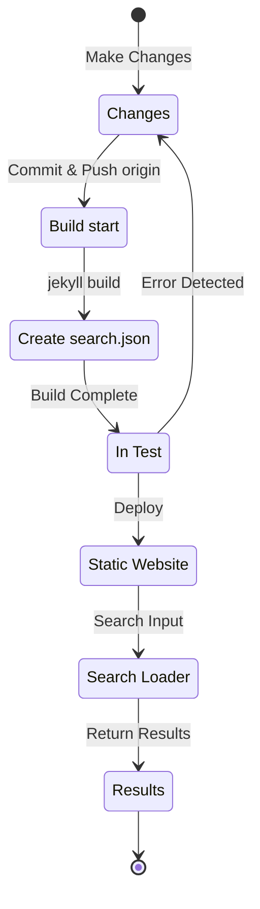

## 概要
約4ヶ月前の12024年7月初旬、Jekyll基盤でGitHub Pagesを通じてホスティング中の本ブログに[Polyglot](https://github.com/untra/polyglot)プラグインを適用して多言語対応実装を追加した。
このシリーズはChirpyテーマにPolyglotプラグインを適用する過程で発生したバグとその解決過程、そしてSEOを考慮したhtmlヘッダーとsitemap.xmlの作成法を共有する。
シリーズは2つの記事で構成されており、現在読んでいるこの記事はそのシリーズの2番目の記事である。
- 1編：[Polyglotプラグインの適用 & hreflang altタグ及びsitemap、言語選択ボタンの実装](/posts/how-to-support-multi-language-on-jekyll-blog-with-polyglot-1)
- 2編：Chirpyテーマビルド失敗及び検索機能エラーのトラブルシューティング（本文）

## 要求条件
- [x] ビルドした結果物（ウェブページ）を言語別パス（例：`/posts/ko/`{: .filepath}、`/posts/ja/`{: .filepath}）で区分して提供できなければならない。
- [x] 多言語対応に追加的に要する時間と労力を可能な限り最小化するため、作成した原本マークダウンファイルのYAML front matterに'lang'及び'permalink'タグを一々指定しなくても、ビルド時に該当ファイルが位置するローカルパス（例：`/_posts/ko/`{: .filepath}、`/_posts/ja/`{: .filepath}）に応じて自動的に言語を認識できなければならない。
- [x] サイト内各ページのヘッダー部分は適切なContent-Languageメタタグとhreflang代替タグ、canonical linkを含んで多言語検索のためのGoogle SEOガイドラインを満たさなければならない。
- [x] サイト内で各言語バージョン別ページリンクを漏れなく`sitemap.xml`{: .filepath}で提供できなければならず、`sitemap.xml`{: .filepath}自体は重複なくルートパスに一つだけ存在しなければならない。
- [x] [Chirpyテーマ](https://github.com/cotes2020/jekyll-theme-chirpy)で提供するすべての機能は各言語ページで正常動作しなければならず、そうでなければ正常動作するよう修正しなければならない。
  - [x] 'Recently Updated'、'Trending Tags'機能の正常動作
  - [x] GitHub Actionsを利用したビルド過程でエラーが発生しないこと
  - [x] ブログ右上の投稿検索機能の正常動作

## 始める前に
この記事は[第1回](/posts/how-to-support-multi-language-on-jekyll-blog-with-polyglot-1)からの続きですので、まだ読んでいない場合は、まず前の記事から読むことをお勧めします。

## トラブルシューティング（'relative_url_regex': target of repeat operator is not specified）
前のステップまで進めた後、`bundle exec jekyll serve`コマンドを実行してビルドテストをしたところ、`'relative_url_regex': target of repeat operator is not specified`というエラーが発生し、ビルドに失敗しました。

```shell
...(前略)
                    ------------------------------------------------
      Jekyll 4.3.4   Please append `--trace` to the `serve` command 
                     for any additional information or backtrace. 
                    ------------------------------------------------
/Users/yunseo/.gem/ruby/3.2.2/gems/jekyll-polyglot-1.8.1/lib/jekyll/polyglot/
patches/jekyll/site.rb:234:in `relative_url_regex': target of repeat operator 
is not specified: /href="?\/((?:(?!*.gem)(?!*.gemspec)(?!tools)(?!README.md)(
?!LICENSE)(?!*.config.js)(?!rollup.config.js)(?!package*.json)(?!.sass-cache)
(?!.jekyll-cache)(?!gemfiles)(?!Gemfile)(?!Gemfile.lock)(?!node_modules)(?!ve
ndor\/bundle\/)(?!vendor\/cache\/)(?!vendor\/gems\/)(?!vendor\/ruby\/)(?!en\/
)(?!ko\/)(?!es\/)(?!pt-BR\/)(?!ja\/)(?!fr\/)(?!de\/)[^,'"\s\/?.]+\.?)*(?:\/[^
\]\[)("'\s]*)?)"/ (RegexpError)

...(後略)
```

同様の問題が報告されているか検索した結果、Polyglotリポジトリに[全く同じ問題](https://github.com/untra/polyglot/issues/204)が既に登録されており、解決策も存在していました。

このブログに適用している[Chirpyテーマの`_config.yml`{: .filepath}](https://github.com/cotes2020/jekyll-theme-chirpy/blob/master/_config.yml)ファイルには、次のような構文が存在します。

```yml
exclude:
  - "*.gem"
  - "*.gemspec"
  - docs
  - tools
  - README.md
  - LICENSE
  - "*.config.js"
  - package*.json
```
{: file='_config.yml'}

問題の原因は[Polyglotの`site.rb`{: .filepath}](https://github.com/untra/polyglot/blob/master/lib/jekyll/polyglot/patches/jekyll/site.rb)ファイルに含まれる次の二つの関数の正規表現構文が、上記の`"*.gem"`、`"*.gemspec"`、`"*.config.js"`のようなワイルドカードを含むグロビング（globbing）パターンを正常に処理できないことにあります。


```ruby
    # a regex that matches relative urls in a html document
    # matches href="baseurl/foo/bar-baz" href="/foo/bar-baz" and others like it
    # avoids matching excluded files.  prepare makes sure
    # that all @exclude dirs have a trailing slash.
    def relative_url_regex(disabled = false)
      regex = ''
      unless disabled
        @exclude.each do |x|
          regex += "(?!#{x})"
        end
        @languages.each do |x|
          regex += "(?!#{x}\/)"
        end
      end
      start = disabled ? 'ferh' : 'href'
      %r{#{start}="?#{@baseurl}/((?:#{regex}[^,'"\s/?.]+\.?)*(?:/[^\]\[)("'\s]*)?)"}
    end

    # a regex that matches absolute urls in a html document
    # matches href="http://baseurl/foo/bar-baz" and others like it
    # avoids matching excluded files.  prepare makes sure
    # that all @exclude dirs have a trailing slash.
    def absolute_url_regex(url, disabled = false)
      regex = ''
      unless disabled
        @exclude.each do |x|
          regex += "(?!#{x})"
        end
        @languages.each do |x|
          regex += "(?!#{x}\/)"
        end
      end
      start = disabled ? 'ferh' : 'href'
      %r{(?<!hreflang="#{@default_lang}" )#{start}="?#{url}#{@baseurl}/((?:#{regex}[^,'"\s/?.]+\.?)*(?:/[^\]\[)("'\s]*)?)"}
    end
```
{: file='(polyglot root path)/lib/jekyll/polyglot/patches/jekyll/site.rb'}


この問題を解決する方法は二つあります。

### 1. Polyglotをフォーク（fork）して問題のある部分を修正して使用する
この記事を書いている時点（12024.11.）では、[Jekyll公式ドキュメント](https://jekyllrb.com/docs/configuration/options/#global-configuration)で`exclude`設定がグロビング（globbing）パターンの活用をサポートすると明記されています。

>"This configuration option supports Ruby's File.fnmatch filename globbing patterns to match multiple entries to exclude."

つまり、問題の原因はChirpyテーマではなく、Polyglotの`relative_url_regex()`、`absolute_url_regex()`という二つの関数にあるため、これらを問題が発生しないように修正することが根本的な解決策です。

Polyglotではこのバグはまだ解決されていない状態なので、[このブログ投稿](https://hionpu.com/posts/github_blog_4#4-polyglot-%EC%9D%98%EC%A1%B4%EC%84%B1-%EB%AC%B8%EC%A0%9C)と[前述のGitHubイシューに付いた回答](https://github.com/untra/polyglot/issues/204#issuecomment-2143270322)を参考にして、Polyglotリポジトリをフォーク（fork）した後、問題のある部分を次のように修正して、オリジナルのPolyglotの代わりに使用すれば良いです。


```ruby
    def relative_url_regex(disabled = false)
      regex = ''
      unless disabled
        @exclude.each do |x|
          escaped_x = Regexp.escape(x)
          regex += "(?!#{escaped_x})"
        end
        @languages.each do |x|
          escaped_x = Regexp.escape(x)
          regex += "(?!#{escaped_x}\/)"
        end
      end
      start = disabled ? 'ferh' : 'href'
      %r{#{start}="?#{@baseurl}/((?:#{regex}[^,'"\s/?.]+\.?)*(?:/[^\]\[)("'\s]*)?)"}
    end

    def absolute_url_regex(url, disabled = false)
      regex = ''
      unless disabled
        @exclude.each do |x|
          escaped_x = Regexp.escape(x)
          regex += "(?!#{escaped_x})"
        end
        @languages.each do |x|
          escaped_x = Regexp.escape(x)
          regex += "(?!#{escaped_x}\/)"
        end
      end
      start = disabled ? 'ferh' : 'href'
      %r{(?<!hreflang="#{@default_lang}" )#{start}="?#{url}#{@baseurl}/((?:#{regex}[^,'"\s/?.]+\.?)*(?:/[^\]\[)("'\s]*)?)"}
    end
```
{: file='(polyglot root path)/lib/jekyll/polyglot/patches/jekyll/site.rb'}


### 2. Chirpyテーマの'_config.yml'設定ファイルでグロビング（globbing）パターンを正確なファイル名に置き換える
実際、正統的で理想的な方法は上記のパッチがPolyglotのメインストリームに反映されることです。しかし、それまではフォークしたバージョンを代わりに使用する必要がありますが、この場合、Polyglotのアップストリームがバージョンアップするたびにそのアップデートを見逃さずに反映しながら追いかけるのが面倒なため、私は別の方法を使用しました。

[Chirpyテーマリポジトリ](https://github.com/cotes2020/jekyll-theme-chirpy)でプロジェクトのルートパスに位置するファイルのうち、`"*.gem"`、`"*.gemspec"`、`"*.config.js"`パターンに対応するファイルを確認すると、以下の3つしかありません。
- `jekyll-theme-chirpy.gemspec`{: .filepath}
- `purgecss.config.js`{: .filepath}
- `rollup.config.js`{: .filepath}

したがって、`_config.yml`{: .filepath}ファイルの`exclude`構文からグロビング（globbing）パターンを削除し、以下のように書き換えれば、Polyglotが問題なく処理できるようになります。

```yml
exclude: # https://github.com/untra/polyglot/issues/204 イシューを参考に修正。
  # - "*.gem"
  - jekyll-theme-chirpy.gemspec # - "*.gemspec"
  - tools
  - README.md
  - LICENSE
  - purgecss.config.js # - "*.config.js"
  - rollup.config.js
  - package*.json
```
{: file='_config.yml'}

## 検索機能の修正
前のステップまで進めた時点で、ほとんどのサイト機能が意図した通りに満足に動作していました。しかし、Chirpyテーマを適用したページの右上に位置する検索バーが`site.default_lang`（このブログの場合は英語）以外の言語で書かれたページをインデックスできず、英語以外の他の言語で検索した場合にも検索結果として英語ページを出力するという問題があることを後で発見しました。

原因を把握するために、検索機能に関わるファイルが何であり、その中でどこに問題が発生しているのかを見てみましょう。

### '_layouts/default.html'
ブログ内のすべてのページの枠組みを構成する[`_layouts/default.html`{: .filepath}](https://github.com/cotes2020/jekyll-theme-chirpy/blob/master/_layouts/default.html)ファイルを確認すると、`<body>`エレメント内に`search-results.html`{: .filepath}と`search-loader.html`{: .filepath}の内容を読み込んでいることが確認できます。


```liquid
  <body>
    

    <div id="main-wrapper" class="d-flex justify-content-center">
      <div class="container d-flex flex-column px-xxl-5">
        
        (...中略...)

        
      </div>

      <aside aria-label="Scroll to Top">
        <button id="back-to-top" type="button" class="btn btn-lg btn-box-shadow">
          <i class="fas fa-angle-up"></i>
        </button>
      </aside>
    </div>

    (...中略...)

    
  </body>
```
{: file='_layouts/default.html'}


### '_includes/search-result.html'
[`_includes/search-result.html`{: .filepath}](https://github.com/cotes2020/jekyll-theme-chirpy/blob/master/_includes/search-results.html)は検索窓に検索語入力時、そのキーワードに対する検索結果を保存するための`search-results`コンテナを構成します。


```html
<!-- The Search results -->

<div id="search-result-wrapper" class="d-flex justify-content-center d-none">
  <div class="col-11 content">
    <div id="search-hints">
      
    </div>
    <div id="search-results" class="d-flex flex-wrap justify-content-center text-muted mt-3"></div>
  </div>
</div>
```
{: file='_includes/search-result.html'}


### '_includes/search-loader.html'
[`_includes/search-loader.html`{: .filepath}](https://github.com/cotes2020/jekyll-theme-chirpy/blob/master/_includes/search-loader.html)がまさに[Simple-Jekyll-Search](https://github.com/christian-fei/Simple-Jekyll-Search)ライブラリベースの検索を実装した核心的な部分で、これは[`search.json`{: .filepath}](#assetsjsdatasearchjson)インデックスファイルの内容のうち、入力キーワードと一致する部分を見つけて該当する投稿リンクを`<article>`エレメントとして返すJavaScriptを訪問者のブラウザ上で実行することによって、クライアントサイドで動作することがわかります。


```js

  <article class="px-1 px-sm-2 px-lg-4 px-xl-0">
    <header>
      <h2><a href="{url}">{title}</a></h2>
      <div class="post-meta d-flex flex-column flex-sm-row text-muted mt-1 mb-1">
        {categories}
        {tags}
      </div>
    </header>
    <p>{snippet}</p>
  </article>


<p class="mt-5">{{ site.data.locales[include.lang].search.no_results }}</p>

<script>
   Note: dependent library will be loaded in `js-selector.html` 
  document.addEventListener('DOMContentLoaded', () => {
    SimpleJekyllSearch({
      searchInput: document.getElementById('search-input'),
      resultsContainer: document.getElementById('search-results'),
      json: '{{ '/assets/js/data/search.json' | relative_url }}',
      searchResultTemplate: '{{ result_elem | strip_newlines }}',
      noResultsText: '{{ not_found }}',
      templateMiddleware: function(prop, value, template) {
        if (prop === 'categories') {
          if (value === '') {
            return `${value}`;
          } else {
            return `<div class="me-sm-4"><i class="far fa-folder fa-fw"></i>${value}</div>`;
          }
        }

        if (prop === 'tags') {
          if (value === '') {
            return `${value}`;
          } else {
            return `<div><i class="fa fa-tag fa-fw"></i>${value}</div>`;
          }
        }
      }
    });
  });
</script>
```
{: file='_includes/search-loader.html'}


### '/assets/js/data/search.json'

```liquid
---
layout: compress
swcache: true
---

[
  
  {
    "title": {{ post.title | jsonify }},
    "url": {{ post.url | relative_url | jsonify }},
    "categories": {{ post.categories | join: ', ' | jsonify }},
    "tags": {{ post.tags | join: ', ' | jsonify }},
    "date": "{{ post.date }}",
    
    
    "snippet": {{ _content | truncate: 200 | jsonify }},
    "content": {{ _content | jsonify }}
  },
  
]
```
{: file='/assets/js/data/search.json'}


JekyllのLiquid構文を利用して、サイト内のすべての投稿のタイトル、URL、カテゴリーおよびタグ情報、作成日、本文の最初の200文字のスニペット、そして全文内容を含むJSONファイルを定義しています。

### 検索機能の動作構造と問題発生部分の把握
つまり整理すると、GitHub Pages上でChirpyテーマをホスティングする場合、検索機能は次のようなプロセスで動作します。



ここで`search.json`{: .filepath}はPolyglotによって次のように各言語別に生成されることを確認しました。
- `/assets/js/data/search.json`{: .filepath}
- `/ko/assets/js/data/search.json`{: .filepath}
- `/es/assets/js/data/search.json`{: .filepath}
- `/pt-BR/assets/js/data/search.json`{: .filepath}
- `/ja/assets/js/data/search.json`{: .filepath}
- `/fr/assets/js/data/search.json`{: .filepath}
- `/de/assets/js/data/search.json`{: .filepath}

したがって、問題の原因となる部分は「Search Loader」です。英語以外の他の言語バージョンのページが検索されない問題は、`_includes/search-loader.html`{: .filepath}で現在訪問中のページの言語に関係なく、英語インデックスファイル（`/assets/js/data/search.json`{: .filepath}）のみを静的に読み込むために発生します。

> - ただし、マークダウンやhtml形式ファイルとは異なり、JSONファイルに対しては`post.title`、`post.content`などJekyll提供変数に対するPolyglot wrapperは動作しますが、[Relativized Local Urls](https://github.com/untra/polyglot?tab=readme-ov-file#relativized-local-urls)機能は動作しないようです。
> - 同様に、JSONファイルテンプレート内では、Jekyll基本提供変数以外に[Polyglotで追加提供する`{{ site.default_lang }}`、`{{ site.active_lang }}` liquidタグ](https://github.com/untra/polyglot?tab=readme-ov-file#features)にはアクセスできないことをテスト過程で確認しました。
>
> したがって、インデックスファイル内の`title`、`snippet`、`content`などの値は言語別に異なって生成されますが、`url`値は言語を考慮しない基本パスを返すため、これに対する適切な処理を「Search Loader」部分に追加する必要があります。
{: .prompt-warning }

### 問題解決
これを解決するには、`_includes/search-loader.html`{: .filepath}の内容を次のように修正します。


```

  <article class="px-1 px-sm-2 px-lg-4 px-xl-0">
    <header>
      
      <h2><a href="/{{ site.active_lang }}{url}">{title}</a></h2>
      
      <h2><a href="{url}">{title}</a></h2>
      

(...中略...)

<script>
   Note: dependent library will be loaded in `js-selector.html` 
  document.addEventListener('DOMContentLoaded', () => {
    
    
      
    
    
    SimpleJekyllSearch({
      searchInput: document.getElementById('search-input'),
      resultsContainer: document.getElementById('search-results'),
      json: '{{ search_path | relative_url }}',
      searchResultTemplate: '{{ result_elem | strip_newlines }}',

(...後略)
```
{: file='_includes/search-loader.html'}


- `site.active_lang`（現在のページの言語）と`site.default_lang`（サイトのデフォルト言語）が同じでない場合、JSONファイルから読み込んだ投稿URLの前に`"/{{ site.active_lang }}"`プレフィックスを追加するように``部分のliquid構文を修正しました。
- 同じ方法で、ビルド過程で現在のページの言語とサイトのデフォルト言語を比較し、同じであればデフォルトパス（`/assets/js/data/search.json`{: .filepath}）を、異なる場合はその言語に合ったパス（例：`/ko/assets/js/data/search.json`{: .filepath}）を`search_path`として指定するように`<script>`部分を修正しました。

上記のように修正した後、ウェブサイトを再ビルドすると、各言語に合わせて検索結果が正常に表示されることを確認しました。

> `{url}`は後でJSONファイルから読み込んだURL値が入る場所であり、それ自体がURLではないため、Polyglotではlocalizationの対象として認識しないため、直接言語に応じて処理する必要があります。問題は、そのように処理した`"/{{ site.active_lang }}{url}"`はURLとして認識され、すでにlocalizationが完了していますが、Polyglotはそこまで知らないため、重複してlocalizationを実行しようとすることです（例：`"/ko/ko/posts/example-post"`{: .filepath}）。これを防ぐために[``タグ](https://github.com/untra/polyglot?tab=readme-ov-file#disabling-url-relativizing)を明示しました。
{: .prompt-tip }
