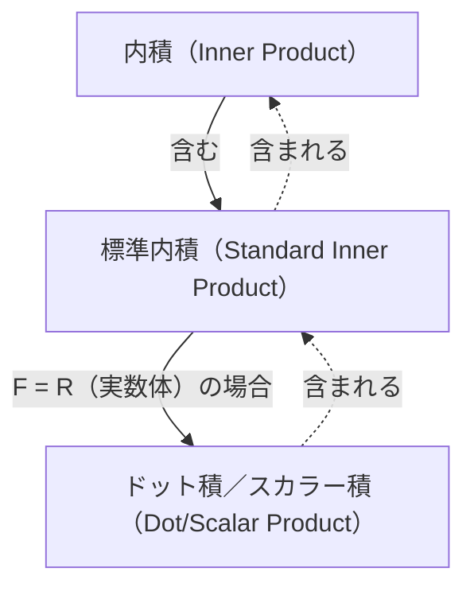

## 前提知識
- [ベクトルと線形結合](/posts/vectors-and-linear-combinations/)

## 内積

一般の $F$-ベクトル空間における**内積（inner product）**の定義は次のとおりである。

> **内積（inner product）と内積空間（inner product space）の定義**  
> $F$-ベクトル空間 $\mathbb{V}$ を考える。$\mathbb{V}$ における**内積（inner product）** $\langle \mathbf{x},\mathbf{y} \rangle$ は、$\mathbb{V}$ の任意のベクトル $\mathbf{x}$ と $\mathbf{y}$ の順序対を $F$ に属するスカラーに対応させる、次の条件を満たす関数として定義する。
>
> 任意の $\mathbf{x},\mathbf{y},\mathbf{z} \in \mathbb{V}$ と任意の $c \in F$ について
> 1. $\langle \mathbf{x}+\mathbf{z}, \mathbf{y} \rangle = \langle \mathbf{x}, \mathbf{y} \rangle + \langle \mathbf{z}, \mathbf{y} \rangle$
> 2. $\langle c\mathbf{x}, \mathbf{y} \rangle = c \langle \mathbf{x}, \mathbf{y} \rangle$
> 3. $\overline{\langle \mathbf{x}, \mathbf{y} \rangle} = \langle \mathbf{y}, \mathbf{x} \rangle$（$\overline{\mathbf{z}}$ は $\mathbf{z}$ の複素共役）
> 4. $\mathbf{x} \neq \mathbf{0}$ のとき、$\langle \mathbf{x}, \mathbf{x} \rangle$ は正である。
>
> 内積が与えられた $F$-ベクトル空間 $\mathbb{V}$ を**内積空間（inner product space）**という。特に $F=\mathbb{C}$ の場合を**複素内積空間（complex inner product space）**、$F=\mathbb{R}$ の場合を**実内積空間（real inner product space）**という。
{: .prompt-info }

特に次の内積を**標準内積（standard inner product）**という。標準内積が前述の4条件をすべて満たすことが確かめられる。

> **標準内積（standard inner product）の定義**  
> $F^n$ の二つのベクトル $\mathbf{x}=(a_1, a_2, \dots, a_n)$、$\mathbf{y}=(b_1, b_2, \dots, b_n)$ に対して、$F^n$ の**標準内積（standard inner product）**を次のように定義する。
>
> $$\langle \mathbf{x}, \mathbf{y} \rangle = \sum_{i=1}^n a_i \overline{b_i} $$
>
{: .prompt-info }

ここで $F=\mathbb{R}$ なら、実数の複素共役は自分自身なので、このときの標準内積は $\sum_{i=1}^n a_i b_i$ となる。特にこの場合の標準内積は $\langle \mathbf{x}, \mathbf{y} \rangle$ の代わりに $\mathbf{x} \cdot \mathbf{y}$ と表記し、**ドット積（dot product）**または**スカラー積（scalar product）**という。

> **ドット積（dot product）／スカラー積（scalar product）の定義**  
> $\mathbb{R}^n$ の $\mathbf{v}=(v_1, v_2, \dots, v_n)$、$\mathbf{w}=(w_1, w_2, \dots, w_n)$ に対して、$\mathbb{R}^n$ の**ドット積（dot product）**または**スカラー積（scalar product）**を次のように定義する。
>
> $$ \mathbf{v} \cdot \mathbf{w} = \sum_{i=1}^n v_i w_i = v_1 w_1 + v_2 w_2 + \cdots + v_n w_n $$
> 
{: .prompt-info }

> ここでいう「スカラー積（scalar product）」はベクトルどうしの演算であり、[ベクトルと線形結合](/posts/vectors-and-linear-combinations/)で扱ったベクトルのスカラー倍、「スカラー倍（scalar multiplication）」とは別の演算である。英語表現も似ているうえに、<u>韓国語では訳語がまったく同じなので</u>混同しないよう注意しよう。
>
> 混同を避けるため、以後は可能なかぎり**ドット積（dot product）**と呼ぶことにする。
{: .prompt-warning }

> ユークリッド空間での内積（inner product）はすなわちドット積（dot product）であるため、文脈上混同の余地がなければドット積を単に内積と呼ぶことも多い。ただし厳密には、内積はドット積を包含するより一般的な概念である。
{: .prompt-tip }

## ベクトルの長さ／ノルム

$\mathbb{R}^n$ におけるベクトル $\mathbf{v}=(v_1, v_2, \dots, v_n)$ に対して、$\mathbf{v}$ のユークリッドの長さは次のようにドット積を通じて定義する。

$$ \| \mathbf{v} \| = \sqrt{\mathbf{v} \cdot \mathbf{v}} = \left[ \sum_{i=1}^n |v_i|^2 \right]^{1/2} = \sqrt{v_1^2 + v_2^2 + \cdots + v_n^2} $$

より一般には、任意の内積空間におけるベクトルの**長さ（length）**または**ノルム（norm）**を次のように定義する。

$$ \| \mathbf{x} \| = \sqrt{\langle \mathbf{x}, \mathbf{x} \rangle} $$

一般の内積空間では、ベクトルのノルムについて次の重要な性質が成り立つ。

> **定理**  
> $F$-内積空間 $\mathbb{V}$ と任意のベクトル $\mathbf{x}, \mathbf{y} \in \mathbb{V}$、スカラー $c \in F$ に対して次が成り立つ。
> 1. $\\|c\mathbf{x}\\| = \|c\| \cdot \\|\mathbf{x}\\|$
> 2. 次の二つが成り立つ。
>    - $\\|\mathbf{x}\\| = 0 \iff \mathbf{x}=\mathbf{0}$
>    - $\\|\mathbf{x}\\| \geq 0 \ \forall \mathbf{x}$
> 3. **コーシー・シュワルツの不等式（Cauchy-Schwarz inequality）**: $\| \langle \mathbf{x}, \mathbf{y} \rangle \| \leq \\|\mathbf{x}\\| \cdot \\|\mathbf{y}\\|$（等号は $\mathbf{x}$ と $\mathbf{y}$ のどちらかが他方のスカラー倍のときに成り立つ）
> 4. **三角不等式（triangle inequality）**: $\\| \mathbf{x} + \mathbf{y} \\| \leq \\|\mathbf{x}\\| + \\|\mathbf{y}\\|$（等号は $\mathbf{x}$ と $\mathbf{y}$ のどちらかが他方のスカラー倍で、かつ両者の向きが同じときに成り立つ）
{: .prompt-info }

## ベクトル間の角度と単位ベクトル

長さが 1 のベクトルを**単位ベクトル（unit vector）**という。また、$\mathbb{R}^n$ における二つのベクトル $\mathbf{v}=(v_1, v_2, \dots, v_n)$、$\mathbf{w}=(w_1, w_2, \dots, w_n)$ に対して $\mathbf{v} \cdot \mathbf{w} = \\|\mathbf{v}\\| \cdot \\|\mathbf{w}\\| \cos\theta$ が成り立ち、これから $\mathbf{v}$ と $\mathbf{w}$ の間の角 $\theta$（$0 \leq \theta \leq \pi$）を求めることができる。

$$ \theta = \arccos{\frac{\mathbf{v} \cdot \mathbf{w}}{\|\mathbf{v}\| \cdot \|\mathbf{w}\|}} $$

$\mathbf{v} \cdot \mathbf{w} = 0$ の場合、二つのベクトルは**垂直（perpendicular）**または**直交（orthogonal）**であるという。

> 二つのベクトル $\mathbf{v}$ と $\mathbf{w}$ が垂直のとき、
>
> $$ \begin{align*}
> \| \mathbf{v} + \mathbf{w} \|^2 &= (\mathbf{v} + \mathbf{w}) \cdot (\mathbf{v} + \mathbf{w}) \\
> &= \mathbf{v} \cdot \mathbf{v} + \mathbf{v} \cdot \mathbf{w} + \mathbf{w} \cdot \mathbf{v} + \mathbf{w} \cdot \mathbf{w} \\
> &= \mathbf{v} \cdot \mathbf{v} + \mathbf{w} \cdot \mathbf{w} \\
> &= \|\mathbf{v}\|^2 + \|\mathbf{w}\|^2.
> \end{align*} $$
>
{: .prompt-tip }

これを任意の内積空間へ一般化すると次のようになる。

> **定義**  
> 内積空間 $\mathbb{V}$ を考える。$\mathbb{V}$ のベクトル $\mathbf{x}, \mathbf{y}$ に対して $\langle \mathbf{x}, \mathbf{y} \rangle = 0$ であれば、二つのベクトルは**直交（orthogonal）**または**垂直（perpendicular）**であると定義する。さらに、
> 1. $\mathbb{V}$ の部分集合 $S$ に対して、$S$ に属する相異なる任意の二つのベクトルが直交するとき、集合 $S$ を**直交集合（orthogonal set）**という。
> 2. $\\|\mathbf{x}\\|=1$ であるベクトル $\mathbf{x} \in \mathbb{V}$ を**単位ベクトル（unit vector）**という。
> 3. $\mathbb{V}$ の部分集合 $S$ が直交集合で、かつ単位ベクトルのみから成るとき、集合 $S$ を**正規直交集合（orthonormal set）**という。
{: .prompt-info }

集合 $S = \{ \mathbf{v}_1, \mathbf{v}_2, \dots \}$ が正規直交集合であるための必要十分条件は $\langle \mathbf{v}\_i, \mathbf{v}\_j \rangle = \delta\_{ij}$ である。ベクトルに零でないスカラーを掛けても直交性には影響しない。

零でない任意のベクトル $\mathbf{x}$ に対して $\cfrac{\mathbf{x}}{\\|\mathbf{x}\\|}$ は単位ベクトルであり、このように零でないベクトルに長さの逆数を掛けて単位ベクトルを得る操作を**正規化（normalizing）**という。
