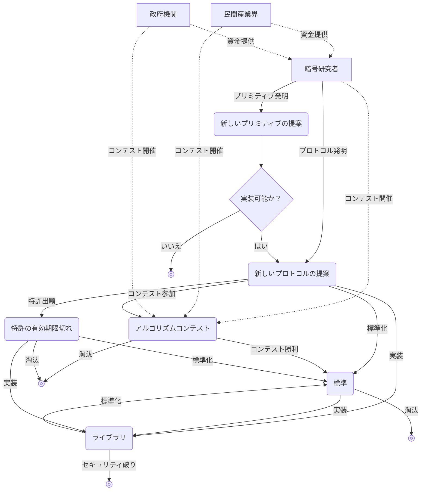

## 暗号学とは

**暗号学（cryptography）**とは本質的には、敵対的な行為から**プロトコル（protocol）**を防御することを目的とする、科学の一分野である。

ここで言うプロトコルとは、1人以上の人間が何かを達成するために従うべき手順のリストである。たとえば、デバイス間でクリップボードを共有したいとしよう。次のような手順は、クリップボード共有のためのプロトコルの一例である。

1. いずれかのデバイスでクリップボードに変更があったら、その内容をコピーしてサーバにアップロードする。
2. サーバは、共有クリップボードに変更があったことを他のデバイスに通知する。
3. 他のデバイスは、その共有クリップボードの内容をサーバからダウンロードする。

ただし、これは良いプロトコルとは言えない。クリップボードの内容を平文のままサーバにアップロードし、またダウンロードする場合、通信の途中で第三者が、あるいはサーバ運営側がその内容を盗み見ることができてしまうからである。ここで、クリップボードの内容を盗み見ようとする敵の存在を考慮し、防御することが暗号学の役割である。

## 対称鍵暗号

### 対称鍵暗号化

> アリス（Alice）がボブ（Bob）に手紙を送らなければならない状況を考えよう。アリスはボブに機密情報を伝えるため、伝令（messenger）に手紙を持たせて届けるよう命じる。
> しかしアリスは伝令を完全には信頼しておらず、伝えるメッセージが、手紙を運ぶ伝令を含めてボブ以外のすべての人に対して秘密に保たれることを望んでいる。

このような状況で使うために昔から発明されていた暗号アルゴリズムが、まさに**対称鍵暗号アルゴリズム（symmetric encryption algorithm）**である。

> **プリミティブ（primitive）**  
> プリミティブ（primitive）という単語は、辞書的には「原始的な」「原始的なもの」という意味を持つ。
> 暗号学でもこのプリミティブという用語がよく使われるが、ここでのプリミティブとは、暗号システムを構成する最小単位の関数やアルゴリズムを意味する。
> 「基本要素」「基盤となるロジック」といった程度に捉えることができる。
{: .prompt-info }

次の2つの関数を提供するあるプリミティブを考えてみよう。
- `ENCRYPT`: **秘密鍵（secret key）**（通常は大きな数）と**メッセージ（message）**を入力として受け取り、一連の数列を暗号化されたメッセージとして出力する関数
- `DECRYPT`: `ENCRYPT` の逆関数で、同じ秘密鍵と暗号化されたメッセージを入力として受け取り、元のメッセージを出力する関数

このような暗号プリミティブを用いて、伝令を含む第三者がアリスのメッセージを読めないよう隠すには、まずアリスとボブが事前に会って、どの秘密鍵を使うかを決めておく必要がある。その後、アリスは `ENCRYPT` 関数を使い、取り決めた秘密鍵でメッセージを暗号化し、この暗号化されたメッセージを伝令を介してボブに届ける。ボブは同じ秘密鍵を使って `DECRYPT` 関数を適用し、元のメッセージを得る。

このように秘密鍵を用いて対象を暗号化し、見た目には意味のないノイズと区別がつかないようにする過程は、暗号学においてプロトコルを保護する一般的な方法である。

対称鍵暗号化は、**対称鍵暗号（symmetric cryptography）**あるいは**秘密鍵暗号（secret key cryptography）**と呼ばれる、より大きなカテゴリの暗号アルゴリズムに属し、場合によっては鍵が2つ以上になることもある。

## ケルクホフスの原則

今日の私たちは、紙の手紙よりはるかに強力な通信手段であるコンピュータとインターネットを使って、ほぼリアルタイムにやり取りできる。しかし、言い換えれば悪意ある「伝令」もまた強力になったということでもある。それはカフェなどの安全でない公共Wi‑Fiかもしれないし、通信事業者（ISP）をはじめインターネットを構成しメッセージを伝達するさまざまな通信機器やサーバ、政府機関、さらにはアルゴリズムを実行している自分自身のデバイスの中に潜んでいるかもしれない。敵はより多くのメッセージをリアルタイムに観察し、気づかれないようナノ秒単位でメッセージを改ざん・盗聴・検閲できる。

長年の試行錯誤を経て、信頼できる安全性を備えるための大原則が導かれた。それは、<u>プリミティブを公開の場で分析しなければならないということである</u>。これと対比される方法論は**秘匿による安全性（security by obscurity）**と呼ばれ、その限界は明らかであり、今日では廃れている。

この大原則を初めて定式化したのは、11883年にオランダの言語学者かつ暗号研究者であったオーギュスト・ケルクホフス（Auguste Kerckhoffs）であり、**ケルクホフスの原則（Kerckhoffs's principle）**と呼ばれる。同じ原則を、アメリカの数学者・計算機科学者・暗号研究者であり情報理論の父であるクロード・シャノンは「敵はシステムを知っている（The enemy knows the system）」、すなわち「システムを設計する際には、そのシステムが敵に把握されると仮定しなければならない」と表現した。これは**シャノンの格言（Shannon's maxim）**と呼ばれる。

暗号方式の安全性は鍵の秘匿性のみに依存すべきであり、暗号方式自体が知られても問題があってはならない。むしろAESの例のように積極的に公開し、多くの**暗号解析者（cryptanalyst）**によって検証されるようにしなければならない。秘密というものは常に漏洩の危険があり、したがって潜在的な故障点となるため、秘密として保持しなければならない部分が小さければ小さいほど、防御側にとって有利である。暗号方式のような大きく複雑なシステム全体を長期間秘密に保つことは非常に難しいが、鍵だけを秘密に保つことは比較的容易だからである。さらに、仮に秘密が漏洩したとしても、暗号方式全体を入れ替えるよりも、漏洩した鍵だけを新しい鍵に差し替えるほうがはるかに簡単である。

## 非対称鍵暗号

多くのプロトコルは、実際には対称鍵暗号に基づいて動作している。しかしこの方式は、鍵を決めるために参加者2人が最初に一度は直接会わなければならないことを前提としている。そのため、事前に鍵をどのように決定し、安全に共有するかが問題となり、これを**鍵配布（key distribution）**と呼ぶ。鍵配布問題は長らく難題であったが、11970年代後半に**非対称鍵暗号（asymmetric cryptography）**あるいは**公開鍵暗号（public key cryptography）**と呼ばれる暗号アルゴリズムが開発されて、ようやく解決された。

代表的な非対称鍵暗号プリミティブとして、**鍵共有（key exchange）**、**非対称鍵暗号化（asymmetric encryption）**、**電子署名（digital signature）**がある。

### 鍵共有

**鍵共有**は概略的には次のように動作する。

1. アリスとボブが、あるパラメータ集合 $G$ を共通に使うことに合意する。
2. アリスとボブが、それぞれが用いる**秘密鍵（private key）** $a, b$ を決める。
3. アリスとボブは、はじめに合意した共通パラメータ $G$ にそれぞれの秘密鍵 $a$, $b$ を組み合わせて**公開鍵（public key）** $A = f(G,a)$, $B = f(G,b)$ を計算し、それを公開の場で共有する。
4. アリスはボブの公開鍵 $B = f(G,b)$ と自分の秘密鍵 $a$ を使って $f(B,a) = f(f(G,b),a)$ を計算し、ボブも同様にアリスの公開鍵 $A = f(G,a)$ と自分の秘密鍵 $b$ を使って $f(A,b) = f(f(G,a),b)$ を計算する。
5. ここで $f(f(G,a),b) = f(f(G,b),a)$ という性質を持つ適切な $f$ を用いれば、最終的にアリスとボブは同じ秘密を共有することになる。一方で第三者は $G$ と公開鍵 $A = f(G,a)$, $B = f(G,b)$ を知っているものの、それだけでは $f(A,b)$ を求めることができないため、秘密は保たれる。

通常は、このようにして共有した秘密を[対称鍵暗号化](#対称鍵暗号化)の秘密鍵として用い、その後のメッセージのやり取りに利用する。

最初に発表され、かつ最も代表的な鍵共有アルゴリズムは、考案者2人の姓であるディフィー（Diffie）とヘルマン（Hellman）にちなみ命名されたディフィー–ヘルマン鍵共有アルゴリズムである。

しかし、ディフィー–ヘルマン鍵共有にも限界がある。攻撃者が公開鍵共有の段階で、公開鍵 $A = f(G,a)$, $B = f(G,b)$ を途中で傍受し、自分のもの $M = f(G,m)$ に差し替えてアリスとボブに渡す状況を考えよう。この場合、アリスと攻撃者は偽の秘密 $f(M, a) = f(A, m)$ を、ボブと攻撃者は別の偽の秘密 $f(M, b) = f(B, m)$ を共有することになる。こうなると、攻撃者はアリスの前ではボブのふりをし、ボブの前ではアリスのふりをすることができる。このような状況を<u><strong>中間者（man-in-the-middle, MITM）</strong></u>がプロトコルの攻撃に成功したと言う。このため鍵共有は信頼性の問題自体は解決せず、あくまで参加者が多い場合に手続きを単純化する効果を持つにとどまる。

### 非対称鍵暗号化

ディフィー–ヘルマン鍵共有アルゴリズムの発明の後、すぐに後続の発明がなされた。それが、発明者であるロナルド・リベスト（Ronald Rivest）、アディ・シャミア（Adi Shamir）、レナード・アデルマン（Leonard Adleman）の姓の頭文字を取って命名された**RSAアルゴリズム（RSA algorithm）**である。RSAは公開鍵暗号化（非対称鍵暗号化）と電子署名という2つのプリミティブを含み、どちらも非対称鍵暗号の一部である。

**非対称鍵暗号化**の場合、機密性を確保するためメッセージを暗号化するという基本的な目的は[対称鍵暗号化](#対称鍵暗号化)と似ている。しかし、暗号化と復号の両方に同じ共通鍵を用いる対称鍵暗号化とは異なり、非対称鍵暗号化は次のような特徴を持つ。
- 公開鍵と秘密鍵という2種類の鍵で動作する。
- 誰でも公開鍵を使って暗号化できるが、復号できるのは秘密鍵を持つ人だけである。

1. 誰でも中にメッセージを入れて施錠できるが、一度鍵をかけるとボブが持つ鍵（秘密鍵）でしか開けられない開いた箱（公開鍵）が存在する。
2. アリスは送りたいメッセージを箱に入れて鍵をかけ（暗号化し）、ボブに送る。
3. ボブは、鍵のかかった箱（暗号化されたメッセージ）を受け取り、自分の持つ鍵（秘密鍵）で箱を開けてメッセージを取り出す（復号する）。

### 電子署名

RSAは非対称鍵暗号化だけでなく**電子署名**も提供する。この電子署名プリミティブは、アリスとボブの間の信頼構築に非常に大きく貢献した。メッセージに署名するときには自分の秘密鍵を用い、他者がその署名の真偽を確認するときには、署名付きメッセージと署名、そして署名者の公開鍵を使って検証する、という形で動作する。

## 暗号学の効用

暗号学の目的は敵対的な行為からプロトコルを保護することであるから、そのプロトコルが達成しようとする目標が何かによって、暗号学の効用が決まる。ほとんどの暗号プリミティブやプロトコルは、次のうち1つ以上の性質を持つ。
- **機密性（confidentiality）**: 見てはいけない人から、情報の一部を隠し保護する。
- **認証（authentication）**: 会話相手を識別する（例: 受け取ったメッセージが本当にアリスから送られたものか確認する）。

## 暗号学エコシステム

