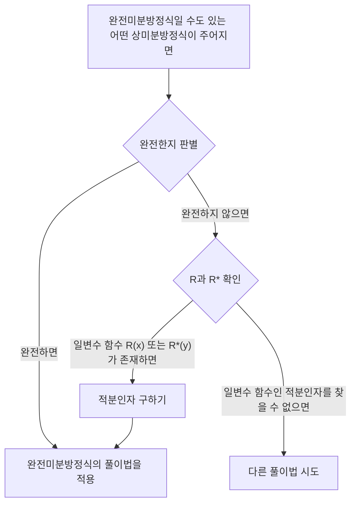

## TL;DR

## 완전미분방정식(Exact Differential Equation)
1계 상미분방정식 $M(x,y)+N(x,y)y'=0$은 

$$ M(x,y)dx+N(x,y)dy=0 \tag{1} $$

과 같이 쓸 수 있다. 만약 

$$ \exists u(x,y): \frac{\partial u}{\partial x}=M(x,y) \land \frac{\partial u}{\partial y}=N(x,y) \tag{2} $$

이면 

$$ M(x,y)dx+N(x,y)dy=\frac{\partial u}{\partial x}dx+\frac{\partial u}{\partial y}dy=du \tag{3} $$

이고, 이때 상미분방정식 $M(x,y)dx+N(x,y)dy=0$을 **완전미분방정식(exact differential equation)** 이라고 부른다. 그러면 이 상미분방정식은 

$$ du=0 $$

으로 쓸 수 있고, 적분하면 

$$ u(x,y)=c \tag{4} $$

의 형태로 일반해를 바로 얻는다.

## 완전미분방정식의 판별
$xy$ 평면상의, 자기 자신과 교차하지 않는 닫힌 곡선을 경계로 갖는 닫힌 영역에서, $M$과 $N$ 그리고 각각의 1계 편도함수가 연속이라고 하자. 조건 (2)를 다시 살펴보면 다음과 같다.

$$ \begin{align*}
\frac {\partial u}{\partial x}&=M(x,y) \tag{2a}
\\ \frac {\partial u}{\partial y}&=N(x,y) \tag{2b}
\end{align*}$$

위 식을 편미분하면 

$$ \begin{align*}
\frac {\partial M}{\partial y} &= \frac{\partial^2 u}{\partial y \partial x}
\\ \frac {\partial N}{\partial x} &= \frac{\partial^2 u}{\partial x \partial y}
\end{align*}$$

연속성을 가정하였으므로 두 개의 2계 편도함수는 서로 같다.

$$ \therefore \frac {\partial M}{\partial y}=\frac {\partial N}{\partial x} \tag{5}$$

따라서 조건 (5)는 상미분방정식 (1)이 완전미분방정식이 되기 위한 필요조건임을 알 수 있으며, 여기서 증명하진 않았으나 사실은 충분조건이기도 하다. 즉 이 조건을 충족하는지 확인함으로써 완전미분방정식 여부를 판별할 수 있다.

## 완전미분방정식의 풀이
식 (2a)를, $y$는 상수로 간주하고 $x$에 관하여 적분하면

$$ u = \int M(x,y) dx + k(y) \tag{6} $$

이다. $y$를 상수로 간주하였으므로, 여기서 $k(y)$는 적분상수의 역할을 한다. 이제 $x$를 상수로 간주하고 식 (6)을 $y$에 대해 미분하여 다음과 같이 $\partial u/\partial y$를 구한다.

$$ \frac{\partial u}{\partial y} = \frac{\partial}{\partial y}\int M(x,y) dx + \frac{dk}{dy} $$

이제 위 식을 식 (2b)와 비교하여 $dk/dy$를 구할 수 있다.

$$ \frac{\partial}{\partial y}\int M(x,y) dx + \frac{dk}{dy} = N(x,y) $$

$$ \frac{dk}{dy} = N(x,y) - \frac{\partial}{\partial y}\int M(x,y) dx $$

마지막으로, 위 식을 적분하여 $k(y)$를 결정한 뒤 식 (6)에 대입하면 음함수해 $u(x,y)=c$를 구할 수 있다.

$$ k(y) = \int N(x,y)dy - \int \left(\frac{\partial}{\partial y}\int Mdx\right)dy + c^* $$

$$ \int M(x,y)dx + \int N(x,y)dy - \int \left(\frac{\partial}{\partial y}\int Mdx\right)dy = c $$

> 이 일반해 형태를 공식으로 외워서 적용하기보단, 어떤 과정을 거쳐 푸는지 아는 것이 중요하다.
{: .prompt-tip }

## 적분인자(Integrating Factor)
어떤 불완전한(Inexact) 상미분방정식이 주어졌다고 하자.

$$ P(x,y)dx+Q(x,y)dy = 0 \quad \left( \frac {\partial P}{\partial y} \neq \frac {\partial Q}{\partial x} \right) \tag{7} $$

만약

$$ \exists F(x,y): \frac {\partial}{\partial y}(FP) = \frac {\partial}{\partial x}(FQ) \tag{8} $$

이면, 주어진 상미분방정식 (7)에 함수 $F$를 곱하여 다음의 완전미분방정식을 얻을 수 있다.

$$ FP\ dx+FQ\ dy = 0 \tag{9} $$

이때 함수 $F(x,y)$를 식 (7)의 **적분인자(integrating factor)** 라고 부른다.

## 적분인자를 구하는 방법
식 (8)에 대해 곱의 미분법을 쓰고 편도함수를 아래 첨자로 나타내면 다음과 같다.

$$ F_y P + FP_y = F_x Q + FQ_x $$

많은 실제적인 경우에, 한 개의 변수에만 의존하는 적분인자가 존재한다. $F=F(x)$라 하면 $F_y=0$이고 $F_x=F'=dF/dx$이므로 아래의 식을 얻는다.

$$ FP_y = F'Q + FQ_x $$

양변을 $FQ$로 나누고 항을 정리하면,

$$ \begin{align*}
\frac{1}{F} \frac{dF}{dx} &= \frac{P_y}{Q} - \frac{Q_x}{Q}
\\ &= \frac{1}{Q}\left(\frac{\partial P}{\partial y}-\frac{\partial Q}{\partial x} \right)
\end{align*} \tag{10} $$

이다. 따라서 다음이 성립한다.

> 주어진 상미분방정식 (7)에 대하여 식 (10)의 우변 $R$이 $x$만의 함수일 경우, 식 (7)은 적분인자 $F=F(x)$를 갖는다.
>
> $$ F(x)=e^{\int R(x)dx}, \quad \text{단 }R=\frac{1}{Q}\left(\frac{\partial P}{\partial y}-\frac{\partial Q}{\partial x} \right) \tag{11} $$
{: .prompt-info }

마찬가지로 $F^\*=F^\*(y)$이면 식 (10) 대신

$$ \frac{1}{F^*} \frac{dF^*}{dy} = \frac{1}{P}\left(\frac{\partial Q}{\partial x}-\frac{\partial P}{\partial y} \right) \tag{12} $$

를 얻고, 따라서 다음이 성립한다.

> 주어진 상미분방정식 (7)에 대하여 식 (12)의 우변 $R^*$이 $y$만의 함수일 경우, 식 (7)은 적분인자 $F^\*=F^\*(y)$를 갖는다.
>
> $$ F^*(y)=e^{\int R^*(y)dy}, \quad \text{단 }R^*=\frac{1}{P}\left(\frac{\partial Q}{\partial x}-\frac{\partial P}{\partial y} \right) \tag{13} $$
{: .prompt-info }
