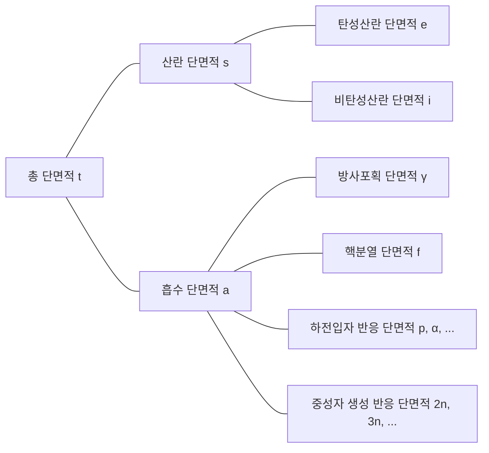

## 중성자 상호작용
중성자는 전기적으로 중성이므로 원자 내의 전자 혹은 원자핵의 양전하에 의한 전기적 영향을 받지 않는다. 따라서 중성자는 원자의 전자구름을 통과해 원자핵과 직접 반응할 수 있다.

### 탄성산란(elastic scattering)
- 중성자가 원자핵에 충돌 후 튕겨나옴
- 원자핵은 에너지 변화 없이 바닥상태를 유지
- (n, n)으로 표시

### 비탄성산란(inelastic scattering)
- 중성자가 원자핵에 충돌 후 튕겨나옴
- 탄성산란과 달리, 원자핵이 중성자의 에너지 일부를 흡수하여 들뜬 상태가 됨(흡열반응)
- (n, n′)으로 표시
- 들뜬 원자핵은 감마선을 방출하며 바닥상태로 돌아가는데, 이때 발생하는 감마선을 *비탄성감마선(inelastic $\gamma$-ray)* 이라 부름

### 방사포획(radiative capture)
- 원자핵이 중성자를 포획하여 한 개 이상의 감마선을 방출(발열반응)
- (n, $\gamma$)로 표시
- 이때 발생하는 감마선을 *포획감마선(capture $\gamma$-ray)*이라 부름

### 하전입자 반응
- 원자핵이 중성자를 포획하여 알파입자($\alpha$)나 양성자(p) 같은 하전입자를 방출
- (n, $\alpha$), (n, p) 등으로 표시
- 경우에 따라 발열반응일 수도, 흡열반응일 수도 있음

### 중성자 생성 반응
- 고에너지의 중성자와 원자핵이 충돌하여 2개 이상의 중성자를 새로 방출(흡열반응)
- (n, 2n), (n, 3n) 등으로 표시
- (n, 2n) 반응은 중수 또는 베릴륨을 포함하는 원자로에서 특히 중요한데, $^2\text{H}$와 $^9\text{Be}$의 중성자들은 결합에너지가 작아 낮은 에너지의 중성자와 충돌해도 쉽게 방출되기 때문

### 핵분열(fission)
- 중성자가 어떤 원자핵과 충돌해 해당 원자핵을 둘 이상의 딸핵들로 분열시킴

## 단면적(cross-section) 또는 미시적 단면적(microscopic cross-section)
단일 에너지 중성자 빔이 (매우 얇은) 두께 $\tau$와 면적 $A$의 표적에 입사하고, 이때 매초 단위면적당 표적에 입사하는 중성자 수를 $I\ \text{neutrons/cm}^2\cdot \text{s}$라 하자. 원자에서 원자핵이 차지하는 부피 비중은 매우 작으며, 표적이 매우 얇다고 가정했으므로 중성자의 대부분은 원자핵과 반응하지 않고 표적을 통과한다. 그러면 매초 단위면적당 원자핵과 충돌하는 중성자 수는 중성자 빔의 세기 $I$, 표적의 두께 $\tau$, 표적의 원자 밀도 $N$에 비례한다.

$$ \Delta I \propto I\tau N $$

비례상수 $\sigma$를 도입하면 다음과 같이 표현할 수 있다.

$$ \Delta I = \sigma I\tau N\ \text{[neutrons/cm}^2\cdot\text{s]} \tag{1} $$

표적에 입사하는 중성자 중 원자핵과 충돌하는 중성자의 비율을 구하면 다음과 같다.

$$ p = \frac {\Delta I}{I} = \sigma\tau N = \frac {\sigma}{A} A\tau N = \frac {\sigma}{A} N_t \tag{2} $$

($N_t$: 표적의 총 원자 수)

이 식에서 $\sigma$는 면적의 단위를 가짐을 알 수 있다. 이 비례상수 $\sigma$를 *단면적(cross-section)* 또는 *미시적 단면적(microscopic cross-section)*이라 부른다. 단면적은 물리적으로 원자핵이 중성자와 반응할 수 있는 유효단면적을 의미한다.

## 미시적 단면적의 단위
cm$^2$은 미시적 단면적을 표현하기엔 너무 큰 단위이므로, 일반적으로 *barn*(b)이란 단위를 사용한다.

$$ 1\ \text{b} = 10^{-24}\ \text{cm}^2 $$

## 미시적 단면적의 유형
- 총 단면적(total): $\sigma_t$
  - 산란 단면적(scattering): $\sigma_s$
    - 탄성산란 단면적(elastic scattering): $\sigma_e$
    - 비탄성산란 단면적(inelastic scattering): $\sigma_i$
  - 흡수 단면적(absorption): $\sigma_a$
    - 방사포획 단면적(radiative capture): $\sigma_\gamma$
    - 핵분열 단면적(fission): $\sigma_f$
    - 하전입자 반응 단면적: $\sigma_p, \sigma_\alpha, \cdots$
    - 중성자 생성 반응 단면적: $\sigma_{2n}, \sigma_{3n}, \cdots$

## 거시적 단면적(macroscopic cross-section)
식 (2)에서 중성자 빔의 단위거리당 충돌률을 구하면 다음과 같다.

$$ \frac {p}{\tau} = \frac {1}{\tau} \frac {\Delta I}{I} = \sigma N \equiv \Sigma\ \text{[cm}^{-1}\text{]} \tag{3}$$

*거시적 단면적(macroscopic cross-section)* 은 위와 같이 원자 밀도 $N$과 단면적의 곱으로 정의한다. 거시적 단면적은 물리적으로 어떤 표적 내에서 중성자의 진행거리당 충돌률을 의미한다. 미시적 단면적과 마찬가지로 다음과 같이 세분할 수 있다.

- 거시적 총 단면적 $\Sigma_t=N\sigma_t$
  - 거시적 산란 단면적 $\Sigma_s=N\sigma_s$
  - 거시적 흡수 단면적 $\Sigma_a=N\sigma_a$

일반적으로, 어떤 반응에 대한 거시적 단면적 $\Sigma_{reaction}=N\sigma_{reaction}$이다.

## 충돌밀도(collision density), i.e., 반응률(reaction rate)
*충돌밀도(collision density)*, *반응률(reaction rate)* 은 표적에서 단위시간, 단위부피당 충돌 횟수를 의미한다. 식 (1), (3)으로부터 다음과 같이 정의할 수 있다.

$$ F = \frac {\Delta I}{\tau} = I\sigma N = I\Sigma \tag{4} $$
