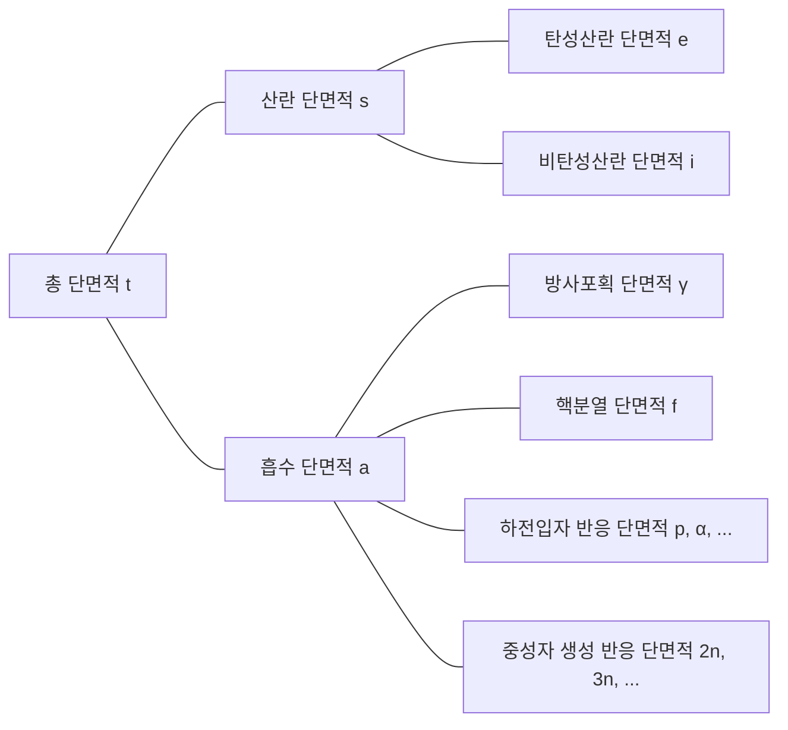

## 단면적(cross-section) 또는 미시적 단면적(microscopic cross-section)
단일 에너지 중성자 빔이 (매우 얇은) 두께 $\tau$와 면적 $A$의 표적에 입사하고, 이때 매초 단위면적당 표적에 입사하는 중성자 수를 $I\ \text{neutrons/cm}^2\cdot \text{s}$라 하자. 원자에서 원자핵이 차지하는 부피 비중은 매우 작으며, 표적이 매우 얇다고 가정했으므로 중성자의 대부분은 원자핵과 반응하지 않고 표적을 통과한다. 그러면 매초 단위면적당 원자핵과 충돌하는 중성자 수는 중성자 빔의 세기 $I$, 표적의 두께 $\tau$, 표적의 원자 밀도 $N$에 비례한다.

$$ \Delta I \propto I\tau N $$

비례상수 $\sigma$를 도입하면 다음과 같이 표현할 수 있다.

$$ \Delta I = \sigma I\tau N\ \mathrm{[neutrons/cm^2\cdot s]} \label{eqn:microscopic_cross_section}\tag{1} $$

표적에 입사하는 중성자 중 원자핵과 충돌하는 중성자의 비율을 구하면 다음과 같다.

$$ p = \frac {\Delta I}{I} = \sigma\tau N = \frac {\sigma}{A} A\tau N = \frac {\sigma}{A} N_t \label{eqn:collision_rate}\tag{2} $$

($N_t$: 표적의 총 원자 수)

이 식에서 $\sigma$는 면적의 단위를 가짐을 알 수 있다. 이 비례상수 $\sigma$를 *단면적(cross-section)* 또는 *미시적 단면적(microscopic cross-section)*이라 부른다. 단면적은 물리적으로 원자핵이 중성자와 반응할 수 있는 유효단면적을 의미한다.

## 미시적 단면적의 단위
cm$^2$은 미시적 단면적을 표현하기엔 너무 큰 단위이므로, 일반적으로 *barn*(b)이란 단위를 사용한다.

$$ 1\ \text{b} = 10^{-24}\ \text{cm}^2 \label{eqn:barn}\tag{3}$$

## 미시적 단면적의 유형
- 총(total) 단면적: $\sigma_t$
  - 산란(scattering) 단면적: $\sigma_s$
    - 탄성산란(elastic scattering) 단면적: $\sigma_e$
    - 비탄성산란(inelastic scattering) 단면적: $\sigma_i$
  - 흡수(absorption) 단면적: $\sigma_a$
    - 방사포획(radiative capture) 단면적: $\sigma_\gamma$
    - 핵분열(fission) 단면적: $\sigma_f$
    - 하전입자 반응(charged-particle reactions) 단면적: $\sigma_p, \sigma_\alpha, \cdots$
    - 중성자 생성 반응(neutron-producing reactions) 단면적: $\sigma_{2n}, \sigma_{3n}, \cdots$

## 중성자 상호작용
중성자는 전기적으로 중성이므로 원자 내의 전자 혹은 원자핵의 양전하에 의한 전기적 영향을 받지 않는다. 따라서 중성자는 원자의 전자구름을 통과해 원자핵과 직접 반응할 수 있다.

### 복합핵 형성
대부분의 물질과 중성자 간의 반응은 2단계로 이루어진다.
1. 중성자와 원자핵이 합쳐져 복합핵(compound nucleus)을 형성
2. 복합핵이 여러 방법으로 붕괴

$$ \begin{align*}
\mathrm{^A Z} + \mathrm{n} \to \left( \mathrm{^{A+1}Z} \right)^*
&\to \mathrm{^A Z} + \mathrm{n} \text{ (탄성산란)} \\
&\to \mathrm{^A Z} + \mathrm{n}^\prime \text{ (비탄성산란)} \\
&\to \mathrm{^{A+1}Z} + \gamma \text{ (방사포획)} \\
&\qquad \vdots
\end{align*} $$

원자핵은 그 구성 핵자들의 배치에 따라 여러 양자화된 에너지 준위를 갖는데, 입사 중성자의 에너지가 대상 핵의 들뜬 상태 중 하나에 해당할 경우 복합핵이 더 잘 형성된다. 따라서 특정한 에너지를 갖는 중성자에 대해 단면적이 극대화되며, 이러한 현상을 *공명(resonance)*이라고 한다.

### 탄성산란(elastic scattering)
- 중성자가 원자핵에 충돌 후 튕겨나옴
- 원자핵은 에너지 변화 없이 바닥상태를 유지
- $(\mathrm{n}, \mathrm{n})$으로 표시

입사 중성자 에너지의 함수로서 탄성산란 단면적을 나타낼 때, 크게 3개의 다른 영역으로 구분할 수 있다.

> **탄소-12의 탄성산란 단면적과 총 단면적**  
> - 그래프 제공: 한국원자력연구원 핵데이터센터(Nuclear Data Center at KAERI), Table of Nuclides (<https://atom.kaeri.re.kr/nuchart/>)

> **U-238의 탄성산란 단면적과 총 단면적**  
> - 그래프 제공: 한국원자력연구원 핵데이터센터(Nuclear Data Center at KAERI), Table of Nuclides (<https://atom.kaeri.re.kr/nuchart/>)

#### 저에너지 영역 (low-energy region)
이 영역에서의 탄성산란 단면적은 근사적으로 상수이다. 이 영역에서는 복합핵이 형성되지는 않으며, 원자핵이 그 주위를 지나는 중성자에 힘을 미쳐 미미한 산란 현상이 일어난다. 이를 퍼텐셜 산란(potential scattering)이라 하며, 원자 반지름을 $R$이라 할 때 퍼텐셜 산란 단면적은

$$ \sigma_e = 4\pi R^2 \label{eqn:potential_scattering}\tag{4}$$

으로 주어진다.

> **극저에너지 대역에서 산란 단면적이 상수가 아닌 이유**  
> 위의 근사식은 탄소-12 기준 약 0.02eV에서 0.01MeV의 에너지 영역에서 유효하며, 그보다 더 낮은 극저에너지 대역에서는 맞지 않음을 위의 실제 데이터로부터 확인할 수 있다.
>
> **람사우어 모델(Ramsauer model)**에 따르면 저에너지 대역에서의 산란 단면적과 중성자 에너지 간에는 다음의 관계식이 성립한다.
>
> $$ \sigma(E) = 2\pi \left(R+\lambda(E)\right)^2(1-\alpha \cos\beta). $$
>
> [중성자의 드보로이 파장 식](/posts/Mass-and-Energy-Particles-and-Waves/#상대론적-효과를-무시할-경우eg-중성자)에 의해, 여기서 $\lambda(E) \propto \cfrac{1}{\sqrt{E}}$이다. 대개의 경우 $\lambda(E) \ll R$이므로 $\left(R+\lambda(E)\right)^2$항에서 $\lambda(E)$를 무시하고 $\sigma(E) \propto R^2$으로 근사할 수 있지만, 매우 낮은 에너지 대역에서는 중성자가 입자보다 파동에 더 가깝게 행동하며 드보로이 파장이 원자 반지름보다 커짐에 따라 $\lambda(E)$가 오히려 지배적인 항이 되어 그러한 근사가 성립하지 않는다.
{: .prompt-info }

#### 공명 영역 (resonance region)
이 영역에서부터는 원자핵이 중성자를 순간적으로 흡수하여 복합핵을 형성하였다가, 이후 입사 중성자와 동일한 에너지의 중성자를 다시 방출하는 탄성 공명 산란(elastic resonance scattering)을 일으킨다. 대상 원자핵의 에너지 준위 차에 해당하는 중성자에 대해 공명이 일어나기 때문에, 특정한 에너지 값들에 대해 중성자 단면적이 크게 나타나는 것을 볼 수 있다.

핵종이 무거울수록 공명 영역은 더 낮은 중성자 에너지에서 나타난다. 우라늄-238의 공명 영역은 탄소-12보다 훨씬 낮은 6 eV에서부터 시작해 대략 1 keV까지 계속된다.

#### 고에너지 영역 (smooth region)
고에너지 영역으로 가면, 원자핵의 각 에너지 준위 사이 간격이 매우 작아짐에 따라 각각의 공명들이 구분이 안 될 정도가 된다. 이 영역에서는 $\sigma_e$는 중성자 에너지에 따라 아주 조금씩, 완만하게 변화하는 연속적인 함수의 형태를 띈다.

### 비탄성산란(inelastic scattering)
- 중성자가 원자핵에 충돌 후 튕겨나옴
- 탄성산란과 달리, 원자핵이 중성자의 에너지 일부를 흡수하여 들뜬 상태가 됨([흡열반응](/posts/nuclear-reactions-and-binding-energy/#발열반응exothermic-reaction--흡열반응endothermic-reaction))
- 원자핵이 가질 수 있는 에너지 준위가 양자화되어 있기 때문에, 해당 원자핵의 두 에너지 준위 사이의 차보다 크거나 같은 에너지를 갖는 중성자가 충돌할 경우에 일어날 수 있음
  - 무거운 핵종일수록 에너지 준위가 세분되어 있어 쉽게 일어나며, 가벼운 핵종에서는 잘 일어나지 않음
  - 탄소의 비탄성산란 문턱에너지(threshold energy)가 4.80 MeV인 데 반해, 우라늄-238의 비탄성산란 문턱에너지는 44 keV임을 아래 그래프에서 확인할 수 있음
- 문턱에너지를 초과하는 에너지에 대해서는, 비탄성산란 단면적 $\sigma_i$는 대략적으로 탄성산란 단면적 $\sigma_e$와 비슷함
- $(\mathrm{n}, \mathrm{n}^{\prime})$으로 표시
- 들뜬 원자핵은 이후 감마선을 방출하며 바닥상태로 돌아가는데, 이때 발생하는 감마선을 *비탄성감마선(inelastic $\gamma$-ray)*이라 부름

> **C-12의 탄성산란 단면적과 비탄성산란 단면적**  
> - 그래프 제공: 한국원자력연구원 핵데이터센터(Nuclear Data Center at KAERI), Table of Nuclides (<https://atom.kaeri.re.kr/nuchart/>)

> **U-238의 탄성산란 단면적과 비탄성산란 단면적**  
> - 그래프 제공: 한국원자력연구원 핵데이터센터(Nuclear Data Center at KAERI), Table of Nuclides (<https://atom.kaeri.re.kr/nuchart/>)

### 방사포획(radiative capture)
- 원자핵이 중성자를 포획하여 한 개 이상의 감마선을 방출([발열반응](/posts/nuclear-reactions-and-binding-energy/#발열반응exothermic-reaction--흡열반응endothermic-reaction))
- $(\mathrm{n}, \gamma)$로 표시
- 이때 발생하는 감마선을 *포획감마선(capture $\gamma$-ray)*이라 부름
- 충돌한 중성자는 원자핵 내부로 흡수되므로, 흡수반응의 일종임

[탄성산란](#탄성산란elastic-scattering)과 마찬가지로, 방사포획 단면적 $\sigma_\gamma$도 3가지 영역으로 구분할 수 있다.

> **Au-197의 방사포획 단면적**  
> - 그래프 제공: 한국원자력연구원 핵데이터센터(Nuclear Data Center at KAERI), Table of Nuclides (<https://atom.kaeri.re.kr/nuchart/>)

#### 저에너지 영역 ($1/v$ 영역)
저에너지 영역에서 대부분의 핵종의 $\sigma_\gamma$는 $1/\sqrt{E}$, 즉 $1/v$에 비례한다. 위의 log-log 스케일로 그린 금-197의 방사포획 단면적 그래프에서 기울기가 $-1/2$인 직선 구간을 확인할 수 있다.

몇몇 주요 핵종들의 경우에는 $\sigma_\gamma$가 낮은 중성자 에너지 영역에서 정확하게 $1/v$ 거동을 보이지는 않는데, 이런 핵종들을 비-$1/v$ 흡수체(non-$1/v$ absorber)라 부른다.

#### 공명 영역
$1/v$ 영역을 넘어서면 산란 반응과 동일한 에너지 영역에서 공명 영역이 관찰된다. 에너지 $E_r$에서 공명이 일어난다고 할 때, 해당 공명 근방에서의 $\sigma_\gamma$는 다음과 같은 브라이트-위그너(Breit-Wigner) 1단계 공식에 의해 주어진다.

$$ \sigma_\gamma = \frac{\gamma_r^2 g}{4\pi}\frac{\Gamma_n\Gamma_g}{(E-E_r)^2 + \Gamma^2/4} \label{eqn:breit_wigner}\tag{5}$$

- $\gamma_r$: 에너지 $E_r$인 중성자의 [드보로이 파장](/posts/Mass-and-Energy-Particles-and-Waves/#상대론적-효과를-무시할-경우eg-중성자)
- $g$: *통계적 계수(statistical factor)*, 상수
- $\Gamma \ (=\Gamma_n + \Gamma_\gamma)$: *총 너비(total width)*, 상수
  - $\Gamma_n$: *중성자 너비(neutron width)*, 상수
  - $\Gamma_\gamma$: *방사선 너비(radiation width)*, 상수

> $\sigma_\gamma(E_r \pm \Gamma/2) = \cfrac{1}{2}\sigma_\gamma(E_r)$로, 단면적이 최댓값의 절반이 되는 두 지점을 기준으로 한 공명 너비가 $\Gamma$가 된다. 이는 *너비(width)*라는 용어의 기원이 되었다.
{: .prompt-tip }

#### 고에너지 영역 (above the resonance region)
공명 영역을 지나 더 높은 에너지 영역(무거운 핵종에서는 대략 1 keV 이상, 가벼운 핵종일수록 더 높은 에너지 영역에서 나타남)에서는 $\sigma_\gamma$가 처음에 급격히 감소하였다가 이후 매우 작은 값으로 서서히 감소한다.

### 하전입자 반응 (charged-particle reactions)
- 원자핵이 중성자를 포획하여 알파입자($\alpha$)나 양성자($\mathrm{p}$) 같은 하전입자를 방출
- $(\mathrm{n}, \alpha)$, $(\mathrm{n}, \mathrm{p})$ 등으로 표시
- 경우에 따라 [발열반응](/posts/nuclear-reactions-and-binding-energy/#발열반응exothermic-reaction--흡열반응endothermic-reaction)일 수도, [흡열반응](/posts/nuclear-reactions-and-binding-energy/#발열반응exothermic-reaction--흡열반응endothermic-reaction)일 수도 있으나 보통 [흡열반응](/posts/nuclear-reactions-and-binding-energy/#발열반응exothermic-reaction--흡열반응endothermic-reaction)임
- 문턱에너지 미만에서는 발생하지 않으며, 문턱에너지 이상에서도 단면적이 대체로 작음(특히 무거운 핵들에 대해 이러한 경향이 뚜렷해짐)

이처럼 하전입자 반응은 문턱에너지를 넘겨야만 일어날 수 있고, 단면적도 대체로 작은 편이다. 그러나 가벼운 핵들에서 일어나는 몇몇 중요한 하전입자 반응들이 있다.

#### 발열반응
##### $^{10}\mathrm{B}(\mathrm{n},\alpha){^7\mathrm{Li}}$

> **$^{10}\mathrm{B}(\mathrm{n},\alpha){^7\mathrm{Li}}$ 반응의 단면적**  
> - 그래프 제공: 한국원자력연구원 핵데이터센터(Nuclear Data Center at KAERI), Table of Nuclides (<https://atom.kaeri.re.kr/nuchart/>)

- $100\ \mathrm{keV}$ 이하의 에너지 영역에 대해 $\sigma_\alpha \propto 1/v$임을 확인할 수 있음
- $\sigma_\alpha$가 낮은 중성자 에너지 영역에서 매우 크다는 것을 알 수 있으며, 이러한 특성을 응용하여 저에너지 중성자를 흡수하기 위해 자주 사용함

> 물을 냉각재 및 감속재로 사용하는 원자로에서 반응을 조절하거나, 혹은 긴급 정지할 필요가 있을 때 감속재에 붕소를 섞어 잉여분의 중성자를 흡수하도록 하는 식으로 활용한다.
{: .prompt-tip }

##### $^{6}\mathrm{Li}(\mathrm{n},\alpha){^3\mathrm{H}}$

> **$^{6}\mathrm{Li}(\mathrm{n},\alpha){^3\mathrm{H}}$ 반응의 단면적**  
> - 그래프 제공: 한국원자력연구원 핵데이터센터(Nuclear Data Center at KAERI), Table of Nuclides (<https://atom.kaeri.re.kr/nuchart/>)

- 마찬가지로 대략 $100\ \mathrm{keV}$ 이하의 에너지 영역에 대해 $\sigma_\alpha \propto 1/v$임을 확인할 수 있음
- 삼중수소($^3\mathrm{H}$)를 생성하기 위해 사용함

> 특히 이 반응은 핵융합로의 블랭킷(blanket)에서 중요하게 활용한다. [삼중수소는 반감기가 짧아 자연적으로는 거의 존재하지 않으므로](/posts/Nuclear-Stability-and-Radioactive-Decay/#삼중수소) 핵융합로에서 자체적으로 생산해야 한다. 따라서 핵융합 반응 용기를 리튬 블랭킷으로 감싸고, 핵융합 반응으로부터 나오는 중성자를 흡수한 블랭킷 내 리튬이 이 반응을 일으켜 삼중수소로 변환되면 이를 모아 핵융합 연료로 활용한다.  
> 또한 이 반응은 발열반응이기 때문에, 핵융합 반응으로부터 나온 중성자의 에너지 일부가 이 반응을 통해 열에너지로 바뀌게 되며 핵융합 발전에서는 해당 열에너지를 전기에너지로 변환한다.
{: .prompt-tip }

#### 흡열반응
##### $^{16}\mathrm{O}(\mathrm{n},\mathrm{p}){^{16}\mathrm{N}}$

> **$^{16}\mathrm{O}(\mathrm{n},\mathrm{p}){^{16}\mathrm{N}}$ 반응의 단면적**  
> - 그래프 제공: 한국원자력연구원 핵데이터센터(Nuclear Data Center at KAERI), Table of Nuclides (<https://atom.kaeri.re.kr/nuchart/>)

- 우라늄-235의 핵분열 반응으로부터 발생하는 중성자의 평균 에너지(2-3 MeV)에 비해 크게 높은 9 MeV 정도의 문턱에너지를 가지며, 따라서 반응 빈도는 수천 개 중성자 중 1개 정도로 낮은 편임
- 그럼에도 불구하고, 물을 냉각재 및 감속재로 사용하는 원자로에서 물이 방사화되는 주요 원인이기 때문에 중요함
  - 물 분자를 구성하는 $^{16}\mathrm{O}$가 이 반응을 통해 $^{16}\mathrm{N}$으로 바뀌는데, $^{16}\mathrm{N}$은 대략 7초 정도의 반감기로 [베타 붕괴](/posts/Nuclear-Stability-and-Radioactive-Decay/#베타붕괴beta-decay)하며 6-7 MeV의 [감마선 또한 방출함](/posts/Nuclear-Stability-and-Radioactive-Decay/#이성체-천이isomeric-transition)

### 중성자 생성 반응 (neutron-producing reactions)
- 고에너지의 중성자와 원자핵이 충돌하여 2개 이상의 중성자를 새로 방출(흡열반응)
- (n, 2n), (n, 3n) 등으로 표시
- (n, 2n) 반응은 중수 또는 베릴륨을 포함하는 원자로에서 특히 중요한데, $^2\text{H}$와 $^9\text{Be}$의 중성자들은 결합에너지가 작아 낮은 에너지의 중성자와 충돌해도 쉽게 방출되기 때문

> **$\mathrm{D}(\mathrm{n},\mathrm{2n})\mathrm{p}$ 반응과 $^{9}\mathrm{Be}(\mathrm{n},\mathrm{2n}){^{8}\mathrm{Be}}$ 반응의 단면적**  
> - 그래프 제공: 한국원자력연구원 핵데이터센터(Nuclear Data Center at KAERI), Table of Nuclides (<https://atom.kaeri.re.kr/nuchart/>)

### 핵분열(fission)
- 중성자가 어떤 원자핵과 충돌해 해당 원자핵을 둘 이상의 딸핵들로 분열시킴

> 핵분열과 핵분열 단면적에 대해서는 별도의 글로 정리하겠다.
{: .prompt-info }

### 총 단면적
#### 저에너지 영역

$$ \sigma_t = 4\pi R^2 + \frac{C}{\sqrt{E}} \label{eqn:total_cross_section}\tag{6}$$

- 첫 번째 항은 [탄성산란 단면적](#저에너지-영역-low-energy-region)을, 두 번째 항은 [방사포획](#저에너지-영역-1v-영역) 및 그 에너지에서 가능한 모든 발열반응에 대한 단면적을 의미함
- 첫 번째 항이 지배적이라면 낮은 에너지 영역에서 상수가 될 것이고, 반대의 경우라면 $1/v$ 거동을 보일 것임

#### 공명 영역
[$\sigma_s$](#공명-영역-resonance-region)와 [$\sigma_\gamma$](#공명-영역)에서 나타나는 공명들을 포함하며, 이 두 단면적과 같은 에너지에서 공명 영역이 나타난다. 가벼운 핵종일수록 높고 넓은 에너지 영역대에서 공명이 일어나며, 무거운 핵종일수록 비교적 낮고 좁은 에너지 영역대에서 공명 영역이 나타난다.

#### 고에너지 영역
공명 영역을 넘어서는 높은 에너지 영역에서는 $\sigma_t$는 에너지에 따라 완만히 감소한다. 

## 수소와 중수소의 단면적
많은 원자로에서 $^1\mathrm{H}$과 $^2\mathrm{H}$ 핵들이 다량으로 존재\*하는데, 이 핵들은 다른 핵들과 다소 다른 양상으로 중성자와 반응한다.
- [복합핵](#복합핵-형성)을 형성하지 않음
- [공명 영역](#공명-영역-1)이 없음
  - [탄성산란 단면적은 상수](#저에너지-영역-low-energy-region)
  - [방사포획 단면적은 모든 중성자 에너지에서 $1/v$ 거동을 보임](#저에너지-영역-1v-영역)
- 특히 $^1\mathrm{H}$의 경우 단 1개의 양성자로 구성되어 들뜬 상태가 없기 때문에, [비탄성산란](#비탄성산란inelastic-scattering)도 발생하지 않음

> \* 보통 물을 냉각재 및 감속재로 사용하는 원자로에서 경수($\mathrm{H_2O}$) 또는 중수($\mathrm{D_2O}$)의 형태로 주로 존재한다.
{: .prompt-info }

> **H-1의 단면적**  
> - 그래프 제공: 한국원자력연구원 핵데이터센터(Nuclear Data Center at KAERI), Table of Nuclides (<https://atom.kaeri.re.kr/nuchart/>)

> **H-2의 단면적**  
> - 그래프 제공: 한국원자력연구원 핵데이터센터(Nuclear Data Center at KAERI), Table of Nuclides (<https://atom.kaeri.re.kr/nuchart/>)

## 거시적 단면적(macroscopic cross-section)
식 ($\ref{eqn:collision_rate}$)에서 중성자 빔의 단위거리당 충돌률을 구하면 다음과 같다.

$$ \frac {p}{\tau} = \frac {1}{\tau} \frac {\Delta I}{I} = \sigma N \equiv \Sigma\ \text{[cm}^{-1}\text{]} \label{eqn:macroscopic_cross_section}\tag{7}$$

*거시적 단면적(macroscopic cross-section)* 은 위와 같이 원자 밀도 $N$과 [단면적](#단면적cross-section-또는-미시적-단면적microscopic-cross-section)의 곱으로 정의한다. 거시적 단면적은 물리적으로 어떤 표적 내에서 중성자의 진행거리당 충돌률을 의미한다. 미시적 단면적과 마찬가지로 다음과 같이 세분할 수 있다.

- 거시적 총 단면적 $\Sigma_t=N\sigma_t$
  - 거시적 산란 단면적 $\Sigma_s=N\sigma_s$
  - 거시적 흡수 단면적 $\Sigma_a=N\sigma_a$

일반적으로, 어떤 반응에 대한 거시적 단면적 $\Sigma_{reaction}=N\sigma_{reaction}$이다.

## 충돌밀도(collision density), i.e., 반응률(reaction rate)
*충돌밀도(collision density)*, *반응률(reaction rate)* 은 표적에서 단위시간, 단위부피당 충돌 횟수를 의미한다. 식 ($\ref{eqn:microscopic_cross_section}$), ($\ref{eqn:macroscopic_cross_section}$)로부터 다음과 같이 정의할 수 있다.

$$ F = \frac {\Delta I}{\tau} = I\sigma N = I\Sigma \label{eqn:reaction_rate}\tag{8} $$
