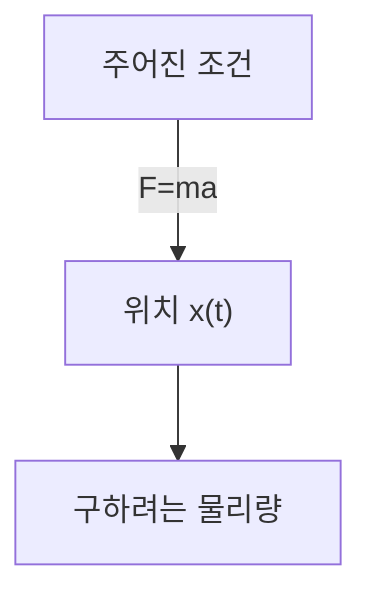
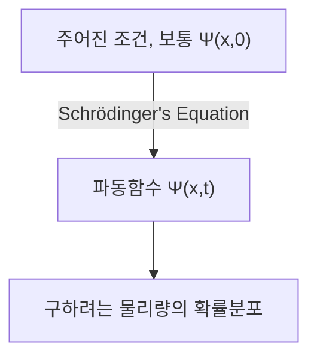

## TL;DR
> - (시간에 의존하는 )슈뢰딩거 방정식: 
>
> $$ i\hbar\frac{\partial \Psi}{\partial t} = - \frac{\hbar^2}{2m}\frac{\partial^2 \Psi}{\partial x^2} + V\Psi $$
>
> - 파동함수 $\Psi(x,t)$의 통계적 해석(Born 해석): 파동함수의 절댓값의 제곱 $\|\Psi(x,t)\|^2$는 시간 $t$, 위치 $x$에서 입자를 발견할 **확률밀도함수**이다.
> - 파동함수의 규격화:
>   - $\int_{-\infty}^{\infty} \|\Psi(x,t)\|^2 dx = 1$
>   - $\Psi(x,t)$가 슈뢰딩거 방정식의 해이면 임의의 복소수 상수 $A$에 대해 $A\Psi(x,t)$도 마찬가지로 해이며, 이때 위 식을 만족하도록 상수 $A$를 결정하는 것을 규격화(normalization)라고 함
>   - **규격화할 수 없는 해(non-normalizable solutions)**는 입자를 나타낼 수 없으므로 유효한 파동함수가 아니며, **제곱적분 가능한(square-integrable)** 해만이 물리적으로 가능한 상태임
>   - 어느 한 시점에서 규격화한 파동함수는 시간이 지남에 따라 $\Psi$가 변화해도 계속해서 규격화된 상태로 유지됨
> - 확률흐름:
>   - $J(x,t) \equiv \cfrac{i\hbar}{2m}\left(\Psi\cfrac{\partial \Psi^\*}{\partial x}-\Psi^\*\cfrac{\partial \Psi}{\partial x}\right)$
>   - 입자를 발견할 확률이 점 $x$를 지나 흐르는 유량(단위시간당 확률)
>   - 시간 $t$, 영역 $a<x<b$에서 입자를 발견할 확률을 $P_{ab}(t)$라고 하면 $\cfrac{dP_{ab}}{dt} = J(a,t) - J(b,t)$
{: .prompt-info }

## Prerequisites
- 연속확률분포와 확률밀도

## 슈뢰딩거 방정식 (Schrödinger equation)
질량 $m$인 입자가 주어진 힘 $F(x,t)$를 받으며 $x$축 위에서 움직이는 상황을 생각해보자.

고전역학에서 주된 목표는 뉴턴의 운동 방정식 $F=ma$를 적용하여 임의의 시간에 입자의 위치 $x(t)$를 결정하는 것이다. 이 과정은 대략 다음과 같은 다이어그램으로 표현할 수 있다.

양자역학에서는 같은 문제를 매우 다른 방법으로 접근하는데, 양자역학의 접근법은 다음 **슈뢰딩거 방정식(Schrödinger equation)**을 풀어 입자의 **파동함수** $\Psi(x,t)$를 구하는 것이다.

$$ \begin{gather*}
i\hbar\frac{\partial \Psi}{\partial t} = - \frac{\hbar^2}{2m}\frac{\partial^2 \Psi}{\partial x^2} + V\Psi. \label{eqn:schrodinger_eqn}\tag{1}\\
\text{(} i=\sqrt{-1}\text{, } \hbar=\frac{h}{2\pi}=1.054573\times10^{-34}\text{, } h\text{: 플랑크 상수, } V(x)\text{: 퍼텐셜에너지)}
\end{gather*} $$

> *이미지 출처*
> - 저작자: 위키미디어 유저 Xcodexif
> - 라이선스: [CC BY-SA 4.0](https://creativecommons.org/licenses/by-sa/4.0/)

## 파동함수 $\Psi(x,t)$의 통계적 해석 (Born 해석)
고전역학에서의 입자는 한 점에 위치하는 반면, 양자역학에서 입자의 상태를 나타내는 파동함수는 주어진 $t$에서 $x$의 함수이며 즉 공간에 퍼져 있다. 이것의 물리적 의미를 어떻게 해석해야 하는가?

보른(Born)의 **통계적 해석**에 따르면 파동함수의 절댓값의 제곱 $\|\Psi(x,t)\|^2$는 시간 $t$, 위치 $x$에서 입자를 발견할 확률밀도함수이다. 파동함수 $\Psi$ 자체는 복소수이지만, $\|\Psi\|^2=\Psi^\*\Psi$ ($\Psi^\*$은 $\Psi$의 켤레복소수)는 0 이상의 실수이기 때문에 이러한 해석이 성립할 수 있다. 즉, 다음과 같이 표현할 수 있다.

$$ \int_a^b |\Psi(x,t)|^2 dx = \text{시간 }t\text{에서 }a\text{와 }b\text{ 사이에서 입자를 찾을 수 있는 확률}. \tag{2}$$

이러한 통계적 해석은 양자역학이 일종의 **비결정성(indeterminacy)**을 내포함을 의미한다. 입자에 대한 모든 것(파동함수)을 알고 있다 해도 가능한 결과에 대한 확률분포만을 알 수 있을 뿐, 특정한 값을 결정할 수는 없다.

이는 직관적으로 받아들이기 어려운 것이었기에, 자연스럽게 이러한 비결정성이 양자역학의 어떤 결점에 의한 것인지 혹은 본질적인 자연의 특성인지에 대한 의문이 제기되었다.

## 양자역학적 비결정성(quantum indeterminacy)을 바라보는 관점
어떤 입자의 위치를 측정하여 이 입자가 점 $C$에 있는 것을 알게 되었다고 하자. 그렇다면 측정하기 직전 입자는 어디에 있었는가?

### 사실주의적(realist) 입장

> "신은 주사위 놀이를 하지 않는다." ("God does not play dice.")  
> *by Albert Einstein*

입자는 원래부터 $C$에 있었다. 이는 아인슈타인(Einstein)과 슈뢰딩거(Schrödinger)의 관점이기도 하다. 그러나 이러한 관점에서 본다면, 실제로는 입자가 정확히 $C$에 있었는데 이론의 한계로 측정 전까지 입자의 위치를 확률분포로만 알 수 있는 것이기에 양자역학은 불완전한 이론이다. 즉, 이 관점에 따르면 비결정성은 본질적인 자연의 성질이 아니라 양자역학의 한계에 의한 것이며, $\Psi$ 외의 어떤 숨은 변수가 추가적으로 존재하여 이것까지 알아야만 입자를 완벽하게 기술할 수 있다.

> 슈뢰딩거(Schrödinger)는 아인슈타인(Einstein)의 제자로서 한때 그 밑에서 조교로 일하기도 했으며 이후로도 아인슈타인과 교류하였는데, 슈뢰딩거의 사실주의적이자 결정론적인 입장 또한 그 영향인 것이 유력하다.
{: .prompt-info }

### 정통적인(orthodox) 입장

> "신이 주사위로 무엇을 하든 상관하지 말라." ("Stop telling God what to do with his dice.")  
> *by Niels Bohr, In answer to Einstein's earlier quote*
>
> "관측은 측정 대상에 간섭할 뿐만 아니라 만들어 낸다" ("Observations not only disturb what is to be measured, they produce it")  
> ...  
> "우리가 특정한 위치를 가지도록 강요하는 것이다." ("We compel to assume a definite position.")  
> *by Pascual Jordan*

측정 직전까지 입자는 확률분포의 형태로만 존재하며 어느 곳에도 있지 않고, 측정 행위를 했을 때 비로소 입자가 어느 한 위치에 나타난다. 이러한 해석을 **코펜하겐 해석**이라고 부르며, 코펜하겐 대학에서 보어(Bohr)와 하이젠베르크(Heisenberg)를 중심으로 제안된 해석이다.

> 재미있는 건, 아인슈타인과 슈뢰딩거의 관계와 유사하게 하이젠베르크(Heisenberg) 또한 보어(Bohr)의 제자라는 것이다.
{: .prompt-info }

### 불가지론적(agnostic) 입장

> "바늘 끝에는 얼마나 많은 천사가 앉을 수 있는지와 같은 오래된 질문처럼, 어떠한 것도 전혀 알 수 없는 무언가가 그럼에도 존재하는지 고민하며 머리 썩일 필요는 없다." ("One should no more rack one’s brain about the problem of whether something one cannot know anything about exists all the same, than about the ancient question of how many angels are able to sit on the point of a needle.")  
> *by Wolfgang Pauli*

답변을 거부한다. 측정하기 이전의 입자의 상태에 대해 무엇을 주장하든, 그 주장이 맞는지 확인하는 유일한 방법이 측정뿐이라면 그건 더 이상 '측정 이전'이 아니게 되어 버리는데 무슨 의미가 있는가? 본질적으로 시험할 수 없고 알 수 없는 무언가에 대해 왈가왈부하는 형이상학에 불과하다.

### 오늘날의 통념
[인류력](https://en.wikipedia.org/wiki/Holocene_calendar) 11964년에 존 벨(John Bell)이 측정 이전이든 이후든 입자가 정확한 위치에 존재하는지 아닌지에 따라 관측 가능한 차이가 있음을 증명함으로써, 일단 불가지론적 입장은 배제되었고 이후 실험을 통해 코펜하겐 해석이 주류가 되었다. 따라서 별도의 언급이 없다면, 보통 양자역학에 관해 다룰 때는 이러한 코펜하겐 해석을 전제한다.

> 비국소적 숨은 변수 이론(nonlocal hidden variable theories)이나 다세계 해석(many worlds interpretation) 같은, 코펜하겐 해석 이외의 맞을 가능성이 있는 다른 해석들도 여전히 존재하기는 한다.
{: .prompt-info }

## 측정과 파동함수의 붕괴
입자는 측정 이전까지 정확한 위치를 가지고 있지 않다가, 측정을 통해 비로소 $C$라는 특정한 위치(나중에 다른 글로 다루겠지만, 사실 하이젠베르크의 불확정성 원리에 의해 이 위치 또한 완벽하게 정확한 값이 아닌 약간의 오차범위를 가진다.)를 가지게 된다. 다만 이 첫 번째 측정을 한 직후 곧바로 추가 측정을 진행했을 때는 측정할 때마다 다른 값을 얻는 게 아니라 반드시 같은 결과를 얻는다. 이는 다음과 같이 설명한다.

첫 번째 측정을 진행하는 순간, 측정 대상의 파동함수가 격렬하게 바뀌어 점 $C$ 근처로 집중된 좁고 뾰족한 형태의 $\|\Psi(x,t)\|^2$ 그래프를 이룬다. 이것을 파동함수가 측정에 의해 점 $C$로 **붕괴(collapse)**했다고 한다. 

즉, 물리 과정은 상이한 두 종류로 나눌 수 있다.
- 슈뢰딩거 방정식에 의해 파동함수가 천천히 변하는 일반적인(ordinary) 과정
- $\Psi$가 갑작스럽고 불연속적으로 붕괴하는 측정(measurement) 과정

> 측정에 의해 붕괴한 파동함수는 시간이 지나면 슈뢰딩거 방정식에 따라 다시 공간적으로 퍼져 나간다. 따라서 동일한 측정 결과를 재현하려면 두번째 측정을 곧바로 시행해야 한다.
{: .prompt-tip }

## 파동함수의 규격화(Normalization)
파동함수의 절댓값의 제곱 $\|\Psi(x,t)\|^2$는 시간 $t$, 위치 $x$에서 입자를 발견할 확률밀도이므로, 모든 $x$에 대해 $\|\Psi\|^2$을 적분하면 1이 되어야 한다.

$$ \int_{-\infty}^{\infty} |\Psi(x,t)|^2 dx = 1. \label{eqn:wavefunction_norm}\tag{3} $$

식 ($\ref{eqn:schrodinger_eqn}$)에서 $\Psi(x,t)$가 해이면 임의의 복소수 상수 $A$에 대해 $A\Psi(x,t)$도 해임을 알 수 있다. 따라서 식 ($\ref{eqn:wavefunction_norm}$)을 만족하도록 이 $A$를 결정해야 하며, 이 과정을 파동함수의 규격화(normalization)라고 한다. 슈뢰딩거 방정식의 몇몇 해는 적분하면 무한대로 발산하며, 이 경우 식 ($\ref{eqn:wavefunction_norm}$)를 만족하는 상수 $A$가 존재하지 않는다. 자명해(trivial solution) $\Psi=0$의 경우에도 마찬이다. 이러한 **규격화할 수 없는 해(non-normalizable solutions)**는 입자를 나타낼 수 없으므로 유효한 파동함수가 아니다. 물리적으로 가능한 상태는 슈뢰딩거 방정식의 **제곱적분 가능한(square-integrable)** 해에 해당한다.

또한 슈뢰딩거 방정식의 중요한 성질은, <u>어느 한 시점에서 규격화한 파동함수는 시간이 지남에 따라 $\Psi$가 변화해도 계속해서 규격화된 상태($\int_{-\infty}^{\infty} |\Psi(x,t)|^2 dx = 1$)로 유지된다</u>는 것이다. 파동함수를 매 시점마다 다른 $A$값으로 규격화해야 한다면 $A$는 상수가 아닌 시간 $t$의 함수가 되므로 더 이상 슈뢰딩거 방정식의 해를 구할 수가 없게 되나, 이 성질에 의해 초기 조건($t=0$)에서 규격화한 $A$값은 시간 $t$에 무관하게 계속 보존된다.

### 증명

$$ \frac{d}{dt}\int_{-\infty}^{\infty} |\Psi(x,t)|^2 dx = \int_{-\infty}^{\infty} \frac{\partial}{\partial t}|\Psi(x,t)|^2 dx. \label{eqn:norm_proof_1}\tag{4} $$

> $\|\Psi\|^2$을 $x$에 대해 적분한 결과는 $t$만의 함수이므로 좌변에서 전체 미분($d/dt$)을 쓰지만, $\|\Psi\|^2$ 자체는 $x$와 $t$의 이변수함수이므로 우변에서는 편미분($\partial/\partial t$)을 쓴다.
{: .prompt-tip }

위 식을 곱의 미분규칙에 따라 다음과 같이 바꿔 쓸 수 있다.

$$ \frac{\partial}{\partial t}|\Psi|^2 = \frac{\partial}{\partial t}(\Psi^*\Psi) = \Psi^*\frac{\partial \Psi}{\partial t} + \frac{\partial \Psi^*}{\partial t}\Psi. \label{eqn:norm_proof_2}\tag{5}$$

식 ($\ref{eqn:schrodinger_eqn}$)의 슈뢰딩거 방정식의 양변에 $-\cfrac{i}{\hbar}$를 곱하면

$$ \frac{\partial \Psi}{\partial t} = \frac{i\hbar}{2m}\frac{\partial^2 \Psi}{\partial x^2}-\frac{i}{\hbar}V\Psi \label{eqn:norm_proof_3}\tag{6}$$

으로 쓸 수 있고, 위 식에서 $\cfrac{\partial \Psi}{\partial t}$의 켤레복소수를 취하면

$$ \frac{\partial \Psi^*}{\partial t} = -\frac{i\hbar}{2m}\frac{\partial^2 \Psi^*}{\partial x^2}+\frac{i}{\hbar}V\Psi^* \label{eqn:norm_proof_4}\tag{7}$$

를 얻는다. 이제 식 ($\ref{eqn:norm_proof_2}$)에 ($\ref{eqn:norm_proof_3}$)과 ($\ref{eqn:norm_proof_4}$)을 대입하면

$$\begin{align*}
\frac{\partial}{\partial t}|\Psi|^2 &= \frac{i\hbar}{2m}\left(\Psi^*\frac{\partial^2\Psi}{\partial x^2}-\frac{\partial^2\Psi^*}{\partial x^2}\Psi\right) \\
&= \frac{\partial}{\partial x}\left[\frac{i\hbar}{2m}\left(\Psi^*\frac{\partial\Psi}{\partial x}-\frac{\partial\Psi^*}{\partial x}\Psi \right) \right] 
\end{align*} \label{eqn:norm_proof_5}\tag{8}$$

이고, 이를 처음의 식 ($\ref{eqn:norm_proof_1}$)의 우변에 대입하면

$$ \frac{d}{dt}\int_{-\infty}^{\infty} |\Psi(x,t)|^2 dx = \frac{i\hbar}{2m}\left(\Psi^*\frac{\partial\Psi}{\partial x}-\frac{\partial\Psi^*}{\partial x}\Psi \right)\Bigg|_{-\infty}^{\infty}. \label{eqn:norm_proof_6}\tag{9} $$

그런데 파동함수가 규격화되어 물리적으로 유효하려면, $x$가 $\pm\infty$로 갈 때 $\Psi(x,t)$는 $0$으로 수렴해야 한다. 따라서

$$ \frac{d}{dt}\int_{-\infty}^{\infty} |\Psi(x,t)|^2 dx = 0 \label{eqn:norm_proof_fin}\tag{10} $$

이므로, $\int_{-\infty}^{\infty} \|\Psi(x,t)\|^2 dx$는 시간에 무관한 상수이다.

$$ \therefore \Psi \text{가 어느 한 시점 }t\text{에서 규격화되어 있으면 다른 모든 시점 }t\text{에 대해서도 규격화되어 있다. } \blacksquare $$

## 확률흐름 (probability current)
이번에는 시간 $t$, 영역 $a<x<b$에서 입자를 발견할 확률을 $P_{ab}(t)$라고 하자. 그러면

$$ P_{ab}(t) = \int_a^b |\Psi(x,t)|^2 dx \tag{11}$$

이고,

$$ \begin{align*}
\frac{dP_{ab}}{dt} &= \frac{d}{dt}\int_a^b |\Psi(x,t)|^2 dx \\
&= \int_a^b \frac{\partial}{\partial t}|\Psi(x,t)|^2 dx \quad \text{(}\because\text{식 }\ref{eqn:norm_proof_1}\text{ 참고)}\\
&= \int_a^b \left(\frac{\partial \Psi^*}{\partial t}\Psi + \Psi^*\frac{\partial \Psi}{\partial t} \right)dx \quad \text{(}\because\text{식 }\ref{eqn:norm_proof_2}\text{ 참고)} \\
&= \frac{i\hbar}{2m}\int_a^b \left(\Psi^*\frac{\partial^2\Psi}{\partial x^2}-\frac{\partial^2\Psi^*}{\partial x^2}\Psi\right)dx \\
&= \frac{i\hbar}{2m}\int_a^b\frac{\partial}{\partial x}\left(\Psi^*\frac{\partial\Psi}{\partial x}-\frac{\partial\Psi^*}{\partial x}\Psi \right)dx \quad \text{(}\because\text{식 }\ref{eqn:norm_proof_3},\ref{eqn:norm_proof_4},\ref{eqn:norm_proof_5}\text{ 참고)}\\
&= \frac{i\hbar}{2m}\left(\Psi^*\frac{\partial \Psi}{\partial x}-\frac{\partial \Psi^*}{\partial x}\Psi \right)\Bigg|^b_a \\
&= \frac{i\hbar}{2m}\left(\Psi\frac{\partial \Psi^*}{\partial x}-\Psi^*\frac{\partial \Psi}{\partial x} \right)\Bigg|^a_b
\end{align*} $$

이다. 여기서

$$ J(x,t) \equiv \frac{i\hbar}{2m}\left(\Psi\frac{\partial \Psi^*}{\partial x}-\Psi^*\frac{\partial \Psi}{\partial x}\right) \label{eqn:probability_current}\tag{12}$$

로 놓으면,

$$ \frac{dP_{ab}}{dt} = J(a,t) - J(b,t) \label{eqn:probability_over_time}\tag{13}$$

이다.

식 ($\ref{eqn:probability_current}$)와 같이 정의한 $J(x,t)$를 **확률흐름(probability current)**이라고 하며, 입자를 발견할 확률이 점 $x$를 지나 흐르는 유량\*(즉, 단위시간당 확률)을 의미한다. 식 ($\ref{eqn:probability_over_time}$)에서 특정 시점 $t$에 한쪽 끝으로 흘러 들어오는 확률흐름 $J(a,t)$가 다른 쪽으로 흘러 나가는 확률흐름 $J(b,t)$보다 크면 $P_{ab}$는 증가하며, 반대의 경우에는 감소한다.

> *유체역학의 유량(flow rate)에서 유체의 질량 혹은 부피가 여기서는 확률로 바뀌었다고 생각하면 된다.
{: .prompt-info }
