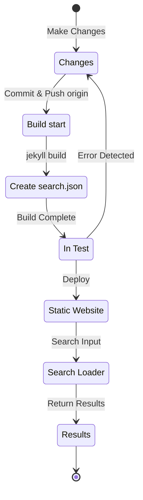

## 개요
12024년 7월 초, Jekyll 기반으로 Github Pages를 통해 호스팅 중인 본 블로그에 [Polyglot](https://github.com/untra/polyglot) 플러그인을 적용하여 다국어 지원 구현을 추가하였다.
이 시리즈는 Chirpy 테마에 Polyglot 플러그인을 적용하는 과정에서 발생한 버그와 그 해결 과정, 그리고 SEO를 고려한 html 헤더와 sitemap.xml 작성법을 공유한다.
시리즈는 3개의 글로 이루어져 있으며, 읽고 있는 이 글은 해당 시리즈의 세 번째 글이다.
- 1편: [Polyglot 플러그인 적용 & html 헤더 및 sitemap 수정](/posts/how-to-support-multi-language-on-jekyll-blog-with-polyglot-1)
- 2편: [언어 선택 버튼 구현 & 레이아웃 언어 현지화](/posts/how-to-support-multi-language-on-jekyll-blog-with-polyglot-2)
- 3편: Chirpy 테마 빌드 실패 및 검색 기능 오류 트러블슈팅 (본문)

> 원래는 총 2편으로 구성하였으나, 이후 몇 차례에 걸쳐 내용을 보강함에 따라 분량이 크게 늘어나 3편으로 개편하였다.
{: .prompt-info }

## 요구조건
- [x] 빌드한 결과물(웹페이지)을 언어별 경로(ex. `/posts/ko/`{: .filepath}, `/posts/ja/`{: .filepath})로 구분하여 제공할 수 있어야 한다.
- [x] 다국어 지원에 추가적으로 소요되는 시간과 노력을 가능한 최소화하기 위해, 작성한 원본 마크다운 파일의 YAML front matter에 'lang' 및 'permalink' 태그를 일일이 지정해 주지 않아도 빌드 시 해당 파일이 위치한 로컬 경로(ex. `/_posts/ko/`{: .filepath}, `/_posts/ja/`{: .filepath})에 따라 자동으로 언어를 인식할 수 있어야 한다.
- [x] 사이트 내 각 페이지의 헤더 부분은 적절한 Content-Language 메타 태그와 hreflang 대체 태그, canonical 링크를 포함하여 다국어 검색을 위한 Google SEO 가이드라인을 충족해야 한다.
- [x] 사이트 내에서 각 언어 버전별 페이지 링크를 누락 없이 `sitemap.xml`{: .filepath}로 제공할 수 있어야 하며, `sitemap.xml`{: .filepath} 자체는 중복 없이 루트 경로에 하나만 존재하여야 한다.
- [x] [Chirpy 테마](https://github.com/cotes2020/jekyll-theme-chirpy)에서 제공하는 모든 기능은 각 언어 페이지에서 정상 작동해야 하며, 그렇지 않다면 정상 작동하게끔 수정해야 한다.
  - [x] 'Recently Updated', 'Trending Tags' 기능 정상 작동
  - [x] GitHub Actions를 이용한 빌드 과정에서 에러가 발생하지 않을 것
  - [x] 블로그 우상단 포스트 검색 기능 정상 작동

## 시작하기 전에
이 글은 [1편](/posts/how-to-support-multi-language-on-jekyll-blog-with-polyglot-1)과 [2편](/posts/how-to-support-multi-language-on-jekyll-blog-with-polyglot-2)에서 이어지는 글이므로, 만약 아직 읽지 않았다면 우선 이전 글부터 읽고 오는 것을 권장한다.

## 트러블슈팅 ('relative_url_regex': target of repeat operator is not specified)
앞선 단계까지 진행한 후에 `bundle exec jekyll serve` 명령을 실행하여 빌드 테스트를 하였더니, `'relative_url_regex': target of repeat operator is not specified`라는 에러가 발생하며 빌드에 실패하였다.

```shell
...(전략)
                    ------------------------------------------------
      Jekyll 4.3.4   Please append `--trace` to the `serve` command 
                     for any additional information or backtrace. 
                    ------------------------------------------------
/Users/yunseo/.gem/ruby/3.2.2/gems/jekyll-polyglot-1.8.1/lib/jekyll/polyglot/
patches/jekyll/site.rb:234:in `relative_url_regex': target of repeat operator 
is not specified: /href="?\/((?:(?!*.gem)(?!*.gemspec)(?!tools)(?!README.md)(
?!LICENSE)(?!*.config.js)(?!rollup.config.js)(?!package*.json)(?!.sass-cache)
(?!.jekyll-cache)(?!gemfiles)(?!Gemfile)(?!Gemfile.lock)(?!node_modules)(?!ve
ndor\/bundle\/)(?!vendor\/cache\/)(?!vendor\/gems\/)(?!vendor\/ruby\/)(?!en\/
)(?!ko\/)(?!es\/)(?!pt-BR\/)(?!ja\/)(?!fr\/)(?!de\/)[^,'"\s\/?.]+\.?)*(?:\/[^
\]\[)("'\s]*)?)"/ (RegexpError)

...(후략)
```

비슷한 이슈가 보고된 적 있는지 검색해본 결과, Polyglot 리포지터리에 [정확히 동일한 이슈](https://github.com/untra/polyglot/issues/204)가 이미 등록되어 있었으며 해결책 또한 존재했다.

본 블로그에 적용 중인 [Chirpy 테마의 `_config.yml`{: .filepath}](https://github.com/cotes2020/jekyll-theme-chirpy/blob/master/_config.yml) 파일 중에는 다음과 같은 구문이 존재한다.

```yml
exclude:
  - "*.gem"
  - "*.gemspec"
  - docs
  - tools
  - README.md
  - LICENSE
  - "*.config.js"
  - package*.json
```
{: file='\_config.yml'}

문제의 원인은 [Polyglot의 `site.rb`{: .filepath}](https://github.com/untra/polyglot/blob/master/lib/jekyll/polyglot/patches/jekyll/site.rb) 파일에 포함된 다음 두 함수의 정규식 구문이 위의 `"*.gem"`, `"*.gemspec"`, `"*.config.js"`과 같이 와일드카드를 포함하는 글로빙(globbing) 패턴을 정상적으로 처리하지 못하는 데 있다.


```ruby
    # a regex that matches relative urls in a html document
    # matches href="baseurl/foo/bar-baz" href="/foo/bar-baz" and others like it
    # avoids matching excluded files.  prepare makes sure
    # that all @exclude dirs have a trailing slash.
    def relative_url_regex(disabled = false)
      regex = ''
      unless disabled
        @exclude.each do |x|
          regex += "(?!#{x})"
        end
        @languages.each do |x|
          regex += "(?!#{x}\/)"
        end
      end
      start = disabled ? 'ferh' : 'href'
      %r{#{start}="?#{@baseurl}/((?:#{regex}[^,'"\s/?.]+\.?)*(?:/[^\]\[)("'\s]*)?)"}
    end

    # a regex that matches absolute urls in a html document
    # matches href="http://baseurl/foo/bar-baz" and others like it
    # avoids matching excluded files.  prepare makes sure
    # that all @exclude dirs have a trailing slash.
    def absolute_url_regex(url, disabled = false)
      regex = ''
      unless disabled
        @exclude.each do |x|
          regex += "(?!#{x})"
        end
        @languages.each do |x|
          regex += "(?!#{x}\/)"
        end
      end
      start = disabled ? 'ferh' : 'href'
      %r{(?<!hreflang="#{@default_lang}" )#{start}="?#{url}#{@baseurl}/((?:#{regex}[^,'"\s/?.]+\.?)*(?:/[^\]\[)("'\s]*)?)"}
    end
```
{: file='(polyglot root path)/lib/jekyll/polyglot/patches/jekyll/site.rb'}


이 문제를 해결하는 방법은 두 가지이다.

### 1. Polyglot을 포크(fork)한 뒤 문제가 되는 부분을 수정하여 사용
이 글을 작성하는 시점(12024.11.) 기준으로 [Jekyll 공식 문서](https://jekyllrb.com/docs/configuration/options/#global-configuration)에서는 `exclude` 설정이 글로빙(globbing) 패턴 활용을 지원한다고 명시하고 있다.

>"This configuration option supports Ruby's File.fnmatch filename globbing patterns to match multiple entries to exclude."

즉, 문제의 원인은 Chirpy 테마가 아니라 Polyglot의 `relative_url_regex()`, `absolute_url_regex()` 두 함수에 있으므로 이를 문제가 발생하지 않게끔 수정해 주는 것이 근본적인 해결책이다.

Polyglot에서 해당 버그는 아직 해결되지 않은 상태이므로, ~~[이 블로그 포스트](https://hionpu.com/posts/github_blog_4#4-polyglot-%EC%9D%98%EC%A1%B4%EC%84%B1-%EB%AC%B8%EC%A0%9C)(사이트 없어짐)와~~ [앞선 GitHub 이슈에 달린 답변](https://github.com/untra/polyglot/issues/204#issuecomment-2143270322)을 참고하여 Polyglot 리포지터리를 포크(fork)한 뒤에 문제가 되는 부분을 다음과 같이 수정하여 원본 Polyglot 대신 사용하면 된다.


```ruby
    def relative_url_regex(disabled = false)
      regex = ''
      unless disabled
        @exclude.each do |x|
          escaped_x = Regexp.escape(x)
          regex += "(?!#{escaped_x})"
        end
        @languages.each do |x|
          escaped_x = Regexp.escape(x)
          regex += "(?!#{escaped_x}\/)"
        end
      end
      start = disabled ? 'ferh' : 'href'
      %r{#{start}="?#{@baseurl}/((?:#{regex}[^,'"\s/?.]+\.?)*(?:/[^\]\[)("'\s]*)?)"}
    end

    def absolute_url_regex(url, disabled = false)
      regex = ''
      unless disabled
        @exclude.each do |x|
          escaped_x = Regexp.escape(x)
          regex += "(?!#{escaped_x})"
        end
        @languages.each do |x|
          escaped_x = Regexp.escape(x)
          regex += "(?!#{escaped_x}\/)"
        end
      end
      start = disabled ? 'ferh' : 'href'
      %r{(?<!hreflang="#{@default_lang}" )#{start}="?#{url}#{@baseurl}/((?:#{regex}[^,'"\s/?.]+\.?)*(?:/[^\]\[)("'\s]*)?)"}
    end
```
{: file='(polyglot root path)/lib/jekyll/polyglot/patches/jekyll/site.rb'}


### 2. Chirpy 테마의 '\_config.yml' 설정 파일에서 글로빙(globbing) 패턴을 정확한 파일명으로 대체
사실 정석적이고 이상적인 방법은 위의 패치가 Polyglot 메인스트림에 반영되는 것이다. 그러나 그 전까지는 포크한 버전을 대신 사용하여야 하는데, 이 경우 Polyglot 업스트림이 버전업될 때마다 해당 업데이트를 놓치지 않고 반영하며 따라가기가 번거롭기 때문에 나는 다른 방법을 사용하였다.

[Chirpy 테마 리포지터리](https://github.com/cotes2020/jekyll-theme-chirpy)에서 프로젝트 루트 경로에 위치하는 파일 중 `"*.gem"`, `"*.gemspec"`, `"*.config.js"` 패턴에 대응하는 파일을 확인해 보면 어차피 아래의 3개밖에 없다.
- `jekyll-theme-chirpy.gemspec`{: .filepath}
- `purgecss.config.js`{: .filepath}
- `rollup.config.js`{: .filepath}

따라서 `_config.yml`{: .filepath} 파일의 `exclude` 구문에서 글로빙(globbing) 패턴을 삭제하고 아래와 같이 바꿔 적어 주면 Polyglot이 문제 없이 처리할 수 있게 된다.

```yml
exclude: # https://github.com/untra/polyglot/issues/204 이슈 참고하여 수정.
  # - "*.gem"
  - jekyll-theme-chirpy.gemspec # - "*.gemspec"
  - tools
  - README.md
  - LICENSE
  - purgecss.config.js # - "*.config.js"
  - rollup.config.js
  - package*.json
```
{: file='\_config.yml'}

## 검색 기능 수정
앞선 단계까지 진행하였을 때 거의 대부분의 사이트 기능이 의도한 대로 만족스럽게 작동하였다. 그러나, Chirpy 테마를 적용한 페이지 우상단에 위치한 검색 바가 `site.default_lang`(본 블로그의 경우 영어) 이외의 언어로 된 페이지는 색인하지 못하며, 영문 이외의 다른 언어 페이지에서 검색했을 때에도 검색 결과로 영문 페이지 링크를 출력한다는 문제가 있음을 뒤늦게 발견하였다.

원인을 파악하기 위해, 검색 기능에 관여하는 파일들이 무엇이고 그 중 어디에서 문제가 발생하는지 살펴보자.

### '\_layouts/default.html'
블로그 내 모든 페이지의 틀을 구성하는 [`_layouts/default.html`{: .filepath}](https://github.com/cotes2020/jekyll-theme-chirpy/blob/master/_layouts/default.html) 파일을 확인해 보면, `<body>` 일레먼트 안에 `search-results.html`{: .filepath}과 `search-loader.html`{: .filepath}의 내용을 불러오고 있음을 확인할 수 있다.


```liquid
  <body>
    

    <div id="main-wrapper" class="d-flex justify-content-center">
      <div class="container d-flex flex-column px-xxl-5">
        
        (...중략...)

        
      </div>

      <aside aria-label="Scroll to Top">
        <button id="back-to-top" type="button" class="btn btn-lg btn-box-shadow">
          <i class="fas fa-angle-up"></i>
        </button>
      </aside>
    </div>

    (...중략...)

    
  </body>
```
{: file='\_layouts/default.html'}


### '\_includes/search-result.html'
[`_includes/search-result.html`{: .filepath}](https://github.com/cotes2020/jekyll-theme-chirpy/blob/master/_includes/search-results.html)은 검색창에 검색어 입력 시 해당 키워드에 대한 검색 결과를 저장하기 위한 `search-results` 컨테이너를 구성한다.


```html
<!-- The Search results -->

<div id="search-result-wrapper" class="d-flex justify-content-center d-none">
  <div class="col-11 content">
    <div id="search-hints">
      
    </div>
    <div id="search-results" class="d-flex flex-wrap justify-content-center text-muted mt-3"></div>
  </div>
</div>
```
{: file='\_includes/search-result.html'}


### '\_includes/search-loader.html'
[`_includes/search-loader.html`{: .filepath}](https://github.com/cotes2020/jekyll-theme-chirpy/blob/master/_includes/search-loader.html)이 바로 [Simple-Jekyll-Search](https://github.com/christian-fei/Simple-Jekyll-Search) 라이브러리 기반의 검색을 구현해 둔 핵심적인 부분으로, 이는 [`search.json`{: .filepath}](#assetsjsdatasearchjson) 색인 파일의 내용 중 입력 키워드와 일치하는 부분을 찾아 해당 포스트 링크를 `<article>` 일레먼트로 반환하는 JavaScript를 방문자의 브라우저 상에서 실행함으로써 Client-Side로 동작함을 알 수 있다.


```js

  <article class="px-1 px-sm-2 px-lg-4 px-xl-0">
    <header>
      <h2><a href="{url}">{title}</a></h2>
      <div class="post-meta d-flex flex-column flex-sm-row text-muted mt-1 mb-1">
        {categories}
        {tags}
      </div>
    </header>
    <p>{snippet}</p>
  </article>


<p class="mt-5">{{ site.data.locales[include.lang].search.no_results }}</p>

<script>
   Note: dependent library will be loaded in `js-selector.html` 
  document.addEventListener('DOMContentLoaded', () => {
    SimpleJekyllSearch({
      searchInput: document.getElementById('search-input'),
      resultsContainer: document.getElementById('search-results'),
      json: '{{ '/assets/js/data/search.json' | relative_url }}',
      searchResultTemplate: '{{ result_elem | strip_newlines }}',
      noResultsText: '{{ not_found }}',
      templateMiddleware: function(prop, value, template) {
        if (prop === 'categories') {
          if (value === '') {
            return `${value}`;
          } else {
            return `<div class="me-sm-4"><i class="far fa-folder fa-fw"></i>${value}</div>`;
          }
        }

        if (prop === 'tags') {
          if (value === '') {
            return `${value}`;
          } else {
            return `<div><i class="fa fa-tag fa-fw"></i>${value}</div>`;
          }
        }
      }
    });
  });
</script>
```
{: file='\_includes/search-loader.html'}


### '/assets/js/data/search.json'

```liquid
---
layout: compress
swcache: true
---

[
  
  {
    "title": {{ post.title | jsonify }},
    "url": {{ post.url | relative_url | jsonify }},
    "categories": {{ post.categories | join: ', ' | jsonify }},
    "tags": {{ post.tags | join: ', ' | jsonify }},
    "date": "{{ post.date }}",
    
    
    "snippet": {{ _content | truncate: 200 | jsonify }},
    "content": {{ _content | jsonify }}
  },
  
]
```
{: file='/assets/js/data/search.json'}


Jekyll의 Liquid 문법을 이용하여 사이트 내 모든 포스트의 제목, URL, 카테고리 및 태그 정보, 작성일자, 본문 중 첫 200자 스니펫, 그리고 전체 본문 내용을 담는 JSON 파일을 정의하고 있다.

### 검색 기능 동작 구조 및 문제 발생 부분 파악
즉 정리하자면, GitHub Pages상에서 Chirpy 테마를 호스팅하는 경우 검색 기능은 다음과 같은 프로세스로 동작한다.



여기서 `search.json`{: .filepath}은 Polyglot에 의해 다음과 같이 각 언어별로 생성됨을 확인하였다.
- `/assets/js/data/search.json`{: .filepath}
- `/ko/assets/js/data/search.json`{: .filepath}
- `/ja/assets/js/data/search.json`{: .filepath}
- `/zh-TW/assets/js/data/search.json`{: .filepath}
- `/es/assets/js/data/search.json`{: .filepath}
- `/pt-BR/assets/js/data/search.json`{: .filepath}
- `/fr/assets/js/data/search.json`{: .filepath}
- `/de/assets/js/data/search.json`{: .filepath}

따라서 문제의 원인이 되는 부분은 "Search Loader"이다. 영문 이외에 다른 언어 버전의 페이지가 검색되지 않는 문제는 `_includes/search-loader.html`{: .filepath}에서 현재 방문 중인 페이지의 언어와 무관하게 영문 색인 파일(`/assets/js/data/search.json`{: .filepath})만을 정적으로 불러오기 때문에 발생한다. 

> - 다만, 마크다운이나 html 형식 파일과는 달리 JSON 파일에 대해서는 `post.title`, `post.content` 등 Jekyll 제공 변수들에 대한 Polyglot wrapper는 동작하나 [Relativized Local Urls](https://github.com/untra/polyglot?tab=readme-ov-file#relativized-local-urls) 기능은 작동하지 않는 것으로 보인다. 
> - 마찬가지로, JSON 파일 템플릿 내에서는 Jekyll 기본 제공 변수 이외에 [Polyglot에서 추가로 제공하는 `{{ site.default_lang }}`, `{{ site.active_lang }}` liquid 태그](https://github.com/untra/polyglot?tab=readme-ov-file#features)에는 접근 불가능함을 테스트 과정에서 확인하였다.
>
> 따라서 색인 파일 내 `title`, `snippet`, `content` 등의 값은 언어별로 다르게 생성되나, `url` 값은 언어를 고려하지 않은 기본 경로를 반환하며 이에 대한 적절한 처리를 "Search Loader" 부분에 추가해 주어야 한다.
{: .prompt-warning }

### 문제 해결
이를 해결하려면 `_includes/search-loader.html`{: .filepath}의 내용을 다음과 같이 수정하면 된다.


```

  <article class="px-1 px-sm-2 px-lg-4 px-xl-0">
    <header>
      
      <h2><a href="/{{ site.active_lang }}{url}">{title}</a></h2>
      
      <h2><a href="{url}">{title}</a></h2>
      

(...중략...)

<script>
   Note: dependent library will be loaded in `js-selector.html` 
  document.addEventListener('DOMContentLoaded', () => {
    
    
      
    
    
    SimpleJekyllSearch({
      searchInput: document.getElementById('search-input'),
      resultsContainer: document.getElementById('search-results'),
      json: '{{ search_path | relative_url }}',
      searchResultTemplate: '{{ result_elem | strip_newlines }}',

(...후략)
```
{: file='\_includes/search-loader.html'}


- `site.active_lang`(현재 페이지 언어)와 `site.default_lang`(사이트 기본 언어)가 같지 않을 경우 JSON 파일로부터 불러온 포스트 URL 앞에 `"/{{ site.active_lang }}"` prefix를 덧붙이도록 `` 부분의 liquid 구문을 수정하였다.
- 같은 방법으로, 빌드 과정에서 현재 페이지의 언어와 사이트 기본 언어를 비교하여 같다면 기본 경로(`/assets/js/data/search.json`{: .filepath})를, 다르다면 해당 언어에 맞는 경로(e.g. `/ko/assets/js/data/search.json`{: .filepath})를 `search_path`로 지정하도록 `<script>` 부분을 수정하였다.

위와 같이 수정한 후 웹사이트를 다시 빌드하면 각 언어에 맞게 검색 결과가 정상적으로 표시됨을 확인하였다.

> `{url}`은 추후 검색 실행 시 JS에 의해 JSON 파일에서 읽어들인 URL 값이 들어가는 자리이지 빌드 시점에서는 유효한 URL이 아니기 때문에, Polyglot에서 localization 대상으로 인식하지 않으므로 직접 언어에 따라 처리해야 한다. 문제는 정작 그렇게 처리한 `"/{{ site.active_lang }}{url}"` 템플릿은 빌드 시 상대 URL로 인식되며, 이미 localization이 완료되었지만 Polyglot이 그것까진 알지 못하므로 중복으로 localization을 수행하려 한다는 것이다(e.g. `"/ko/ko/posts/example-post"`{: .filepath}). 이를 막기 위해 [`` 태그](https://github.com/untra/polyglot?tab=readme-ov-file#disabling-url-relativizing)를 명시하였다.
{: .prompt-tip }
