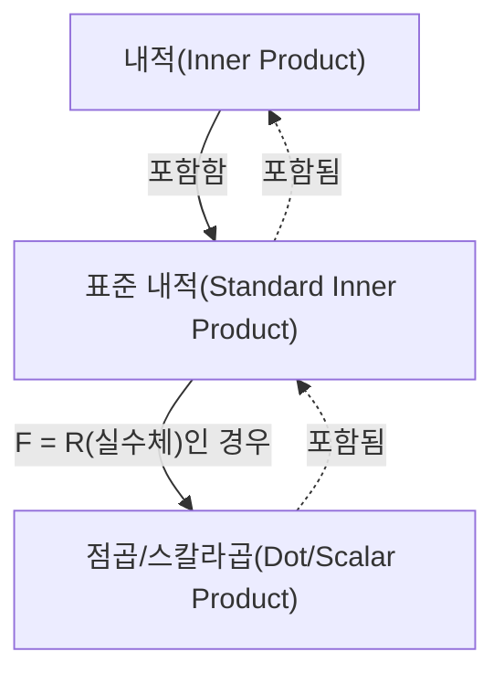

## Prerequisites
- [벡터와 선형결합](/posts/vectors-and-linear-combinations/)

## 내적

일반적인 $F$-벡터공간에서의 **내적(inner product)**의 정의는 다음과 같다.

> **내적(inner product)과 내적공간(inner product space)의 정의**  
> $F$-벡터공간 $\mathbb{V}$를 생각하자. $\mathbb{V}$에서의 **내적(inner product)** $\langle \mathbf{x},\mathbf{y} \rangle$는 $\mathbb{V}$의 임의의 벡터 $\mathbf{x}$와 $\mathbf{y}$의 순서쌍을 $F$에 속한 스칼라에 대응시키는, 다음 조건을 만족하는 함수로 정의한다.
>
> 임의의 $\mathbf{x},\mathbf{y},\mathbf{z} \in \mathbb{V}$와 임의의 $c \in F$에 대하여
> 1. $\langle \mathbf{x}+\mathbf{z}, \mathbf{y} \rangle = \langle \mathbf{x}, \mathbf{y} \rangle + \langle \mathbf{z}, \mathbf{y} \rangle$
> 2. $\langle c\mathbf{x}, \mathbf{y} \rangle = c \langle \mathbf{x}, \mathbf{y} \rangle$
> 3. $\overline{\langle \mathbf{x}, \mathbf{y} \rangle} = \langle \mathbf{y}, \mathbf{x} \rangle$ ($\overline{\mathbf{z}}$는 $\mathbf{z}$의 복소 켤레)
> 4. $\mathbf{x} \neq \mathbf{0}$일 때, $\langle \mathbf{x}, \mathbf{x} \rangle$는 양수이다.
>
> 내적이 주어진 $F$-벡터공간 $\mathbb{V}$를 **내적공간(inner product space)**이라 한다. 특히 $F=\mathbb{C}$인 경우 **복소내적공간(complex inner product space)**, $F=\mathbb{R}$인 경우 **실내적공간(real inner product space)**이라 한다.
{: .prompt-info }

특히 다음의 내적을 **표준 내적(standard inner product)**이라고 한다. 표준 내적이 앞선 내적의 조건 4가지를 모두 만족함을 확인할 수 있다.

> **표준 내적(standard inner product)의 정의**  
> $F^n$의 두 벡터 $\mathbf{x}=(a_1, a_2, \dots, a_n)$, $\mathbf{y}=(b_1, b_2, \dots, b_n)$에 대하여, $F^n$의 **표준 내적(standard inner product)**을 다음과 같이 정의한다.
>
> $$\langle \mathbf{x}, \mathbf{y} \rangle = \sum_{i=1}^n a_i \overline{b_i} $$
>
{: .prompt-info }

여기서 $F=\mathbb{R}$이면, 실수의 켤레복소수는 자기 자신이기 때문에 이때의 표준 내적은 $\sum_{i=1}^n a_i b_i$가 된다. 특별히 이 경우의 표준 내적을 $\langle \mathbf{x}, \mathbf{y} \rangle$ 대신 $\mathbf{x} \cdot \mathbf{y}$로 표기하고, **점곱(dot product)** 또는 **스칼라곱(scalar product)**이라고 한다.

> **점곱(dot product)/스칼라곱(scalar product)의 정의**  
> $\mathbb{R}^n$의 $\mathbf{v}=(v_1, v_2, \dots, v_n)$, $\mathbf{w}=(w_1, w_2, \dots, w_n)$에 대하여, $\mathbb{R}^n$의 **점곱(dot product)** 또는 **스칼라곱(scalar product)**을 다음과 같이 정의한다.
>
> $$ \mathbf{v} \cdot \mathbf{w} = \sum_{i=1}^n v_i w_i = v_1 w_1 + v_2 w_2 + \cdots + v_n w_n $$
> 
{: .prompt-info }

> 여기서 말하는 '스칼라곱(**scalar product**)'은 벡터와 벡터 간의 연산으로, [벡터와 선형결합](/posts/vectors-and-linear-combinations/)에서 다뤘던 벡터의 상수배, '스칼라곱(**scalar multiplication**)'과는 별개의 연산이다. 영문 표현도 비슷한 편인 데다, <u>한글 번역명은 아예 동일하기 때문에</u> 혼동하지 않도록 주의하자.
>
> 혼동을 방지하기 위해, 앞으로는 가급적 **점곱(dot product)**으로 지칭하겠다.
{: .prompt-warning }

> 유클리드 공간에서의 내적(inner product)이 곧 점곱(dot product)이므로, 맥락상 혼동의 여지가 없다면 점곱을 그냥 내적이라고 표현하는 경우도 흔하다. 다만 엄밀히는 내적이 점곱을 포함하는 더 일반적인 개념이다.
{: .prompt-tip }

## 벡터의 길이/노름

$\mathbb{R}^n$에서의 벡터 $\mathbf{v}=(v_1, v_2, \dots, v_n)$에 대하여 $\mathbf{v}$의 유클리드 길이는 다음과 같이 점곱을 통해 정의한다.

$$ \| \mathbf{v} \| = \sqrt{\mathbf{v} \cdot \mathbf{v}} = \left[ \sum_{i=1}^n |v_i|^2 \right]^{1/2} = \sqrt{v_1^2 + v_2^2 + \cdots + v_n^2} $$

보다 일반적으로는, 임의의 내적공간에서의 벡터의 **길이(length)** 또는 **노름(norm)**을 다음과 같이 정의한다.

$$ \| \mathbf{x} \| = \sqrt{\langle \mathbf{x}, \mathbf{x} \rangle} $$

일반적인 내적공간에서, 벡터의 노름에 대해 다음의 중요한 성질들이 성립한다.

> **정리**  
> $F$-내적공간 $\mathbb{V}$와 임의의 벡터 $\mathbf{x}, \mathbf{y} \in \mathbb{V}$, 스칼라 $c \in F$에 대하여 다음이 성립한다.
> 1. $\\|c\mathbf{x}\\| = \|c\| \cdot \\|\mathbf{x}\\|$
> 2. 다음의 둘이 성립한다.
>    - $\\|\mathbf{x}\\| = 0 \iff \mathbf{x}=\mathbf{0}$
>    - $\\|\mathbf{x}\\| \geq 0 \ \forall \mathbf{x}$
> 3. **코시-슈바르츠 부등식(Cauchy-Schwarz inequality)**: $\| \langle \mathbf{x}, \mathbf{y} \rangle \| \leq \\|\mathbf{x}\\| \cdot \\|\mathbf{y}\\|$ (등호는 $\mathbf{x}$와 $\mathbf{y}$ 둘 중 하나가 다른 하나의 상수배일 때 성립)
> 4. **삼각 부등식(triangle inequality)**: $\\| \mathbf{x} + \mathbf{y} \\| \leq \\|\mathbf{x}\\| + \\|\mathbf{y}\\|$ (등호는 $\mathbf{x}$와 $\mathbf{y}$ 둘 중 하나가 다른 하나의 상수배이고, 둘의 방향이 같을 때 성립)
{: .prompt-info }

## 벡터들 사이의 각과 단위벡터

길이가 $1$인 벡터를 **단위벡터(unit vector)**라고 한다. 또한 $\mathbb{R}^n$에서의 두 벡터 $\mathbf{v}=(v_1, v_2, \dots, v_n)$, $\mathbf{w}=(w_1, w_2, \dots, w_n)$에 대하여 $\mathbf{v} \cdot \mathbf{w} = \\|\mathbf{v}\\| \cdot \\|\mathbf{w}\\| \cos\theta$가 성립하며, 이로부터 $\mathbf{v}$와 $\mathbf{w}$ 사이의 각 $\theta$ ($0 \leq \theta \leq \pi$)를 구할 수 있다.

$$ \theta = \arccos{\frac{\mathbf{v} \cdot \mathbf{w}}{\|\mathbf{v}\| \cdot \|\mathbf{w}\|}} $$

$\mathbf{v} \cdot \mathbf{w} = 0$인 경우, 두 벡터는 **수직(perpendicular)** 또는 **직교(orthogonal)**한다고 한다.

> 두 벡터 $\mathbf{v}$와 $\mathbf{w}$가 수직인 경우,
>
> $$ \begin{align*}
> \| \mathbf{v} + \mathbf{w} \|^2 &= (\mathbf{v} + \mathbf{w}) \cdot (\mathbf{v} + \mathbf{w}) \\
> &= \mathbf{v} \cdot \mathbf{v} + \mathbf{v} \cdot \mathbf{w} + \mathbf{w} \cdot \mathbf{v} + \mathbf{w} \cdot \mathbf{w} \\
> &= \mathbf{v} \cdot \mathbf{v} + \mathbf{w} \cdot \mathbf{w} \\
> &= \|\mathbf{v}\|^2 + \|\mathbf{w}\|^2.
> \end{align*} $$
>
{: .prompt-tip }

이를 임의의 내적공간으로 일반화하면 다음과 같다.

> **정의**  
> 내적공간 $\mathbb{V}$를 생각하자. $\mathbb{V}$의 벡터 $\mathbf{x}, \mathbf{y}$에 대하여 $\langle \mathbf{x}, \mathbf{y} \rangle = 0$이면 두 벡터는 **직교(orthogonal)** 또는 **수직(perpendicular)**이라고 정의한다. 또한,
> 1. $\mathbb{V}$의 부분집합 $S$에 대하여 $S$에 속하는 서로 다른 임의의 두 벡터가 직교할 때, 집합 $S$를 **직교집합(orthogonal set)**이라 한다.
> 2. $\\|\mathbf{x}\\|=1$인 벡터 $\mathbf{x} \in \mathbb{V}$를 **단위벡터(unit vector)**라 한다.
> 3. $\mathbb{V}$의 부분집합 $S$가 직교집합이고 단위벡터로만 이루어져 있을 때, 집합 $S$를 **정규직교집합(orthonormal set)**이라 한다.
{: .prompt-info }

집합 $S = \{ \mathbf{v}_1, \mathbf{v}_2, \dots \}$가 정규직교집합이기 위한 필요충분조건은 $\langle \mathbf{v}\_i, \mathbf{v}\_j \rangle = \delta\_{ij}$이다. 벡터에 영이 아닌 스칼라를 곱해도 직교성에 영향을 주지 않는다.

영이 아닌 임의의 벡터 $\mathbf{x}$에 대하여 $\cfrac{\mathbf{x}}{\\|\mathbf{x}\\|}$는 단위벡터이며, 이렇게 영이 아닌 벡터에 길이의 역수만큼의 스칼라를 곱하여 단위벡터를 얻는 과정을 **정규화(normalizing)**라 한다.
