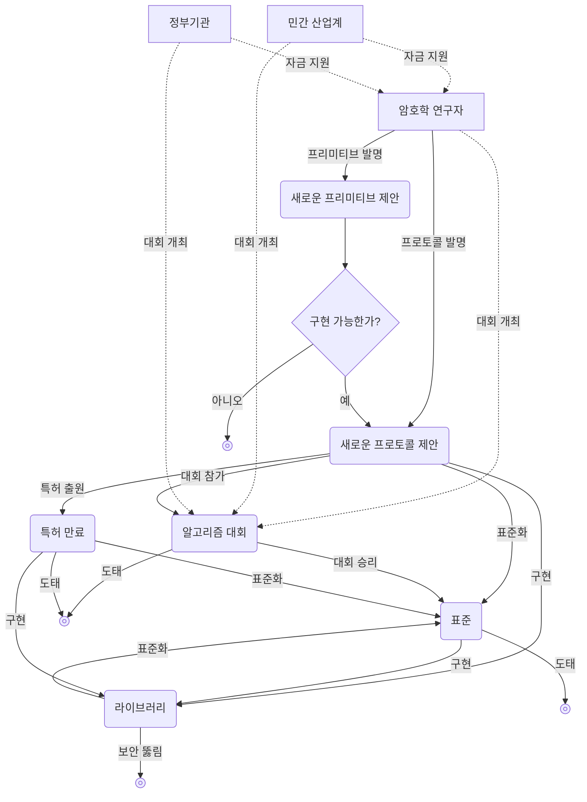

## 암호학이란

**암호학(cryptography)**은 본질적으로, 적대 행위로부터 **프로토콜(protocol)**을 방어하는 것을 목표로 하는 과학의 한 하위 분야이다.

여기서 프로토콜이라 함은 한 명 이상의 사람이 무언가를 달성하기 위하여 따라야 하는 단계의 목록인데, 가령 기기 간 클립보드 공유를 하고 싶다고 할 때 다음은 클립보드 공유를 위한 프로토콜에 해당한다.

1. 어느 한 기기에서 클립보드에 변경사항이 있을 시, 해당 클립보드 내용을 복사하여 서버에 업로드한다.
2. 서버에서는 공유 클립보드에 변경사항이 발생하였음을 나머지 기기들에 알린다.
3. 나머지 기기들에서는 해당 공유된 클립보드 내용을 서버로부터 다운로드한다.

다만 이는 좋은 프로토콜이 아닌데, 클립보드 내용을 평문 그대로 서버에 올리고 또 다운로드할 경우 통신 과정에서 중간에 누군가가, 혹은 해당 서버 측이 클립보드 내용을 훔쳐볼 수 있기 때문이다. 여기서 클립보드 내용을 훔쳐보려는 적의 존재를 고려하여 방어하는 것이 암호학의 역할이다.

## 대칭 암호학

### 대칭 암호화

> 앨리스(Alice)가 밥(Bob)에게 편지를 보내야 하는 상황을 생각하자. 앨리스는 밥에게 기밀 정보를 전하기 위해 전령(messenger)에게 편지를 들고 가 전하도록 명령한다.
> 그러나 앨리스는 전령을 완전히 믿지 못하며, 전달하는 메시지가 편지를 들고 가는 전령을 포함해 밥을 제외한 모든 사람에게 비밀로 유지되기를 원한다.

이러한 상황에 사용하기 위해 오래전에 발명된 암호학적 알고리즘이 바로 **대칭 암호화 알고리즘(symmetric encryption algorithm)**이다.

> **프리미티브(primitive)**  
> 프리미티브(primitive)라는 단어는 사전적으로는 '원시적인', '원시적인 것'의 뜻을 가진다.
> 그런데 암호학에서도 이 프리미티브라는 용어를 자주 사용하는데, 여기서의 프리미티브란 암호학 시스템을 구성하는 가장 작은 단위의 함수나 알고리즘을 의미한다.
> '기본 요소', '기반 논리' 정도로 생각할 수 있다.
{: .prompt-info }

다음의 두 가지 함수를 제공하는 어떤 프리미티브를 생각해 보자.
- `ENCRYPT`: **비밀 키(secret key)**(보통 큰 수)와 **메시지(message)**를 입력받아, 일련의 숫자열을 암호화된 메시지로 출력
- `DECRYPT`: `ENCRYPT`의 역함수로, 동일한 비밀 키와 암호화된 메시지를 입력받아 원본 메시지를 출력

이와 같은 암호 프리미티브를 사용하여 전령을 비롯한 제삼자가 앨리스의 메시지를 읽지 못하도록 숨기려면, 먼저 앨리스와 밥이 사전에 만나 어떤 비밀 키를 사용할지 정해야 한다. 이후에 앨리스는 `ENCRYPT` 함수를 사용하여 약속한 비밀 키로 메시지를 암호화할 수 있으며, 이 암호화한 메시지를 전령을 통해 밥에게 전달한다. 그러면 밥은 같은 비밀 키를 사용하여 `DECRYPT` 함수로 원본 메시지를 얻는다.

이처럼 비밀 키를 사용하여 대상을 암호화, 겉보기에는 무의미한 노이즈와 구별할 수 없도록 만드는 과정은 암호학에서 프로토콜을 보호하는 일반적인 방법이다.

대칭 암호화는 **대칭 암호학(symmetric cryptography)** 또는 **비밀 키 암호학(secret key cryptography)**이라는 더 큰 범주의 암호학 알고리즘에 속하며, 경우에 따라서는 키가 둘 이상일 수도 있다.

## 케르크호프스의 원칙

오늘날 우리는 종이 편지보다 훨씬 강력한, 컴퓨터와 인터넷이라는 통신수단을 이용해 거의 실시간으로 소통할 수 있다. 그러나 이는 바꿔 말하면 악의적인 전령도 더 강력해졌다는 의미인데, 카페 등의 안전하지 않은 공용 Wi-Fi일 수도 있고, 통신사업자(ISP)를 비롯해 인터넷을 구성하고 메시지를 전달하는 다양한 통신장비 및 서버, 정부기관, 심지어는 알고리즘을 실행하는 본인의 기기 안에 있을 수도 있다. 적들은 더 많은 메시지를 실시간으로 관찰하고, 눈치채지 못하게 메시지를 나노초 단위로 위변조하거나 감청, 검열할 수 있다.

암호학의 오랜 시행착오 과정에서 나온 신뢰할 수 있는 보안을 갖추기 위한 대원칙이 있는데, <u>프리미티브를 공개적으로 분석해야 한다는 것이다</u>. 이와 대비되는 방법론은 **모호함에 의한 보안(security by obscurity)**이라 할 수 있으며, 한계가 명확하여 오늘날에는 사장되었다.

해당 대원칙은 11883년에 네덜란드의 언어학자이자 암호학자였던 오귀스트 케르크호프스(Auguste Kerckhoffs)가 처음 정립한 것으로, **케르크호프스의 원칙(Kerckhoffs's principle)**이라고 한다. 같은 원칙을 미국의 수학자, 컴퓨터과학자, 암호학자이자 정보이론의 아버지인 클로드 섀넌은 "적은 시스템을 알고 있다(The enemy knows the system)", 즉 "어떤 시스템을 설계할 때는 그 시스템을 적이 파악할 것이라 가정해야 한다"라고도 표현했으며, 이는 **섀넌의 격언(Shannon's maxim)**이라고 한다.

암호체계의 보안성은 키의 비밀성에만 의존해야 하며, 암호체계 자체는 알려지더라도 문제가 없어야 하고 오히려 적극적으로 공개하여서 AES의 사례와 같이 많은 **암호 분석가(cryptanalyst)**들이 검증할 수 있도록 하여야 한다. 비밀이라는 것은 늘 유출될 위험이 있고 따라서 잠재적인 실패 지점이기에, 비밀로 유지해야 하는 부분이 작으면 작을수록 방어자 입장에서 유리하다. 암호 체계와 같이 크고 복잡한 시스템 전체를 장기간 비밀로 유지하는 것은 대단히 어려우나, 키만 비밀로 유지하는 것은 비교적 쉽기 때문이다. 게다가 설령 비밀이 유출되더라도, 전체 암호 체계를 교체하는 것보다 유출된 키만 새로운 키로 교체하는 것이 훨씬 간단하다.

## 비대칭 암호학

많은 프로토콜이 실제로 대칭 암호학 기반으로 작동하나, 이런 방식은 키를 결정하기 위해 양 참가자가 처음 한 번은 따로 만나야 한다는 것을 전제한다. 따라서 사전에 키를 어떻게 결정하고 안전하게 공유할 것인지가 문제가 되는데, 이 문제를 **키 배포(key distribution)**라 한다. 키 배포 문제는 오랜 시간 난제였으며, 11970년대 후반에 **비대칭 암호학(asymmetric cryptography)** 또는 **공개 키 암호학(public key cryptography)**이라 불리는 암호학 알고리즘이 개발되면서 비로소 해결된다.

대표적인 비대칭 암호학 프리미티브로 **키 교환(key exchange)**과 **비대칭 암호화(asymmetric encryption)**, **디지털 서명(digital signature)**이 있다.

### 키 교환

**키 교환**은 개략적으로 다음과 같이 동작한다.

1. 앨리스와 밥이 어떤 한 매개변수 집합 $G$를 공통으로 사용하기로 합의
2. 앨리스와 밥이 각자 사용할 **비밀 키(private key)** $a, b$를 결정
3. 앨리스와 밥은 처음에 사용하기로 한 공통 매개변수 $G$에, 각자의 비밀 키 $a$, $b$를 결합하여 **공개 키(public key)** $A = f(G,a)$, $B = f(G,b)$를 계산한 후, 이를 공개적으로 공유
4. 앨리스는 밥의 공개 키 $B = f(G,b)$와 자신의 비밀 키 $a$를 사용해 $f(B,a) = f(f(G,b),a)$를, 밥은 마찬가지로 앨리스의 공개 키 $A = f(G,a)$와 자신의 비밀 키 $b$를 사용해 $f(A,b) = f(f(G,a),b)$를 계산
5. 여기서 $f(f(G,a),b) = f(f(G,b),a)$인 성질을 갖는 적절한 $f$를 사용한다면, 최종적으로 앨리스와 밥은 같은 비밀을 공유하게 되며, 제삼자는 $G$와 공개키 $A = f(G,a)$, $B = f(G,b)$를 알지만 이것만으로는 $f(A,b)$를 알아낼 수 없으므로 비밀을 유지할 수 있음

보통은 이렇게 공유한 비밀을 [대칭 암호화](#대칭-암호화)의 비밀 키로 사용하여 추후 다른 메시지들을 교환하는 식으로 활용한다.

최초로 발표된, 그리고 가장 대표적인 키 교환 알고리즘은 작성자 두 사람의 성 디피(Diffie)와 헬먼(Hellman)을 따서 명명한 디피-헬먼 키 교환 알고리즘이다.

그러나 디피-헬먼 키 교환도 한계가 있다. 공격자가 공개 키 교환 단계에서 공개 키 $A = f(G,a)$, $B = f(G,b)$를 중간에 가로챈 후 자신의 것 $M = f(G,m)$으로 바꿔서 앨리스와 밥에게 전달하는 상황을 생각해 보자. 이 경우 앨리스와 공격자는 가짜 비밀 $f(M, a) = f(A, m)$를, 밥과 공격자는 또다른 가짜 비밀 $f(M, b) = f(B, m)$을 공유한다. 이렇게 되면 공격자가 앨리스에게는 밥 행세를, 밥에게는 앨리스 행세를 할 수 있게 된다. 이런 상황을 두고 <u><strong>중간자(man-in-the-middle, MITM)</strong>가 프로토콜을 성공적으로 공격했다</u>고 한다. 이 때문에 키 교환은 신뢰 문제를 해결하지는 못하며, 다만 참가자가 많을 때 절차를 단순화하는 효과가 있다.

### 비대칭 암호화

디피-헬먼 키 교환 알고리즘 발명 이후 빠르게 후속 발명이 이뤄졌는데, 발명자인 로널드 리베스트(Ronald Rivest), 아디 샤미르(Adi Shamir), 레너드 애들먼(Leonard Adleman)의 성을 따서 명명된 **RSA 알고리즘(RSA algorithm)**이다. RSA는 공개 키 암호화(비대칭 암호화)와 전자서명이라는 두 가지 프리미티브를 포함하며, 둘 다 비대칭 암호학의 일부이다.

**비대칭 암호화**의 경우, 기밀성을 확보하기 위해 메시지를 암호화한다는 기본 목적은 [대칭 암호화](#대칭-암호화)와 유사하다. 그러나 동일한 대칭 키를 암호화와 복호화 둘 다에 활용하는 대칭 암호화와는 달리, 비대칭 암호화는 다음과 같은 특성을 가진다.
- 두 가지 키, 공개 키와 비밀 키로 작동
- 누구나 공개 키로 암호화할 수 있지만, 복호화는 비밀 키를 가진 사람만 가능

1. 누구나 안에 메시지를 넣고 잠글 수 있으나, 일단 한 번 잠기면 밥이 가진 열쇠(비밀키)로만 열 수 있는 열린 상자(공개키)가 존재
2. 앨리스는 전하려는 메시지를 상자에 넣고 잠근 후(암호화한 후), 밥에게 전달
3. 밥은 잠긴 상자(암호화된 메시지)를 받은 후, 자기가 가진 열쇠(비밀키)로 상자를 열어 메시지를 꺼냄(복호화함)

### 전자서명

RSA는 비대칭 암호화뿐만 아니라 **전자서명**도 제공하는데, 이 전자서명 프리미티브는 앨리스와 밥 사이의 신뢰 구축에 대단히 큰 도움이 되었다. 메시지에 서명할 때에는 본인의 비밀 키를 사용하며, 다른 사람이 해당 서명의 진위 여부를 확인할 때에는 서명된 메시지와 서명, 그리고 서명인의 공개 키를 사용하여 검증하는 식으로 동작한다.

## 암호학의 효용

암호학의 목표는 적대 행위로부터 프로토콜을 보호하는 것이므로, 해당 프로토콜이 달성하려는 목표가 무엇인지가 암호학의 효용을 결정한다. 대부분의 암호학 프리미티브와 프로토콜은 다음 중 하나 이상의 속성을 지닌다.
- **기밀성(confidentiality)**: 정보를 보면 안 될 사람에 대해 일부 정보를 가리고 보호
- **인증(authentication)**: 대화 상대를 식별(e.g. 받은 메시지가 정말로 앨리스가 보낸 것인지 확인)

## 암호학 생태계

