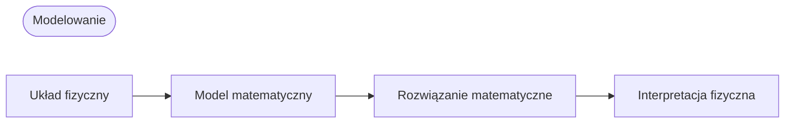

## Modelowanie (Modeling)

- **model (model)**: sformalizowanie rozwiązywanego problemu inżynierskiego w postaci wyrażeń matematycznych z użyciem zmiennych, funkcji, równań itp.
- **modelowanie matematyczne (mathematical modeling)** lub **modelowanie (modeling)**: proces zbudowania modelu, matematycznego rozwiązania go oraz interpretacji wyniku

Ponieważ wiele pojęć fizycznych, takich jak prędkość czy przyspieszenie, jest pochodnymi, model często ma postać równania zawierającego pochodne funkcji niewiadomej, czyli **równania różniczkowego (differential equation)**.

## Równania różniczkowe zwyczajne (ODE) i cząstkowe (PDE)

### Równanie różniczkowe zwyczajne (ODE)

**Równanie różniczkowe zwyczajne (ordinary differential equation; ODE)**: równanie zawierające $n$-tą pochodną funkcji niewiadomej

Przykłady:

$$y' = \cos x$$

$$ y'' + 9y = e^{-2x} $$

$$ y'y''' - \frac{3}{2}y'^{2} = 0 $$

### Równanie różniczkowe cząstkowe (PDE)

**Równanie różniczkowe cząstkowe (partial differential equation; PDE)**: równanie zawierające pochodne cząstkowe funkcji niewiadomej zależnej od co najmniej dwóch zmiennych

Przykład:

$$ \frac{\partial^2 u}{\partial x^2} + \frac{\partial^2 u}{\partial y^2} = 0 $$

## Rozwiązanie (Solution)

Jeśli funkcja $h(x)$ jest określona i różniczkowalna na pewnym otwartym przedziale $(a, b)$, a po podstawieniu $y \mapsto h$ oraz $y' \mapsto h'$ dane równanie różniczkowe zwyczajne staje się tożsamością, to funkcję

$$ y = h(x) $$

nazywa się **rozwiązaniem (solution)** danego równania różniczkowego zwyczajnego na przedziale $(a, b)$, a wykres funkcji $h$ nazywa się **krzywą rozwiązań (solution curve)**.

Przykłady:

$$ y'=\cos x \Leftrightarrow y=\sin x+c $$

$$ y'=0.2y \Leftrightarrow y=ce^{0.2t} $$

Takie rozwiązanie zawierające dowolną stałą $c$ nazywa się **rozwiązaniem ogólnym (general solution)** równania różniczkowego zwyczajnego.

Geometrycznie rozwiązanie ogólne równania różniczkowego zwyczajnego jest zbiorem nieskończenie wielu krzywych rozwiązań; każdej wartości stałej $c$ odpowiada jedna krzywa. Wybierając konkretną stałą $c$, otrzymujemy **rozwiązanie szczególne (particular solution)**.

## Problem początkowy (Initial Value Problem)

Aby otrzymać rozwiązanie szczególne danego problemu, trzeba wyznaczyć wartość dowolnej stałej $c$. W wielu przypadkach można to zrobić poprzez **warunek początkowy (initial condition)**, np. $y(x_{0})=y_{0}$ lub $y(t_{0})=y_{0}$ (nawet jeśli zmienna niezależna nie jest czasem albo $t_{0}\neq0$, nadal używa się określenia „warunek początkowy”). Równanie różniczkowe zwyczajne wraz z warunkiem początkowym nazywa się **problemem początkowym (initial value problem)**.

Przykład:

$$ y'=f(x,y),\qquad y(x_{0})=y_{0} $$

## Przykład modelowania: wykładniczy rozpad substancji promieniotwórczej

Dana jest ilość substancji promieniotwórczej równa 0.5 g. Wyznacz ilość pozostałą po czasie $t$.
> Z doświadczenia wynika, że substancja promieniotwórcza w każdej chwili rozpada się z szybkością proporcjonalną do aktualnej ilości, a więc maleje (zanika) w czasie.
{: .prompt-info }

### 1. Ustalenie modelu matematycznego

Niech $y(t)$ oznacza ilość substancji pozostałą w chwili $t$. Ponieważ $y'(t)$ jest proporcjonalne do $y(t)$, otrzymujemy **równanie różniczkowe zwyczajne pierwszego rzędu**

$$ \frac {dy}{dt} = -ky$$

(gdzie $k>0$ jest stałą).

Znamy też **warunek początkowy** $y(0)=0.5$. Zatem model matematyczny można sformułować jako następujący **problem początkowy**:

$$ \frac {dy}{dt} = -ky, \qquad y(0)=0.5 $$

### 2. Rozwiązanie matematyczne

Rozwiązanie ogólne wcześniej ułożonego równania różniczkowego zwyczajnego jest następujące (zob. [metoda rozdzielania zmiennych](/posts/Separation-of-Variables/#przyklad-modelowania-datowanie-radioweglowe-radiocarbon-dating)).

$$ y(t)=ce^{-kt} $$

Ponieważ $y(0)=c$, z warunku początkowego otrzymujemy $y(0)=c=0.5$. Zatem poszukiwane rozwiązanie szczególne ma postać

$$ y(t)=0.5e^{-kt} \quad(k>0)$$

### 3. Interpretacja fizyczna rozwiązania

Otrzymane rozwiązanie opisuje ilość substancji promieniotwórczej w dowolnej chwili $t$. Ilość ta startuje od wartości początkowej 0.5 (g) i maleje w czasie; gdy $t \to \infty$, granica $y$ wynosi $0$.
