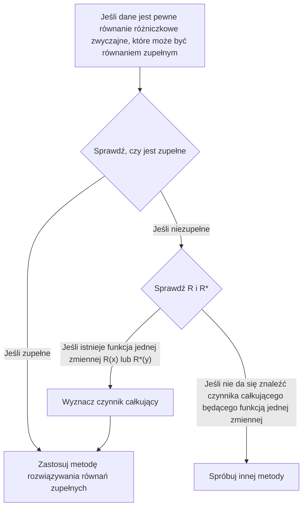

## TL;DR

## Równanie różniczkowe zupełne (Exact Differential Equation)

Równanie różniczkowe zwyczajne I rzędu $M(x,y)+N(x,y)y'=0$ można zapisać jako

$$ M(x,y)dx+N(x,y)dy=0 \tag{1} $$

Jeżeli

$$ \exists u(x,y): \frac{\partial u}{\partial x}=M(x,y) \land \frac{\partial u}{\partial y}=N(x,y) \tag{2} $$

to

$$ M(x,y)dx+N(x,y)dy=\frac{\partial u}{\partial x}dx+\frac{\partial u}{\partial y}dy=du \tag{3} $$

i wówczas równanie $M(x,y)dx+N(x,y)dy=0$ nazywa się **równaniem różniczkowym zupełnym (exact differential equation)**. Wtedy można je zapisać jako

$$ du=0 $$

a po scałkowaniu od razu otrzymujemy rozwiązanie ogólne w postaci

$$ u(x,y)=c \tag{4} $$

## Kryterium zupełności

Załóżmy, że na obszarze domkniętym w płaszczyźnie $xy$, którego brzegiem jest krzywa zamknięta nieprzecinająca samej siebie, funkcje $M$ i $N$ oraz ich pochodne cząstkowe I rzędu są ciągłe. Spójrzmy ponownie na warunek (2):

$$ \begin{align*}
\frac {\partial u}{\partial x}&=M(x,y) \tag{2a}
\\ \frac {\partial u}{\partial y}&=N(x,y) \tag{2b}
\end{align*}$$

Różniczkując powyższe równania cząstkowo, dostajemy

$$ \begin{align*}
\frac {\partial M}{\partial y} &= \frac{\partial^2 u}{\partial y \partial x}
\\ \frac {\partial N}{\partial x} &= \frac{\partial^2 u}{\partial x \partial y}
\end{align*}$$

Ponieważ założyliśmy ciągłość, te dwie pochodne cząstkowe II rzędu są sobie równe, więc

$$ \therefore \frac {\partial M}{\partial y}=\frac {\partial N}{\partial x} \tag{5}$$

Zatem warunek (5) jest warunkiem koniecznym, aby równanie (1) było równaniem zupełnym; choć nie dowodzimy tu tego faktu, jest to również warunek wystarczający. Innymi słowy, sprawdzając spełnienie tego warunku, możemy rozstrzygnąć, czy mamy do czynienia z równaniem zupełnym.

## Rozwiązywanie równania zupełnego

Całkując równanie (2a) względem $x$ (traktując $y$ jako stałą), otrzymujemy

$$ u = \int M(x,y) dx + k(y) \tag{6} $$

Ponieważ $y$ traktujemy jako stałą, $k(y)$ pełni tu rolę stałej całkowania. Teraz, traktując $x$ jako stałą, różniczkujemy (6) względem $y$ i wyznaczamy $\partial u/\partial y$:

$$ \frac{\partial u}{\partial y} = \frac{\partial}{\partial y}\int M(x,y) dx + \frac{dk}{dy} $$

Porównując to z (2b), możemy wyznaczyć $dk/dy$:

$$ \frac{\partial}{\partial y}\int M(x,y) dx + \frac{dk}{dy} = N(x,y) $$

$$ \frac{dk}{dy} = N(x,y) - \frac{\partial}{\partial y}\int M(x,y) dx $$

Na koniec całkujemy powyższe równanie, wyznaczamy $k(y)$, a następnie podstawiamy do (6), aby otrzymać rozwiązanie niejawne $u(x,y)=c$.

$$ k(y) = \int N(x,y)dy - \int \left(\frac{\partial}{\partial y}\int Mdx\right)dy + c^* $$

$$ \int M(x,y)dx + \int N(x,y)dy - \int \left(\frac{\partial}{\partial y}\int Mdx\right)dy = c $$

> Zamiast zapamiętywać tę postać rozwiązania ogólnego jako wzór i mechanicznie ją stosować, ważniejsze jest zrozumienie procesu, który do niej prowadzi.
{: .prompt-tip }

## Czynnik całkujący (Integrating Factor)

Załóżmy, że dane jest pewne niezupełne (inexact) równanie różniczkowe zwyczajne:

$$ P(x,y)dx+Q(x,y)dy = 0 \quad \left( \frac {\partial P}{\partial y} \neq \frac {\partial Q}{\partial x} \right) \tag{7} $$

Jeżeli

$$ \exists F(x,y): \frac {\partial}{\partial y}(FP) = \frac {\partial}{\partial x}(FQ) \tag{8} $$

to mnożąc równanie (7) przez funkcję $F$, możemy otrzymać następujące równanie zupełne:

$$ FP\ dx+FQ\ dy = 0 \tag{9} $$

Wtedy funkcję $F(x,y)$ nazywamy **czynnikiem całkującym (integrating factor)** równania (7).

## Jak wyznaczyć czynnik całkujący

Stosując regułę różniczkowania iloczynu do (8) i zapisując pochodne cząstkowe indeksami dolnymi, dostajemy:

$$ F_y P + FP_y = F_x Q + FQ_x $$

W wielu praktycznych przypadkach istnieje czynnik całkujący zależny tylko od jednej zmiennej. Jeśli $F=F(x)$, to $F_y=0$, a $F_x=F'=dF/dx$, zatem otrzymujemy

$$ FP_y = F'Q + FQ_x $$

Dzieląc obie strony przez $FQ$ i porządkując wyrazy, mamy

$$ \begin{align*}
\frac{1}{F} \frac{dF}{dx} &= \frac{P_y}{Q} - \frac{Q_x}{Q}
\\ &= \frac{1}{Q}\left(\frac{\partial P}{\partial y}-\frac{\partial Q}{\partial x} \right)
\end{align*} \tag{10} $$

A zatem zachodzi:

> Dla danego równania (7), jeśli prawa strona (10), $R$, jest funkcją wyłącznie zmiennej $x$, to równanie (7) ma czynnik całkujący $F=F(x)$.
>
> $$ F(x)=e^{\int R(x)dx}, \quad \text{gdzie }R=\frac{1}{Q}\left(\frac{\partial P}{\partial y}-\frac{\partial Q}{\partial x} \right) \tag{11} $$
{: .prompt-info }

Analogicznie, jeśli $F^\*=F^\*(y)$, to zamiast (10) otrzymujemy

$$ \frac{1}{F^*} \frac{dF^*}{dy} = \frac{1}{P}\left(\frac{\partial Q}{\partial x}-\frac{\partial P}{\partial y} \right) \tag{12} $$

a więc zachodzi:

> Dla danego równania (7), jeśli prawa strona (12), $R^*$, jest funkcją wyłącznie zmiennej $y$, to równanie (7) ma czynnik całkujący $F^\*=F^\*(y)$.
>
> $$ F^*(y)=e^{\int R^*(y)dy}, \quad \text{gdzie }R^*=\frac{1}{P}\left(\frac{\partial Q}{\partial x}-\frac{\partial P}{\partial y} \right) \tag{13} $$
{: .prompt-info }
