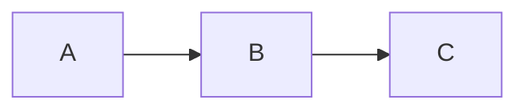

## TL;DR
> **Aktywność w dowolnej chwili t**
>
> $$\begin{align*}
> \alpha (t) &= \lambda n(t)
> \\ &= \alpha_0 e^{-\lambda t}
> \\ &= \alpha_0 e^{-0.693t/T_{1/2}}
> \end{align*}$$
{: .prompt-info }

> **Zależność między stałą rozpadu, okresem połowicznego zaniku i średnim czasem życia**
>
> $$ \begin{align*}
> T_{1/2}&=\frac {\ln 2}{\lambda} = \frac {0.693}{\lambda}
> \\
> \\ \overline{t}&=\frac {1}{\lambda}
> \\ &=\frac {T_{1/2}}{0.693}=1.44T_{1/2}
> \end{align*} $$
{: .prompt-info }

## Stała rozpadu (Decay Constant)
- prawdopodobieństwo, że dane jądro rozpadnie się w jednostce czasu
- stała niezależna od czasu, wyznaczona wyłącznie przez nuklid
- oznaczana symbolem $\lambda$

## Aktywność (Radioactivity)
Jeśli przez $n(t)$ oznaczymy liczbę jąder, które w chwili $t$ jeszcze się nie rozpadły, to w przedziale czasu $dt$ między $t$ i $t+dt$ średnio $\lambda n(t)$ jąder ulega rozpadowi. Tę szybkość rozpadu nazywa się *aktywnością (radioactivity)* próbki i oznacza symbolem $\alpha$. Zatem aktywność w chwili $t$ wynosi:

$$ \alpha (t)=\lambda n(t) \tag{1}$$

## Jednostki aktywności
### Kiur (Curie, Ci)
- jednostka tradycyjnie stosowana przed wprowadzeniem bekerela
- aktywność 1 g radu-226
- $3.7\times 10^{10}$ rozpadów jądrowych na sekundę ($3.7\times 10^{10}\text{Bq}$)

### Bekerel (Becquerel, Bq)
- jednostka międzynarodowa (SI)
- 1 rozpad jądrowy na sekundę
- $1 \text{Bq} = 2.703\times 10^{-11}\text{Ci} = 27\text{pCi}$

## Obliczanie zmian aktywności w czasie
Ponieważ w czasie $dt$ rozpada się $\lambda n(t)$ jąder, spadek liczby jąder, które pozostają nierozpadłe w próbce w czasie $dt$, można zapisać następująco:

$$ -dn(t)=\lambda n(t)dt $$

Całkując, otrzymujemy

$$ n(t)=n_0e^{-\lambda t} \tag{2} $$

Mnożąc obie strony przez $\lambda$, dostajemy aktywność:

$$ \alpha (t)=\alpha_0e^{-\lambda t} \tag{3} $$

Ponieważ w czasie *okresu połowicznego zaniku (half-life)* aktywność maleje o połowę,

$$ \alpha (T_{1/2})=\alpha_0/2 $$

Podstawiając to do (3), dostajemy

$$ \alpha_0/2=\alpha_0e^{-\lambda T_{1/2}} $$

Biorąc logarytm po obu stronach i rozwiązując względem okresu połowicznego zaniku $T_{1/2}$:

$$ T_{1/2}=\frac {\ln 2}{\lambda}=\frac {0.693}{\lambda} \tag{4}$$

Rozwiązując powyższe równanie względem $\lambda$ i podstawiając do (3), otrzymujemy

$$ \alpha (t)=\alpha_0e^{-0.693t/T_{1/2}} \tag{5} $$

Równanie (5) bywa często wygodniejsze w obliczeniach rozpadu promieniotwórczego niż (3), ponieważ częściej podaje się okres połowicznego zaniku niż stałą rozpadu.

*Średni czas życia (mean-life)* jądra promieniotwórczego $\overline{t}$ jest odwrotnością stałej rozpadu:

$$ \overline{t}=1/\lambda $$

Z równania (3) widać, że w czasie jednego średniego czasu życia aktywność spada do $1/e$ wartości początkowej. Z równania (4) wynika następująca zależność między średnim czasem życia a okresem połowicznego zaniku:

$$ \overline{t}=\frac {T_{1/2}}{0.693}=1.44T_{1/2} \tag{6} $$

### ※ Wyprowadzenie średniego czasu życia $\overline{t}$

$$ \begin{align*}
\overline{t}&=\frac {\int_0^\infty t\alpha(t)}{\int_0^\infty t} = \frac {\int_0^\infty t\alpha(t)}{n_0}
\\ &= \frac {\int_0^\infty n_0 \lambda te^{-\lambda t}}{n_0}
\\ &= \int_0^\infty \lambda te^{-\lambda t}
\\ &= \left[-te^{-\lambda t}\right]_0^\infty +\int_0^\infty e^{-\lambda t}
\\ &=\left[-\frac {1}{\lambda} e^{-\lambda t}\right]_0^\infty
\\ &=\frac {1}{\lambda}
\end{align*}$$

## Przykład: łańcuch rozpadu promieniotwórczego 1
Załóżmy, że pewien radionuklid jest wytwarzany z szybkością $R$ atom/s. Jądro to, zaraz po powstaniu, natychmiast ulega rozpadowi promieniotwórczemu. Wyznacz aktywność tego nuklidu w dowolnej chwili $t$.

### 1. Ustalenie modelu

$$ \text{tempo zmiany liczby jąder w czasie} = \text{szybkość produkcji}-\text{szybkość strat} $$

W zapisie matematycznym:

$$ dn/dt = -\lambda n + R $$

### 2. Rozwiązanie ogólne
Przenieśmy wszystkie wyrazy z $n$ na lewą stronę i pomnóżmy obie strony przez $e^{\lambda t}$.

$$ \frac {dn}{dt} + \lambda n = R $$

$$ e^{\lambda t}\frac {dn}{dt} + \lambda e^{\lambda t}n = Re^{\lambda t} $$

Ponieważ $\lambda e^{\lambda t}=\frac {d}{dt} e^{\lambda t}$, możemy to uporządkować następująco:

$$ e^{\lambda t}\frac {dn}{dt}+\left(\frac {d}{dt} e^{\lambda t}\right)n = Re^{\lambda t} $$

Całkując obie strony, otrzymujemy rozwiązanie ogólne:

$$ e^{\lambda t}n=\frac {R}{\lambda}e^{\lambda t}+c $$

$$ n=ce^{-\lambda t}+\frac {R}{\lambda} $$

### 3. Rozwiązanie szczególne
Niech w chwili $t=0$ liczba jąder tego nuklidu wynosi $n_0$. Wyznaczmy wartość stałej $c$.

$$ n(0)=c+\frac {R}{\lambda}=n_0 $$

$$ c=n_0-\frac {R}{\lambda} $$

Zatem rozwiązanie szczególne dla zadanej sytuacji ma postać:

$$ n = n_0e^{-\lambda t}+\frac {R}{\lambda}(1-e^{-\lambda t}) \tag{7} $$

Mnożąc obie strony przez $\lambda$, możemy wyznaczyć aktywność tego nuklidu:

$$ \alpha = \alpha_0e^{-\lambda t}+R(1-e^{-\lambda t}) \tag{8} $$

Czyli dla $t\to\infty$ mamy granice: $\alpha_{\text{max}}=R$ oraz $n_{\text{max}}=R/\lambda$.

## Przykład: łańcuch rozpadu promieniotwórczego 2
Dla poniższego łańcucha rozpadu oblicz aktywność radionuklidu B.

### 1. Ustalenie modelu

$$ \text{tempo zmiany liczby jąder B}=\text{szybkość produkcji z rozpadu A}-\text{szybkość rozpadu B do C} $$

$$ \frac {dn_B}{dt} = -\lambda_B n_B + \lambda_A n_A $$

Podstawiając do powyższego $n_A$ z równania (2), otrzymujemy następujące równanie różniczkowe dla $n_B$:

$$  \frac {dn_B}{dt} = -\lambda_B n_B + \lambda_A n_{A0}e^{-\lambda_A t} \tag{9}$$ 

### 2. Rozwiązanie ogólne
Aby rozwiązać równanie różniczkowe, przenieśmy wszystkie wyrazy z $n_B$ na lewą stronę i pomnóżmy obie strony przez $e^{\lambda_B t}$.

$$ \frac {dn_B}{dt} + \lambda_B n_B = n_{A0}\lambda_A e^{-\lambda_A t} $$

$$ e^{\lambda_B t}\frac {dn_B}{dt} + \lambda_B e^{\lambda_B t}n_B = n_{A0}\lambda_A e^{(\lambda_B-\lambda_A)t} $$

Ponieważ $\lambda_B e^{\lambda_B t}=\frac {d}{dt} e^{\lambda_b t}$, możemy to zapisać w postaci:

$$ e^{\lambda_B t}\frac {dn_B}{dt} + \left(\frac {d}{dt} e^{\lambda_B t}\right)n_B = n_{A0}\lambda_A e^{(\lambda_B-\lambda_A)t} $$

Całkując obie strony, dostajemy:

$$ e^{\lambda_B t}n_B = \frac {n_{A0}\lambda_A}{\lambda_B-\lambda_A}e^{(\lambda_B-\lambda_A)t}+c $$

Dzieląc obie strony przez $e^{\lambda_B t}$, otrzymujemy rozwiązanie ogólne:

$$ n_B = \frac {n_{A0}\lambda_A}{\lambda_B-\lambda_A}e^{-\lambda_A t}+ce^{-\lambda_B t} $$

### 3. Rozwiązanie szczególne
Niech w chwili $t=0$ liczba jąder pierwiastka B wynosi $n_{B0}$. Wyznaczmy wartość stałej $c$.

$$ n_B(0)=\frac {n_{A0}\lambda_A}{\lambda_B-\lambda_A}+c=n_{B0} $$

$$ c=n_{B0}-\frac{n_{A0}\lambda_A}{\lambda_B-\lambda_A} $$

Zatem rozwiązanie szczególne dla zadanej sytuacji jest następujące:

$$ n_B = n_{B0}e^{-\lambda_B t} + \frac {n_{A0}\lambda_A}{\lambda_B - \lambda_A} (e^{-\lambda_A t} - e^{-\lambda_B t}) \tag{10}$$

$$ \therefore \alpha_B = \alpha_{B0} e^{-\lambda_B t} + \frac {\alpha_{A0}\lambda_A}{\lambda_B - \lambda_A} (e^{-\lambda_A t} - e^{-\lambda_B t}) \tag{11}$$
