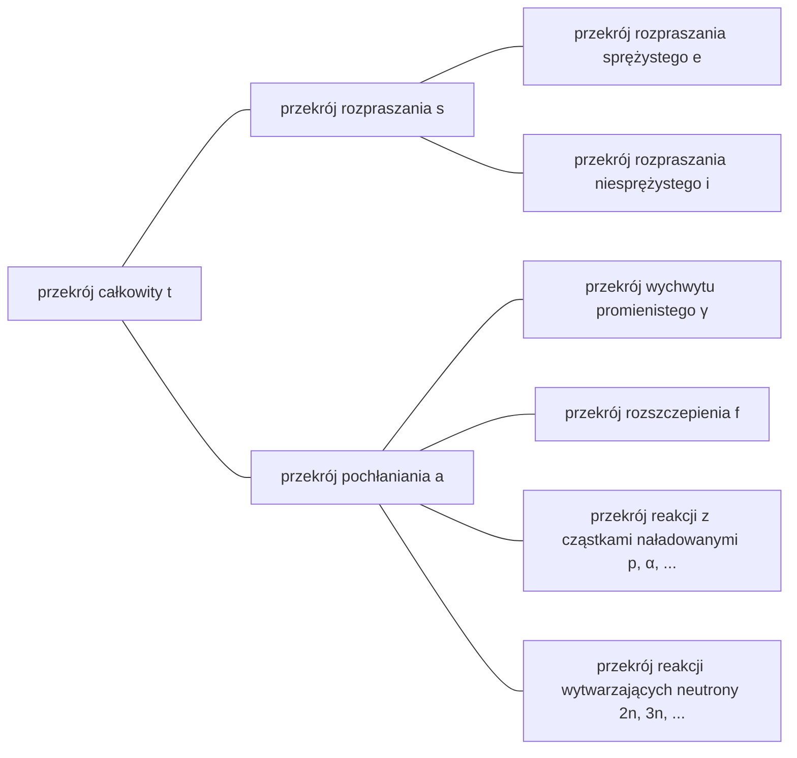

## Przekrój czynny (cross-section) lub mikroskopowy przekrój czynny (microscopic cross-section)
Niech jednorodna wiązka neutronów o pojedynczej energii pada na tarczę o (bardzo małej) grubości $\tau$ i polu $A$, a liczbę neutronów padających na jednostkę powierzchni tarczy w jednostce czasu oznaczmy przez $I\ \text{neutrons/cm}^2\cdot \text{s}$. Udział objętościowy jądra atomowego w atomie jest bardzo mały, a ponieważ zakładamy, że tarcza jest bardzo cienka, większość neutronów przechodzi przez nią bez reakcji z jądrami. Wtedy liczba neutronów zderzających się w jednostce czasu z jądrami na jednostkę powierzchni jest proporcjonalna do natężenia wiązki $I$, grubości tarczy $\tau$ oraz gęstości atomowej tarczy $N$.

$$ \Delta I \propto I\tau N $$

Wprowadzając stałą proporcjonalności $\sigma$, możemy zapisać:

$$ \Delta I = \sigma I\tau N\ \mathrm{[neutrons/cm^2\cdot s]} \label{eqn:microscopic_cross_section}\tag{1} $$

Ułamek neutronów padających na tarczę, które zderzają się z jądrami, wynosi:

$$ p = \frac {\Delta I}{I} = \sigma\tau N = \frac {\sigma}{A} A\tau N = \frac {\sigma}{A} N_t \label{eqn:collision_rate}\tag{2} $$

($N_t$: całkowita liczba atomów w tarczy)

Z tego równania widać, że $\sigma$ ma wymiar pola powierzchni. Tę stałą proporcjonalności $\sigma$ nazywa się *przekrojem czynnym (cross-section)* lub *mikroskopowym przekrojem czynnym (microscopic cross-section)*. Fizycznie przekrój czynny oznacza efektywną „powierzchnię”, z jaką jądro może wejść w reakcję z neutronem.

## Jednostka mikroskopowego przekroju czynnego
cm$^2$ to zbyt duża jednostka do opisu mikroskopowych przekrojów czynnych, dlatego zwykle używa się jednostki *barn* (b).

$$ 1\ \text{b} = 10^{-24}\ \text{cm}^2 \label{eqn:barn}\tag{3}$$

## Rodzaje mikroskopowych przekrojów czynnych
- przekrój całkowity (total): $\sigma_t$
  - przekrój rozpraszania (scattering): $\sigma_s$
    - przekrój rozpraszania sprężystego (elastic scattering): $\sigma_e$
    - przekrój rozpraszania niesprężystego (inelastic scattering): $\sigma_i$
  - przekrój pochłaniania (absorption): $\sigma_a$
    - przekrój wychwytu promienistego (radiative capture): $\sigma_\gamma$
    - przekrój rozszczepienia (fission): $\sigma_f$
    - przekroje reakcji z cząstkami naładowanymi (charged-particle reactions): $\sigma_p, \sigma_\alpha, \cdots$
    - przekroje reakcji wytwarzających neutrony (neutron-producing reactions): $\sigma_{2n}, \sigma_{3n}, \cdots$

## Oddziaływania neutronów
Neutron jest elektrycznie obojętny, więc nie podlega wpływom elektrycznym pochodzącym od elektronów w atomie ani od dodatniego ładunku jądra. W konsekwencji neutron może przejść przez chmurę elektronową i bezpośrednio reagować z jądrem atomowym.

### Tworzenie jądra złożonego
Większość reakcji między neutronami a materią przebiega dwuetapowo.
1. Neutron i jądro łączą się, tworząc jądro złożone (compound nucleus)
2. Jądro złożone rozpada się na różne sposoby

$$ \begin{align*}
\mathrm{^A Z} + \mathrm{n} \to \left( \mathrm{^{A+1}Z} \right)^*
&\to \mathrm{^A Z} + \mathrm{n} \text{ (rozpraszanie sprężyste)} \\
&\to \mathrm{^A Z} + \mathrm{n}^\prime \text{ (rozpraszanie niesprężyste)} \\
&\to \mathrm{^{A+1}Z} + \gamma \text{ (wychwyt promienisty)} \\
&\qquad \vdots
\end{align*} $$

Jądro atomowe ma wiele skwantowanych poziomów energii, zależnych od konfiguracji nukleonów. Jeśli energia padającego neutronu odpowiada jednemu ze stanów wzbudzonych danego jądra, jądro złożone tworzy się łatwiej. Dlatego dla neutronów o określonych energiach przekrój czynny osiąga maksimum; zjawisko to nazywa się *rezonansem (resonance)*.

### Rozpraszanie sprężyste (elastic scattering)
- neutron po zderzeniu z jądrem zostaje odrzucony (rozprasza się)
- jądro pozostaje w stanie podstawowym, bez zmiany energii wewnętrznej
- oznaczane jako $(\mathrm{n}, \mathrm{n})$

Rozpatrując przekrój czynny rozpraszania sprężystego jako funkcję energii neutronu, można go zasadniczo podzielić na trzy różne obszary.

> **Przekrój rozpraszania sprężystego i przekrój całkowity dla węgla-12**  
> - źródło wykresu: 한국원자력연구원 핵데이터센터 (Nuclear Data Center at KAERI), Table of Nuclides (<https://atom.kaeri.re.kr/nuchart/>)

> **Przekrój rozpraszania sprężystego i przekrój całkowity dla U-238**  
> - źródło wykresu: 한국원자력연구원 핵데이터센터 (Nuclear Data Center at KAERI), Table of Nuclides (<https://atom.kaeri.re.kr/nuchart/>)

#### Obszar niskoenergetyczny (low-energy region)
W tym obszarze przekrój rozpraszania sprężystego jest w przybliżeniu stały. Nie powstaje tu jądro złożone; jądro oddziałuje siłą na neutron przelatujący w jego pobliżu, wywołując słabe rozpraszanie. Nazywa się to rozpraszaniem potencjałowym (potential scattering). Jeśli promień jądra oznaczymy przez $R$, to przekrój rozpraszania potencjałowego wynosi:

$$ \sigma_e = 4\pi R^2 \label{eqn:potential_scattering}\tag{4}$$

> **Dlaczego w skrajnie niskoenergetycznym zakresie przekrój rozpraszania nie jest stały**  
> Powyższe przybliżenie jest skuteczne (dla węgla-12) w zakresie energii mniej więcej od 0.02 eV do 0.01 MeV, natomiast dla jeszcze niższych energii nie jest spełnione, co widać na danych rzeczywistych powyżej.
>
> Zgodnie z **modelem Ramsauera (Ramsauer model)**, w zakresie niskoenergetycznym zachodzi zależność:
>
> $$ \sigma(E) = 2\pi \left(R+\lambda(E)\right)^2(1-\alpha \cos\beta). $$
>
> Z [wzoru na długość fali de Broglie’a neutronu](/posts/Mass-and-Energy-Particles-and-Waves/#gdy-pomija-się-efekty-relatywistyczne-np-neutrony) wynika, że $\lambda(E) \propto \cfrac{1}{\sqrt{E}}$. Zwykle $\lambda(E) \ll R$, więc w wyrażeniu $\left(R+\lambda(E)\right)^2$ można zaniedbać $\lambda(E)$ i przybliżyć $\sigma(E) \propto R^2$. Jednak dla bardzo małych energii neutron zachowuje się bardziej jak fala niż jak cząstka, a gdy długość fali de Broglie’a staje się większa od promienia atomowego, człon $\lambda(E)$ zaczyna dominować i takie przybliżenie przestaje być prawdziwe.
{: .prompt-info }

#### Obszar rezonansowy (resonance region)
Począwszy od tego obszaru, jądro chwilowo pochłania neutron, tworząc jądro złożone, po czym ponownie emituje neutron o tej samej energii co neutron padający, wywołując sprężyste rozpraszanie rezonansowe (elastic resonance scattering). Ponieważ rezonans występuje dla neutronów odpowiadających różnicom poziomów energii w jądrze, można zaobserwować, że dla pewnych wartości energii przekrój czynny jest bardzo duży.

Im cięższy nuklid, tym obszar rezonansowy pojawia się dla niższych energii neutronów. Dla uranu-238 obszar rezonansowy zaczyna się już od około 6 eV (znacznie niżej niż dla węgla-12) i trwa mniej więcej do 1 keV.

#### Obszar wysokoenergetyczny (smooth region)
W obszarze wysokoenergetycznym odstępy między poziomami energii jądra stają się bardzo małe, przez co poszczególne rezonanse przestają być rozróżnialne. W tym zakresie $\sigma_e$ jest ciągłą funkcją energii neutronu i zmienia się powoli, łagodnie.

### Rozpraszanie niesprężyste (inelastic scattering)
- neutron po zderzeniu z jądrem zostaje odrzucony
- w przeciwieństwie do rozpraszania sprężystego, jądro pochłania część energii neutronu i przechodzi w stan wzbudzony ([reakcja endotermiczna](/posts/nuclear-reactions-and-binding-energy/#reakcja-egzotermiczna-exothermic-reaction-i-endotermiczna-endothermic-reaction))
- ponieważ poziomy energii jądra są skwantowane, zjawisko może zajść, gdy neutron ma energię większą lub równą różnicy między dwoma poziomami energii danego jądra
  - dla cięższych nuklidów (z gęsto „rozszczepionymi” poziomami) zachodzi łatwo, a dla lekkich — trudno
  - na wykresach poniżej widać, że energia progowa (threshold energy) rozpraszania niesprężystego dla węgla wynosi 4.80 MeV, natomiast dla uranu-238 jest to 44 keV
- powyżej energii progowej przekrój $\sigma_i$ jest w przybliżeniu podobny do $\sigma_e$
- oznaczane jako $(\mathrm{n}, \mathrm{n}^{\prime})$
- wzbudzone jądro wraca następnie do stanu podstawowego, emitując promieniowanie gamma; gamma powstałe w tym procesie nazywa się *promieniowaniem gamma rozpraszania niesprężystego (inelastic $\gamma$-ray)*

> **Przekrój rozpraszania sprężystego i niesprężystego dla C-12**  
> - źródło wykresu: 한국원자력연구원 핵데이터센터 (Nuclear Data Center at KAERI), Table of Nuclides (<https://atom.kaeri.re.kr/nuchart/>)

> **Przekrój rozpraszania sprężystego i niesprężystego dla U-238**  
> - źródło wykresu: 한국원자력연구원 핵데이터센터 (Nuclear Data Center at KAERI), Table of Nuclides (<https://atom.kaeri.re.kr/nuchart/>)

### Wychwyt promienisty (radiative capture)
- jądro wychwytuje neutron i emituje co najmniej jeden kwant gamma ([reakcja egzotermiczna](/posts/nuclear-reactions-and-binding-energy/#reakcja-egzotermiczna-exothermic-reaction-i-endotermiczna-endothermic-reaction))
- oznaczane jako $(\mathrm{n}, \gamma)$
- gamma powstałe w tym procesie nazywa się *promieniowaniem gamma wychwytu (capture $\gamma$-ray)*
- ponieważ neutron zostaje zaabsorbowany w jądrze, jest to rodzaj reakcji pochłaniania

Podobnie jak dla [rozpraszania sprężystego](#rozpraszanie-sprężyste-elastic-scattering), przekrój wychwytu promienistego $\sigma_\gamma$ również można podzielić na trzy obszary.

> **Przekrój wychwytu promienistego dla Au-197**  
> - źródło wykresu: 한국원자력연구원 핵데이터센터 (Nuclear Data Center at KAERI), Table of Nuclides (<https://atom.kaeri.re.kr/nuchart/>)

#### Obszar niskoenergetyczny (obszar $1/v$)
W obszarze niskoenergetycznym dla większości nuklidów $\sigma_\gamma$ jest proporcjonalny do $1/\sqrt{E}$, czyli do $1/v$. Na powyższym wykresie przekroju wychwytu promienistego złota-197 w skali log-log można zauważyć odcinek prostej o nachyleniu $-1/2$.

Dla niektórych ważnych nuklidów $\sigma_\gamma$ w niskich energiach neutronów nie wykazuje dokładnie zachowania $1/v$; takie nuklidy nazywa się pochłaniaczami nie-$1/v$ (non-$1/v$ absorber).

#### Obszar rezonansowy
Po przekroczeniu obszaru $1/v$ w tym samym zakresie energii co w reakcjach rozpraszania obserwuje się obszar rezonansowy. Jeśli rezonans zachodzi przy energii $E_r$, to w jego pobliżu $\sigma_\gamma$ dane jest jedno-poziomowym wzorem Breit-Wignera (Breit-Wigner):

$$ \sigma_\gamma = \frac{\gamma_r^2 g}{4\pi}\frac{\Gamma_n\Gamma_g}{(E-E_r)^2 + \Gamma^2/4} \label{eqn:breit_wigner}\tag{5}$$

- $\gamma_r$: [długość fali de Broglie’a](/posts/Mass-and-Energy-Particles-and-Waves/#gdy-pomija-się-efekty-relatywistyczne-np-neutrony) neutronu o energii $E_r$
- $g$: *współczynnik statystyczny (statistical factor)*, stała
- $\Gamma \ (=\Gamma_n + \Gamma_\gamma)$: *szerokość całkowita (total width)*, stała
  - $\Gamma_n$: *szerokość neutronowa (neutron width)*, stała
  - $\Gamma_\gamma$: *szerokość promienista (radiation width)*, stała

> Ponieważ $\sigma_\gamma(E_r \pm \Gamma/2) = \cfrac{1}{2}\sigma_\gamma(E_r)$, $\Gamma$ jest szerokością rezonansu zdefiniowaną jako odległość między dwoma punktami, w których przekrój spada do połowy wartości maksymalnej. Stąd pochodzi termin *szerokość (width)*.
{: .prompt-tip }

#### Obszar wysokoenergetyczny (above the resonance region)
Po przejściu przez obszar rezonansowy, w wyższych energiach (dla ciężkich nuklidów zwykle powyżej ok. 1 keV; dla lekkich — w jeszcze wyższych energiach) $\sigma_\gamma$ najpierw gwałtownie maleje, a następnie powoli zmniejsza się do bardzo małych wartości.

### Reakcje z cząstkami naładowanymi (charged-particle reactions)
- jądro wychwytuje neutron i emituje cząstkę naładowaną, np. cząstkę alfa ($\alpha$) lub proton ($\mathrm{p}$)
- oznaczane jako $(\mathrm{n}, \alpha)$, $(\mathrm{n}, \mathrm{p})$ itd.
- w zależności od przypadku może to być [reakcja egzotermiczna](/posts/nuclear-reactions-and-binding-energy/#reakcja-egzotermiczna-exothermic-reaction-i-endotermiczna-endothermic-reaction) albo [endotermiczna](/posts/nuclear-reactions-and-binding-energy/#reakcja-egzotermiczna-exothermic-reaction-i-endotermiczna-endothermic-reaction), ale zazwyczaj jest to [reakcja endotermiczna](/posts/nuclear-reactions-and-binding-energy/#reakcja-egzotermiczna-exothermic-reaction-i-endotermiczna-endothermic-reaction)
- nie zachodzi poniżej energii progowej, a nawet powyżej progu przekrój jest na ogół mały (szczególnie wyraźne dla ciężkich jąder)

Jak widać, reakcje z cząstkami naładowanymi wymagają przekroczenia energii progowej, a ich przekroje są zwykle niewielkie. Istnieje jednak kilka ważnych reakcji tego typu dla lekkich jąder.

#### Reakcje egzotermiczne
##### $^{10}\mathrm{B}(\mathrm{n},\alpha){^7\mathrm{Li}}$

> **Przekrój czynny reakcji $^{10}\mathrm{B}(\mathrm{n},\alpha){^7\mathrm{Li}}$**  
> - źródło wykresu: 한국원자력연구원 핵데이터센터 (Nuclear Data Center at KAERI), Table of Nuclides (<https://atom.kaeri.re.kr/nuchart/>)

- widać, że dla energii poniżej $100\ \mathrm{keV}$ zachodzi $\sigma_\alpha \propto 1/v$
- w niskich energiach neutronów $\sigma_\alpha$ jest bardzo duży; wykorzystuje się to często do pochłaniania neutronów niskoenergetycznych

> W reaktorach, w których woda jest chłodziwem i moderatorem, do sterowania reakcją (lub do awaryjnego wyłączenia) miesza się bor z moderatorem, aby pochłaniał nadmiar neutronów.
{: .prompt-tip }

##### $^{6}\mathrm{Li}(\mathrm{n},\alpha){^3\mathrm{H}}$

> **Przekrój czynny reakcji $^{6}\mathrm{Li}(\mathrm{n},\alpha){^3\mathrm{H}}$**  
> - źródło wykresu: 한국원자력연구원 핵데이터센터 (Nuclear Data Center at KAERI), Table of Nuclides (<https://atom.kaeri.re.kr/nuchart/>)

- podobnie, dla energii poniżej około $100\ \mathrm{keV}$ zachodzi $\sigma_\alpha \propto 1/v$
- stosowana do wytwarzania trytu ($^3\mathrm{H}$)

> Ta reakcja jest szczególnie ważna w płaszczu (blanket) reaktora termojądrowego. [Ponieważ tryt ma krótki okres półtrwania i w naturze prawie nie występuje](/posts/Nuclear-Stability-and-Radioactive-Decay/#tryt), w reaktorze termojądrowym trzeba go wytwarzać in situ. W praktyce komorę reakcji syntezy otacza się płaszczem litowym; lit w płaszczu pochłania neutrony z reakcji syntezy i w wyniku tej reakcji zamienia się w tryt, który następnie zbiera się i wykorzystuje jako paliwo termojądrowe.  
> Ponadto, ponieważ jest to reakcja egzotermiczna, część energii neutronów z syntezy zamienia się w niej na energię cieplną, a w elektrowni termojądrowej ciepło to przekształca się w energię elektryczną.
{: .prompt-tip }

#### Reakcje endotermiczne
##### $^{16}\mathrm{O}(\mathrm{n},\mathrm{p}){^{16}\mathrm{N}}$

> **Przekrój czynny reakcji $^{16}\mathrm{O}(\mathrm{n},\mathrm{p}){^{16}\mathrm{N}}$**  
> - źródło wykresu: 한국원자력연구원 핵de이터센터 (Nuclear Data Center at KAERI), Table of Nuclides (<https://atom.kaeri.re.kr/nuchart/>)

- ma energię progową ok. 9 MeV, znacznie większą niż średnia energia neutronów z rozszczepienia uranu-235 (2–3 MeV), więc częstość reakcji jest niewielka: rzędu 1 na kilka tysięcy neutronów
- mimo to jest ważna, ponieważ stanowi główną przyczynę aktywacji wody w reaktorach, w których woda jest chłodziwem i moderatorem
  - $^{16}\mathrm{O}$ w cząsteczce wody przechodzi w tej reakcji w $^{16}\mathrm{N}$; $^{16}\mathrm{N}$ ulega następnie z okresem półtrwania ok. 7 s [rozpadowi beta](/posts/Nuclear-Stability-and-Radioactive-Decay/#rozpad-beta-%CE%B2-decay) i [emituje również promieniowanie gamma o energii 6–7 MeV](/posts/Nuclear-Stability-and-Radioactive-Decay/#przej%C5%9Bcie-izomeryczne-isomeric-transition)

### Reakcje wytwarzające neutrony (neutron-producing reactions)
- neutron o wysokiej energii zderza się z jądrem, a następnie emitowane są co najmniej dwa nowe neutrony (reakcja endotermiczna)
- oznaczane jako (n, 2n), (n, 3n) itd.
- reakcja (n, 2n) jest szczególnie istotna w reaktorach zawierających ciężką wodę lub beryl, ponieważ neutrony w $^2\text{H}$ i $^9\text{Be}$ mają małe energie wiązania i mogą być łatwo wybite nawet przez neutrony o stosunkowo niskiej energii

> **Przekrój czynny reakcji $\mathrm{D}(\mathrm{n},\mathrm{2n})\mathrm{p}$ oraz $^{9}\mathrm{Be}(\mathrm{n},\mathrm{2n}){^{8}\mathrm{Be}}$**  
> - źródło wykresu: 한국원자력연구원 핵데이터센터 (Nuclear Data Center at KAERI), Table of Nuclides (<https://atom.kaeri.re.kr/nuchart/>)

### Rozszczepienie (fission)
- neutron zderza się z jądrem i powoduje jego podział na co najmniej dwa jądra potomne

> Rozszczepienie i przekrój rozszczepienia omówię w osobnym wpisie.
{: .prompt-info }

### Przekrój całkowity
#### Obszar niskoenergetyczny

$$ \sigma_t = 4\pi R^2 + \frac{C}{\sqrt{E}} \label{eqn:total_cross_section}\tag{6}$$

- pierwszy składnik oznacza [przekrój rozpraszania sprężystego](#obszar-niskoenergetyczny-low-energy-region), a drugi — przekrój [wychwytu promienistego](#obszar-niskoenergetyczny-obszar-1v) oraz wszystkich reakcji egzotermicznych możliwych przy danej energii
- jeśli dominuje pierwszy składnik, przekrój będzie stały w niskich energiach; w przeciwnym razie będzie wykazywał zachowanie $1/v$

#### Obszar rezonansowy
Zawiera rezonanse widoczne w [$\sigma_s$](#obszar-rezonansowy-resonance-region) oraz w [$\sigma_\gamma$](#obszar-rezonansowy), a obszar rezonansowy pojawia się w tych samych energiach co te przekroje. Im lżejszy nuklid, tym rezonanse występują w wyższym i szerszym zakresie energii; im cięższy nuklid, tym rezonanse pojawiają się w niższych i węższych przedziałach energii.

#### Obszar wysokoenergetyczny
W energiach wyższych niż obszar rezonansowy $\sigma_t$ maleje łagodnie wraz z energią.

## Przekroje czynne wodoru i deuteru
W wielu reaktorach w dużej ilości występują\* jądra $^1\mathrm{H}$ i $^2\mathrm{H}$, które reagują z neutronami nieco inaczej niż większość innych jąder.
- nie tworzą [jądra złożonego](#tworzenie-j%C4%85dra-z%C5%82o%C5%BConego)
- nie mają [obszaru rezonansowego](#obszar-rezonansowy-1)
  - [przekrój rozpraszania sprężystego jest stały](#obszar-niskoenergetyczny-low-energy-region)
  - [przekrój wychwytu promienistego wykazuje zachowanie $1/v$ dla wszystkich energii neutronów](#obszar-niskoenergetyczny-obszar-1v)
- szczególnie dla $^1\mathrm{H}$, który składa się tylko z jednego protonu i nie ma stanów wzbudzonych, nie zachodzi również [rozpraszanie niesprężyste](#rozpraszanie-niespr%C4%99%C5%BCyste-inelastic-scattering)

> \* Zwykle występują w postaci wody lekkiej ($\mathrm{H_2O}$) lub ciężkiej ($\mathrm{D_2O}$) w reaktorach, w których woda jest chłodziwem i moderatorem.
{: .prompt-info }

> **Przekroje czynne H-1**  
> - źródło wykresu: 한국원자력연구원 핵데이터센터 (Nuclear Data Center at KAERI), Table of Nuclides (<https://atom.kaeri.re.kr/nuchart/>)

> **Przekroje czynne H-2**  
> - źródło wykresu: 한국원자력연구원 핵데이터센터 (Nuclear Data Center at KAERI), Table of Nuclides (<https://atom.kaeri.re.kr/nuchart/>)

## Makroskopowy przekrój czynny (macroscopic cross-section)
Z równania ($\ref{eqn:collision_rate}$) wyznaczmy częstość zderzeń wiązki neutronów na jednostkę drogi:

$$ \frac {p}{\tau} = \frac {1}{\tau} \frac {\Delta I}{I} = \sigma N \equiv \Sigma\ \text{[cm}^{-1}\text{]} \label{eqn:macroscopic_cross_section}\tag{7}$$

*Makroskopowy przekrój czynny (macroscopic cross-section)* definiuje się jako iloczyn gęstości atomowej $N$ i [przekroju czynnego](#przekr%C3%B3j-czynny-cross-section-lub-mikroskopowy-przekr%C3%B3j-czynny-microscopic-cross-section), tj. $\Sigma=\sigma N$. Fizycznie oznacza on częstość zderzeń neutronu na jednostkę drogi w danej tarczy/ośrodku. Podobnie jak przekrój mikroskopowy, można go rozbić na składowe:

- makroskopowy przekrój całkowity $\Sigma_t=N\sigma_t$
  - makroskopowy przekrój rozpraszania $\Sigma_s=N\sigma_s$
  - makroskopowy przekrój pochłaniania $\Sigma_a=N\sigma_a$

Ogólnie, dla dowolnej reakcji $\Sigma_{\text{reaction}}=N\sigma_{\text{reaction}}$.

## Gęstość zderzeń (collision density), tj. szybkość reakcji (reaction rate)
*Gęstość zderzeń (collision density)*, *szybkość reakcji (reaction rate)* oznacza liczbę zderzeń w tarczy w jednostce czasu i jednostce objętości. Z równań ($\ref{eqn:microscopic_cross_section}$), ($\ref{eqn:macroscopic_cross_section}$) wynika definicja:

$$ F = \frac {\Delta I}{\tau} = I\sigma N = I\Sigma \label{eqn:reaction_rate}\tag{8} $$
