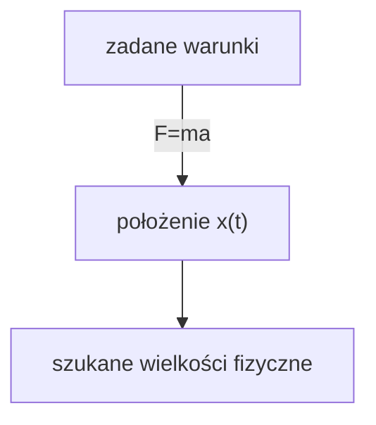
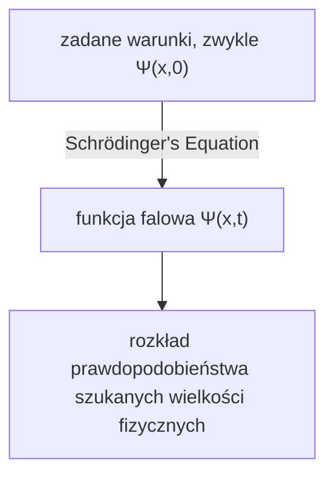

## TL;DR
> - (Zależne od czasu) równanie Schrödingera: 
>
> $$ i\hbar\frac{\partial \Psi}{\partial t} = - \frac{\hbar^2}{2m}\frac{\partial^2 \Psi}{\partial x^2} + V\Psi $$
>
> - Interpretacja statystyczna funkcji falowej $\Psi(x,t)$ (interpretacja Borna): kwadrat modułu funkcji falowej $\|\Psi(x,t)\|^2$ jest **funkcją gęstości prawdopodobieństwa** znalezienia cząstki w chwili $t$ w położeniu $x$.
> - Normalizacja funkcji falowej:
>   - $\int_{-\infty}^{\infty} \|\Psi(x,t)\|^2 dx = 1$
>   - jeśli $\Psi(x,t)$ jest rozwiązaniem równania Schrödingera, to dla dowolnej zespolonej stałej $A$ również $A\Psi(x,t)$ jest rozwiązaniem; wyznaczenie stałej $A$ tak, aby spełniony był powyższy warunek, nazywa się normalizacją (normalization)
>   - **rozwiązania nienormalizowalne (non-normalizable solutions)** nie mogą opisywać cząstki, więc nie są poprawnymi funkcjami falowymi; fizycznie dopuszczalne są tylko rozwiązania **kwadratowalalne (square-integrable)**
>   - funkcja falowa znormalizowana w pewnej chwili pozostaje znormalizowana także w późniejszym czasie, nawet jeśli $\Psi$ ulega zmianie
> - Prąd prawdopodobieństwa:
>   - $J(x,t) \equiv \cfrac{i\hbar}{2m}\left(\Psi\cfrac{\partial \Psi^\*}{\partial x}-\Psi^\*\cfrac{\partial \Psi}{\partial x}\right)$
>   - strumień (na jednostkę czasu) prawdopodobieństwa znalezienia cząstki przepływający przez punkt $x$
>   - jeśli $P_{ab}(t)$ oznacza prawdopodobieństwo znalezienia cząstki w chwili $t$ na obszarze $a<x<b$, to $\cfrac{dP_{ab}}{dt} = J(a,t) - J(b,t)$
{: .prompt-info }

## Prerequisites
- ciągłe rozkłady prawdopodobieństwa i gęstość prawdopodobieństwa

## Równanie Schrödingera (Schrödinger equation)
Rozważmy sytuację, w której cząstka o masie $m$ porusza się wzdłuż osi $x$ pod wpływem zadanej siły $F(x,t)$.

W mechanice klasycznej głównym celem jest zastosowanie równania ruchu Newtona $F=ma$ w celu wyznaczenia położenia cząstki $x(t)$ w dowolnej chwili. Proces ten można w przybliżeniu przedstawić następującym diagramem:

W mechanice kwantowej do tego samego problemu podchodzi się w zupełnie inny sposób: podejście kwantowe polega na rozwiązaniu następującego **równania Schrödingera (Schrödinger equation)** w celu znalezienia **funkcji falowej** cząstki $\Psi(x,t)$.

$$ \begin{gather*}
i\hbar\frac{\partial \Psi}{\partial t} = - \frac{\hbar^2}{2m}\frac{\partial^2 \Psi}{\partial x^2} + V\Psi. \label{eqn:schrodinger_eqn}\tag{1}\\
\text{(} i=\sqrt{-1}\text{, } \hbar=\frac{h}{2\pi}=1.054573\times10^{-34}\text{, } h\text{: stała Plancka, } V(x)\text{: energia potencjalna)}
\end{gather*} $$

> *Źródło obrazu*
> - autor: użytkownik Wikimedia Xcodexif
> - licencja: [CC BY-SA 4.0](https://creativecommons.org/licenses/by-sa/4.0/)

## Interpretacja statystyczna funkcji falowej $\Psi(x,t)$ (interpretacja Borna)
Podczas gdy cząstka w mechanice klasycznej znajduje się w jednym punkcie, w mechanice kwantowej funkcja falowa opisująca stan cząstki jest funkcją $x$ dla danego $t$, a więc jest „rozlana” w przestrzeni. Jak należy interpretować fizyczne znaczenie tego faktu?

Zgodnie z **interpretacją statystyczną** Borna (Born) kwadrat modułu funkcji falowej $\|\Psi(x,t)\|^2$ jest funkcją gęstości prawdopodobieństwa znalezienia cząstki w chwili $t$ w położeniu $x$. Sama funkcja falowa $\Psi$ jest zespolona, ale $\|\Psi\|^2=\Psi^\*\Psi$ (gdzie $\Psi^\*$ jest sprzężeniem zespolonym $\Psi$) jest nieujemną liczbą rzeczywistą, dlatego taka interpretacja ma sens. Można to zapisać następująco:

$$ \int_a^b |\Psi(x,t)|^2 dx = \text{prawdopodobieństwo znalezienia cząstki między }a\text{ i }b\text{ w chwili }t. \tag{2}$$

Taka interpretacja statystyczna oznacza, że mechanika kwantowa zawiera pewien rodzaj **niedeterminizmu (indeterminacy)**. Nawet jeśli znamy wszystko o cząstce (funkcję falową), możemy poznać jedynie rozkład prawdopodobieństwa możliwych wyników, a nie ustalić konkretnej wartości.

Było to trudne do zaakceptowania intuicyjnie, więc naturalnie pojawiło się pytanie, czy owa niedeterminizm wynika z jakiejś wady mechaniki kwantowej, czy też stanowi fundamentalną cechę natury.

## Perspektywy na kwantowy niedeterminizm (quantum indeterminacy)
Załóżmy, że mierzymy położenie pewnej cząstki i stwierdzamy, że znajduje się ona w punkcie $C$. Gdzie zatem była cząstka tuż przed pomiarem?

### Stanowisko realistyczne (realist)

> "Bóg nie gra w kości." ("God does not play dice.")  
> *by Albert Einstein*

Cząstka od początku była w punkcie $C$. Jest to również perspektywa Einsteina (Einstein) i Schrödingera (Schrödinger). Jednak w takim ujęciu cząstka w rzeczywistości miała dokładnie położenie $C$, a my — ze względu na ograniczenia teorii — przed pomiarem możemy znać jej położenie jedynie w postaci rozkładu prawdopodobieństwa; w konsekwencji mechanika kwantowa jest teorią niepełną. Innymi słowy, w tym podejściu niedeterminizm nie jest fundamentalną właściwością natury, lecz wynikiem ograniczeń mechaniki kwantowej; poza $\Psi$ muszą istnieć dodatkowe zmienne ukryte, które trzeba znać, aby w pełni opisać cząstkę.

> Schrödinger (Schrödinger) był uczniem Einsteina (Einstein) i przez pewien czas pracował u niego jako asystent; później także utrzymywał z nim kontakty. Jest bardzo prawdopodobne, że jego realistyczne i deterministyczne stanowisko również wynikało z tego wpływu.
{: .prompt-info }

### Stanowisko ortodoksyjne (orthodox)

> "Przestań mówić Bogu, co ma robić ze swoimi kośćmi." ("Stop telling God what to do with his dice.")  
> *by Niels Bohr, In answer to Einstein's earlier quote*
>
> "Obserwacje nie tylko zakłócają to, co ma być mierzone, ale też to wytwarzają" ("Observations not only disturb what is to be measured, they produce it")  
> ...  
> "Zmuszamy [układ], by przyjął określone położenie." ("We compel to assume a definite position.")  
> *by Pascual Jordan*

Do chwili pomiaru cząstka istnieje wyłącznie w postaci rozkładu prawdopodobieństwa, nie będąc „nigdzie”, a dopiero akt pomiaru sprawia, że cząstka pojawia się w jakimś konkretnym położeniu. Taką interpretację nazywa się **interpretacją kopenhaską**, zaproponowaną na Uniwersytecie Kopenhaskim głównie przez Bohra (Bohr) i Heisenberga (Heisenberg).

> Ciekawostką jest to, że podobnie jak relacja Einsteina i Schrödingera, także Heisenberg (Heisenberg) był uczniem Bohra (Bohr).
{: .prompt-info }

### Stanowisko agnostyczne (agnostic)

> "Nie należy bardziej łamać sobie głowy problemem tego, czy istnieje coś, o czym nie można niczego wiedzieć, niż dawnym pytaniem o to, ile aniołów może usiąść na czubku igły." ("One should no more rack one’s brain about the problem of whether something one cannot know anything about exists all the same, than about the ancient question of how many angels are able to sit on the point of a needle.")  
> *by Wolfgang Pauli*

Odmowa odpowiedzi. Jaki sens ma twierdzenie czegokolwiek o stanie cząstki sprzed pomiaru, skoro jedynym sposobem sprawdzenia, czy to twierdzenie jest prawdziwe, jest pomiar — który sprawia, że nie jest to już „przed pomiarem”? W istocie jest to jedynie metafizyka: dyskusja o czymś, czego nie da się ani sprawdzić, ani poznać.

### Dzisiejszy konsensus
W roku 11964 [kalendarza holoceńskiego](https://en.wikipedia.org/wiki/Holocene_calendar) John Bell (John Bell) wykazał, że istnieją obserwowalne różnice zależne od tego, czy cząstka ma dokładne położenie przed pomiarem czy nie. W efekcie stanowisko agnostyczne zostało odrzucone, a późniejsze eksperymenty sprawiły, że interpretacja kopenhaska stała się dominująca. Dlatego jeśli nie zaznaczono inaczej, mówiąc o mechanice kwantowej zazwyczaj zakłada się właśnie interpretację kopenhaską.

> Nadal istnieją jednak inne interpretacje, które mogą okazać się trafne, takie jak nielokalne teorie zmiennych ukrytych (nonlocal hidden variable theories) czy interpretacja wielu światów (many worlds interpretation).
{: .prompt-info }

## Pomiar i kolaps funkcji falowej
Cząstka nie ma dokładnego położenia przed pomiarem, a dopiero pomiar nadaje jej konkretne położenie $C$ (co omówię w innym tekście: w istocie, z powodu zasady nieoznaczoności Heisenberga, również to położenie nie jest idealnie „dokładną wartością”, lecz ma pewien niewielki zakres niepewności). Jednak zaraz po wykonaniu pierwszego pomiaru, jeśli natychmiast przeprowadzimy kolejny, nie otrzymujemy za każdym razem innej wartości, lecz koniecznie ten sam wynik. Wyjaśnia się to następująco.

W chwili pierwszego pomiaru funkcja falowa mierzonego obiektu gwałtownie się zmienia, tworząc wąski i ostry wykres $\|\Psi(x,t)\|^2$ skoncentrowany w pobliżu punktu $C$. Mówi się, że funkcja falowa **ulega kolapsowi (collapse)** do punktu $C$ na skutek pomiaru. 

Zatem procesy fizyczne można podzielić na dwa odmienne typy:
- zwykły (ordinary) proces, w którym funkcja falowa powoli zmienia się zgodnie z równaniem Schrödingera
- proces pomiaru (measurement), w którym $\Psi$ zapada się nagle i nieciągle

> Funkcja falowa, która uległa kolapsowi wskutek pomiaru, z czasem znów rozprzestrzenia się w przestrzeni zgodnie z równaniem Schrödingera. Aby więc odtworzyć ten sam wynik pomiaru, drugi pomiar trzeba wykonać natychmiast.
{: .prompt-tip }

## Normalizacja funkcji falowej (Normalization)
Ponieważ kwadrat modułu funkcji falowej $\|\Psi(x,t)\|^2$ jest gęstością prawdopodobieństwa znalezienia cząstki w chwili $t$ w położeniu $x$, całka z $\|\Psi\|^2$ po wszystkich $x$ musi być równa 1.

$$ \int_{-\infty}^{\infty} |\Psi(x,t)|^2 dx = 1. \label{eqn:wavefunction_norm}\tag{3} $$

Z równania ($\ref{eqn:schrodinger_eqn}$) wynika, że jeśli $\Psi(x,t)$ jest rozwiązaniem, to dla dowolnej zespolonej stałej $A$ również $A\Psi(x,t)$ jest rozwiązaniem. Zatem należy wyznaczyć $A$ tak, aby spełnione było ($\ref{eqn:wavefunction_norm}$); proces ten nazywa się normalizacją (normalization). Niektóre rozwiązania równania Schrödingera po scałkowaniu rozbiegają się do nieskończoności, więc w takim przypadku nie istnieje stała $A$ spełniająca ($\ref{eqn:wavefunction_norm}$). Dotyczy to także rozwiązania trywialnego (trivial solution) $\Psi=0$. Takie **rozwiązania nienormalizowalne (non-normalizable solutions)** nie mogą opisywać cząstki, więc nie są poprawnymi funkcjami falowymi. Fizycznie możliwe stany odpowiadają **rozwiązaniom kwadratowalalnym (square-integrable)** równania Schrödingera.

Ważną własnością równania Schrödingera jest również to, że <u>funkcja falowa znormalizowana w pewnej chwili pozostaje znormalizowana w każdej innej chwili (tj. $\int_{-\infty}^{\infty} |\Psi(x,t)|^2 dx = 1$), nawet jeśli $\Psi$ zmienia się w czasie</u>. Gdyby trzeba było normalizować funkcję falową w każdej chwili inną wartością $A$, to $A$ byłaby funkcją czasu $t$, a wtedy nie dałoby się już mówić o rozwiązywaniu równania Schrödingera ze stałą $A$. Dzięki tej własności wartość $A$ znormalizowana w warunku początkowym ($t=0$) pozostaje zachowana niezależnie od czasu $t$.

### Dowód

$$ \frac{d}{dt}\int_{-\infty}^{\infty} |\Psi(x,t)|^2 dx = \int_{-\infty}^{\infty} \frac{\partial}{\partial t}|\Psi(x,t)|^2 dx. \label{eqn:norm_proof_1}\tag{4} $$

> Wynik całkowania $\|\Psi\|^2$ po $x$ jest funkcją tylko $t$, więc po lewej stronie używamy pochodnej całkowitej ($d/dt$); natomiast samo $\|\Psi\|^2$ jest funkcją dwóch zmiennych $x$ i $t$, więc po prawej stronie używamy pochodnej cząstkowej ($\partial/\partial t$).
{: .prompt-tip }

Zgodnie z regułą różniczkowania iloczynu możemy przekształcić to równanie następująco:

$$ \frac{\partial}{\partial t}|\Psi|^2 = \frac{\partial}{\partial t}(\Psi^*\Psi) = \Psi^*\frac{\partial \Psi}{\partial t} + \frac{\partial \Psi^*}{\partial t}\Psi. \label{eqn:norm_proof_2}\tag{5}$$

Jeśli obie strony równania Schrödingera ($\ref{eqn:schrodinger_eqn}$) pomnożymy przez $-\cfrac{i}{\hbar}$, to otrzymujemy

$$ \frac{\partial \Psi}{\partial t} = \frac{i\hbar}{2m}\frac{\partial^2 \Psi}{\partial x^2}-\frac{i}{\hbar}V\Psi \label{eqn:norm_proof_3}\tag{6}$$

a biorąc sprzężenie zespolone obu stron powyższego równania, dostajemy

$$ \frac{\partial \Psi^*}{\partial t} = -\frac{i\hbar}{2m}\frac{\partial^2 \Psi^*}{\partial x^2}+\frac{i}{\hbar}V\Psi^* \label{eqn:norm_proof_4}\tag{7}$$

Teraz podstawiając ($\ref{eqn:norm_proof_3}$) i ($\ref{eqn:norm_proof_4}$) do ($\ref{eqn:norm_proof_2}$), otrzymujemy

$$\begin{align*}
\frac{\partial}{\partial t}|\Psi|^2 &= \frac{i\hbar}{2m}\left(\Psi^*\frac{\partial^2\Psi}{\partial x^2}-\frac{\partial^2\Psi^*}{\partial x^2}\Psi\right) \\
&= \frac{\partial}{\partial x}\left[\frac{i\hbar}{2m}\left(\Psi^*\frac{\partial\Psi}{\partial x}-\frac{\partial\Psi^*}{\partial x}\Psi \right) \right] 
\end{align*} \label{eqn:norm_proof_5}\tag{8}$$

a po podstawieniu tego do prawej strony początkowego równania ($\ref{eqn:norm_proof_1}$) dostajemy

$$ \frac{d}{dt}\int_{-\infty}^{\infty} |\Psi(x,t)|^2 dx = \frac{i\hbar}{2m}\left(\Psi^*\frac{\partial\Psi}{\partial x}-\frac{\partial\Psi^*}{\partial x}\Psi \right)\Bigg|_{-\infty}^{\infty}. \label{eqn:norm_proof_6}\tag{9} $$

Aby jednak funkcja falowa była znormalizowana i fizycznie poprawna, przy $x\to\pm\infty$ musi zachodzić $\Psi(x,t)\to 0$. Zatem

$$ \frac{d}{dt}\int_{-\infty}^{\infty} |\Psi(x,t)|^2 dx = 0 \label{eqn:norm_proof_fin}\tag{10} $$

czyli $\int_{-\infty}^{\infty} \|\Psi(x,t)\|^2 dx$ jest stałą niezależną od czasu.

$$ \therefore \Psi \text{ jest znormalizowana w pewnej chwili }t\text{ wtedy i tylko wtedy, gdy jest znormalizowana w każdej innej chwili }t. } \blacksquare $$

## Prąd prawdopodobieństwa (probability current)
Tym razem niech $P_{ab}(t)$ oznacza prawdopodobieństwo znalezienia cząstki w chwili $t$ na obszarze $a<x<b$. Wówczas

$$ P_{ab}(t) = \int_a^b |\Psi(x,t)|^2 dx \tag{11}$$

oraz

$$ \begin{align*}
\frac{dP_{ab}}{dt} &= \frac{d}{dt}\int_a^b |\Psi(x,t)|^2 dx \\
&= \int_a^b \frac{\partial}{\partial t}|\Psi(x,t)|^2 dx \quad \text{(}\because\text{por. wzór }\ref{eqn:norm_proof_1}\text{)}\\
&= \int_a^b \left(\frac{\partial \Psi^*}{\partial t}\Psi + \Psi^*\frac{\partial \Psi}{\partial t} \right)dx \quad \text{(}\because\text{por. wzór }\ref{eqn:norm_proof_2}\text{)} \\
&= \frac{i\hbar}{2m}\int_a^b \left(\Psi^*\frac{\partial^2\Psi}{\partial x^2}-\frac{\partial^2\Psi^*}{\partial x^2}\Psi\right)dx \\
&= \frac{i\hbar}{2m}\int_a^b\frac{\partial}{\partial x}\left(\Psi^*\frac{\partial\Psi}{\partial x}-\frac{\partial\Psi^*}{\partial x}\Psi \right)dx \quad \text{(}\because\text{por. wzory }\ref{eqn:norm_proof_3},\ref{eqn:norm_proof_4},\ref{eqn:norm_proof_5}\text{)}\\
&= \frac{i\hbar}{2m}\left(\Psi^*\frac{\partial \Psi}{\partial x}-\frac{\partial \Psi^*}{\partial x}\Psi \right)\Bigg|^b_a \\
&= \frac{i\hbar}{2m}\left(\Psi\frac{\partial \Psi^*}{\partial x}-\Psi^*\frac{\partial \Psi}{\partial x} \right)\Bigg|^a_b
\end{align*} $$

Stąd, definiując

$$ J(x,t) \equiv \frac{i\hbar}{2m}\left(\Psi\frac{\partial \Psi^*}{\partial x}-\Psi^*\frac{\partial \Psi}{\partial x}\right) \label{eqn:probability_current}\tag{12}$$

otrzymujemy

$$ \frac{dP_{ab}}{dt} = J(a,t) - J(b,t) \label{eqn:probability_over_time}\tag{13}$$

Wielkość $J(x,t)$ zdefiniowaną jak w ($\ref{eqn:probability_current}$) nazywa się **prądem prawdopodobieństwa (probability current)**; oznacza ona strumień\* (tj. prawdopodobieństwo na jednostkę czasu) prawdopodobieństwa znalezienia cząstki przepływający przez punkt $x$. We wzorze ($\ref{eqn:probability_over_time}$), jeśli w chwili $t$ prąd prawdopodobieństwa wpływający jednym końcem $J(a,t)$ jest większy niż prąd wypływający drugim końcem $J(b,t)$, to $P_{ab}$ rośnie; w przeciwnym przypadku maleje.

> \*Można to rozumieć tak, jakby w hydrodynamicznym natężeniu przepływu (flow rate) masa lub objętość płynu została tutaj zastąpiona prawdopodobieństwem.
{: .prompt-info }
