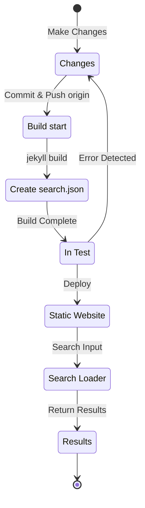

## Przegląd
Na początku lipca 12024, na tym blogu opartym o Jekyll i hostowanym przez GitHub Pages zastosowałem wtyczkę [Polyglot](https://github.com/untra/polyglot), aby dodać obsługę wielu języków.
Ta seria dzieli się bugami, które wystąpiły podczas stosowania Polyglot w motywie Chirpy, procesem ich naprawy oraz sposobem przygotowania nagłówka HTML i `sitemap.xml`{: .filepath} z uwzględnieniem SEO.
Seria składa się z 3 wpisów; czytany teraz tekst to trzecia część.
- Część 1: [Zastosowanie wtyczki Polyglot & modyfikacje nagłówka html oraz sitemap](/posts/how-to-support-multi-language-on-jekyll-blog-with-polyglot-1)
- Część 2: [Implementacja przycisku wyboru języka & lokalizacja języka layoutu](/posts/how-to-support-multi-language-on-jekyll-blog-with-polyglot-2)
- Część 3: Troubleshooting błędu budowania motywu Chirpy oraz błędów funkcji wyszukiwania (ten wpis)

> Pierwotnie seria miała składać się z 2 części, jednak po późniejszych uzupełnieniach objętość znacznie wzrosła, więc przebudowałem ją do 3 części.
{: .prompt-info }

## Wymagania
- [x] Zbudowany wynik (strony WWW) musi dać się serwować z rozdzieleniem na ścieżki per język (np. `/posts/ko/`{: .filepath}, `/posts/ja/`{: .filepath}).
- [x] Aby możliwie zminimalizować dodatkowy czas i wysiłek związany z wielojęzycznością, podczas budowania język powinien być rozpoznawany automatycznie na podstawie lokalnej ścieżki pliku (np. `/_posts/ko/`{: .filepath}, `/_posts/ja/`{: .filepath}), bez ręcznego ustawiania tagów `lang` i `permalink` w YAML front matter każdego pliku źródłowego.
- [x] Nagłówek każdej strony powinien zawierać właściwy meta tag Content-Language, alternatywne tagi `hreflang` oraz link canonical, spełniając wytyczne Google SEO dla wyszukiwania wielojęzycznego.
- [x] Linki do stron dla każdej wersji językowej muszą być bez braków dostarczane przez `sitemap.xml`{: .filepath}, a sam `sitemap.xml`{: .filepath} ma istnieć tylko raz, w katalogu głównym (bez duplikatów).
- [x] Wszystkie funkcje dostarczane przez [motyw Chirpy](https://github.com/cotes2020/jekyll-theme-chirpy) muszą działać poprawnie na stronach w każdym języku; a jeśli nie, trzeba je poprawić, aby działały.
  - [x] Poprawne działanie funkcji „Recently Updated” i „Trending Tags”
  - [x] Brak błędów podczas procesu build w GitHub Actions
  - [x] Poprawne działanie wyszukiwarki postów w prawym górnym rogu bloga

## Zanim zaczniesz
Ten wpis jest kontynuacją [części 1](/posts/how-to-support-multi-language-on-jekyll-blog-with-polyglot-1) i [części 2](/posts/how-to-support-multi-language-on-jekyll-blog-with-polyglot-2), więc jeśli jeszcze ich nie czytałeś(-aś), polecam najpierw nadrobić poprzednie.

## Troubleshooting ('relative_url_regex': target of repeat operator is not specified)

(+ aktualizacja 12025.10.08.) [Ten błąd został naprawiony w Polyglot 1.11](https://polyglot.untra.io/2025/09/20/polyglot.1.11.0/).

Po przejściu poprzednich kroków uruchomiłem testowy build poleceniem `bundle exec jekyll serve`, ale build zakończył się niepowodzeniem z błędem: `'relative_url_regex': target of repeat operator is not specified`.

```shell
...(pominięto)
                    ------------------------------------------------
      Jekyll 4.3.4   Please append `--trace` to the `serve` command 
                     for any additional information or backtrace. 
                    ------------------------------------------------
/Users/yunseo/.gem/ruby/3.2.2/gems/jekyll-polyglot-1.8.1/lib/jekyll/polyglot/
patches/jekyll/site.rb:234:in `relative_url_regex': target of repeat operator 
is not specified: /href="?\/((?:(?!*.gem)(?!*.gemspec)(?!tools)(?!README.md)(
?!LICENSE)(?!*.config.js)(?!rollup.config.js)(?!package*.json)(?!.sass-cache)
(?!.jekyll-cache)(?!gemfiles)(?!Gemfile)(?!Gemfile.lock)(?!node_modules)(?!ve
ndor\/bundle\/)(?!vendor\/cache\/)(?!vendor\/gems\/)(?!vendor\/ruby\/)(?!en\/
)(?!ko\/)(?!es\/)(?!pt-BR\/)(?!ja\/)(?!fr\/)(?!de\/)[^,'"\s\/?.]+\.?)*(?:\/[^
\]\[)("'\s]*)?)"/ (RegexpError)

...(pominięto)
```

Sprawdziłem, czy ktoś zgłaszał podobny problem — i okazało się, że w repozytorium Polyglot istnieje już [dokładnie to samo zgłoszenie](https://github.com/untra/polyglot/issues/204) oraz jest też rozwiązanie.

W pliku `_config.yml`{: .filepath} używanego na tym blogu [motywu Chirpy](https://github.com/cotes2020/jekyll-theme-chirpy/blob/master/_config.yml) znajduje się m.in. taki fragment:

```yml
exclude:
  - "*.gem"
  - "*.gemspec"
  - docs
  - tools
  - README.md
  - LICENSE
  - "*.config.js"
  - package*.json
```
{: file='\_config.yml'}

Źródło problemu polega na tym, że wyrażenia regularne w dwóch funkcjach w pliku [Polyglot `site.rb`{: .filepath}](https://github.com/untra/polyglot/blob/master/lib/jekyll/polyglot/patches/jekyll/site.rb) nie potrafią poprawnie przetworzyć wzorców globbing zawierających wildcardy, takich jak `"*.gem"`, `"*.gemspec"`, `"*.config.js"`.


```ruby
    # a regex that matches relative urls in a html document
    # matches href="baseurl/foo/bar-baz" href="/foo/bar-baz" and others like it
    # avoids matching excluded files.  prepare makes sure
    # that all @exclude dirs have a trailing slash.
    def relative_url_regex(disabled = false)
      regex = ''
      unless disabled
        @exclude.each do |x|
          regex += "(?!#{x})"
        end
        @languages.each do |x|
          regex += "(?!#{x}\/)"
        end
      end
      start = disabled ? 'ferh' : 'href'
      %r{#{start}="?#{@baseurl}/((?:#{regex}[^,'"\s/?.]+\.?)*(?:/[^\]\[)("'\s]*)?)"}
    end

    # a regex that matches absolute urls in a html document
    # matches href="http://baseurl/foo/bar-baz" and others like it
    # avoids matching excluded files.  prepare makes sure
    # that all @exclude dirs have a trailing slash.
    def absolute_url_regex(url, disabled = false)
      regex = ''
      unless disabled
        @exclude.each do |x|
          regex += "(?!#{x})"
        end
        @languages.each do |x|
          regex += "(?!#{x}\/)"
        end
      end
      start = disabled ? 'ferh' : 'href'
      %r{(?<!hreflang="#{@default_lang}" )#{start}="?#{url}#{@baseurl}/((?:#{regex}[^,'"\s/?.]+\.?)*(?:/[^\]\[)("'\s]*)?)"}
    end
```
{: file='(polyglot root path)/lib/jekyll/polyglot/patches/jekyll/site.rb'}


Są dwa sposoby rozwiązania tego problemu.

### 1. Sfrokować Polyglot i poprawić problematyczny fragment
W momencie pisania tego tekstu (12024.11.) [oficjalna dokumentacja Jekyll](https://jekyllrb.com/docs/configuration/options/#global-configuration) jasno mówi, że konfiguracja `exclude` wspiera wzorce globbing.

> "This configuration option supports Ruby's File.fnmatch filename globbing patterns to match multiple entries to exclude."

To znaczy, że winny nie jest motyw Chirpy, tylko funkcje `relative_url_regex()` oraz `absolute_url_regex()` w Polyglot — więc fundamentalnym rozwiązaniem jest poprawienie ich tak, by nie generowały błędów.

~~W Polyglot ten bug nie był jeszcze naprawiony,~~ ale jak wspomniałem wyżej, [od Polyglot 1.11 problem jest rozwiązany](https://polyglot.untra.io/2025/09/20/polyglot.1.11.0/). Gdy problem występował, rozwiązanie polegało na skorzystaniu z ~~[tego wpisu](https://hionpu.com/posts/github_blog_4#4-polyglot-%EC%9D%98%EC%A1%B4%EC%84%B1-%EB%AC%B8%EC%A0%9C)(strona już nie istnieje) oraz~~ [odpowiedzi w powyższym zgłoszeniu GitHub](https://github.com/untra/polyglot/issues/204#issuecomment-2143270322): należało sforkować repozytorium Polyglot i zmienić problematyczny fragment tak, jak poniżej, a następnie używać tej wersji zamiast upstreamowego Polyglot.


```ruby
    def relative_url_regex(disabled = false)
      regex = ''
      unless disabled
        @exclude.each do |x|
          escaped_x = Regexp.escape(x)
          regex += "(?!#{escaped_x})"
        end
        @languages.each do |x|
          escaped_x = Regexp.escape(x)
          regex += "(?!#{escaped_x}\/)"
        end
      end
      start = disabled ? 'ferh' : 'href'
      %r{#{start}="?#{@baseurl}/((?:#{regex}[^,'"\s/?.]+\.?)*(?:/[^\]\[)("'\s]*)?)"}
    end

    def absolute_url_regex(url, disabled = false)
      regex = ''
      unless disabled
        @exclude.each do |x|
          escaped_x = Regexp.escape(x)
          regex += "(?!#{escaped_x})"
        end
        @languages.each do |x|
          escaped_x = Regexp.escape(x)
          regex += "(?!#{escaped_x}\/)"
        end
      end
      start = disabled ? 'ferh' : 'href'
      %r{(?<!hreflang="#{@default_lang}" )#{start}="?#{url}#{@baseurl}/((?:#{regex}[^,'"\s/?.]+\.?)*(?:/[^\]\[)("'\s]*)?)"}
    end
```
{: file='(polyglot root path)/lib/jekyll/polyglot/patches/jekyll/site.rb'}


### 2. W pliku konfiguracyjnym '\_config.yml' motywu Chirpy zastąpić wzorce globbing konkretnymi nazwami plików
W praktyce najbardziej eleganckie i „kanoniczne” podejście to włączenie powyższej poprawki do głównego Polyglot. Jednak zanim to nastąpi, trzeba używać wersji sforkowanej — a wtedy za każdym razem, gdy upstream Polyglot podnosi wersję, robi się kłopotliwe śledzenie i wciąganie zmian, żeby niczego nie przegapić. Dlatego zastosowałem inną metodę.

Jeśli sprawdzić pliki w katalogu głównym repozytorium [motywu Chirpy](https://github.com/cotes2020/jekyll-theme-chirpy), to wzorcom `"*.gem"`, `"*.gemspec"`, `"*.config.js"` odpowiadają i tak tylko te 3 pliki:
- `jekyll-theme-chirpy.gemspec`{: .filepath}
- `purgecss.config.js`{: .filepath}
- `rollup.config.js`{: .filepath}

Wystarczy więc usunąć wzorce globbing z sekcji `exclude` w `_config.yml`{: .filepath} i przepisać to tak jak poniżej — wtedy Polyglot jest w stanie to przetworzyć bez błędów.

```yml
exclude: # Zmodyfikowane w oparciu o issue https://github.com/untra/polyglot/issues/204
  # - "*.gem"
  - jekyll-theme-chirpy.gemspec # - "*.gemspec"
  - tools
  - README.md
  - LICENSE
  - purgecss.config.js # - "*.config.js"
  - rollup.config.js
  - package*.json
```
{: file='\_config.yml'}

## Poprawka funkcji wyszukiwania
Po wykonaniu powyższych kroków niemal wszystkie funkcje witryny działały satysfakcjonująco i zgodnie z zamierzeniem. Jednak później odkryłem problem: pasek wyszukiwania w prawym górnym rogu stron z motywem Chirpy nie indeksował stron w językach innych niż `site.default_lang` (w moim przypadku angielski). Co więcej, nawet jeśli wyszukiwać na stronach w innym języku, wyniki zwracały linki do stron angielskich.

Aby zrozumieć przyczynę, zobaczmy, które pliki biorą udział w wyszukiwaniu i gdzie powstaje problem.

### '\_layouts/default.html'
Gdy zajrzeć do pliku [`_layouts/default.html`{: .filepath}](https://github.com/cotes2020/jekyll-theme-chirpy/blob/master/_layouts/default.html), który buduje szkielet wszystkich stron bloga, widać, że wewnątrz elementu `<body>` ładowane są treści `search-results.html`{: .filepath} oraz `search-loader.html`{: .filepath}.


```liquid
  <body>
    

    <div id="main-wrapper" class="d-flex justify-content-center">
      <div class="container d-flex flex-column px-xxl-5">
        
        (...pominięto...)

        
      </div>

      <aside aria-label="Scroll to Top">
        <button id="back-to-top" type="button" class="btn btn-lg btn-box-shadow">
          <i class="fas fa-angle-up"></i>
        </button>
      </aside>
    </div>

    (...pominięto...)

    
  </body>
```
{: file='\_layouts/default.html'}


### '\_includes/search-result.html'
Plik [`_includes/search-result.html`{: .filepath}](https://github.com/cotes2020/jekyll-theme-chirpy/blob/master/_includes/search-results.html) konfiguruje kontener `search-results`, w którym przechowywane są wyniki wyszukiwania dla wpisanego słowa kluczowego.


```html
<!-- The Search results -->

<div id="search-result-wrapper" class="d-flex justify-content-center d-none">
  <div class="col-11 content">
    <div id="search-hints">
      
    </div>
    <div id="search-results" class="d-flex flex-wrap justify-content-center text-muted mt-3"></div>
  </div>
</div>
```
{: file='\_includes/search-result.html'}


### '\_includes/search-loader.html'
Plik [`_includes/search-loader.html`{: .filepath}](https://github.com/cotes2020/jekyll-theme-chirpy/blob/master/_includes/search-loader.html) to kluczowa część implementacji wyszukiwania opartej o bibliotekę [Simple-Jekyll-Search](https://github.com/christian-fei/Simple-Jekyll-Search). Widać tu, że JavaScript po stronie przeglądarki (Client-Side) przeszukuje plik indeksu `search.json`{: .filepath} (poniżej w sekcji [ `/assets/js/data/search.json`{: .filepath}](#assetsjsdatasearchjson)) i zwraca dopasowane posty jako elementy `<article>`.


```js

  <article class="px-1 px-sm-2 px-lg-4 px-xl-0">
    <header>
      <h2><a href="{url}">{title}</a></h2>
      <div class="post-meta d-flex flex-column flex-sm-row text-muted mt-1 mb-1">
        {categories}
        {tags}
      </div>
    </header>
    <p>{snippet}</p>
  </article>


<p class="mt-5">{{ site.data.locales[include.lang].search.no_results }}</p>

<script>
   Note: dependent library will be loaded in `js-selector.html` 
  document.addEventListener('DOMContentLoaded', () => {
    SimpleJekyllSearch({
      searchInput: document.getElementById('search-input'),
      resultsContainer: document.getElementById('search-results'),
      json: '{{ '/assets/js/data/search.json' | relative_url }}',
      searchResultTemplate: '{{ result_elem | strip_newlines }}',
      noResultsText: '{{ not_found }}',
      templateMiddleware: function(prop, value, template) {
        if (prop === 'categories') {
          if (value === '') {
            return `${value}`;
          } else {
            return `<div class="me-sm-4"><i class="far fa-folder fa-fw"></i>${value}</div>`;
          }
        }

        if (prop === 'tags') {
          if (value === '') {
            return `${value}`;
          } else {
            return `<div><i class="fa fa-tag fa-fw"></i>${value}</div>`;
          }
        }
      }
    });
  });
</script>
```
{: file='\_includes/search-loader.html'}


### '/assets/js/data/search.json'

```liquid
---
layout: compress
swcache: true
---

[
  
  {
    "title": {{ post.title | jsonify }},
    "url": {{ post.url | relative_url | jsonify }},
    "categories": {{ post.categories | join: ', ' | jsonify }},
    "tags": {{ post.tags | join: ', ' | jsonify }},
    "date": "{{ post.date }}",
    
    
    "snippet": {{ _content | truncate: 200 | jsonify }},
    "content": {{ _content | jsonify }}
  },
  
]
```
{: file='/assets/js/data/search.json'}


To plik JSON tworzony z użyciem składni Liquid Jekyll, definiujący: tytuł, URL, kategorie i tagi, datę, pierwsze 200 znaków jako snippet oraz pełną treść dla wszystkich postów w serwisie.

### Jak działa wyszukiwanie i gdzie powstaje problem
Podsumowując: przy hostowaniu motywu Chirpy na GitHub Pages wyszukiwanie działa w takim procesie.



W tym miejscu potwierdziłem, że `search.json`{: .filepath} jest generowany przez Polyglot osobno dla każdego języka, np.:
- `/assets/js/data/search.json`{: .filepath}
- `/ko/assets/js/data/search.json`{: .filepath}
- `/ja/assets/js/data/search.json`{: .filepath}
- `/zh-TW/assets/js/data/search.json`{: .filepath}
- `/es/assets/js/data/search.json`{: .filepath}
- `/pt-BR/assets/js/data/search.json`{: .filepath}
- `/fr/assets/js/data/search.json`{: .filepath}
- `/de/assets/js/data/search.json`{: .filepath}

Zatem winny jest element „Search Loader”. Problem polega na tym, że `_includes/search-loader.html`{: .filepath} statycznie ładuje wyłącznie angielski plik indeksu (`/assets/js/data/search.json`{: .filepath}), niezależnie od języka aktualnie oglądanej strony — przez co strony w innych językach nie są przeszukiwane.

> - Natomiast w przypadku plików JSON (w odróżnieniu od Markdown/HTML) wrapper Polyglot dla zmiennych Jekyll takich jak `post.title`, `post.content` działa, ale wygląda na to, że funkcja [Relativized Local Urls](https://github.com/untra/polyglot?tab=readme-ov-file#relativized-local-urls) nie działa.
> - Podobnie, w testach potwierdziłem, że w szablonie JSON nie da się odwołać do tagów Liquid dostarczanych przez Polyglot ponad standardowe zmienne Jekyll: [`{{ site.default_lang }}`, `{{ site.active_lang }}`](https://github.com/untra/polyglot?tab=readme-ov-file#features).
>
> W efekcie wartości `title`, `snippet`, `content` są generowane inaczej per język, ale `url` zwraca bazową ścieżkę bez uwzględnienia języka — i trzeba to odpowiednio obsłużyć w „Search Loader”.
{: .prompt-warning }

### Rozwiązanie
Aby to naprawić, wystarczy zmienić `_includes/search-loader.html`{: .filepath} tak jak poniżej.


```

  <article class="px-1 px-sm-2 px-lg-4 px-xl-0">
    <header>
      
      <h2><a href="/{{ site.active_lang }}{url}">{title}</a></h2>
      
      <h2><a href="{url}">{title}</a></h2>
      

(...pominięto...)

<script>
   Note: dependent library will be loaded in `js-selector.html` 
  document.addEventListener('DOMContentLoaded', () => {
    
    
      
    
    
    SimpleJekyllSearch({
      searchInput: document.getElementById('search-input'),
      resultsContainer: document.getElementById('search-results'),
      json: '{{ search_path | relative_url }}',
      searchResultTemplate: '{{ result_elem | strip_newlines }}',

(...pominięto)
```
{: file='\_includes/search-loader.html'}


- Jeśli `site.active_lang` (język bieżącej strony) różni się od `site.default_lang` (domyślny język witryny), zmodyfikowałem część Liquid w ````, aby do URL posta wczytanego z JSON doklejać prefix ``"/{{ site.active_lang }}"``.
- Analogicznie, w części `<script>` build porównuje język bieżącej strony z domyślnym językiem witryny: jeśli są równe, używany jest domyślny indeks (`/assets/js/data/search.json`{: .filepath}); jeśli nie — ustawiany jest `search_path` na ścieżkę dla danego języka (np. `/ko/assets/js/data/search.json`{: .filepath}).

Po tej zmianie i ponownym zbudowaniu witryny potwierdziłem, że wyniki wyszukiwania wyświetlają się poprawnie dla każdego języka.

> `{url}` nie jest poprawnym URL na etapie builda — to miejsce, w które JS podczas wyszukiwania wstawi URL odczytany z pliku JSON. Polyglot nie traktuje tego więc jako obiektu do lokalizacji, dlatego trzeba to obsłużyć ręcznie. Problem w tym, że szablon ``"/{{ site.active_lang }}{url}"`` na etapie builda jest rozpoznawany jako względny URL; mimo że lokalizacja została już wykonana, Polyglot o tym „nie wie” i próbuje wykonać lokalizację ponownie (np. `"/ko/ko/posts/example-post"`{: .filepath}). Żeby temu zapobiec, jawnie użyłem taga [``](https://github.com/untra/polyglot?tab=readme-ov-file#disabling-url-relativizing).
{: .prompt-tip }
