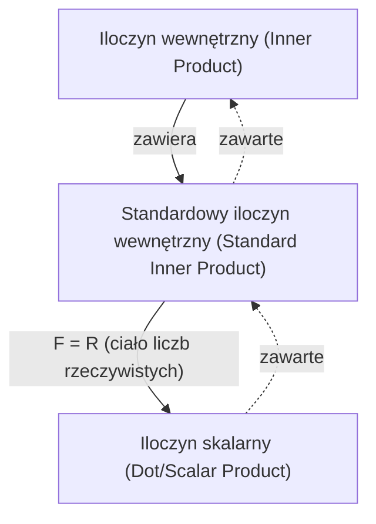

## Wymagania wstępne
- [Wektory i kombinacje liniowe](/posts/vectors-and-linear-combinations/)

## Iloczyn wewnętrzny

Definicja **iloczynu wewnętrznego (inner product)** w ogólnej $F$-przestrzeni wektorowej jest następująca.

> **Definicja iloczynu wewnętrznego (inner product) i przestrzeni z iloczynem wewnętrznym (inner product space)**  
> Rozważmy $F$-przestrzeń wektorową $\mathbb{V}$. **Iloczyn wewnętrzny (inner product)** $\langle \mathbf{x},\mathbf{y} \rangle$ na $\mathbb{V}$ definiuje się jako funkcję, która każdej uporządkowanej parze dowolnych wektorów $\mathbf{x}$ i $\mathbf{y}$ z $\mathbb{V}$ przyporządkowuje skalar należący do $F$ i spełnia następujące warunki.
>
> Dla dowolnych $\mathbf{x},\mathbf{y},\mathbf{z} \in \mathbb{V}$ oraz dowolnego $c \in F$ zachodzi:
> 1. $\langle \mathbf{x}+\mathbf{z}, \mathbf{y} \rangle = \langle \mathbf{x}, \mathbf{y} \rangle + \langle \mathbf{z}, \mathbf{y} \rangle$
> 2. $\langle c\mathbf{x}, \mathbf{y} \rangle = c \langle \mathbf{x}, \mathbf{y} \rangle$
> 3. $\overline{\langle \mathbf{x}, \mathbf{y} \rangle} = \langle \mathbf{y}, \mathbf{x} \rangle$ ($\overline{\mathbf{z}}$ to sprzężenie zespolone liczby $\mathbf{z}$)
> 4. Gdy $\mathbf{x} \neq \mathbf{0}$, to $\langle \mathbf{x}, \mathbf{x} \rangle$ jest dodatnie.
>
> $F$-przestrzeń wektorową $\mathbb{V}$ wyposażoną w iloczyn wewnętrzny nazywa się **przestrzenią z iloczynem wewnętrznym (inner product space)**. W szczególności, gdy $F=\mathbb{C}$, mówimy o **zespolonej przestrzeni z iloczynem wewnętrznym (complex inner product space)**, a gdy $F=\mathbb{R}$ — o **rzeczywistej przestrzeni z iloczynem wewnętrznym (real inner product space)**.
{: .prompt-info }

W szczególności poniższy iloczyn wewnętrzny nazywa się **standardowym iloczynem wewnętrznym (standard inner product)**. Można sprawdzić, że spełnia on wszystkie cztery warunki z powyższej definicji.

> **Definicja standardowego iloczynu wewnętrznego (standard inner product)**  
> Dla dwóch wektorów $\mathbf{x}=(a_1, a_2, \dots, a_n)$ oraz $\mathbf{y}=(b_1, b_2, \dots, b_n)$ w $F^n$ definiujemy **standardowy iloczyn wewnętrzny (standard inner product)** na $F^n$ następująco:
>
> $$\langle \mathbf{x}, \mathbf{y} \rangle = \sum_{i=1}^n a_i \overline{b_i} $$
>
{: .prompt-info }

Gdy $F=\mathbb{R}$, sprzężenie zespolone liczby rzeczywistej jest równe jej samej, więc standardowy iloczyn wewnętrzny ma wówczas postać $\sum_{i=1}^n a_i b_i$. W tym szczególnym przypadku standardowy iloczyn wewnętrzny zapisuje się często nie jako $\langle \mathbf{x}, \mathbf{y} \rangle$, lecz jako $\mathbf{x} \cdot \mathbf{y}$, i nazywa **iloczynem skalarnym (dot product)** lub **iloczynem skalarnym (scalar product)**.

> **Definicja iloczynu skalarnego (dot product)/iloczynu skalarnego (scalar product)**  
> Dla $\mathbf{v}=(v_1, v_2, \dots, v_n)$ oraz $\mathbf{w}=(w_1, w_2, \dots, w_n)$ w $\mathbb{R}^n$ definiujemy **iloczyn skalarny (dot product)** lub **iloczyn skalarny (scalar product)** na $\mathbb{R}^n$ następująco:
>
> $$ \mathbf{v} \cdot \mathbf{w} = \sum_{i=1}^n v_i w_i = v_1 w_1 + v_2 w_2 + \cdots + v_n w_n $$
> 
{: .prompt-info }

> Wspomniany tu „iloczyn skalarny (**scalar product**)” jest działaniem między wektorami i jest czymś innym niż „mnożenie skalarne (**scalar multiplication**)” (działanie skalar–wektor) omawiane w [Wektory i kombinacje liniowe](/posts/vectors-and-linear-combinations/). Ponieważ angielskie nazwy są do siebie dość podobne, a do tego [w standardzie tłumaczeń przyjętym przez Koreańskie Towarzystwo Matematyczne oba terminy są w języku koreańskim identyczne](https://www.kms.or.kr/mathdict/list.html?key=kname&keyword=%EC%8A%A4%EC%B9%BC%EB%9D%BC%EA%B3%B1), trzeba uważać, by ich nie pomylić.
>
> Aby uniknąć nieporozumień, dalej będę możliwie konsekwentnie używać określenia **iloczyn skalarny (dot product)**.
{: .prompt-warning }

> Ponieważ w przestrzeni euklidesowej iloczyn wewnętrzny (inner product) jest tym samym co iloczyn skalarny (dot product), często — jeśli z kontekstu nie wynika ryzyko pomyłki — iloczyn skalarny nazywa się po prostu iloczynem wewnętrznym. Ściśle rzecz biorąc, iloczyn wewnętrzny jest jednak pojęciem bardziej ogólnym, obejmującym iloczyn skalarny jako szczególny przypadek.
{: .prompt-tip }

## Długość/norma wektora

Dla wektora $\mathbf{v}=(v_1, v_2, \dots, v_n)$ w $\mathbb{R}^n$ długość euklidesową wektora $\mathbf{v}$ definiuje się za pomocą iloczynu skalarnego następująco:

$$ \| \mathbf{v} \| = \sqrt{\mathbf{v} \cdot \mathbf{v}} = \left[ \sum_{i=1}^n |v_i|^2 \right]^{1/2} = \sqrt{v_1^2 + v_2^2 + \cdots + v_n^2} $$

Bardziej ogólnie, w dowolnej przestrzeni z iloczynem wewnętrznym **długość (length)** lub **normę (norm)** wektora definiuje się następująco:

$$ \| \mathbf{x} \| = \sqrt{\langle \mathbf{x}, \mathbf{x} \rangle} $$

W ogólnej przestrzeni z iloczynem wewnętrznym dla normy wektora zachodzą następujące ważne własności.

> **Twierdzenie**  
> Dla $F$-przestrzeni z iloczynem wewnętrznym $\mathbb{V}$, dowolnych wektorów $\mathbf{x}, \mathbf{y} \in \mathbb{V}$ oraz skalaru $c \in F$ zachodzi:
> 1. $\\|c\mathbf{x}\\| = \|c\| \cdot \\|\mathbf{x}\\|$
> 2. Zachodzą dwa fakty:
>    - $\\|\mathbf{x}\\| = 0 \iff \mathbf{x}=\mathbf{0}$
>    - $\\|\mathbf{x}\\| \geq 0 \ \forall \mathbf{x}$
> 3. **Nierówność Cauchy’ego-Schwarza (Cauchy-Schwarz inequality)**: $\| \langle \mathbf{x}, \mathbf{y} \rangle \| \leq \\|\mathbf{x}\\| \cdot \\|\mathbf{y}\\|$ (równość zachodzi, gdy jeden z wektorów $\mathbf{x}$ i $\mathbf{y}$ jest stałą wielokrotnością drugiego)
> 4. **Nierówność trójkąta (triangle inequality)**: $\\| \mathbf{x} + \mathbf{y} \\| \leq \\|\mathbf{x}\\| + \\|\mathbf{y}\\|$ (równość zachodzi, gdy jeden z wektorów $\mathbf{x}$ i $\mathbf{y}$ jest stałą wielokrotnością drugiego oraz mają ten sam zwrot)
{: .prompt-info }

## Kąt między wektorami i wektor jednostkowy

Wektor o długości $1$ nazywa się **wektorem jednostkowym (unit vector)**. Ponadto dla dwóch wektorów $\mathbf{v}=(v_1, v_2, \dots, v_n)$ oraz $\mathbf{w}=(w_1, w_2, \dots, w_n)$ w $\mathbb{R}^n$ zachodzi zależność $\mathbf{v} \cdot \mathbf{w} = \\|\mathbf{v}\\| \cdot \\|\mathbf{w}\\| \cos\theta$, skąd można wyznaczyć kąt $\theta$ ($0 \leq \theta \leq \pi$) między $\mathbf{v}$ i $\mathbf{w}$.

$$ \theta = \arccos{\frac{\mathbf{v} \cdot \mathbf{w}}{\|\mathbf{v}\| \cdot \|\mathbf{w}\|}} $$

Jeśli $\mathbf{v} \cdot \mathbf{w} = 0$, to dwa wektory są **prostopadłe (perpendicular)** lub **ortogonalne (orthogonal)**.

> Gdy dwa wektory $\mathbf{v}$ i $\mathbf{w}$ są prostopadłe,
>
> $$ \begin{align*}
> \| \mathbf{v} + \mathbf{w} \|^2 &= (\mathbf{v} + \mathbf{w}) \cdot (\mathbf{v} + \mathbf{w}) \\
> &= \mathbf{v} \cdot \mathbf{v} + \mathbf{v} \cdot \mathbf{w} + \mathbf{w} \cdot \mathbf{v} + \mathbf{w} \cdot \mathbf{w} \\
> &= \mathbf{v} \cdot \mathbf{v} + \mathbf{w} \cdot \mathbf{w} \\
> &= \|\mathbf{v}\|^2 + \|\mathbf{w}\|^2.
> \end{align*} $$
>
{: .prompt-tip }

Uogólnienie tego na dowolną przestrzeń z iloczynem wewnętrznym wygląda następująco.

> **Definicja**  
> Rozważmy przestrzeń z iloczynem wewnętrznym $\mathbb{V}$. Dla wektorów $\mathbf{x}, \mathbf{y}$ z $\mathbb{V}$, jeśli $\langle \mathbf{x}, \mathbf{y} \rangle = 0$, to definiujemy, że dwa wektory są **ortogonalne (orthogonal)** lub **prostopadłe (perpendicular)**. Ponadto:
> 1. Dla podzbioru $S$ przestrzeni $\mathbb{V}$, jeśli dowolne dwa różne wektory należące do $S$ są ortogonalne, to zbiór $S$ nazywa się **zbiorem ortogonalnym (orthogonal set)**.
> 2. Wektor $\mathbf{x} \in \mathbb{V}$ spełniający $\\|\mathbf{x}\\|=1$ nazywa się **wektorem jednostkowym (unit vector)**.
> 3. Jeśli podzbiór $S$ przestrzeni $\mathbb{V}$ jest zbiorem ortogonalnym i składa się wyłącznie z wektorów jednostkowych, to zbiór $S$ nazywa się **zbiorem ortonormalnym (orthonormal set)**.
{: .prompt-info }

Warunkiem koniecznym i wystarczającym na to, by zbiór $S = \{ \mathbf{v}_1, \mathbf{v}_2, \dots \}$ był zbiorem ortonormalnym, jest $\langle \mathbf{v}\_i, \mathbf{v}\_j \rangle = \delta\_{ij}$. Pomnożenie wektora przez niezerowy skalar nie wpływa na ortogonalność.

Dla dowolnego niezerowego wektora $\mathbf{x}$, wektor $\cfrac{\mathbf{x}}{\\|\mathbf{x}\\|}$ jest wektorem jednostkowym. Proces otrzymywania wektora jednostkowego poprzez pomnożenie niezerowego wektora przez skalar równy odwrotności jego długości nazywa się **normalizacją (normalizing)**.
