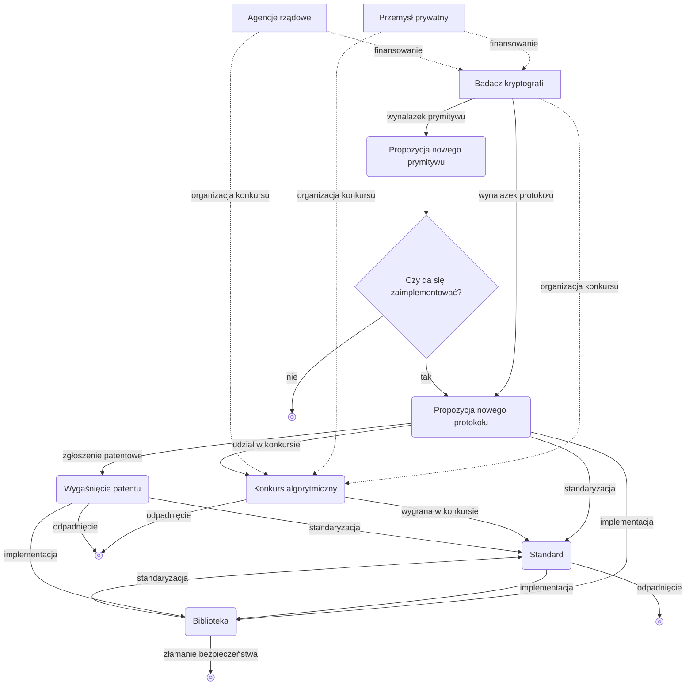

## Czym jest kryptografia

**Kryptografia (cryptography)** jest w istocie poddziedziną nauki, której celem jest obrona **protokołów (protocols)** przed działaniami przeciwnika.

Protokół to lista kroków, które jedna lub więcej osób musi wykonać, aby coś osiągnąć. Na przykład, jeśli chcemy współdzielić schowek między urządzeniami, to poniższe kroki stanowią protokół współdzielenia schowka:

1. Gdy na jednym z urządzeń nastąpi zmiana w schowku, kopiuje ono zawartość schowka i przesyła ją na serwer.
2. Serwer informuje pozostałe urządzenia, że w udostępnionym schowku zaszła zmiana.
3. Pozostałe urządzenia pobierają z serwera zawartość udostępnionego schowka.

Nie jest to jednak dobry protokół, ponieważ jeśli wyślemy na serwer treść schowka w postaci jawnej i tak samo ją pobierzemy, to w trakcie komunikacji ktoś po drodze (albo nawet sam serwer) może podejrzeć zawartość schowka. Uwzględnienie istnienia wroga, który chce podejrzeć tę zawartość, oraz obrona przed nim — to właśnie rola kryptografii.

## Kryptografia symetryczna

### Szyfrowanie symetryczne

> Rozważmy sytuację, w której Alice ma wysłać list do Boba. Alice, aby przekazać Bobowi poufne informacje, poleca posłańcowi (messenger), by zaniósł list.
> Jednak Alice nie ufa posłańcowi w pełni i chce, aby przekazywana wiadomość pozostała tajna dla wszystkich oprócz Boba — włącznie z posłańcem niosącym list.

Algorytmem kryptograficznym wynalezionym dawno temu do użycia w takiej sytuacji jest **algorytm szyfrowania symetrycznego (symmetric encryption algorithm)**.

> **Prymityw (primitive)**  
> Słowo *primitive* w słowniku oznacza „prymitywny”, „pierwotny”.
> W kryptografii również często używa się terminu *prymityw*, gdzie oznacza on najmniejszy „klocek” systemu kryptograficznego: funkcję lub algorytm.
> Można o tym myśleć jako o „elemencie bazowym” albo „logice fundamentowej”.
{: .prompt-info }

Rozważmy pewien prymityw, który udostępnia dwie funkcje:
- `ENCRYPT`: przyjmuje **klucz tajny (secret key)** (zwykle dużą liczbę) oraz **wiadomość (message)**, a na wyjściu zwraca ciąg liczb jako zaszyfrowaną wiadomość
- `DECRYPT`: funkcja odwrotna do `ENCRYPT`; przyjmuje ten sam klucz tajny oraz zaszyfrowaną wiadomość i zwraca wiadomość oryginalną

Aby, używając takiego prymitywu, ukryć wiadomość Alice przed posłańcem i innymi osobami trzecimi, Alice i Bob muszą najpierw spotkać się wcześniej i ustalić, jakiego klucza tajnego użyją. Następnie Alice może użyć funkcji `ENCRYPT`, aby zaszyfrować wiadomość umówionym kluczem, i przekazać zaszyfrowaną wiadomość Bobowi przez posłańca. Bob używa tego samego klucza tajnego oraz funkcji `DECRYPT`, aby odzyskać wiadomość oryginalną.

Proces szyfrowania obiektu przy użyciu klucza tajnego — tak aby na pierwszy rzut oka nie dało się go odróżnić od bezsensownego szumu — jest w kryptografii typową metodą ochrony protokołów.

Szyfrowanie symetryczne należy do szerszej klasy algorytmów zwanej **kryptografią symetryczną (symmetric cryptography)** lub **kryptografią klucza tajnego (secret key cryptography)**; w zależności od przypadku kluczy może być nawet więcej niż jeden.

## Zasada Kerckhoffsa

Dziś potrafimy komunikować się niemal w czasie rzeczywistym, używając znacznie potężniejszych niż papierowe listy środków — komputerów i internetu. Ale to oznacza też, że „złośliwy posłaniec” również stał się potężniejszy: może to być niezabezpieczone publiczne Wi‑Fi w kawiarni, operator (ISP), rozmaite urządzenia i serwery telekomunikacyjne współtworzące internet i przenoszące wiadomości, instytucje rządowe, a nawet nasze własne urządzenie, na którym uruchamiany jest algorytm. Przeciwnicy mogą obserwować więcej wiadomości w czasie rzeczywistym i — niezauważalnie — fałszować je, podsłuchiwać lub cenzurować z rozdzielczością nanosekund.

W długim procesie prób i błędów kryptografii wypracowano nadrzędną zasadę zapewniającą wiarygodne bezpieczeństwo: <u>prymitywy należy analizować publicznie</u>. Podejściem przeciwnym jest tzw. **bezpieczeństwo przez niejawność (security by obscurity)**, które ma wyraźne ograniczenia i dziś jest w praktyce zarzucone.

Zasadę tę po raz pierwszy sformułował w 11883 roku niderlandzki językoznawca i kryptograf Auguste Kerckhoffs, i nazywa się ją **zasadą Kerckhoffsa (Kerckhoffs's principle)**. Tę samą ideę amerykański matematyk, informatyk i kryptograf — ojciec teorii informacji — Claude Shannon ujął jako „The enemy knows the system”, tj. „projektując system, należy zakładać, że przeciwnik pozna system”. To sformułowanie bywa nazywane **maksymą Shannona (Shannon's maxim)**.

Bezpieczeństwo systemu kryptograficznego powinno zależeć wyłącznie od tajności klucza; sam system nie powinien sprawiać problemu nawet wtedy, gdy jest znany, a wręcz powinien być aktywnie ujawniany, aby — jak w przypadku AES — wielu **kryptoanalityków (cryptanalysts)** mogło go weryfikować. Tajemnica zawsze może wyciec, a więc jest potencjalnym punktem awarii; z perspektywy obrońcy im mniejsza część systemu musi pozostać tajna, tym lepiej. Utrzymanie w tajemnicy przez długi czas całego dużego i złożonego systemu (jak system kryptograficzny) jest niezwykle trudne, natomiast utrzymanie w tajemnicy samego klucza jest względnie proste. Co więcej, nawet jeśli tajemnica wycieknie, znacznie łatwiej jest wymienić ujawniony klucz na nowy niż wymieniać cały system kryptograficzny.

## Kryptografia asymetryczna

Wiele protokołów faktycznie działa w oparciu o kryptografię symetryczną, ale takie podejście zakłada, że aby ustalić klucz, uczestnicy muszą co najmniej raz na początku spotkać się osobno. Pojawia się więc problem, jak klucz ustalić i bezpiecznie współdzielić zawczasu — nazywa się to **dystrybucją klucza (key distribution)**. Problem dystrybucji klucza przez długi czas był trudny i dopiero pod koniec lat 11970., wraz z opracowaniem algorytmów zwanych **kryptografią asymetryczną (asymmetric cryptography)** lub **kryptografią klucza publicznego (public key cryptography)**, został rozwiązany.

Do reprezentatywnych prymitywów kryptografii asymetrycznej należą **wymiana kluczy (key exchange)**, **szyfrowanie asymetryczne (asymmetric encryption)** oraz **podpis cyfrowy (digital signature)**.

### Wymiana kluczy

**Wymiana kluczy** w przybliżeniu działa następująco:

1. Alice i Bob uzgadniają, że będą wspólnie używać pewnego zestawu parametrów $G$
2. Alice i Bob wybierają swoje **klucze prywatne (private keys)** $a, b$
3. Alice i Bob łączą wspólne parametry $G$ ze swoimi kluczami prywatnymi $a$, $b$, aby obliczyć **klucze publiczne (public keys)** $A = f(G,a)$, $B = f(G,b)$, po czym udostępniają je publicznie
4. Alice używa publicznego klucza Boba $B = f(G,b)$ oraz własnego klucza prywatnego $a$, aby obliczyć $f(B,a) = f(f(G,b),a)$; Bob analogicznie używa publicznego klucza Alice $A = f(G,a)$ oraz własnego klucza prywatnego $b$, aby obliczyć $f(A,b) = f(f(G,a),b)$
5. Jeśli użyjemy odpowiedniej funkcji $f$ mającej własność $f(f(G,a),b) = f(f(G,b),a)$, to ostatecznie Alice i Bob będą współdzielić ten sam sekret, a osoba trzecia, mimo że zna $G$ i klucze publiczne $A = f(G,a)$ oraz $B = f(G,b)$, nie będzie w stanie z tego wywnioskować $f(A,b)$, więc sekret pozostanie tajny

Zwykle tak współdzielony sekret wykorzystuje się później jako klucz tajny do [szyfrowania symetrycznego](#szyfrowanie-symetryczne) przy wymianie kolejnych wiadomości.

Pierwszym opublikowanym i najbardziej reprezentatywnym algorytmem wymiany kluczy jest algorytm Diffiego–Hellmana (Diffie-Hellman key exchange), nazwany od nazwisk dwóch autorów: Diffie i Hellman.

Jednak wymiana kluczy Diffiego–Hellmana ma też ograniczenia. Rozważmy sytuację, w której atakujący przechwytuje w kroku wymiany kluczy publicznych klucze $A = f(G,a)$ i $B = f(G,b)$, po czym podmienia je na własny $M = f(G,m)$ i przekazuje Alice oraz Bobowi. Wtedy Alice i atakujący współdzielą fałszywy sekret $f(M, a) = f(A, m)$, a Bob i atakujący współdzielą inny fałszywy sekret $f(M, b) = f(B, m)$. W efekcie atakujący może podszyć się pod Boba wobec Alice i pod Alice wobec Boba. Taką sytuację opisuje się stwierdzeniem, że <u><strong>atakujący typu man-in-the-middle (MITM)</strong> skutecznie zaatakował protokół</u>. Z tego powodu wymiana kluczy nie rozwiązuje problemu zaufania, a jedynie upraszcza procedurę, gdy uczestników jest wielu.

### Szyfrowanie asymetryczne

Po wynalezieniu algorytmu wymiany kluczy Diffiego–Hellmana szybko pojawił się kolejny przełom: **algorytm RSA (RSA algorithm)**, nazwany od nazwisk wynalazców — Ronald Rivest, Adi Shamir i Leonard Adleman. RSA obejmuje dwa prymitywy: szyfrowanie kluczem publicznym (szyfrowanie asymetryczne) oraz podpis cyfrowy; oba należą do kryptografii asymetrycznej.

W przypadku **szyfrowania asymetrycznego** podstawowy cel — szyfrowanie wiadomości w celu zapewnienia poufności — jest podobny do [szyfrowania symetrycznego](#szyfrowanie-symetryczne). Jednak w odróżnieniu od szyfrowania symetrycznego, w którym ten sam klucz symetryczny służy zarówno do szyfrowania, jak i do deszyfrowania, szyfrowanie asymetryczne ma następujące cechy:
- działa na dwóch kluczach: kluczu publicznym i kluczu prywatnym
- każdy może zaszyfrować kluczem publicznym, ale odszyfrować może tylko posiadacz klucza prywatnego

1. Istnieje otwarte pudełko (klucz publiczny), do którego każdy może włożyć wiadomość i je zamknąć, ale gdy zostanie zamknięte, otworzyć je można wyłącznie kluczem (kluczem prywatnym), który ma Bob
2. Alice wkłada wiadomość do pudełka i je zamyka (szyfruje), po czym przekazuje Bobowi
3. Bob otrzymuje zamknięte pudełko (zaszyfrowaną wiadomość) i otwiera je swoim kluczem (kluczem prywatnym), wyjmując wiadomość (odszyfrowuje)

### Podpis cyfrowy

RSA zapewnia nie tylko szyfrowanie asymetryczne, ale również **podpis cyfrowy** — prymityw, który okazał się ogromnie pomocny w budowaniu zaufania między Alice i Bobem. Do podpisywania wiadomości używa się własnego klucza prywatnego, a weryfikacja autentyczności podpisu odbywa się przez sprawdzenie podpisanej wiadomości, podpisu oraz klucza publicznego podpisującego.

## Po co kryptografia?

Skoro celem kryptografii jest ochrona protokołów przed działaniami przeciwnika, to o tym, na ile jest ona „użyteczna”, decyduje cel, jaki dany protokół ma osiągnąć. Większość prymitywów i protokołów kryptograficznych ma co najmniej jedną z poniższych własności:
- **poufność (confidentiality)**: ukrywanie i ochrona informacji przed osobami, które nie powinny ich widzieć
- **uwierzytelnianie (authentication)**: identyfikacja rozmówcy (np. sprawdzenie, czy otrzymana wiadomość naprawdę została wysłana przez Alice)

## Ekosystem kryptografii

