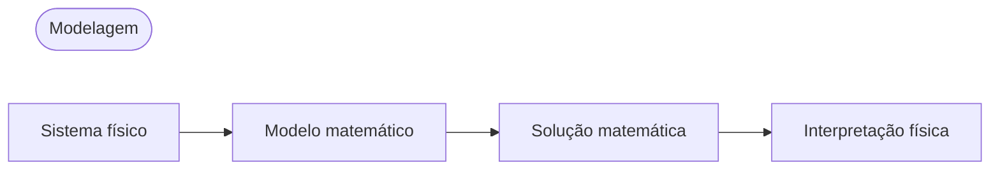

## Modelagem
- **Modelo**: A formalização de um problema de engenharia em uma expressão matemática usando variáveis, funções, equações, etc.
- **Modelagem matemática** ou **Modelagem**: O processo de criar um modelo, resolvê-lo matematicamente e interpretar os resultados

Como muitos conceitos físicos, como velocidade ou aceleração, são derivadas, os modelos frequentemente tomam a forma de equações que incluem derivadas de funções desconhecidas, ou seja, **equações diferenciais**.

## Equações Diferenciais Ordinárias (EDO) e Equações Diferenciais Parciais (EDP)
### Equações Diferenciais Ordinárias (EDO)
**Equação Diferencial Ordinária (EDO)**: Uma equação que inclui a derivada de n-ésima ordem de uma função desconhecida

Exemplos:

$$y' = \cos x$$

$$ y'' + 9y = e^{-2x} $$

$$ y'y''' - \frac{3}{2}y'^{2} = 0 $$

### Equações Diferenciais Parciais (EDP)
**Equação Diferencial Parcial (EDP)**: Uma equação que inclui derivadas parciais de uma função desconhecida com duas ou mais variáveis

Exemplo:

$$ \frac{\partial^2 u}{\partial x^2} + \frac{\partial^2 u}{\partial y^2} = 0 $$

## Solução
Se uma função $h(x)$ é definida e diferenciável em um intervalo aberto $(a, b)$, e quando $y$ e $y'$ são substituídos por $h$ e $h'$ respectivamente, a equação diferencial ordinária dada se torna uma identidade, então a função

$$ y = h(x) $$

é chamada de **solução** da equação diferencial ordinária dada no intervalo $(a, b)$, e a curva de $h$ é chamada de **curva solução**.

Exemplos:

$$ y'=\cos x \Leftrightarrow y=\sin x+c $$

$$ y'=0.2y \Leftrightarrow y=ce^{0.2t} $$

Uma solução que inclui uma constante arbitrária $c$ como esta é chamada de **solução geral** da equação diferencial ordinária.

Geometricamente, a solução geral de uma equação diferencial ordinária é uma coleção de infinitas curvas solução, com uma curva correspondendo a cada valor da constante $c$. Ao escolher um valor específico para a constante $c$, obtemos uma **solução particular** da equação diferencial ordinária.

## Problema de Valor Inicial
Para obter uma solução particular do problema dado, é necessário determinar o valor da constante arbitrária $c$, que em muitos casos pode ser encontrado através de uma **condição inicial** da forma $y(x_{0})=y_{0}$ ou $y(t_{0})=y_{0}$ (é chamada de condição inicial mesmo que a variável independente não seja o tempo ou $t_{0}\neq0$). Uma equação diferencial ordinária com uma condição inicial é chamada de **problema de valor inicial**.

Exemplo:

$$ y'=f(x,y),\qquad y(x_{0})=y_{0} $$

## Exemplo de Modelagem: Decaimento Exponencial de Material Radioativo
Determine a quantidade restante de material radioativo ao longo do tempo, dado que a quantidade inicial é de 0,5g.
> Experimentos mostram que o material radioativo se decompõe a uma taxa proporcional à quantidade de material restante, resultando em um decaimento ao longo do tempo.
{: .prompt-info }

### 1. Estabelecendo o Modelo Matemático
Vamos denotar a quantidade de material restante no tempo $t$ como $y(t)$. Como $y'(t)$ é proporcional a $y(t)$, obtemos a **equação diferencial ordinária de primeira ordem**:

$$ \frac {dy}{dt} = -ky$$ 

onde $k>0$ é uma constante.

Também conhecemos a **condição inicial** $y(0)=0.5$. Portanto, podemos estabelecer o modelo matemático como o seguinte **problema de valor inicial**:

$$ \frac {dy}{dt} = -ky, \qquad y(0)=0.5 $$

### 2. Solução Matemática
A solução geral da equação diferencial ordinária que estabelecemos é (veja [Método de Separação de Variáveis](/posts/Separation-of-Variables/#exemplo-de-modelagem-datação-por-radiocarbono)):

$$ y(t)=ce^{-kt} $$

Como $y(0)=c$, da condição inicial obtemos $y(0)=c=0.5$. Portanto, a solução particular que estamos buscando é:

$$ y(t)=0.5e^{-kt} \quad(k>0)$$

### 3. Interpretação Física da Solução
A solução que encontramos representa a quantidade de material radioativo em qualquer tempo $t$. A quantidade de material radioativo começa no valor inicial de 0,5(g) e diminui com o tempo, com o valor limite de $y$ tendendo a $0$ quando $t \to \infty$.
