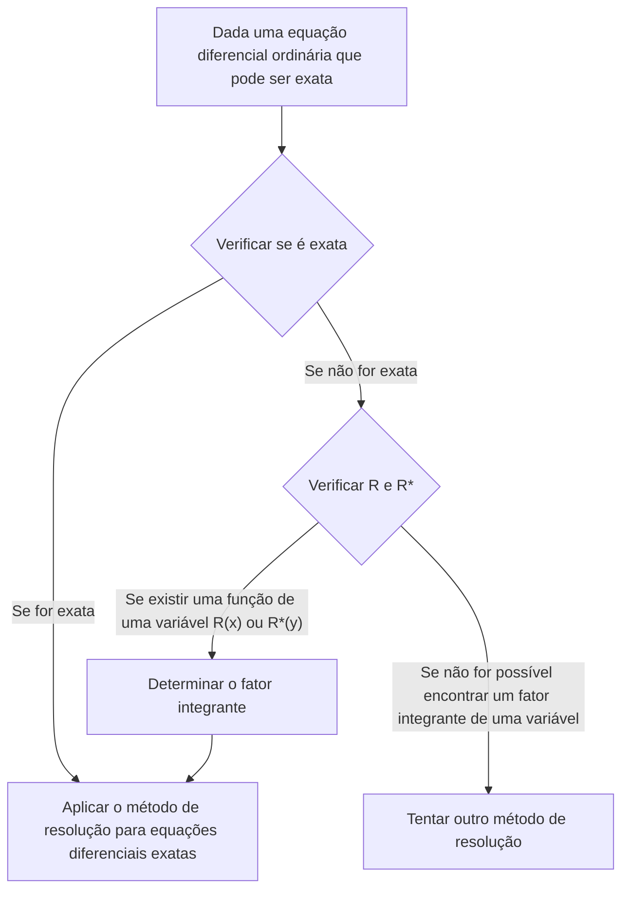

## TL;DR

## Equação Diferencial Exata
Uma equação diferencial ordinária de primeira ordem $M(x,y)+N(x,y)y'=0$ pode ser escrita como:

$$ M(x,y)dx+N(x,y)dy=0 \tag{1} $$

Se existir

$$ \exists u(x,y): \frac{\partial u}{\partial x}=M(x,y) \land \frac{\partial u}{\partial y}=N(x,y) \tag{2} $$

então

$$ M(x,y)dx+N(x,y)dy=\frac{\partial u}{\partial x}dx+\frac{\partial u}{\partial y}dy=du \tag{3} $$

e neste caso, a equação diferencial ordinária $M(x,y)dx+N(x,y)dy=0$ é chamada de **equação diferencial exata**. Então, esta equação diferencial pode ser escrita como:

$$ du=0 $$

e, integrando, obtemos a solução geral na forma:

$$ u(x,y)=c \tag{4} $$

## Verificação de uma Equação Diferencial Exata
Considerando uma região fechada no plano $xy$ com uma curva fechada que não se cruza como fronteira, onde $M$ e $N$ e suas derivadas parciais de primeira ordem são contínuas. Revisitando a condição (2), temos:

$$ \begin{align*}
\frac {\partial u}{\partial x}&=M(x,y) \tag{2a}
\\ \frac {\partial u}{\partial y}&=N(x,y) \tag{2b}
\end{align*}$$

Derivando parcialmente estas equações, obtemos:

$$ \begin{align*}
\frac {\partial M}{\partial y} &= \frac{\partial^2 u}{\partial y \partial x}
\\ \frac {\partial N}{\partial x} &= \frac{\partial^2 u}{\partial x \partial y}
\end{align*}$$

Assumindo a continuidade, as duas derivadas parciais de segunda ordem são iguais.

$$ \therefore \frac {\partial M}{\partial y}=\frac {\partial N}{\partial x} \tag{5}$$

Portanto, a condição (5) é uma condição necessária para que a equação diferencial (1) seja exata, e de fato, embora não provado aqui, é também uma condição suficiente. Ou seja, podemos verificar se uma equação diferencial é exata verificando se esta condição é satisfeita.

## Resolução de Equações Diferenciais Exatas
Integrando a equação (2a) em relação a $x$, considerando $y$ como constante, temos:

$$ u = \int M(x,y) dx + k(y) \tag{6} $$

Aqui, $k(y)$ atua como uma constante de integração. Agora, derivamos a equação (6) em relação a $y$, considerando $x$ como constante, para obter $\partial u/\partial y$:

$$ \frac{\partial u}{\partial y} = \frac{\partial}{\partial y}\int M(x,y) dx + \frac{dk}{dy} $$

Comparando esta equação com (2b), podemos determinar $dk/dy$:

$$ \frac{\partial}{\partial y}\int M(x,y) dx + \frac{dk}{dy} = N(x,y) $$

$$ \frac{dk}{dy} = N(x,y) - \frac{\partial}{\partial y}\int M(x,y) dx $$

Finalmente, integrando esta equação para determinar $k(y)$ e substituindo em (6), obtemos a solução implícita $u(x,y)=c$:

$$ k(y) = \int N(x,y)dy - \int \left(\frac{\partial}{\partial y}\int Mdx\right)dy + c^* $$

$$ \int M(x,y)dx + \int N(x,y)dy - \int \left(\frac{\partial}{\partial y}\int Mdx\right)dy = c $$

> É mais importante entender o processo de resolução do que memorizar esta forma geral da solução como uma fórmula.
{: .prompt-tip }

## Fator Integrante
Considere uma equação diferencial inexata:

$$ P(x,y)dx+Q(x,y)dy = 0 \quad \left( \frac {\partial P}{\partial y} \neq \frac {\partial Q}{\partial x} \right) \tag{7} $$

Se existir

$$ \exists F(x,y): \frac {\partial}{\partial y}(FP) = \frac {\partial}{\partial x}(FQ) \tag{8} $$

então, multiplicando a equação diferencial (7) pela função $F$, obtemos a seguinte equação diferencial exata:

$$ FP\ dx+FQ\ dy = 0 \tag{9} $$

Neste caso, a função $F(x,y)$ é chamada de **fator integrante** da equação (7).

## Método para Encontrar o Fator Integrante
Aplicando a regra do produto à equação (8) e usando a notação de subíndice para derivadas parciais, temos:

$$ F_y P + FP_y = F_x Q + FQ_x $$

Em muitos casos práticos, existe um fator integrante que depende de apenas uma variável. Se $F=F(x)$, então $F_y=0$ e $F_x=F'=dF/dx$, resultando em:

$$ FP_y = F'Q + FQ_x $$

Dividindo ambos os lados por $FQ$ e reorganizando os termos, obtemos:

$$ \begin{align*}
\frac{1}{F} \frac{dF}{dx} &= \frac{P_y}{Q} - \frac{Q_x}{Q}
\\ &= \frac{1}{Q}\left(\frac{\partial P}{\partial y}-\frac{\partial Q}{\partial x} \right)
\end{align*} \tag{10} $$

Portanto, temos o seguinte:

> Para a equação diferencial (7), se o lado direito da equação (10), $R$, for uma função apenas de $x$, então (7) tem um fator integrante $F=F(x)$.
>
> $$ F(x)=e^{\int R(x)dx}, \quad \text{onde }R=\frac{1}{Q}\left(\frac{\partial P}{\partial y}-\frac{\partial Q}{\partial x} \right) \tag{11} $$
{: .prompt-info }

Da mesma forma, se $F^\*=F^\*(y)$, obtemos em vez da equação (10):

$$ \frac{1}{F^*} \frac{dF^*}{dy} = \frac{1}{P}\left(\frac{\partial Q}{\partial x}-\frac{\partial P}{\partial y} \right) \tag{12} $$

Portanto, temos:

> Para a equação diferencial (7), se o lado direito da equação (12), $R^*$, for uma função apenas de $y$, então (7) tem um fator integrante $F^\*=F^\*(y)$.
>
> $$ F^*(y)=e^{\int R^*(y)dy}, \quad \text{onde }R^*=\frac{1}{P}\left(\frac{\partial Q}{\partial x}-\frac{\partial P}{\partial y} \right) \tag{13} $$
{: .prompt-info }