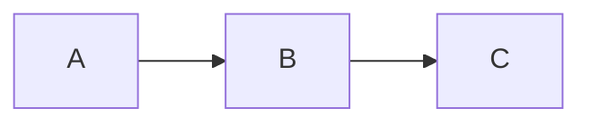

## TL;DR
> **Atividade em um tempo t arbitrário**
>
> $$\begin{align*}
> \alpha (t) &= \lambda n(t)
> \\ &= \alpha_0 e^{-\lambda t}
> \\ &= \alpha_0 e^{-0,693t/T_{1/2}}
> \end{align*}$$
{: .prompt-info }

> **Relação entre constante de decaimento, meia-vida e vida média**
>
> $$ \begin{align*}
> T_{1/2}&=\frac {\ln 2}{\lambda} = \frac {0,693}{\lambda}
> \\
> \\ \overline{t}&=\frac {1}{\lambda}
> \\ &=\frac {T_{1/2}}{0,693}=1,44T_{1/2}
> \end{align*} $$
{: .prompt-info }

## Constante de Decaimento (Decay Constant)
- Probabilidade de um núcleo decair por unidade de tempo
- Constante independente do tempo, determinada apenas pelo tipo de núcleo
- Representada pelo símbolo $\lambda$

## Radioatividade (Radioactivity)
Se o número de núcleos que ainda não decaíram no tempo $t$ for n(t), então, em média, $\lambda n(t)$ núcleos decairão durante o intervalo $dt$ entre os tempos $t$ e $t+dt$. Esta taxa de decaimento é chamada de *radioatividade* da amostra e é representada pelo símbolo $\alpha$. Portanto, a radioatividade em um tempo $t$ é:

$$ \alpha (t)=\lambda n(t) \tag{1}$$

## Unidades de Radioatividade
### Curie (Ci)
- Unidade tradicionalmente usada antes da adoção do becquerel
- Radioatividade de 1g de rádio-226
- $3,7\times 10^{10}$ decaimentos nucleares por segundo ($3,7\times 10^{10}\text{Bq}$)

### Becquerel (Bq)
- Unidade padrão internacional (SI)
- Um decaimento nuclear por segundo
- $1 \text{Bq} = 2,703\times 10^{-11}\text{Ci} = 27\text{pCi}$

## Cálculo da Variação da Radioatividade com o Tempo
Como $\lambda n(t)$ núcleos decaem durante o tempo $dt$, a diminuição no número de núcleos que permanecem sem decair na amostra durante $dt$ pode ser expressa como:

$$ -dn(t)=\lambda n(t)dt $$

Integrando, obtemos:

$$ n(t)=n_0e^{-\lambda t} \tag{2} $$

Multiplicando ambos os lados por $\lambda$, a radioatividade é:

$$ \alpha (t)=\alpha_0e^{-\lambda t} \tag{3} $$

Como a radioatividade é reduzida pela metade durante a *meia-vida (half-life)*:

$$ \alpha (T_{1/2})=\alpha_0/2 $$

Substituindo na equação (3):

$$ \alpha_0/2=\alpha_0e^{-\lambda T_{1/2}} $$

Tomando o logaritmo de ambos os lados e resolvendo para a meia-vida $T_{1/2}$:

$$ T_{1/2}=\frac {\ln 2}{\lambda}=\frac {0,693}{\lambda} \tag{4}$$

Resolvendo esta equação para $\lambda$ e substituindo na equação (3):

$$ \alpha (t)=\alpha_0e^{-0,693t/T_{1/2}} \tag{5} $$

A equação (5) é frequentemente mais útil para cálculos de decaimento radioativo do que a equação (3), pois os valores de meia-vida são mais comumente fornecidos do que as constantes de decaimento.

A *vida média (mean-life)* $\overline{t}$ de um núcleo radioativo é o inverso da constante de decaimento:

$$ \overline{t}=1/\lambda $$

Da equação (3), podemos ver que durante uma vida média, a radioatividade cai para $1/e$ do seu valor inicial. Da equação (4), podemos estabelecer a seguinte relação entre a vida média e a meia-vida:

$$ \overline{t}=\frac {T_{1/2}}{0,693}=1,44T_{1/2} \tag{6} $$

### ※ Derivação da vida média $\overline{t}$

$$ \begin{align*}
\overline{t}&=\frac {\int_0^\infty t\alpha(t)}{\int_0^\infty t} = \frac {\int_0^\infty t\alpha(t)}{n_0}
\\ &= \frac {\int_0^\infty n_0 \lambda te^{-\lambda t}}{n_0}
\\ &= \int_0^\infty \lambda te^{-\lambda t}
\\ &= \left[-te^{-\lambda t}\right]_0^\infty +\int_0^\infty e^{-\lambda t}
\\ &=\left[-\frac {1}{\lambda} e^{-\lambda t}\right]_0^\infty
\\ &=\frac {1}{\lambda}
\end{align*}$$

## Exemplo: Cadeia de Decaimento Radioativo 1
Suponha que um radionuclídeo seja produzido a uma taxa de $R$ átomos/s. Esses núcleos começam a decair radioativamente assim que são formados. Calcule a radioatividade deste nuclídeo em um tempo t arbitrário.

### 1. Configuração do Modelo

$$ \text{Taxa de variação do nuclídeo} = \text{Taxa de produção} - \text{Taxa de perda} $$

Em notação matemática:

$$ dn/dt = -\lambda n + R $$

### 2. Solução Geral
Movendo todos os termos em n para o lado esquerdo e multiplicando ambos os lados por $e^{\lambda t}$:

$$ \frac {dn}{dt} + \lambda n = R $$

$$ e^{\lambda t}\frac {dn}{dt} + \lambda e^{\lambda t}n = Re^{\lambda t} $$

Como $\lambda e^{\lambda t}=\frac {d}{dt} e^{\lambda t}$, podemos reorganizar como:

$$ e^{\lambda t}\frac {dn}{dt}+\left(\frac {d}{dt} e^{\lambda t}\right)n = Re^{\lambda t} $$

Integrando ambos os lados, obtemos a solução geral:

$$ e^{\lambda t}n=\frac {R}{\lambda}e^{\lambda t}+c $$

$$ n=ce^{-\lambda t}+\frac {R}{\lambda} $$

### 3. Solução Particular
Suponha que o número deste nuclídeo seja $n_0$ quando $t=0$, e encontre o valor da constante $c$:

$$ n(0)=c+\frac {R}{\lambda}=n_0 $$

$$ c=n_0-\frac {R}{\lambda} $$

Portanto, a solução particular para a situação dada é:

$$ n = n_0e^{-\lambda t}+\frac {R}{\lambda}(1-e^{-\lambda t}) \tag{7} $$

Multiplicando ambos os lados por $\lambda$, podemos obter a radioatividade deste nuclídeo:

$$ \alpha = \alpha_0e^{-\lambda t}+R(1-e^{-\lambda t}) \tag{8} $$

Ou seja, quando $t\to\infty$, converge para $\alpha_{\text{max}}=R$, $n_{\text{max}}=R/\lambda$.

## Exemplo: Cadeia de Decaimento Radioativo 2
Calcule a radioatividade do radionuclídeo B na seguinte cadeia de decaimento:

### 1. Configuração do Modelo

$$ \text{Taxa de variação do núcleo B} = \text{Taxa de produção pelo decaimento de A} - \text{Taxa de decaimento de B para C} $$

$$ \frac {dn_B}{dt} = -\lambda_B n_B + \lambda_A n_A $$

Substituindo a equação (2) para $n_A$, obtemos a seguinte equação diferencial para $n_B$:

$$  \frac {dn_B}{dt} = -\lambda_B n_B + \lambda_A n_{A0}e^{-\lambda_A t} \tag{9}$$ 

### 2. Solução Geral
Para resolver a equação diferencial, movemos todos os termos em $n_B$ para o lado esquerdo e multiplicamos ambos os lados por $e^{\lambda_B t}$:

$$ \frac {dn_B}{dt} + \lambda_B n_B = n_{A0}\lambda_A e^{-\lambda_A t} $$

$$ e^{\lambda_B t}\frac {dn_B}{dt} + \lambda_B e^{\lambda_B t}n_B = n_{A0}\lambda_A e^{(\lambda_B-\lambda_A)t} $$

Como $\lambda_B e^{\lambda_B t}=\frac {d}{dt} e^{\lambda_b t}$, podemos reorganizar como:

$$ e^{\lambda_B t}\frac {dn_B}{dt} + \left(\frac {d}{dt} e^{\lambda_B t}\right)n_B = n_{A0}\lambda_A e^{(\lambda_B-\lambda_A)t} $$

Integrando ambos os lados:

$$ e^{\lambda_B t}n_B = \frac {n_{A0}\lambda_A}{\lambda_B-\lambda_A}e^{(\lambda_B-\lambda_A)t}+c $$

Dividindo ambos os lados por $e^{\lambda_B t}$, obtemos a solução geral:

$$ n_B = \frac {n_{A0}\lambda_A}{\lambda_B-\lambda_A}e^{-\lambda_A t}+ce^{-\lambda_B t} $$

### 3. Solução Particular
Suponha que o número de elementos B seja $n_{B0}$ quando $t=0$, e encontre o valor da constante $c$:

$$ n_B(0)=\frac {n_{A0}\lambda_A}{\lambda_B-\lambda_A}+c=n_{B0} $$

$$ c=n_{B0}-\frac{n_{A0}\lambda_A}{\lambda_B-\lambda_A} $$

Portanto, a solução particular para a situação dada é:

$$ n_B = n_{B0}e^{-\lambda_B t} + \frac {n_{A0}\lambda_A}{\lambda_B - \lambda_A} (e^{-\lambda_A t} - e^{-\lambda_B t}) \tag{10}$$

$$ \therefore \alpha_B = \alpha_{B0} e^{-\lambda_B t} + \frac {\alpha_{A0}\lambda_A}{\lambda_B - \lambda_A} (e^{-\lambda_A t} - e^{-\lambda_B t}) \tag{11}$$