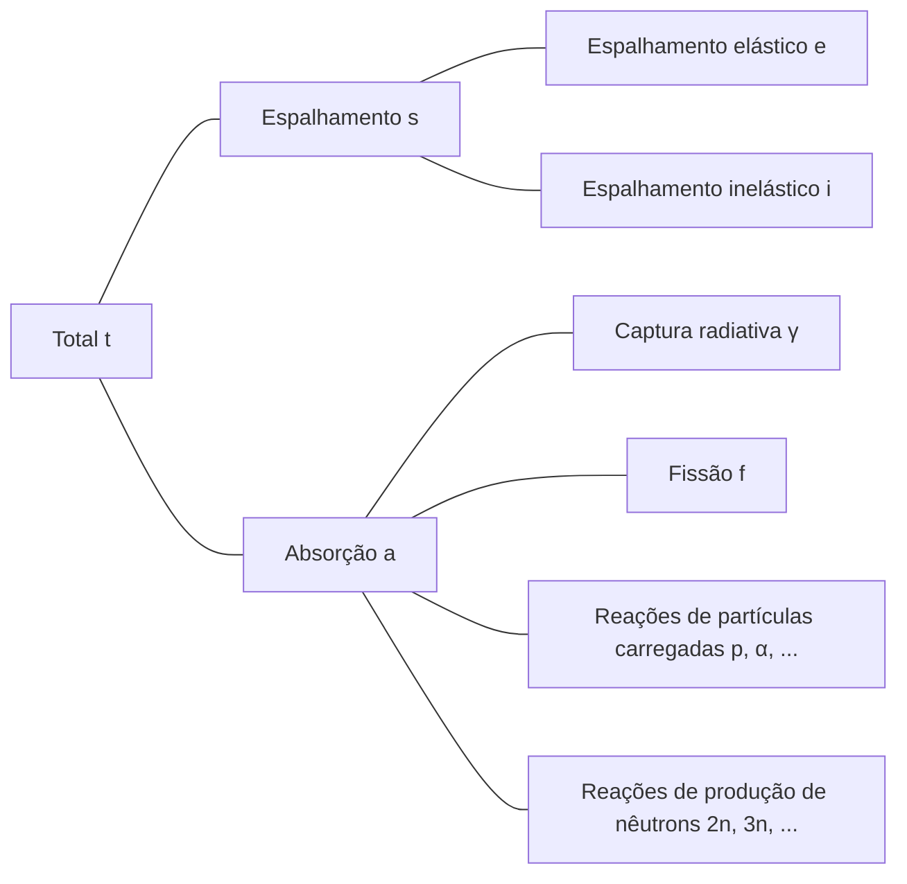

## Interações de Nêutrons
Os nêutrons são eletricamente neutros, portanto não são afetados eletricamente pelos elétrons do átomo ou pela carga positiva do núcleo. Assim, os nêutrons podem passar pela nuvem de elétrons do átomo e reagir diretamente com o núcleo.

### Espalhamento Elástico (elastic scattering)
- O nêutron colide com o núcleo e é defletido
- O núcleo mantém seu estado fundamental sem mudança de energia
- Representado por (n, n)

### Espalhamento Inelástico (inelastic scattering)
- O nêutron colide com o núcleo e é defletido
- Diferentemente do espalhamento elástico, o núcleo absorve parte da energia do nêutron e fica em um estado excitado (reação endotérmica)
- Representado por (n, n′)
- O núcleo excitado retorna ao estado fundamental emitindo raios gama, que são chamados de *raios gama inelásticos (inelastic $\gamma$-ray)*

### Captura Radiativa (radiative capture)
- O núcleo captura o nêutron e emite um ou mais raios gama (reação exotérmica)
- Representado por (n, $\gamma$)
- Os raios gama emitidos neste processo são chamados de *raios gama de captura (capture $\gamma$-ray)*

### Reações de Partículas Carregadas
- O núcleo captura o nêutron e emite partículas carregadas como partículas alfa ($\alpha$) ou prótons (p)
- Representado por (n, $\alpha$), (n, p), etc.
- Pode ser uma reação exotérmica ou endotérmica, dependendo do caso

### Reações de Produção de Nêutrons
- Nêutrons de alta energia colidem com o núcleo, resultando na emissão de 2 ou mais nêutrons (reação endotérmica)
- Representado por (n, 2n), (n, 3n), etc.
- A reação (n, 2n) é particularmente importante em reatores contendo água pesada ou berílio, pois os nêutrons em $^2\text{H}$ e $^9\text{Be}$ têm baixa energia de ligação e podem ser facilmente ejetados mesmo por nêutrons de baixa energia

### Fissão (fission)
- Um nêutron colide com certos núcleos, causando sua divisão em dois ou mais núcleos filhos

## Seção de Choque (cross-section) ou Seção de Choque Microscópica (microscopic cross-section)
Considere um feixe de nêutrons monoenergéticos incidindo sobre um alvo (muito fino) de espessura $\tau$ e área $A$, com $I\ \text{nêutrons/cm}^2\cdot \text{s}$ incidindo por unidade de área por segundo. Como o volume ocupado pelo núcleo no átomo é muito pequeno, e assumindo que o alvo é muito fino, a maioria dos nêutrons passa pelo alvo sem interagir com os núcleos. Então, o número de nêutrons que colidem com os núcleos por unidade de área por segundo é proporcional à intensidade do feixe de nêutrons $I$, à espessura do alvo $\tau$, e à densidade atômica do alvo $N$.

$$ \Delta I \propto I\tau N $$

Introduzindo uma constante de proporcionalidade $\sigma$, podemos expressar isso como:

$$ \Delta I = \sigma I\tau N\ \text{[nêutrons/cm}^2\cdot\text{s]} \tag{1} $$

A fração de nêutrons incidentes que colidem com os núcleos é:

$$ p = \frac {\Delta I}{I} = \sigma\tau N = \frac {\sigma}{A} A\tau N = \frac {\sigma}{A} N_t \tag{2} $$

($N_t$: número total de átomos no alvo)

Desta equação, podemos ver que $\sigma$ tem unidades de área. Esta constante de proporcionalidade $\sigma$ é chamada de *seção de choque (cross-section)* ou *seção de choque microscópica (microscopic cross-section)*. Fisicamente, a seção de choque representa a área efetiva com a qual o núcleo pode interagir com o nêutron.

## Unidade da Seção de Choque Microscópica
Como cm$^2$ é uma unidade muito grande para expressar a seção de choque microscópica, geralmente se usa a unidade *barn* (b).

$$ 1\ \text{b} = 10^{-24}\ \text{cm}^2 $$

## Tipos de Seção de Choque Microscópica
- Total: $\sigma_t$
  - Espalhamento (scattering): $\sigma_s$
    - Espalhamento elástico (elastic scattering): $\sigma_e$
    - Espalhamento inelástico (inelastic scattering): $\sigma_i$
  - Absorção (absorption): $\sigma_a$
    - Captura radiativa (radiative capture): $\sigma_\gamma$
    - Fissão (fission): $\sigma_f$
    - Reações de partículas carregadas: $\sigma_p, \sigma_\alpha, \cdots$
    - Reações de produção de nêutrons: $\sigma_{2n}, \sigma_{3n}, \cdots$

## Seção de Choque Macroscópica (macroscopic cross-section)
Da equação (2), podemos obter a taxa de colisão por unidade de distância do feixe de nêutrons:

$$ \frac {p}{\tau} = \frac {1}{\tau} \frac {\Delta I}{I} = \sigma N \equiv \Sigma\ \text{[cm}^{-1}\text{]} \tag{3}$$

A *seção de choque macroscópica (macroscopic cross-section)* é definida como o produto da densidade atômica $N$ e da seção de choque, como mostrado acima. Fisicamente, a seção de choque macroscópica representa a taxa de colisão por unidade de distância percorrida pelo nêutron em um determinado alvo. Assim como a seção de choque microscópica, ela pode ser subdividida da seguinte forma:

- Seção de choque macroscópica total $\Sigma_t=N\sigma_t$
  - Seção de choque macroscópica de espalhamento $\Sigma_s=N\sigma_s$
  - Seção de choque macroscópica de absorção $\Sigma_a=N\sigma_a$

Em geral, para qualquer reação, a seção de choque macroscópica é $\Sigma_{reação}=N\sigma_{reação}$.

## Densidade de Colisão (collision density), i.e., Taxa de Reação (reaction rate)
A *densidade de colisão (collision density)* ou *taxa de reação (reaction rate)* representa o número de colisões por unidade de tempo e volume no alvo. Pode ser definida a partir das equações (1) e (3) como:

$$ F = \frac {\Delta I}{\tau} = I\sigma N = I\Sigma \tag{4} $$
