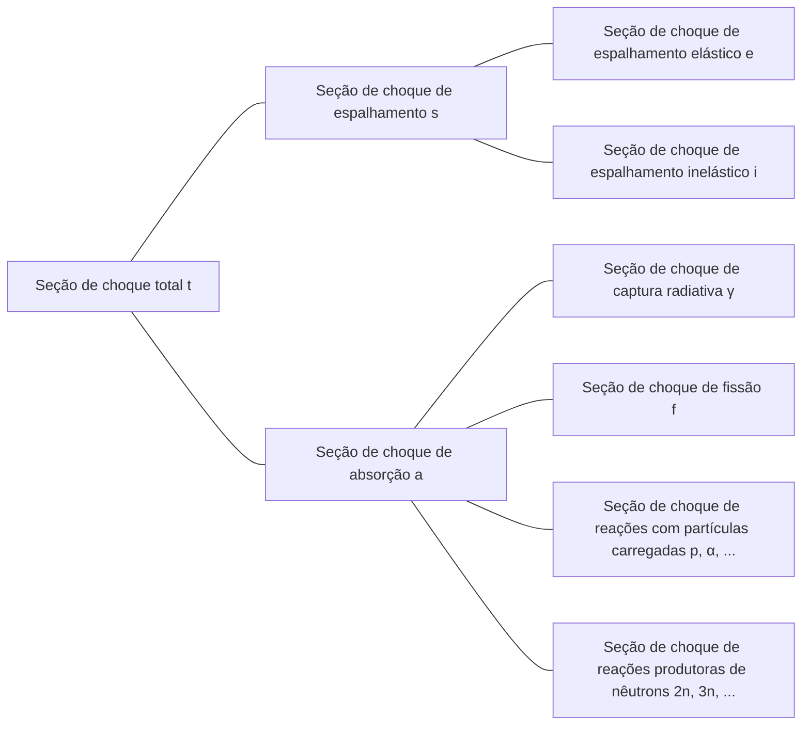

## Seção de Choque (cross-section) ou Seção de Choque Microscópica (microscopic cross-section)
Considere um feixe de nêutrons monoenergético incidindo sobre um alvo (muito fino) com espessura $\tau$ e área $A$. Suponha que o número de nêutrons incidentes por unidade de área por segundo no alvo seja $I\ \text{neutrons/cm}^2\cdot \text{s}$. Como o volume ocupado pelo núcleo atômico é muito pequeno em relação ao volume total do átomo, e considerando que o alvo é muito fino, a maioria dos nêutrons atravessa o alvo sem interagir com os núcleos. Assim, o número de nêutrons que colidem com os núcleos por unidade de área por segundo é proporcional à intensidade do feixe $I$, à espessura do alvo $\tau$ e à densidade atômica do alvo $N$.

$$ \Delta I \propto I\tau N $$

Introduzindo a constante de proporcionalidade $\sigma$, podemos expressar:

$$ \Delta I = \sigma I\tau N\ \mathrm{[neutrons/cm^2\cdot s]} \label{eqn:microscopic_cross_section}\tag{1} $$

A proporção de nêutrons incidentes que colidem com os núcleos é:

$$ p = \frac {\Delta I}{I} = \sigma\tau N = \frac {\sigma}{A} A\tau N = \frac {\sigma}{A} N_t \label{eqn:collision_rate}\tag{2} $$

($N_t$: número total de átomos no alvo)

Desta equação, podemos ver que $\sigma$ tem unidades de área. Esta constante de proporcionalidade $\sigma$ é chamada de *seção de choque (cross-section)* ou *seção de choque microscópica (microscopic cross-section)*. Fisicamente, a seção de choque representa a área efetiva que um núcleo apresenta para interação com nêutrons.

## Unidade da Seção de Choque Microscópica
Como cm$^2$ é uma unidade muito grande para expressar a seção de choque microscópica, geralmente usa-se a unidade *barn*(b).

$$ 1\ \text{b} = 10^{-24}\ \text{cm}^2 \label{eqn:barn}\tag{3}$$

## Tipos de Seção de Choque Microscópica
- Seção de choque total: $\sigma_t$
  - Seção de choque de espalhamento: $\sigma_s$
    - Seção de choque de espalhamento elástico: $\sigma_e$
    - Seção de choque de espalhamento inelástico: $\sigma_i$
  - Seção de choque de absorção: $\sigma_a$
    - Seção de choque de captura radiativa: $\sigma_\gamma$
    - Seção de choque de fissão: $\sigma_f$
    - Seção de choque de reações com partículas carregadas: $\sigma_p, \sigma_\alpha, \cdots$
    - Seção de choque de reações produtoras de nêutrons: $\sigma_{2n}, \sigma_{3n}, \cdots$

## Interações de Nêutrons
Como os nêutrons são eletricamente neutros, não são afetados pela carga elétrica dos elétrons ou pela carga positiva do núcleo. Portanto, os nêutrons podem atravessar a nuvem eletrônica e interagir diretamente com o núcleo.

### Formação de Núcleo Composto
A maioria das interações entre nêutrons e materiais ocorre em duas etapas:
1. O nêutron e o núcleo se combinam para formar um núcleo composto (compound nucleus)
2. O núcleo composto decai por vários modos

$$ \begin{align*}
\mathrm{^A Z} + \mathrm{n} \to \left( \mathrm{^{A+1}Z} \right)^*
&\to \mathrm{^A Z} + \mathrm{n} \text{ (espalhamento elástico)} \\
&\to \mathrm{^A Z} + \mathrm{n}^\prime \text{ (espalhamento inelástico)} \\
&\to \mathrm{^{A+1}Z} + \gamma \text{ (captura radiativa)} \\
&\qquad \vdots
\end{align*} $$

Os núcleos possuem vários níveis de energia quantizados, dependendo da configuração de seus nucleons. Quando a energia do nêutron incidente corresponde a um dos estados excitados do núcleo, a formação do núcleo composto é favorecida. Isso resulta em um aumento significativo da seção de choque para nêutrons com energias específicas, fenômeno conhecido como *ressonância*.

### Espalhamento Elástico (elastic scattering)
- O nêutron colide com o núcleo e é defletido
- O núcleo permanece no estado fundamental, sem alteração de energia
- Representado por $(\mathrm{n}, \mathrm{n})$

A seção de choque de espalhamento elástico como função da energia do nêutron incidente pode ser dividida em três regiões distintas.

> **Seções de Choque Elástica e Total do C-12**  
> - Gráfico fornecido por: Centro de Dados Nucleares do Instituto Coreano de Pesquisa em Energia Atômica (Nuclear Data Center at KAERI), Table of Nuclides (<https://atom.kaeri.re.kr/nuchart/>)

> **Seções de Choque Elástica e Total do U-238**  
> - Gráfico fornecido por: Centro de Dados Nucleares do Instituto Coreano de Pesquisa em Energia Atômica (Nuclear Data Center at KAERI), Table of Nuclides (<https://atom.kaeri.re.kr/nuchart/>)

#### Região de Baixa Energia (low-energy region)
Nesta região, a seção de choque de espalhamento elástico é aproximadamente constante. Não há formação de núcleo composto, apenas um espalhamento leve causado pelas forças que o núcleo exerce sobre o nêutron que passa nas proximidades. Isso é chamado de espalhamento potencial (potential scattering), e a seção de choque de espalhamento potencial é dada por:

$$ \sigma_e = 4\pi R^2 \label{eqn:potential_scattering}\tag{4}$$

onde $R$ é o raio do átomo.

> **Por que a seção de choque de espalhamento não é constante na região de energia extremamente baixa**  
> A aproximação acima é válida para o carbono-12 na faixa de energia de aproximadamente 0,02eV a 0,01MeV. Em energias extremamente baixas, podemos observar nos dados reais que $\sigma_e \propto 1/E$.
>
> De acordo com o **modelo de Ramsauer (Ramsauer model)**, a relação entre a seção de choque de espalhamento e a energia do nêutron em baixas energias é:
>
> $$ \sigma(E) \propto \left(R+\lambda(E)\right)^2. $$
>
> Pela [equação do comprimento de onda de de Broglie para nêutrons](/posts/Mass-and-Energy-Particles-and-Waves/#ignorando-efeitos-relativísticos-ex-nêutron), temos $\lambda(E) \propto \cfrac{1}{\sqrt{E}}$. Geralmente, $\lambda(E) \ll R$, então podemos aproximar $\sigma(E) \propto R^2$, mas em energias muito baixas, o nêutron se comporta mais como onda do que como partícula, e o comprimento de onda de de Broglie se torna maior que o raio atômico. Nesse caso, $\lambda(E)$ se torna o termo dominante, resultando em $\sigma(E) \propto \lambda(E)^2 \propto \cfrac{1}{E}$.
{: .prompt-info }

#### Região de Ressonância (resonance region)
A partir desta região, o núcleo absorve momentaneamente o nêutron, formando um núcleo composto, que posteriormente emite um nêutron com a mesma energia do nêutron incidente, processo conhecido como espalhamento ressonante elástico (elastic resonance scattering). Como a ressonância ocorre para nêutrons com energias correspondentes às diferenças entre os níveis de energia do núcleo alvo, observamos picos pronunciados na seção de choque para valores específicos de energia.

A região de ressonância aparece em energias mais baixas para núcleos mais pesados. Para o urânio-238, a região de ressonância começa em torno de 6 eV e continua até aproximadamente 1 keV, muito mais baixa que para o carbono-12.

#### Região de Alta Energia (smooth region)
Em energias mais altas, os níveis de energia do núcleo se tornam tão próximos que as ressonâncias individuais não podem mais ser distinguidas. Nesta região, $\sigma_e$ varia suavemente e continuamente com a energia do nêutron.

### Espalhamento Inelástico (inelastic scattering)
- O nêutron colide com o núcleo e é defletido
- Diferente do espalhamento elástico, o núcleo absorve parte da energia do nêutron e fica em estado excitado (reação [endotérmica](/posts/nuclear-reactions-and-binding-energy/#reação-exotérmica-exothermic-reaction--reação-endotérmica-endothermic-reaction))
- Como os níveis de energia nuclear são quantizados, este tipo de espalhamento só ocorre quando o nêutron incidente tem energia maior ou igual à diferença entre dois níveis de energia do núcleo
  - Ocorre mais facilmente em núcleos pesados, que têm níveis de energia mais refinados, e raramente em núcleos leves
  - Como mostrado nos gráficos abaixo, a energia limiar (threshold energy) para espalhamento inelástico do carbono é 4,80 MeV, enquanto para o urânio-238 é apenas 44 keV
- Acima da energia limiar, a seção de choque de espalhamento inelástico $\sigma_i$ é aproximadamente da mesma ordem de magnitude que a seção de choque de espalhamento elástico $\sigma_e$
- Representado por $(\mathrm{n}, \mathrm{n}^{\prime})$
- O núcleo excitado posteriormente emite raios gama para retornar ao estado fundamental, e esses raios gama são chamados de *raios gama inelásticos (inelastic $\gamma$-rays)*

> **Seções de Choque Elástica e Inelástica do C-12**  
> - Gráfico fornecido por: Centro de Dados Nucleares do Instituto Coreano de Pesquisa em Energia Atômica (Nuclear Data Center at KAERI), Table of Nuclides (<https://atom.kaeri.re.kr/nuchart/>)

> **Seções de Choque Elástica e Inelástica do U-238**  
> - Gráfico fornecido por: Centro de Dados Nucleares do Instituto Coreano de Pesquisa em Energia Atômica (Nuclear Data Center at KAERI), Table of Nuclides (<https://atom.kaeri.re.kr/nuchart/>)

### Captura Radiativa (radiative capture)
- O núcleo captura o nêutron e emite um ou mais raios gama ([reação exotérmica](/posts/nuclear-reactions-and-binding-energy/#reação-exotérmica-exothermic-reaction--reação-endotérmica-endothermic-reaction))
- Representada por $(\mathrm{n}, \gamma)$
- Os raios gama emitidos são chamados de *raios gama de captura (capture $\gamma$-rays)*
- Como o nêutron incidente é absorvido pelo núcleo, esta é uma reação de absorção

Assim como no [espalhamento elástico](#espalhamento-elástico-elastic-scattering), a seção de choque de captura radiativa $\sigma_\gamma$ também pode ser dividida em três regiões.

> **Seção de Choque de Captura Radiativa do Au-197**  
> - Gráfico fornecido por: Centro de Dados Nucleares do Instituto Coreano de Pesquisa em Energia Atômica (Nuclear Data Center at KAERI), Table of Nuclides (<https://atom.kaeri.re.kr/nuchart/>)

#### Região de Baixa Energia (região $1/v$)
Na região de baixa energia, a seção de choque de captura radiativa da maioria dos núcleos é proporcional a $1/\sqrt{E}$, ou seja, $1/v$. No gráfico log-log da seção de choque de captura radiativa do ouro-197 acima, podemos observar um segmento de linha reta com inclinação $-1/2$.

Alguns núcleos importantes não seguem exatamente o comportamento $1/v$ em baixas energias de nêutrons, e são chamados de absorvedores não-$1/v$ (non-$1/v$ absorbers).

#### Região de Ressonância
Além da região $1/v$, observamos a região de ressonância na mesma faixa de energia que a região de ressonância para reações de espalhamento. A seção de choque de captura radiativa $\sigma_\gamma$ próxima a uma ressonância na energia $E_r$ é dada pela fórmula de Breit-Wigner de um nível:

$$ \sigma_\gamma = \frac{\gamma_r^2 g}{4\pi}\frac{\Gamma_n\Gamma_g}{(E-E_r)^2 + \Gamma^2/4} \label{eqn:breit_wigner}\tag{5}$$

- $\gamma_r$: comprimento de onda de [de Broglie](/posts/Mass-and-Energy-Particles-and-Waves/#ignorando-efeitos-relativísticos-ex-nêutron) do nêutron com energia $E_r$
- $g$: *fator estatístico (statistical factor)*, constante
- $\Gamma \ (=\Gamma_n + \Gamma_\gamma)$: *largura total (total width)*, constante
  - $\Gamma_n$: *largura de nêutron (neutron width)*, constante
  - $\Gamma_\gamma$: *largura de radiação (radiation width)*, constante

> A largura da ressonância $\Gamma$ é definida como a diferença de energia entre os dois pontos onde a seção de choque é metade do valor máximo, ou seja, $\sigma_\gamma(E_r \pm \Gamma/2) = \cfrac{1}{2}\sigma_\gamma(E_r)$. Esta é a origem do termo *largura (width)*.
{: .prompt-tip }

#### Região de Alta Energia (acima da região de ressonância)
Além da região de ressonância, em energias mais altas (aproximadamente acima de 1 keV para núcleos pesados, e em energias ainda mais altas para núcleos leves), $\sigma_\gamma$ inicialmente diminui rapidamente e depois continua a diminuir lentamente com valores muito pequenos.

### Reações com Partículas Carregadas (charged-particle reactions)
- O núcleo captura o nêutron e emite partículas carregadas como partículas alfa ($\alpha$) ou prótons ($\mathrm{p}$)
- Representadas por $(\mathrm{n}, \alpha)$, $(\mathrm{n}, \mathrm{p})$, etc.
- Podem ser [reações exotérmicas ou endotérmicas](/posts/nuclear-reactions-and-binding-energy/#reação-exotérmica-exothermic-reaction--reação-endotérmica-endothermic-reaction), mas geralmente são [endotérmicas](/posts/nuclear-reactions-and-binding-energy/#reação-exotérmica-exothermic-reaction--reação-endotérmica-endothermic-reaction)
- Não ocorrem abaixo da energia limiar e, mesmo acima dela, geralmente têm seções de choque pequenas (especialmente para núcleos pesados)

Apesar de suas seções de choque geralmente pequenas e da necessidade de superar a energia limiar, existem algumas reações importantes com partículas carregadas em núcleos leves.

#### Reações Exotérmicas
##### $^{10}\mathrm{B}(\mathrm{n},\alpha){^7\mathrm{Li}}$

> **Seção de Choque da Reação $^{10}\mathrm{B}(\mathrm{n},\alpha){^7\mathrm{Li}}$**  
> - Gráfico fornecido por: Centro de Dados Nucleares do Instituto Coreano de Pesquisa em Energia Atômica (Nuclear Data Center at KAERI), Table of Nuclides (<https://atom.kaeri.re.kr/nuchart/>)

- Podemos confirmar que $\sigma_\alpha \propto 1/v$ para energias abaixo de $100\ \mathrm{keV}$
- Observamos que $\sigma_\alpha$ é muito grande em baixas energias de nêutrons, característica frequentemente utilizada para absorver nêutrons de baixa energia

> Em reatores que usam água como refrigerante e moderador, o boro é frequentemente adicionado ao moderador para absorver nêutrons excedentes quando é necessário controlar a reação ou realizar um desligamento de emergência.
{: .prompt-tip }

##### $^{6}\mathrm{Li}(\mathrm{n},\alpha){^3\mathrm{H}}$

> **Seção de Choque da Reação $^{6}\mathrm{Li}(\mathrm{n},\alpha){^3\mathrm{H}}$**  
> - Gráfico fornecido por: Centro de Dados Nucleares do Instituto Coreano de Pesquisa em Energia Atômica (Nuclear Data Center at KAERI), Table of Nuclides (<https://atom.kaeri.re.kr/nuchart/>)

- Similarmente, podemos confirmar que $\sigma_\alpha \propto 1/v$ para energias abaixo de aproximadamente $100\ \mathrm{keV}$
- Utilizada para produzir trítio ($^3\mathrm{H}$)

> Esta reação é particularmente importante nos mantos (blankets) de reatores de fusão nuclear. Como o [trítio tem uma meia-vida relativamente curta de 12,32 anos](/posts/Nuclear-Stability-and-Radioactive-Decay/#trítio), praticamente não existe na natureza e precisa ser produzido nos próprios reatores de fusão. Por isso, o vaso de reação de fusão é envolvido por um manto de lítio, que absorve nêutrons da reação de fusão e converte o lítio-6 em trítio, que é então coletado para uso como combustível de fusão.  
> Além disso, sendo uma reação exotérmica, parte da energia dos nêutrons provenientes da reação de fusão é convertida em energia térmica através desta reação, que é posteriormente convertida em energia elétrica nas usinas de fusão.
{: .prompt-tip }

#### Reações Endotérmicas
##### $^{16}\mathrm{O}(\mathrm{n},\mathrm{p}){^{16}\mathrm{N}}$

> **Seção de Choque da Reação $^{16}\mathrm{O}(\mathrm{n},\mathrm{p}){^{16}\mathrm{N}}$**  
> - Gráfico fornecido por: Centro de Dados Nucleares do Instituto Coreano de Pesquisa em Energia Atômica (Nuclear Data Center at KAERI), Table of Nuclides (<https://atom.kaeri.re.kr/nuchart/>)

- Tem uma energia limiar de aproximadamente 9 MeV, significativamente maior que a energia média dos nêutrons produzidos na fissão do urânio-235 (2-3 MeV), resultando em uma frequência de reação relativamente baixa (aproximadamente 1 em milhares de nêutrons)
- Apesar da baixa frequência, é importante por ser a principal causa da ativação da água em reatores que usam água como refrigerante e moderador
  - O $^{16}\mathrm{O}$ nas moléculas de água é convertido em $^{16}\mathrm{N}$ através desta reação. O $^{16}\mathrm{N}$ tem uma meia-vida de aproximadamente 7 segundos, [decaindo por emissão beta](/posts/Nuclear-Stability-and-Radioactive-Decay/#decaimento-beta-beta-decay) e [emitindo também raios gama de 6-7 MeV](/posts/Nuclear-Stability-and-Radioactive-Decay/#transição-isomérica-isomeric-transition)

### Reações Produtoras de Nêutrons (neutron-producing reactions)
- Nêutrons de alta energia colidem com núcleos, resultando na emissão de dois ou mais nêutrons (reações endotérmicas)
- Representadas por (n, 2n), (n, 3n), etc.
- A reação (n, 2n) é particularmente importante em reatores contendo água pesada ou berílio, pois os nêutrons em $^2\text{H}$ e $^9\text{Be}$ têm baixa energia de ligação e podem ser facilmente ejetados mesmo por nêutrons de baixa energia

> **Seções de Choque das Reações $\mathrm{D}(\mathrm{n},\mathrm{2n})\mathrm{p}$ e $^{9}\mathrm{Be}(\mathrm{n},\mathrm{2n}){^{8}\mathrm{Be}}$**  
> - Gráfico fornecido por: Centro de Dados Nucleares do Instituto Coreano de Pesquisa em Energia Atômica (Nuclear Data Center at KAERI), Table of Nuclides (<https://atom.kaeri.re.kr/nuchart/>)

### Fissão (fission)
- Um nêutron colide com certos núcleos, dividindo-os em dois ou mais fragmentos menores

> A fissão nuclear e a seção de choque de fissão serão abordadas em um artigo separado.
{: .prompt-info }

### Seção de Choque Total
#### Região de Baixa Energia

$$ \sigma_t = 4\pi R^2 + \frac{C}{\sqrt{E}} \label{eqn:total_cross_section}\tag{6}$$

- O primeiro termo representa a [seção de choque de espalhamento elástico](#região-de-baixa-energia-low-energy-region), enquanto o segundo termo representa a [seção de choque de captura radiativa](#região-de-baixa-energia-região-1v) e todas as reações exotérmicas possíveis naquela energia
- Se o primeiro termo for dominante, a seção de choque total será aproximadamente constante em baixas energias; se o segundo termo for dominante, observaremos um comportamento $1/v$

#### Região de Ressonância
Inclui as ressonâncias observadas em [$\sigma_s$](#região-de-ressonância-resonance-region) e [$\sigma_\gamma$](#região-de-ressonância), ocorrendo na mesma faixa de energia. Núcleos mais leves apresentam ressonâncias em faixas de energia mais altas e amplas, enquanto núcleos mais pesados mostram ressonâncias em faixas de energia mais baixas e estreitas.

#### Região de Alta Energia
Além da região de ressonância, $\sigma_t$ diminui suavemente com o aumento da energia.

## Seções de Choque do Hidrogênio e Deutério
Os núcleos de $^1\mathrm{H}$ e $^2\mathrm{H}$ estão presentes em grandes quantidades em muitos reatores\* e interagem com nêutrons de maneira diferente da maioria dos outros núcleos:
- Não formam [núcleos compostos](#formação-de-núcleo-composto)
- Não apresentam [região de ressonância](#região-de-ressonância-1)
  - [A seção de choque de espalhamento elástico é constante](#região-de-baixa-energia-low-energy-region)
  - [A seção de choque de captura radiativa segue o comportamento $1/v$ em todas as energias de nêutrons](#região-de-baixa-energia-região-1v)
- Especificamente para $^1\mathrm{H}$, que consiste em apenas um próton, não há estados excitados, portanto o [espalhamento inelástico](#espalhamento-inelástico-inelastic-scattering) não ocorre

> \* Geralmente presentes na forma de água leve ($\mathrm{H_2O}$) ou água pesada ($\mathrm{D_2O}$) em reatores que usam água como refrigerante e moderador.
{: .prompt-info }

> **Seções de Choque do H-1**  
> - Gráfico fornecido por: Centro de Dados Nucleares do Instituto Coreano de Pesquisa em Energia Atômica (Nuclear Data Center at KAERI), Table of Nuclides (<https://atom.kaeri.re.kr/nuchart/>)

> **Seções de Choque do H-2**  
> - Gráfico fornecido por: Centro de Dados Nucleares do Instituto Coreano de Pesquisa em Energia Atômica (Nuclear Data Center at KAERI), Table of Nuclides (<https://atom.kaeri.re.kr/nuchart/>)

## Seção de Choque Macroscópica (macroscopic cross-section)
Da equação ($\ref{eqn:collision_rate}$), a taxa de colisão por unidade de distância percorrida pelo feixe de nêutrons é:

$$ \frac {p}{\tau} = \frac {1}{\tau} \frac {\Delta I}{I} = \sigma N \equiv \Sigma\ \text{[cm}^{-1}\text{]} \label{eqn:macroscopic_cross_section}\tag{7}$$

A *seção de choque macroscópica (macroscopic cross-section)* é definida como o produto da densidade atômica $N$ e da [seção de choque](#seção-de-choque-cross-section-ou-seção-de-choque-microscópica-microscopic-cross-section). Fisicamente, representa a taxa de colisão por unidade de distância percorrida pelos nêutrons em um material. Assim como a seção de choque microscópica, pode ser subdividida em:

- Seção de choque macroscópica total $\Sigma_t=N\sigma_t$
  - Seção de choque macroscópica de espalhamento $\Sigma_s=N\sigma_s$
  - Seção de choque macroscópica de absorção $\Sigma_a=N\sigma_a$

Em geral, para qualquer reação, a seção de choque macroscópica é $\Sigma_{reaction}=N\sigma_{reaction}$.

## Densidade de Colisão (collision density), ou Taxa de Reação (reaction rate)
A *densidade de colisão (collision density)* ou *taxa de reação (reaction rate)* representa o número de colisões por unidade de tempo por unidade de volume no alvo. Das equações ($\ref{eqn:microscopic_cross_section}$) e ($\ref{eqn:macroscopic_cross_section}$), podemos definir:

$$ F = \frac {\Delta I}{\tau} = I\sigma N = I\Sigma \label{eqn:reaction_rate}\tag{8} $$
