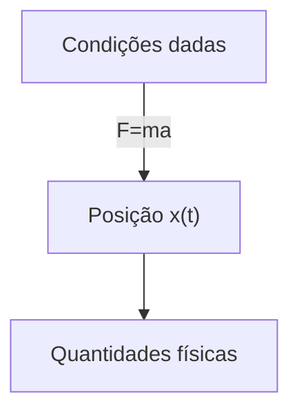
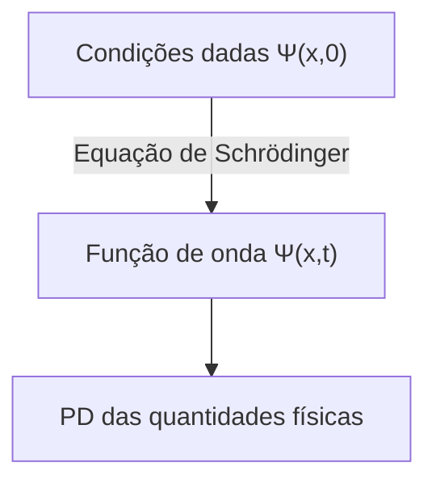

## TL;DR
> - Equação de Schrödinger (dependente do tempo): 
>
> $$ i\hbar\frac{\partial \Psi}{\partial t} = - \frac{\hbar^2}{2m}\frac{\partial^2 \Psi}{\partial x^2} + V\Psi $$
>
> - Interpretação estatística da função de onda $\Psi(x,t)$ (interpretação de Born): O quadrado do valor absoluto da função de onda $\|\Psi(x,t)\|^2$ é a **função de densidade de probabilidade** de encontrar a partícula na posição $x$ no tempo $t$.
> - Normalização da função de onda:
>   - $\int_{-\infty}^{\infty} \|\Psi(x,t)\|^2 dx = 1$
>   - Se $\Psi(x,t)$ é uma solução da equação de Schrödinger, então $A\Psi(x,t)$ também é uma solução para qualquer constante complexa $A$, e determinar a constante $A$ para satisfazer a equação acima é chamado de normalização
>   - **Soluções não normalizáveis** não podem representar partículas e, portanto, não são funções de onda válidas, e apenas soluções **quadrado-integráveis** são fisicamente possíveis
>   - Uma função de onda normalizada em um ponto no tempo permanece normalizada à medida que $\Psi$ muda com o tempo
> - Fluxo de probabilidade:
>   - $J(x,t) \equiv \cfrac{i\hbar}{2m}\left(\Psi\cfrac{\partial \Psi^\*}{\partial x}-\Psi^\*\cfrac{\partial \Psi}{\partial x}\right)$
>   - O fluxo (probabilidade por unidade de tempo) da probabilidade de encontrar a partícula passando pelo ponto $x$
>   - Se $P_{ab}(t)$ é a probabilidade de encontrar a partícula na região $a<x<b$ no tempo $t$, então $\cfrac{dP_{ab}}{dt} = J(a,t) - J(b,t)$
{: .prompt-info }

## Pré-requisitos
- Distribuição de probabilidade contínua e densidade de probabilidade

## Equação de Schrödinger
Vamos considerar uma situação em que uma partícula de massa $m$ se move ao longo do eixo $x$ sob uma força dada $F(x,t)$.

Na mecânica clássica, o principal objetivo é determinar a posição $x(t)$ da partícula em qualquer momento aplicando a equação de movimento de Newton $F=ma$. Este processo pode ser representado aproximadamente pelo seguinte diagrama:

Na mecânica quântica, o mesmo problema é abordado de uma maneira muito diferente. A abordagem da mecânica quântica é resolver a seguinte **equação de Schrödinger** para encontrar a **função de onda** $\Psi(x,t)$ da partícula:

$$ \begin{gather*}
i\hbar\frac{\partial \Psi}{\partial t} = - \frac{\hbar^2}{2m}\frac{\partial^2 \Psi}{\partial x^2} + V\Psi. \label{eqn:schrodinger_eqn}\tag{1}\\
\text{(} i=\sqrt{-1}\text{, } \hbar=\frac{h}{2\pi}=1.054573\times10^{-34}\text{, } h\text{: constante de Planck, } V(x)\text{: energia potencial)}
\end{gather*} $$

> *Fonte da imagem*
> - Autor: Usuário Xcodexif do Wikimedia
> - Licença: [CC BY-SA 4.0](https://creativecommons.org/licenses/by-sa/4.0/)

## Interpretação estatística da função de onda $\Psi(x,t)$ (Interpretação de Born)
Enquanto uma partícula na mecânica clássica está localizada em um ponto, a função de onda que representa o estado de uma partícula na mecânica quântica é uma função de $x$ para um dado $t$, ou seja, está espalhada no espaço. Como devemos interpretar o significado físico disso?

De acordo com a **interpretação estatística** de Born, o quadrado do valor absoluto da função de onda $\|\Psi(x,t)\|^2$ é a função de densidade de probabilidade de encontrar a partícula na posição $x$ no tempo $t$. Embora a própria função de onda $\Psi$ seja um número complexo, $\|\Psi\|^2=\Psi^\*\Psi$ ($\Psi^\*$ é o conjugado complexo de $\Psi$) é um número real não negativo, permitindo essa interpretação. Isso pode ser expresso como:

$$ \int_a^b |\Psi(x,t)|^2 dx = \text{probabilidade de encontrar a partícula entre }a\text{ e }b\text{ no tempo }t. \tag{2}$$

Essa interpretação estatística implica que a mecânica quântica incorpora uma espécie de **indeterminação**. Mesmo que se conheça tudo sobre a partícula (a função de onda), só se pode conhecer a distribuição de probabilidade dos possíveis resultados, não um valor específico.

Como isso era difícil de aceitar intuitivamente, naturalmente surgiram questões sobre se essa indeterminação era devido a algum defeito na mecânica quântica ou se era uma característica essencial da natureza.

## Perspectivas sobre a indeterminação quântica
Suponha que medimos a posição de uma partícula e descobrimos que ela está no ponto $C$. Então, onde estava a partícula imediatamente antes da medição?

### Posição realista

> "Deus não joga dados." ("God does not play dice.")  
> *por Albert Einstein*

A partícula estava originalmente em $C$. Esta é também a perspectiva de Einstein e Schrödinger. No entanto, deste ponto de vista, a mecânica quântica é uma teoria incompleta, pois na realidade a partícula estava exatamente em $C$, mas devido às limitações da teoria, só podemos conhecer a posição da partícula como uma distribuição de probabilidade até a medição. Ou seja, de acordo com esta visão, a indeterminação não é uma característica essencial da natureza, mas sim devido às limitações da mecânica quântica, e existe alguma variável oculta além de $\Psi$ que precisa ser conhecida para descrever perfeitamente a partícula.

> Schrödinger foi um aluno de Einstein e trabalhou como seu assistente por um tempo, e depois continuou a interagir com Einstein. É provável que sua posição realista e determinista também tenha sido influenciada por isso.
{: .prompt-info }

### Posição ortodoxa

> "Pare de dizer a Deus o que fazer com seus dados." ("Stop telling God what to do with his dice.")  
> *por Niels Bohr, em resposta à citação anterior de Einstein*
>
> "As observações não apenas perturbam o que deve ser medido, elas o produzem" ("Observations not only disturb what is to be measured, they produce it")  
> ...  
> "Nós a forçamos a assumir uma posição definida." ("We compel to assume a definite position.")  
> *por Pascual Jordan*

Até o momento imediatamente antes da medição, a partícula existe apenas na forma de uma distribuição de probabilidade e não está em nenhum lugar específico, e só quando o ato de medição é realizado é que a partícula aparece em uma posição específica. Esta interpretação é chamada de **interpretação de Copenhague**, proposta por Bohr e Heisenberg na Universidade de Copenhague.

> O interessante é que, semelhante à relação entre Einstein e Schrödinger, Heisenberg também era aluno de Bohr.
{: .prompt-info }

### Posição agnóstica

> "Não se deve quebrar a cabeça com o problema de se algo sobre o qual não se pode saber nada existe mesmo assim, assim como com a antiga questão de quantos anjos podem se sentar na ponta de uma agulha." ("One should no more rack one's brain about the problem of whether something one cannot know anything about exists all the same, than about the ancient question of how many angels are able to sit on the point of a needle.")  
> *por Wolfgang Pauli*

Recusa-se a responder. Qualquer que seja a afirmação sobre o estado da partícula antes da medição, se a única maneira de verificar se essa afirmação está correta é através da medição, então isso não é mais "antes da medição", então qual é o significado? É apenas metafísica discutir algo que é essencialmente impossível de testar e conhecer.

### Consenso atual
Em 1964, John Bell provou que há uma diferença observável dependendo se a partícula existe em uma posição exata ou não, seja antes ou depois da medição, excluindo assim a posição agnóstica, e posteriormente, através de experimentos, a interpretação de Copenhague se tornou a corrente principal. Portanto, a menos que seja especificado de outra forma, geralmente se pressupõe esta interpretação de Copenhague ao lidar com a mecânica quântica.

> Ainda existem outras interpretações que podem estar corretas além da interpretação de Copenhague, como as teorias de variáveis ocultas não locais (nonlocal hidden variable theories) ou a interpretação de muitos mundos (many worlds interpretation).
{: .prompt-info }

## Medição e colapso da função de onda
A partícula não tem uma posição exata até o momento da medição, e só através da medição é que ela adquire uma posição específica $C$ (na verdade, devido ao princípio da incerteza de Heisenberg, que será discutido em outro artigo posteriormente, mesmo esta posição não é um valor perfeitamente exato, mas tem uma pequena margem de erro). No entanto, se uma medição adicional for realizada imediatamente após esta primeira medição, não se obtém um valor diferente a cada medição, mas sempre o mesmo resultado. Isso é explicado da seguinte maneira:

No momento em que a primeira medição é realizada, a função de onda do objeto medido muda drasticamente, formando um gráfico de $\|\Psi(x,t)\|^2$ estreito e pontiagudo concentrado em torno do ponto $C$. Diz-se que a função de onda **colapsou** para o ponto $C$ devido à medição.

Ou seja, os processos físicos podem ser divididos em dois tipos distintos:
- Processo ordinário em que a função de onda muda lentamente de acordo com a equação de Schrödinger
- Processo de medição em que $\Psi$ colapsa repentina e descontinuamente

> A função de onda que colapsou devido à medição se espalha novamente espacialmente de acordo com a equação de Schrödinger à medida que o tempo passa. Portanto, para reproduzir o mesmo resultado de medição, a segunda medição deve ser realizada imediatamente.
{: .prompt-tip }

## Normalização da função de onda
Como o quadrado do valor absoluto da função de onda $\|\Psi(x,t)\|^2$ é a densidade de probabilidade de encontrar a partícula na posição $x$ no tempo $t$, a integral de $\|\Psi\|^2$ sobre todos os $x$ deve ser igual a 1.

$$ \int_{-\infty}^{\infty} |\Psi(x,t)|^2 dx = 1. \label{eqn:wavefunction_norm}\tag{3} $$

Na equação ($\ref{eqn:schrodinger_eqn}$), se $\Psi(x,t)$ é uma solução, então $A\Psi(x,t)$ também é uma solução para qualquer constante complexa $A$. Portanto, este $A$ deve ser determinado para satisfazer a equação ($\ref{eqn:wavefunction_norm}$), e este processo é chamado de normalização da função de onda. Algumas soluções da equação de Schrödinger divergem para o infinito quando integradas, e neste caso, não existe uma constante $A$ que satisfaça a equação ($\ref{eqn:wavefunction_norm}$). O mesmo acontece com a solução trivial $\Psi=0$. Essas **soluções não normalizáveis** não são funções de onda válidas, pois não podem representar partículas. Os estados fisicamente possíveis correspondem às soluções **quadrado-integráveis** da equação de Schrödinger.

Além disso, uma propriedade importante da equação de Schrödinger é que <u>uma função de onda normalizada em um ponto no tempo permanece normalizada ($\int_{-\infty}^{\infty} |\Psi(x,t)|^2 dx = 1$) à medida que $\Psi$ muda com o tempo</u>. Se tivéssemos que normalizar a função de onda com um valor $A$ diferente a cada ponto no tempo, $A$ não seria mais uma constante, mas uma função do tempo $t$, e não poderíamos mais encontrar soluções para a equação de Schrödinger. No entanto, devido a esta propriedade, o valor $A$ normalizado na condição inicial ($t=0$) é preservado independentemente do tempo $t$.

### Prova

$$ \frac{d}{dt}\int_{-\infty}^{\infty} |\Psi(x,t)|^2 dx = \int_{-\infty}^{\infty} \frac{\partial}{\partial t}|\Psi(x,t)|^2 dx. \label{eqn:norm_proof_1}\tag{4} $$

> Como o resultado da integração de $\|\Psi\|^2$ em relação a $x$ é uma função apenas de $t$, usamos a derivada total ($d/dt$) no lado esquerdo, mas como $\|\Psi\|^2$ em si é uma função de duas variáveis $x$ e $t$, usamos a derivada parcial ($\partial/\partial t$) no lado direito.
{: .prompt-tip }

A equação acima pode ser reescrita de acordo com a regra de derivação do produto como:

$$ \frac{\partial}{\partial t}|\Psi|^2 = \frac{\partial}{\partial t}(\Psi^*\Psi) = \Psi^*\frac{\partial \Psi}{\partial t} + \frac{\partial \Psi^*}{\partial t}\Psi. \label{eqn:norm_proof_2}\tag{5}$$

Multiplicando ambos os lados da equação de Schrödinger ($\ref{eqn:schrodinger_eqn}$) por $-\cfrac{i}{\hbar}$, obtemos:

$$ \frac{\partial \Psi}{\partial t} = \frac{i\hbar}{2m}\frac{\partial^2 \Psi}{\partial x^2}-\frac{i}{\hbar}V\Psi \label{eqn:norm_proof_3}\tag{6}$$

e tomando o conjugado complexo de $\cfrac{\partial \Psi}{\partial t}$ na equação acima, obtemos:

$$ \frac{\partial \Psi^*}{\partial t} = -\frac{i\hbar}{2m}\frac{\partial^2 \Psi^*}{\partial x^2}+\frac{i}{\hbar}V\Psi^* \label{eqn:norm_proof_4}\tag{7}$$

Agora, substituindo ($\ref{eqn:norm_proof_3}$) e ($\ref{eqn:norm_proof_4}$) em ($\ref{eqn:norm_proof_2}$), temos:

$$\begin{align*}
\frac{\partial}{\partial t}|\Psi|^2 &= \frac{i\hbar}{2m}\left(\Psi^*\frac{\partial^2\Psi}{\partial x^2}-\frac{\partial^2\Psi^*}{\partial x^2}\Psi\right) \\
&= \frac{\partial}{\partial x}\left[\frac{i\hbar}{2m}\left(\Psi^*\frac{\partial\Psi}{\partial x}-\frac{\partial\Psi^*}{\partial x}\Psi \right) \right] 
\end{align*} \label{eqn:norm_proof_5}\tag{8}$$

e substituindo isso no lado direito da equação original ($\ref{eqn:norm_proof_1}$), obtemos:

$$ \frac{d}{dt}\int_{-\infty}^{\infty} |\Psi(x,t)|^2 dx = \frac{i\hbar}{2m}\left(\Psi^*\frac{\partial\Psi}{\partial x}-\frac{\partial\Psi^*}{\partial x}\Psi \right)\Bigg|_{-\infty}^{\infty}. \label{eqn:norm_proof_6}\tag{9} $$

No entanto, para que a função de onda seja normalizada e fisicamente válida, $\Psi(x,t)$ deve convergir para 0 quando $x$ tende a $\pm\infty$. Portanto,

$$ \frac{d}{dt}\int_{-\infty}^{\infty} |\Psi(x,t)|^2 dx = 0 \label{eqn:norm_proof_fin}\tag{10} $$

o que significa que $\int_{-\infty}^{\infty} \|\Psi(x,t)\|^2 dx$ é uma constante independente do tempo.

$$ \therefore \text{Se }\Psi \text{ está normalizada em um ponto no tempo }t\text{, então está normalizada para todos os outros pontos no tempo }t. \blacksquare $$

## Fluxo de probabilidade (probability current)
Agora, vamos definir $P_{ab}(t)$ como a probabilidade de encontrar a partícula na região $a<x<b$ no tempo $t$. Então,

$$ P_{ab}(t) = \int_a^b |\Psi(x,t)|^2 dx \tag{11}$$

e,

$$ \begin{align*}
\frac{dP_{ab}}{dt} &= \frac{d}{dt}\int_a^b |\Psi(x,t)|^2 dx \\
&= \int_a^b \frac{\partial}{\partial t}|\Psi(x,t)|^2 dx \quad \text{(}\because\text{veja a equação }\ref{eqn:norm_proof_1}\text{)}\\
&= \int_a^b \left(\frac{\partial \Psi^*}{\partial t}\Psi + \Psi^*\frac{\partial \Psi}{\partial t} \right)dx \quad \text{(}\because\text{veja a equação }\ref{eqn:norm_proof_2}\text{)} \\
&= \frac{i\hbar}{2m}\int_a^b \left(\Psi^*\frac{\partial^2\Psi}{\partial x^2}-\frac{\partial^2\Psi^*}{\partial x^2}\Psi\right)dx \\
&= \frac{i\hbar}{2m}\int_a^b\frac{\partial}{\partial x}\left(\Psi^*\frac{\partial\Psi}{\partial x}-\frac{\partial\Psi^*}{\partial x}\Psi \right)dx \quad \text{(}\because\text{veja as equações }\ref{eqn:norm_proof_3},\ref{eqn:norm_proof_4},\ref{eqn:norm_proof_5}\text{)}\\
&= \frac{i\hbar}{2m}\left(\Psi^*\frac{\partial \Psi}{\partial x}-\frac{\partial \Psi^*}{\partial x}\Psi \right)\Bigg|^b_a \\
&= \frac{i\hbar}{2m}\left(\Psi\frac{\partial \Psi^*}{\partial x}-\Psi^*\frac{\partial \Psi}{\partial x} \right)\Bigg|^a_b
\end{align*} $$

Aqui, se definirmos

$$ J(x,t) \equiv \frac{i\hbar}{2m}\left(\Psi\frac{\partial \Psi^*}{\partial x}-\Psi^*\frac{\partial \Psi}{\partial x}\right) \label{eqn:probability_current}\tag{12}$$

então,

$$ \frac{dP_{ab}}{dt} = J(a,t) - J(b,t) \label{eqn:probability_over_time}\tag{13}$$

$J(x,t)$ definido pela equação ($\ref{eqn:probability_current}$) é chamado de **fluxo de probabilidade**, e representa o fluxo* (ou seja, a probabilidade por unidade de tempo) da probabilidade de encontrar a partícula passando pelo ponto $x$. Na equação ($\ref{eqn:probability_over_time}$), se o fluxo de probabilidade $J(a,t)$ entrando por uma extremidade em um determinado tempo $t$ for maior que o fluxo de probabilidade $J(b,t)$ saindo pela outra extremidade, $P_{ab}$ aumenta, e no caso contrário, diminui.

> *No fluxo (flow rate) da mecânica dos fluidos, a massa ou volume do fluido foi substituída aqui pela probabilidade.
{: .prompt-info }
