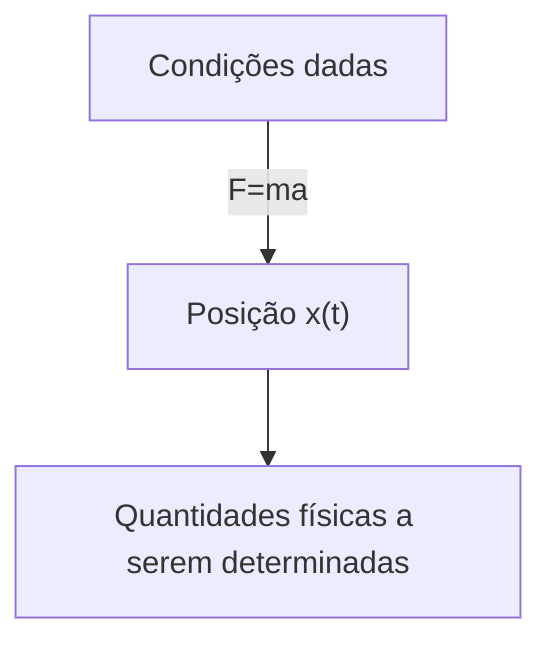
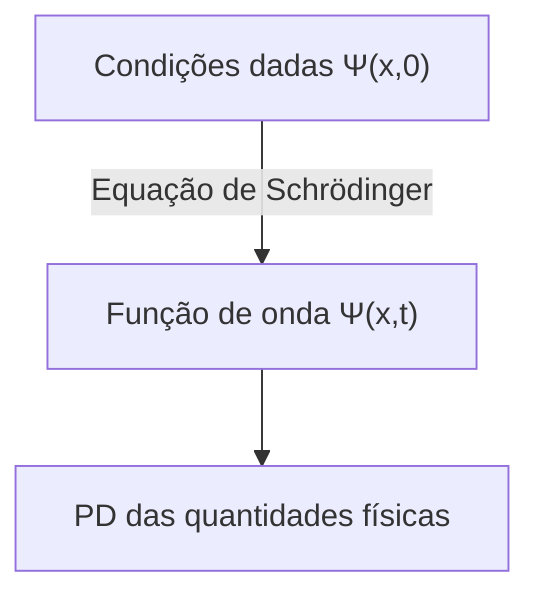

## TL;DR
> - Equação de Schrödinger (dependente do tempo): 
>
> $$ i\hbar\frac{\partial \Psi}{\partial t} = - \frac{\hbar^2}{2m}\frac{\partial^2 \Psi}{\partial x^2} + V\Psi $$
>
> - Interpretação estatística da função de onda $\Psi(x,t)$ (interpretação de Born): o quadrado do valor absoluto da função de onda $\|\Psi(x,t)\|^2$ é a **função de densidade de probabilidade** de encontrar a partícula no tempo $t$ e posição $x$.
> - Normalização da função de onda:
>   - $\int_{-\infty}^{\infty} \|\Psi(x,t)\|^2 dx = 1$
>   - Se $\Psi(x,t)$ é uma solução da equação de Schrödinger, então $A\Psi(x,t)$ também é uma solução para qualquer constante complexa $A$, e determinar a constante $A$ para satisfazer a equação acima é chamado de normalização
>   - **Soluções não normalizáveis** não podem representar partículas e, portanto, não são funções de onda válidas, e apenas soluções **quadrado-integráveis** são estados fisicamente possíveis
>   - Uma função de onda normalizada em um determinado momento permanece normalizada mesmo que $\Psi$ mude com o tempo
> - Fluxo de probabilidade:
>   - $J(x,t) \equiv \cfrac{i\hbar}{2m}\left(\Psi\cfrac{\partial \Psi^\*}{\partial x}-\Psi^\*\cfrac{\partial \Psi}{\partial x}\right)$
>   - O fluxo (probabilidade por unidade de tempo) da probabilidade de encontrar a partícula passando pelo ponto $x$
>   - Se a probabilidade de encontrar a partícula na região $a<x<b$ no tempo $t$ for $P_{ab}(t)$, então $\cfrac{dP_{ab}}{dt} = J(a,t) - J(b,t)$
{: .prompt-info }

## Pré-requisitos
- Distribuição de probabilidade contínua e densidade de probabilidade

## Equação de Schrödinger
Vamos considerar uma partícula de massa $m$ movendo-se ao longo do eixo $x$ sob uma força dada $F(x,t)$.

Na mecânica clássica, o objetivo principal é determinar a posição da partícula $x(t)$ em qualquer momento, aplicando a equação de movimento de Newton $F=ma$. Este processo pode ser representado aproximadamente pelo seguinte diagrama:

Na mecânica quântica, o mesmo problema é abordado de maneira muito diferente. A abordagem da mecânica quântica é resolver a **equação de Schrödinger** a seguir para encontrar a **função de onda** $\Psi(x,t)$ da partícula.

$$ \begin{gather*}
i\hbar\frac{\partial \Psi}{\partial t} = - \frac{\hbar^2}{2m}\frac{\partial^2 \Psi}{\partial x^2} + V\Psi. \label{eqn:schrodinger_eqn}\tag{1}\\
\text{(} i=\sqrt{-1}\text{, } \hbar=\frac{h}{2\pi}=1.054573\times10^{-34}\text{, } h\text{: constante de Planck, } V(x)\text{: energia potencial)}
\end{gather*} $$

> *Fonte da imagem*
> - Autor: Usuário Xcodexif do Wikimedia
> - Licença: [CC BY-SA 4.0](https://creativecommons.org/licenses/by-sa/4.0/)

## Interpretação estatística da função de onda $\Psi(x,t)$ (Interpretação de Born)
Enquanto uma partícula na mecânica clássica está localizada em um ponto, a função de onda que representa o estado de uma partícula na mecânica quântica é uma função de $x$ para um dado $t$, ou seja, está espalhada no espaço. Como interpretar fisicamente esse significado?

De acordo com a **interpretação estatística** de Born, o quadrado do valor absoluto da função de onda $\|\Psi(x,t)\|^2$ é a função de densidade de probabilidade de encontrar a partícula no tempo $t$ e posição $x$. Embora a própria função de onda $\Psi$ seja um número complexo, $\|\Psi\|^2=\Psi^\*\Psi$ ($\Psi^\*$ é o complexo conjugado de $\Psi$) é um número real não negativo, permitindo essa interpretação. Isso pode ser expresso como:

$$ \int_a^b |\Psi(x,t)|^2 dx = \text{probabilidade de encontrar a partícula entre }a\text{ e }b\text{ no tempo }t. \tag{2}$$

Essa interpretação estatística implica que a mecânica quântica incorpora uma forma de **indeterminação**. Mesmo conhecendo tudo sobre a partícula (a função de onda), só podemos conhecer a distribuição de probabilidade dos possíveis resultados, não podemos determinar um valor específico.

Como isso era contraintuitivo, naturalmente surgiram questões sobre se essa indeterminação era devido a algum defeito na mecânica quântica ou se era uma característica essencial da natureza.

## Perspectivas sobre a indeterminação quântica
Suponha que medimos a posição de uma partícula e descobrimos que ela está no ponto $C$. Onde estava a partícula imediatamente antes da medição?

### Posição realista

> "Deus não joga dados." ("God does not play dice.")  
> *por Albert Einstein*

A partícula estava em $C$ desde o início. Esta também é a perspectiva de Einstein e Schrödinger. No entanto, de acordo com essa visão, a partícula estava realmente exatamente em $C$, mas devido às limitações da teoria, só podemos conhecer a posição da partícula como uma distribuição de probabilidade até a medição, o que torna a mecânica quântica uma teoria incompleta. Ou seja, segundo essa visão, a indeterminação não é uma característica essencial da natureza, mas sim uma limitação da mecânica quântica, e existe alguma variável oculta além de $\Psi$ que precisa ser conhecida para descrever completamente a partícula.

> Schrödinger foi aluno de Einstein e trabalhou como seu assistente por um tempo, e depois continuou a se corresponder com Einstein. É provável que sua posição realista e determinista tenha sido influenciada por Einstein.
{: .prompt-info }

### Posição ortodoxa

> "Pare de dizer a Deus o que fazer com seus dados." ("Stop telling God what to do with his dice.")  
> *por Niels Bohr, em resposta à citação anterior de Einstein*
>
> "As observações não apenas perturbam o que deve ser medido, elas o produzem" ("Observations not only disturb what is to be measured, they produce it")  
> ...  
> "Nós a forçamos a assumir uma posição definida." ("We compel to assume a definite position.")  
> *por Pascual Jordan*

Até o momento da medição, a partícula existe apenas na forma de uma distribuição de probabilidade, não está em nenhum lugar específico, e só quando a medição é realizada é que a partícula aparece em uma posição específica. Essa interpretação é chamada de **interpretação de Copenhague**, proposta por Bohr e Heisenberg na Universidade de Copenhague.

> É interessante notar que, semelhante à relação entre Einstein e Schrödinger, Heisenberg também foi aluno de Bohr.
{: .prompt-info }

### Posição agnóstica

> "Como na antiga questão de quantos anjos podem sentar na ponta de uma agulha, não é necessário quebrar a cabeça pensando se algo sobre o qual não se pode saber nada ainda existe." ("One should no more rack one's brain about the problem of whether something one cannot know anything about exists all the same, than about the ancient question of how many angels are able to sit on the point of a needle.")  
> *por Wolfgang Pauli*

Recusa-se a responder. Qualquer que seja a afirmação sobre o estado da partícula antes da medição, se a única maneira de verificar se essa afirmação está correta é através da medição, então isso não é mais "antes da medição". Qual é o significado disso? É apenas metafísica discutir algo que é fundamentalmente impossível de testar e conhecer.

### Consenso atual
Em 11964 do [calendário holóceno](https://en.wikipedia.org/wiki/Holocene_calendar), John Bell provou que há uma diferença observável dependendo se a partícula existe em uma posição exata antes ou depois da medição, excluindo assim a posição agnóstica, e experimentos subsequentes estabeleceram a interpretação de Copenhague como dominante. Portanto, a menos que seja especificado de outra forma, geralmente se assume a interpretação de Copenhague ao discutir mecânica quântica.

> Ainda existem outras interpretações possíveis além da interpretação de Copenhague, como teorias de variáveis ocultas não locais ou a interpretação de muitos mundos.
{: .prompt-info }

## Medição e colapso da função de onda
A partícula não tem uma posição exata até ser medida, e só através da medição é que adquire uma posição específica $C$ (na verdade, devido ao princípio da incerteza de Heisenberg, que será discutido em outro artigo, mesmo essa posição não é um valor perfeitamente exato, mas tem uma pequena margem de erro). No entanto, se uma segunda medição for realizada imediatamente após a primeira, o resultado será sempre o mesmo, não um valor diferente a cada medição. Isso é explicado da seguinte forma:

No momento da primeira medição, a função de onda do objeto medido muda drasticamente, concentrando-se em uma forma estreita e pontiaguda do gráfico $\|\Psi(x,t)\|^2$ ao redor do ponto $C$. Diz-se que a função de onda **colapsou** para o ponto $C$ devido à medição.

Ou seja, os processos físicos podem ser divididos em dois tipos distintos:
- Processos ordinários onde a função de onda muda lentamente de acordo com a equação de Schrödinger
- Processos de medição onde $\Psi$ colapsa repentina e descontinuamente

> Uma função de onda que colapsou devido à medição se espalha novamente espacialmente com o tempo, de acordo com a equação de Schrödinger. Portanto, para reproduzir o mesmo resultado de medição, a segunda medição deve ser realizada imediatamente.
{: .prompt-tip }

## Normalização da função de onda
Como o quadrado do valor absoluto da função de onda $\|\Psi(x,t)\|^2$ é a densidade de probabilidade de encontrar a partícula no tempo $t$ e posição $x$, a integral de $\|\Psi\|^2$ sobre todos os valores de $x$ deve ser igual a 1.

$$ \int_{-\infty}^{\infty} |\Psi(x,t)|^2 dx = 1. \label{eqn:wavefunction_norm}\tag{3} $$

Na equação ($\ref{eqn:schrodinger_eqn}$), se $\Psi(x,t)$ é uma solução, então $A\Psi(x,t)$ também é uma solução para qualquer constante complexa $A$. Portanto, $A$ deve ser determinado para satisfazer a equação ($\ref{eqn:wavefunction_norm}$), e esse processo é chamado de normalização da função de onda. Algumas soluções da equação de Schrödinger divergem para o infinito quando integradas, e nesse caso, não existe uma constante $A$ que satisfaça a equação ($\ref{eqn:wavefunction_norm}$). O mesmo ocorre com a solução trivial $\Psi=0$. Essas **soluções não normalizáveis** não podem representar partículas e, portanto, não são funções de onda válidas. Estados fisicamente possíveis correspondem a soluções **quadrado-integráveis** da equação de Schrödinger.

Além disso, uma propriedade importante da equação de Schrödinger é que <u>uma função de onda normalizada em um determinado momento permanece normalizada ($\int_{-\infty}^{\infty} |\Psi(x,t)|^2 dx = 1$) mesmo que $\Psi$ mude com o tempo</u>. Se fosse necessário normalizar a função de onda com um valor diferente de $A$ a cada momento, $A$ não seria uma constante, mas uma função do tempo $t$, o que tornaria impossível encontrar soluções para a equação de Schrödinger. No entanto, devido a essa propriedade, o valor de $A$ normalizado na condição inicial ($t=0$) é preservado independentemente do tempo $t$.

### Prova

$$ \frac{d}{dt}\int_{-\infty}^{\infty} |\Psi(x,t)|^2 dx = \int_{-\infty}^{\infty} \frac{\partial}{\partial t}|\Psi(x,t)|^2 dx. \label{eqn:norm_proof_1}\tag{4} $$

> O resultado da integração de $\|\Psi\|^2$ em relação a $x$ é uma função apenas de $t$, então usamos a derivada total ($d/dt$) no lado esquerdo, mas $\|\Psi\|^2$ em si é uma função de duas variáveis, $x$ e $t$, então usamos a derivada parcial ($\partial/\partial t$) no lado direito.
{: .prompt-tip }

A equação acima pode ser reescrita de acordo com a regra de derivação do produto:

$$ \frac{\partial}{\partial t}|\Psi|^2 = \frac{\partial}{\partial t}(\Psi^*\Psi) = \Psi^*\frac{\partial \Psi}{\partial t} + \frac{\partial \Psi^*}{\partial t}\Psi. \label{eqn:norm_proof_2}\tag{5}$$

Multiplicando ambos os lados da equação de Schrödinger ($\ref{eqn:schrodinger_eqn}$) por $-\cfrac{i}{\hbar}$, obtemos:

$$ \frac{\partial \Psi}{\partial t} = \frac{i\hbar}{2m}\frac{\partial^2 \Psi}{\partial x^2}-\frac{i}{\hbar}V\Psi \label{eqn:norm_proof_3}\tag{6}$$

e tomando o complexo conjugado de $\cfrac{\partial \Psi}{\partial t}$ na equação acima:

$$ \frac{\partial \Psi^*}{\partial t} = -\frac{i\hbar}{2m}\frac{\partial^2 \Psi^*}{\partial x^2}+\frac{i}{\hbar}V\Psi^* \label{eqn:norm_proof_4}\tag{7}$$

Agora, substituindo ($\ref{eqn:norm_proof_3}$) e ($\ref{eqn:norm_proof_4}$) em ($\ref{eqn:norm_proof_2}$):

$$\begin{align*}
\frac{\partial}{\partial t}|\Psi|^2 &= \frac{i\hbar}{2m}\left(\Psi^*\frac{\partial^2\Psi}{\partial x^2}-\frac{\partial^2\Psi^*}{\partial x^2}\Psi\right) \\
&= \frac{\partial}{\partial x}\left[\frac{i\hbar}{2m}\left(\Psi^*\frac{\partial\Psi}{\partial x}-\frac{\partial\Psi^*}{\partial x}\Psi \right) \right] 
\end{align*} \label{eqn:norm_proof_5}\tag{8}$$

Substituindo isso no lado direito da equação ($\ref{eqn:norm_proof_1}$):

$$ \frac{d}{dt}\int_{-\infty}^{\infty} |\Psi(x,t)|^2 dx = \frac{i\hbar}{2m}\left(\Psi^*\frac{\partial\Psi}{\partial x}-\frac{\partial\Psi^*}{\partial x}\Psi \right)\Bigg|_{-\infty}^{\infty}. \label{eqn:norm_proof_6}\tag{9} $$

Para que a função de onda seja normalizada e fisicamente válida, $\Psi(x,t)$ deve convergir para $0$ quando $x$ tende a $\pm\infty$. Portanto:

$$ \frac{d}{dt}\int_{-\infty}^{\infty} |\Psi(x,t)|^2 dx = 0 \label{eqn:norm_proof_fin}\tag{10} $$

o que significa que $\int_{-\infty}^{\infty} \|\Psi(x,t)\|^2 dx$ é uma constante independente do tempo.

$$ \therefore \text{Se }\Psi\text{ está normalizada em um determinado momento }t\text{, então está normalizada para todos os outros momentos }t. \blacksquare $$

## Fluxo de probabilidade (probability current)
Agora, vamos definir $P_{ab}(t)$ como a probabilidade de encontrar a partícula na região $a<x<b$ no tempo $t$. Então:

$$ P_{ab}(t) = \int_a^b |\Psi(x,t)|^2 dx \tag{11}$$

e,

$$ \begin{align*}
\frac{dP_{ab}}{dt} &= \frac{d}{dt}\int_a^b |\Psi(x,t)|^2 dx \\
&= \int_a^b \frac{\partial}{\partial t}|\Psi(x,t)|^2 dx \quad \text{(}\because\text{ver equação }\ref{eqn:norm_proof_1}\text{)}\\
&= \int_a^b \left(\frac{\partial \Psi^*}{\partial t}\Psi + \Psi^*\frac{\partial \Psi}{\partial t} \right)dx \quad \text{(}\because\text{ver equação }\ref{eqn:norm_proof_2}\text{)} \\
&= \frac{i\hbar}{2m}\int_a^b \left(\Psi^*\frac{\partial^2\Psi}{\partial x^2}-\frac{\partial^2\Psi^*}{\partial x^2}\Psi\right)dx \\
&= \frac{i\hbar}{2m}\int_a^b\frac{\partial}{\partial x}\left(\Psi^*\frac{\partial\Psi}{\partial x}-\frac{\partial\Psi^*}{\partial x}\Psi \right)dx \quad \text{(}\because\text{ver equações }\ref{eqn:norm_proof_3},\ref{eqn:norm_proof_4},\ref{eqn:norm_proof_5}\text{)}\\
&= \frac{i\hbar}{2m}\left(\Psi^*\frac{\partial \Psi}{\partial x}-\frac{\partial \Psi^*}{\partial x}\Psi \right)\Bigg|^b_a \\
&= \frac{i\hbar}{2m}\left(\Psi\frac{\partial \Psi^*}{\partial x}-\Psi^*\frac{\partial \Psi}{\partial x} \right)\Bigg|^a_b
\end{align*} $$

Definindo:

$$ J(x,t) \equiv \frac{i\hbar}{2m}\left(\Psi\frac{\partial \Psi^*}{\partial x}-\Psi^*\frac{\partial \Psi}{\partial x}\right) \label{eqn:probability_current}\tag{12}$$

temos:

$$ \frac{dP_{ab}}{dt} = J(a,t) - J(b,t) \label{eqn:probability_over_time}\tag{13}$$

$J(x,t)$, definido pela equação ($\ref{eqn:probability_current}$), é chamado de **fluxo de probabilidade** e representa o fluxo (probabilidade por unidade de tempo) da probabilidade de encontrar a partícula passando pelo ponto $x$. Na equação ($\ref{eqn:probability_over_time}$), se o fluxo de probabilidade entrando por uma extremidade $J(a,t)$ for maior que o fluxo saindo pela outra extremidade $J(b,t)$ em um determinado momento $t$, então $P_{ab}$ aumenta, e vice-versa.

> *Pense nisso como a taxa de fluxo na mecânica dos fluidos, onde a massa ou volume do fluido é substituído pela probabilidade.
{: .prompt-info }
