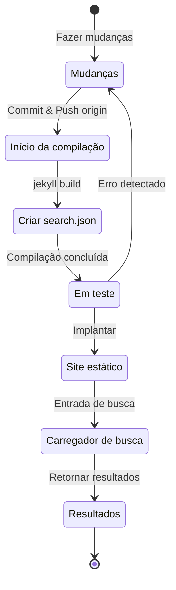

## Visão geral
Há cerca de 4 meses, no início de julho de 2024, adicionei suporte multilíngue a este blog, que é hospedado via GitHub Pages baseado em Jekyll, aplicando o plugin [Polyglot](https://github.com/untra/polyglot).
Esta série compartilha os bugs encontrados ao aplicar o plugin Polyglot ao tema Chirpy, o processo de resolução e como escrever cabeçalhos html e sitemap.xml considerando SEO.
A série consiste em 2 posts, e este que você está lendo é o segundo post da série.
- Parte 1: [Aplicando o plugin Polyglot e implementando tags alt hreflang, sitemap e botão de seleção de idioma](/posts/how-to-support-multi-language-on-jekyll-blog-with-polyglot-1)
- Parte 2: Solução de problemas de falha na compilação do tema Chirpy e erros na função de busca (este post)

## Requisitos
- [x] Deve ser possível fornecer o resultado da compilação (páginas web) separado por caminhos de idioma (ex. `/posts/pt-BR/`{: .filepath}, `/posts/ja/`{: .filepath}).
- [x] Para minimizar o tempo e esforço adicionais necessários para suporte multilíngue, deve ser possível reconhecer automaticamente o idioma com base no caminho local onde o arquivo markdown original está localizado (ex. `/_posts/pt-BR/`{: .filepath}, `/_posts/ja/`{: .filepath}) durante a compilação, sem ter que especificar manualmente as tags 'lang' e 'permalink' no YAML front matter de cada arquivo markdown escrito.
- [x] O cabeçalho de cada página do site deve incluir meta tags Content-Language apropriadas e tags alternativas hreflang para atender às diretrizes de SEO do Google para pesquisa multilíngue.
- [x] Deve ser possível fornecer links para todas as páginas que suportam cada idioma no site sem omissões no `sitemap.xml`{: .filepath}, e o próprio `sitemap.xml`{: .filepath} deve existir apenas uma vez no caminho raiz, sem duplicações.
- [x] Todas as funcionalidades fornecidas pelo [tema Chirpy](https://github.com/cotes2020/jekyll-theme-chirpy) devem funcionar normalmente em cada página de idioma, e caso contrário, devem ser modificadas para funcionar corretamente.
  - [x] Funcionamento normal das funcionalidades 'Recently Updated', 'Trending Tags'
  - [x] Sem erros no processo de compilação usando GitHub Actions
  - [x] Funcionamento normal da função de busca de posts no canto superior direito do blog

## Antes de começar
Este post é uma continuação da [Parte 1](/posts/how-to-support-multi-language-on-jekyll-blog-with-polyglot-1), então recomendo ler o post anterior primeiro se ainda não o fez.

## Solução de problemas ('relative_url_regex': target of repeat operator is not specified)
Após concluir as etapas anteriores, ao executar o comando `bundle exec jekyll serve` para testar a compilação, ocorreu um erro dizendo `'relative_url_regex': target of repeat operator is not specified` e a compilação falhou.

```shell
...(omitido)
                    ------------------------------------------------
      Jekyll 4.3.4   Please append `--trace` to the `serve` command 
                     for any additional information or backtrace. 
                    ------------------------------------------------
/Users/yunseo/.gem/ruby/3.2.2/gems/jekyll-polyglot-1.8.1/lib/jekyll/polyglot/
patches/jekyll/site.rb:234:in `relative_url_regex': target of repeat operator 
is not specified: /href="?\/((?:(?!*.gem)(?!*.gemspec)(?!tools)(?!README.md)(
?!LICENSE)(?!*.config.js)(?!rollup.config.js)(?!package*.json)(?!.sass-cache)
(?!.jekyll-cache)(?!gemfiles)(?!Gemfile)(?!Gemfile.lock)(?!node_modules)(?!ve
ndor\/bundle\/)(?!vendor\/cache\/)(?!vendor\/gems\/)(?!vendor\/ruby\/)(?!en\/
)(?!ko\/)(?!es\/)(?!pt-BR\/)(?!ja\/)(?!fr\/)(?!de\/)[^,'"\s\/?.]+\.?)*(?:\/[^
\]\[)("'\s]*)?)"/ (RegexpError)

...(omitido)
```

Ao pesquisar se um problema semelhante já havia sido relatado, encontrei [exatamente o mesmo problema](https://github.com/untra/polyglot/issues/204) já registrado no repositório do Polyglot, e também havia uma solução.

No arquivo [`_config.yml`{: .filepath}](https://github.com/cotes2020/jekyll-theme-chirpy/blob/master/_config.yml) do [tema Chirpy](https://github.com/cotes2020/jekyll-theme-chirpy) que estou aplicando a este blog, existe a seguinte sintaxe:

```yml
exclude:
  - "*.gem"
  - "*.gemspec"
  - docs
  - tools
  - README.md
  - LICENSE
  - "*.config.js"
  - package*.json
```
{: file='_config.yml'}

A causa do problema está nas expressões regulares das duas funções incluídas no arquivo [`site.rb`{: .filepath}](https://github.com/untra/polyglot/blob/master/lib/jekyll/polyglot/patches/jekyll/site.rb) do Polyglot, que não processam corretamente padrões de globbing contendo curingas como `"*.gem"`, `"*.gemspec"`, `"*.config.js"`.


```ruby
    # uma regex que corresponde a urls relativas em um documento html
    # corresponde a href="baseurl/foo/bar-baz" href="/foo/bar-baz" e outros semelhantes
    # evita corresponder a arquivos excluídos. prepare garante
    # que todos os diretórios @exclude tenham uma barra no final.
    def relative_url_regex(disabled = false)
      regex = ''
      unless disabled
        @exclude.each do |x|
          regex += "(?!#{x})"
        end
        @languages.each do |x|
          regex += "(?!#{x}\/)"
        end
      end
      start = disabled ? 'ferh' : 'href'
      %r{#{start}="?#{@baseurl}/((?:#{regex}[^,'"\s/?.]+\.?)*(?:/[^\]\[)("'\s]*)?)"}
    end

    # uma regex que corresponde a urls absolutas em um documento html
    # corresponde a href="http://baseurl/foo/bar-baz" e outros semelhantes
    # evita corresponder a arquivos excluídos. prepare garante
    # que todos os diretórios @exclude tenham uma barra no final.
    def absolute_url_regex(url, disabled = false)
      regex = ''
      unless disabled
        @exclude.each do |x|
          regex += "(?!#{x})"
        end
        @languages.each do |x|
          regex += "(?!#{x}\/)"
        end
      end
      start = disabled ? 'ferh' : 'href'
      %r{(?<!hreflang="#{@default_lang}" )#{start}="?#{url}#{@baseurl}/((?:#{regex}[^,'"\s/?.]+\.?)*(?:/[^\]\[)("'\s]*)?)"}
    end
```
{: file='(caminho raiz do polyglot)/lib/jekyll/polyglot/patches/jekyll/site.rb'}


Existem duas maneiras de resolver este problema.

### 1. Fazer um fork do Polyglot, modificar a parte problemática e usar
No momento da escrita deste post (novembro de 2024), a [documentação oficial do Jekyll](https://jekyllrb.com/docs/configuration/options/#global-configuration) afirma que a configuração `exclude` suporta o uso de padrões de globbing.

>"Esta opção de configuração suporta padrões de globbing de nomes de arquivo do Ruby File.fnmatch para corresponder a várias entradas a serem excluídas."

Ou seja, a causa do problema não está no tema Chirpy, mas nas duas funções `relative_url_regex()` e `absolute_url_regex()` do Polyglot, então modificá-las para que o problema não ocorra é a solução fundamental.

Como o bug ainda não foi resolvido no Polyglot, você pode fazer um fork do repositório do Polyglot e modificar a parte problemática conforme [este post de blog](https://hionpu.com/posts/github_blog_4#4-polyglot-%EC%9D%98%EC%A1%B4%EC%84%B1-%EB%AC%B8%EC%A0%9C) e [a resposta dada ao problema do GitHub mencionado anteriormente](https://github.com/untra/polyglot/issues/204#issuecomment-2143270322), e então usar isso em vez do Polyglot original.


```ruby
    def relative_url_regex(disabled = false)
      regex = ''
      unless disabled
        @exclude.each do |x|
          escaped_x = Regexp.escape(x)
          regex += "(?!#{escaped_x})"
        end
        @languages.each do |x|
          escaped_x = Regexp.escape(x)
          regex += "(?!#{escaped_x}\/)"
        end
      end
      start = disabled ? 'ferh' : 'href'
      %r{#{start}="?#{@baseurl}/((?:#{regex}[^,'"\s/?.]+\.?)*(?:/[^\]\[)("'\s]*)?)"}
    end

    def absolute_url_regex(url, disabled = false)
      regex = ''
      unless disabled
        @exclude.each do |x|
          escaped_x = Regexp.escape(x)
          regex += "(?!#{escaped_x})"
        end
        @languages.each do |x|
          escaped_x = Regexp.escape(x)
          regex += "(?!#{escaped_x}\/)"
        end
      end
      start = disabled ? 'ferh' : 'href'
      %r{(?<!hreflang="#{@default_lang}" )#{start}="?#{url}#{@baseurl}/((?:#{regex}[^,'"\s/?.]+\.?)*(?:/[^\]\[)("'\s]*)?)"}
    end
```
{: file='(caminho raiz do polyglot)/lib/jekyll/polyglot/patches/jekyll/site.rb'}


### 2. Substituir padrões de globbing por nomes de arquivo exatos no arquivo de configuração '_config.yml' do tema Chirpy
Na verdade, o método ideal e correto seria refletir o patch acima no mainstream do Polyglot. No entanto, até lá, seria necessário usar a versão bifurcada, o que seria inconveniente para acompanhar e refletir as atualizações do upstream do Polyglot sempre que houver uma atualização de versão, então eu usei um método diferente.

Se você verificar os arquivos localizados no caminho raiz do projeto no [repositório do tema Chirpy](https://github.com/cotes2020/jekyll-theme-chirpy) que correspondem aos padrões `"*.gem"`, `"*.gemspec"`, `"*.config.js"`, há apenas 3:
- `jekyll-theme-chirpy.gemspec`{: .filepath}
- `purgecss.config.js`{: .filepath}
- `rollup.config.js`{: .filepath}

Portanto, se você remover os padrões de globbing da sintaxe `exclude` no arquivo `_config.yml`{: .filepath} e reescrevê-los como segue, o Polyglot poderá processá-los sem problemas.

```yml
exclude: # Modificado com referência ao problema https://github.com/untra/polyglot/issues/204.
  # - "*.gem"
  - jekyll-theme-chirpy.gemspec # - "*.gemspec"
  - tools
  - README.md
  - LICENSE
  - purgecss.config.js # - "*.config.js"
  - rollup.config.js
  - package*.json
```
{: file='_config.yml'}

## Modificação da função de busca
Após concluir as etapas anteriores, quase todas as funcionalidades do site funcionavam satisfatoriamente como pretendido. No entanto, descobri tardiamente que havia um problema com a barra de busca localizada no canto superior direito da página que aplica o tema Chirpy: ela não indexava páginas em idiomas diferentes de `site.default_lang` (no caso deste blog, inglês) e, ao pesquisar em idiomas diferentes do inglês, ainda exibia páginas em inglês nos resultados da busca.

Para entender a causa, vamos examinar quais arquivos estão envolvidos na funcionalidade de busca e onde o problema ocorre.

### '_layouts/default.html'
Verificando o arquivo [`_layouts/default.html`{: .filepath}](https://github.com/cotes2020/jekyll-theme-chirpy/blob/master/_layouts/default.html) que constitui o template para todas as páginas do blog, podemos ver que dentro do elemento `<body>`, o conteúdo de `search-results.html`{: .filepath} e `search-loader.html`{: .filepath} está sendo carregado.


```liquid
  <body>
    

    <div id="main-wrapper" class="d-flex justify-content-center">
      <div class="container d-flex flex-column px-xxl-5">
        
        (...omitido...)

        
      </div>

      <aside aria-label="Scroll to Top">
        <button id="back-to-top" type="button" class="btn btn-lg btn-box-shadow">
          <i class="fas fa-angle-up"></i>
        </button>
      </aside>
    </div>

    (...omitido...)

    
  </body>
```
{: file='_layouts/default.html'}


### '_includes/search-result.html'
[`_includes/search-result.html`{: .filepath}](https://github.com/cotes2020/jekyll-theme-chirpy/blob/master/_includes/search-results.html) constitui o container `search-results` para armazenar os resultados da busca para a palavra-chave inserida na caixa de busca.


```html
<!-- Os resultados da busca -->

<div id="search-result-wrapper" class="d-flex justify-content-center d-none">
  <div class="col-11 content">
    <div id="search-hints">
      
    </div>
    <div id="search-results" class="d-flex flex-wrap justify-content-center text-muted mt-3"></div>
  </div>
</div>
```
{: file='_includes/search-result.html'}


### '_includes/search-loader.html'
[`_includes/search-loader.html`{: .filepath}](https://github.com/cotes2020/jekyll-theme-chirpy/blob/master/_includes/search-loader.html) é a parte central que implementa a busca baseada na biblioteca [Simple-Jekyll-Search](https://github.com/christian-fei/Simple-Jekyll-Search). Podemos ver que ela funciona do lado do cliente, executando JavaScript no navegador do visitante para encontrar partes correspondentes à palavra-chave de entrada no conteúdo do arquivo de índice [`search.json`{: .filepath}](#assetsjsdatasearchjson) e retornar o link do post correspondente como um elemento `<article>`.


```js

  <article class="px-1 px-sm-2 px-lg-4 px-xl-0">
    <header>
      <h2><a href="{url}">{title}</a></h2>
      <div class="post-meta d-flex flex-column flex-sm-row text-muted mt-1 mb-1">
        {categories}
        {tags}
      </div>
    </header>
    <p>{snippet}</p>
  </article>


<p class="mt-5">{{ site.data.locales[include.lang].search.no_results }}</p>

<script>
   Nota: a biblioteca dependente será carregada em `js-selector.html` 
  document.addEventListener('DOMContentLoaded', () => {
    SimpleJekyllSearch({
      searchInput: document.getElementById('search-input'),
      resultsContainer: document.getElementById('search-results'),
      json: '{{ '/assets/js/data/search.json' | relative_url }}',
      searchResultTemplate: '{{ result_elem | strip_newlines }}',
      noResultsText: '{{ not_found }}',
      templateMiddleware: function(prop, value, template) {
        if (prop === 'categories') {
          if (value === '') {
            return `${value}`;
          } else {
            return `<div class="me-sm-4"><i class="far fa-folder fa-fw"></i>${value}</div>`;
          }
        }

        if (prop === 'tags') {
          if (value === '') {
            return `${value}`;
          } else {
            return `<div><i class="fa fa-tag fa-fw"></i>${value}</div>`;
          }
        }
      }
    });
  });
</script>
```
{: file='_includes/search-loader.html'}


### '/assets/js/data/search.json'

```liquid
---
layout: compress
swcache: true
---

[
  
  {
    "title": {{ post.title | jsonify }},
    "url": {{ post.url | relative_url | jsonify }},
    "categories": {{ post.categories | join: ', ' | jsonify }},
    "tags": {{ post.tags | join: ', ' | jsonify }},
    "date": "{{ post.date }}",
    
    
    "snippet": {{ _content | truncate: 200 | jsonify }},
    "content": {{ _content | jsonify }}
  },
  
]
```
{: file='/assets/js/data/search.json'}


Ele define um arquivo JSON usando a sintaxe Liquid do Jekyll para incluir o título, URL, informações de categoria e tag, data de criação, um snippet dos primeiros 200 caracteres do conteúdo e o conteúdo completo de todos os posts no site.

### Estrutura de funcionamento da função de busca e identificação da parte problemática
Em resumo, ao hospedar o tema Chirpy no GitHub Pages, a função de busca opera no seguinte processo:



Aqui, confirmei que `search.json`{: .filepath} é gerado pelo Polyglot para cada idioma da seguinte forma:
- `/assets/js/data/search.json`{: .filepath}
- `/pt-BR/assets/js/data/search.json`{: .filepath}
- `/es/assets/js/data/search.json`{: .filepath}
- `/ko/assets/js/data/search.json`{: .filepath}
- `/ja/assets/js/data/search.json`{: .filepath}
- `/fr/assets/js/data/search.json`{: .filepath}
- `/de/assets/js/data/search.json`{: .filepath}

Portanto, a parte que causa o problema é o "Carregador de busca". O problema de páginas em idiomas diferentes do inglês não serem pesquisadas ocorre porque `_includes/search-loader.html`{: .filepath} carrega estaticamente apenas o arquivo de índice em inglês (`/assets/js/data/search.json`{: .filepath}), independentemente do idioma da página que está sendo visitada atualmente.

> - No entanto, diferentemente dos arquivos markdown ou html, para arquivos JSON, o wrapper Polyglot funciona para variáveis fornecidas pelo Jekyll como `post.title`, `post.content`, etc., mas parece que a funcionalidade [Relativized Local Urls](https://github.com/untra/polyglot?tab=readme-ov-file#relativized-local-urls) não funciona.
> - Da mesma forma, confirmei durante o processo de teste que dentro do template do arquivo JSON, não é possível acessar as [tags liquid `{{ site.default_lang }}`, `{{ site.active_lang }}` adicionalmente fornecidas pelo Polyglot](https://github.com/untra/polyglot?tab=readme-ov-file#features) além das variáveis padrão fornecidas pelo Jekyll.
>
> Portanto, enquanto valores como `title`, `snippet`, `content` no arquivo de índice são gerados diferentemente para cada idioma, o valor `url` retorna o caminho padrão sem considerar o idioma, e um tratamento apropriado para isso deve ser adicionado na parte do "Carregador de busca".
{: .prompt-warning }

### Resolução do problema
Para resolver isso, você pode modificar o conteúdo de `_includes/search-loader.html`{: .filepath} da seguinte forma:


```

  <article class="px-1 px-sm-2 px-lg-4 px-xl-0">
    <header>
      
      <h2><a href="/{{ site.active_lang }}{url}">{title}</a></h2>
      
      <h2><a href="{url}">{title}</a></h2>
      

(...omitido...)

<script>
   Nota: a biblioteca dependente será carregada em `js-selector.html` 
  document.addEventListener('DOMContentLoaded', () => {
    
    
      
    
    
    SimpleJekyllSearch({
      searchInput: document.getElementById('search-input'),
      resultsContainer: document.getElementById('search-results'),
      json: '{{ search_path | relative_url }}',
      searchResultTemplate: '{{ result_elem | strip_newlines }}',

(...omitido)
```
{: file='_includes/search-loader.html'}


- Modifiquei a sintaxe liquid na parte `` para adicionar o prefixo `"/{{ site.active_lang }}"` na frente da URL do post carregada do arquivo JSON quando `site.active_lang` (idioma da página atual) e `site.default_lang` (idioma padrão do site) são diferentes.
- Da mesma forma, modifiquei a parte `<script>` para designar `search_path` como o caminho padrão (`/assets/js/data/search.json`{: .filepath}) se o idioma da página atual e o idioma padrão do site forem os mesmos durante o processo de compilação, e o caminho apropriado para o idioma correspondente (por exemplo, `/pt-BR/assets/js/data/search.json`{: .filepath}) se forem diferentes.

Após fazer essas modificações e recompilar o site, confirmei que os resultados da busca são exibidos corretamente para cada idioma.

> Como `{url}` é um espaço reservado para o valor da URL lido do arquivo JSON posteriormente, e não uma URL em si, o Polyglot não o reconhece como alvo de localização, então deve ser tratado diretamente de acordo com o idioma. O problema é que `"/{{ site.active_lang }}{url}"` é reconhecido como uma URL, e embora a localização já tenha sido concluída, o Polyglot não sabe disso e tenta realizar a localização novamente (por exemplo, `"/pt-BR/pt-BR/posts/example-post"`{: .filepath}). Para evitar isso, especifiquei a [tag ``](https://github.com/untra/polyglot?tab=readme-ov-file#disabling-url-relativizing).
{: .prompt-tip }
