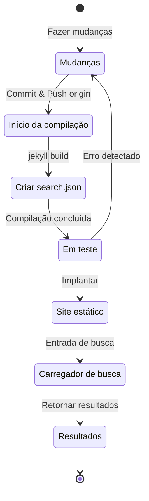

## Visão geral
No início de julho de 2024, há cerca de 4 meses, adicionei suporte multilíngue ao meu blog hospedado no GitHub Pages baseado em Jekyll aplicando o plugin [Polyglot](https://github.com/untra/polyglot).
Esta série compartilha os bugs encontrados ao aplicar o plugin Polyglot ao tema Chirpy, o processo de resolução, e como escrever cabeçalhos HTML e sitemap.xml considerando SEO.
A série consiste em 2 posts, e este que você está lendo é o segundo post da série.
- Parte 1: [Aplicando o plugin Polyglot & implementando tags hreflang alt, sitemap e botão de seleção de idioma](/posts/how-to-support-multi-language-on-jekyll-blog-with-polyglot-1)
- Parte 2: Solução de problemas de falha de compilação do tema Chirpy e erros na função de busca (este post)

## Requisitos
- [x] Deve ser possível fornecer o resultado da compilação (páginas web) separado por caminhos de idioma (ex. `/posts/ko/`{: .filepath}, `/posts/ja/`{: .filepath}).
- [x] Para minimizar o tempo e esforço adicionais necessários para o suporte multilíngue, deve ser possível reconhecer automaticamente o idioma com base no caminho local onde o arquivo está localizado (ex. `/_posts/ko/`{: .filepath}, `/_posts/ja/`{: .filepath}) durante a compilação, sem ter que especificar manualmente as tags 'lang' e 'permalink' no YAML front matter do arquivo markdown original.
- [x] O cabeçalho de cada página do site deve incluir meta tags Content-Language apropriadas e tags hreflang alternativas para atender às diretrizes de SEO para busca multilíngue do Google.
- [x] Deve ser possível fornecer links para todas as páginas que suportam cada idioma no site sem omissões no `sitemap.xml`, e o próprio `sitemap.xml` deve existir apenas uma vez no caminho raiz, sem duplicações.
- [x] Todas as funcionalidades fornecidas pelo [tema Chirpy](https://github.com/cotes2020/jekyll-theme-chirpy) devem funcionar normalmente em cada página de idioma, caso contrário, devem ser modificadas para funcionar corretamente.
  - [x] Funcionamento normal das funcionalidades 'Recently Updated', 'Trending Tags'
  - [x] Sem erros no processo de compilação usando GitHub Actions
  - [x] Funcionamento normal da função de busca de posts no canto superior direito do blog

## Antes de começar
Este post é uma continuação da [Parte 1](/posts/how-to-support-multi-language-on-jekyll-blog-with-polyglot-1), então recomendo ler o post anterior primeiro se ainda não o fez.

## Solução de problemas ('relative_url_regex': target of repeat operator is not specified)
Após concluir as etapas anteriores, ao executar o comando `bundle exec jekyll serve` para testar a compilação, ocorreu um erro dizendo `'relative_url_regex': target of repeat operator is not specified` e a compilação falhou.

```shell
...(omitido)
                    ------------------------------------------------
      Jekyll 4.3.4   Please append `--trace` to the `serve` command 
                     for any additional information or backtrace. 
                    ------------------------------------------------
/Users/yunseo/.gem/ruby/3.2.2/gems/jekyll-polyglot-1.8.1/lib/jekyll/polyglot/
patches/jekyll/site.rb:234:in `relative_url_regex': target of repeat operator 
is not specified: /href="?\/((?:(?!*.gem)(?!*.gemspec)(?!tools)(?!README.md)(
?!LICENSE)(?!*.config.js)(?!rollup.config.js)(?!package*.json)(?!.sass-cache)
(?!.jekyll-cache)(?!gemfiles)(?!Gemfile)(?!Gemfile.lock)(?!node_modules)(?!ve
ndor\/bundle\/)(?!vendor\/cache\/)(?!vendor\/gems\/)(?!vendor\/ruby\/)(?!en\/
)(?!ko\/)(?!es\/)(?!pt-BR\/)(?!ja\/)(?!fr\/)(?!de\/)[^,'"\s\/?.]+\.?)*(?:\/[^
\]\[)("'\s]*)?)"/ (RegexpError)

...(omitido)
```

Ao pesquisar se um problema semelhante já havia sido relatado, encontrei [exatamente o mesmo problema](https://github.com/untra/polyglot/issues/204) já registrado no repositório do Polyglot, e também havia uma solução.

No arquivo `_config.yml` do [tema Chirpy](https://github.com/cotes2020/jekyll-theme-chirpy/blob/master/_config.yml) que estou aplicando a este blog, existe a seguinte sintaxe:

```yml
exclude:
  - "*.gem"
  - "*.gemspec"
  - docs
  - tools
  - README.md
  - LICENSE
  - "*.config.js"
  - package*.json
```
{: file='_config.yml'}

A causa do problema está nas expressões regulares das seguintes duas funções incluídas no arquivo [`site.rb` do Polyglot](https://github.com/untra/polyglot/blob/master/lib/jekyll/polyglot/patches/jekyll/site.rb), que não processam corretamente padrões de globbing contendo curingas como `"*.gem"`, `"*.gemspec"`, `"*.config.js"`.


```ruby
    # a regex that matches relative urls in a html document
    # matches href="baseurl/foo/bar-baz" href="/foo/bar-baz" and others like it
    # avoids matching excluded files.  prepare makes sure
    # that all @exclude dirs have a trailing slash.
    def relative_url_regex(disabled = false)
      regex = ''
      unless disabled
        @exclude.each do |x|
          regex += "(?!#{x})"
        end
        @languages.each do |x|
          regex += "(?!#{x}\/)"
        end
      end
      start = disabled ? 'ferh' : 'href'
      %r{#{start}="?#{@baseurl}/((?:#{regex}[^,'"\s/?.]+\.?)*(?:/[^\]\[)("'\s]*)?)"}
    end

    # a regex that matches absolute urls in a html document
    # matches href="http://baseurl/foo/bar-baz" and others like it
    # avoids matching excluded files.  prepare makes sure
    # that all @exclude dirs have a trailing slash.
    def absolute_url_regex(url, disabled = false)
      regex = ''
      unless disabled
        @exclude.each do |x|
          regex += "(?!#{x})"
        end
        @languages.each do |x|
          regex += "(?!#{x}\/)"
        end
      end
      start = disabled ? 'ferh' : 'href'
      %r{(?<!hreflang="#{@default_lang}" )#{start}="?#{url}#{@baseurl}/((?:#{regex}[^,'"\s/?.]+\.?)*(?:/[^\]\[)("'\s]*)?)"}
    end
```
{: file='(polyglot root path)/lib/jekyll/polyglot/patches/jekyll/site.rb'}


Existem duas maneiras de resolver este problema.

### 1. Fazer um fork do Polyglot, modificar a parte problemática e usar
No momento da escrita deste post (novembro de 2024), a [documentação oficial do Jekyll](https://jekyllrb.com/docs/configuration/options/#global-configuration) afirma que a configuração `exclude` suporta o uso de padrões de globbing.

>"This configuration option supports Ruby's File.fnmatch filename globbing patterns to match multiple entries to exclude."

Ou seja, a causa do problema não está no tema Chirpy, mas nas duas funções `relative_url_regex()` e `absolute_url_regex()` do Polyglot, então modificá-las para que não ocorra o problema é a solução fundamental.

Como o bug ainda não foi resolvido no Polyglot, você pode fazer um fork do repositório do Polyglot e modificar a parte problemática conforme [este post de blog](https://hionpu.com/posts/github_blog_4#4-polyglot-%EC%9D%98%EC%A1%B4%EC%84%B1-%EB%AC%B8%EC%A0%9C) e [a resposta dada nesta issue do GitHub](https://github.com/untra/polyglot/issues/204#issuecomment-2143270322), e então usar essa versão modificada em vez do Polyglot original.


```ruby
    def relative_url_regex(disabled = false)
      regex = ''
      unless disabled
        @exclude.each do |x|
          escaped_x = Regexp.escape(x)
          regex += "(?!#{escaped_x})"
        end
        @languages.each do |x|
          escaped_x = Regexp.escape(x)
          regex += "(?!#{escaped_x}\/)"
        end
      end
      start = disabled ? 'ferh' : 'href'
      %r{#{start}="?#{@baseurl}/((?:#{regex}[^,'"\s/?.]+\.?)*(?:/[^\]\[)("'\s]*)?)"}
    end

    def absolute_url_regex(url, disabled = false)
      regex = ''
      unless disabled
        @exclude.each do |x|
          escaped_x = Regexp.escape(x)
          regex += "(?!#{escaped_x})"
        end
        @languages.each do |x|
          escaped_x = Regexp.escape(x)
          regex += "(?!#{escaped_x}\/)"
        end
      end
      start = disabled ? 'ferh' : 'href'
      %r{(?<!hreflang="#{@default_lang}" )#{start}="?#{url}#{@baseurl}/((?:#{regex}[^,'"\s/?.]+\.?)*(?:/[^\]\[)("'\s]*)?)"}
    end
```
{: file='(polyglot root path)/lib/jekyll/polyglot/patches/jekyll/site.rb'}


### 2. Substituir os padrões de globbing por nomes de arquivo exatos no arquivo de configuração `_config.yml` do tema Chirpy
Na verdade, o método ideal e correto seria que o patch acima fosse incorporado ao mainstream do Polyglot. No entanto, até que isso aconteça, seria necessário usar a versão bifurcada em seu lugar, o que pode ser inconveniente para acompanhar e refletir as atualizações do upstream do Polyglot sempre que houver uma atualização de versão. Por isso, eu usei um método diferente.

Se você verificar os arquivos localizados no caminho raiz do projeto no [repositório do tema Chirpy](https://github.com/cotes2020/jekyll-theme-chirpy) que correspondem aos padrões `"*.gem"`, `"*.gemspec"`, `"*.config.js"`, verá que há apenas 3 arquivos:
- `jekyll-theme-chirpy.gemspec`
- `purgecss.config.js`
- `rollup.config.js`

Portanto, se você remover os padrões de globbing da seção `exclude` no arquivo `_config.yml` e substituí-los como mostrado abaixo, o Polyglot poderá processá-los sem problemas.

```yml
exclude: # Modificado com referência à issue https://github.com/untra/polyglot/issues/204.
  # - "*.gem"
  - jekyll-theme-chirpy.gemspec # - "*.gemspec"
  - tools
  - README.md
  - LICENSE
  - purgecss.config.js # - "*.config.js"
  - rollup.config.js
  - package*.json
```

## Modificação da função de busca
Após concluir as etapas anteriores, quase todas as funcionalidades do site funcionavam satisfatoriamente como pretendido. No entanto, descobri tardiamente que havia um problema com a barra de busca localizada no canto superior direito da página que usa o tema Chirpy: ela não indexava páginas em idiomas diferentes de `site.default_lang` (no caso deste blog, inglês) e, ao pesquisar em outros idiomas além do inglês, exibia páginas em inglês nos resultados da busca.

Para entender a causa, vamos examinar quais arquivos estão envolvidos na funcionalidade de busca e onde o problema está ocorrendo.

### '_layouts/default.html'
Ao verificar o arquivo [`_layouts/default.html`](https://github.com/cotes2020/jekyll-theme-chirpy/blob/master/_layouts/default.html) que forma a estrutura de todas as páginas do blog, podemos ver que ele carrega o conteúdo de `search-results.html` e `search-loader.html` dentro do elemento `<body>`.


```liquid
  <body>
    

    <div id="main-wrapper" class="d-flex justify-content-center">
      <div class="container d-flex flex-column px-xxl-5">
        
        (...omitido...)

        
      </div>

      <aside aria-label="Scroll to Top">
        <button id="back-to-top" type="button" class="btn btn-lg btn-box-shadow">
          <i class="fas fa-angle-up"></i>
        </button>
      </aside>
    </div>

    (...omitido...)

    
  </body>
```
{: file='_layouts/default.html'}


### '_includes/search-result.html'
[`_includes/search-result.html`](https://github.com/cotes2020/jekyll-theme-chirpy/blob/master/_includes/search-results.html) configura o container `search-results` para armazenar os resultados da busca para a palavra-chave inserida na caixa de busca.


```html
<!-- The Search results -->

<div id="search-result-wrapper" class="d-flex justify-content-center d-none">
  <div class="col-11 content">
    <div id="search-hints">
      
    </div>
    <div id="search-results" class="d-flex flex-wrap justify-content-center text-muted mt-3"></div>
  </div>
</div>
```
{: file='_includes/search-result.html'}


### '_includes/search-loader.html'
[`_includes/search-loader.html`](https://github.com/cotes2020/jekyll-theme-chirpy/blob/master/_includes/search-loader.html) é a parte central que implementa a busca baseada na biblioteca [Simple-Jekyll-Search](https://github.com/christian-fei/Simple-Jekyll-Search). Podemos ver que ela funciona do lado do cliente, executando JavaScript no navegador do visitante para encontrar partes correspondentes à palavra-chave de entrada no conteúdo do arquivo de índice [`search.json`](https://github.com/cotes2020/jekyll-theme-chirpy/blob/master/assets/js/data/search.json) e retornar o link do post correspondente como um elemento `<article>`.


```js

  <article class="px-1 px-sm-2 px-lg-4 px-xl-0">
    <header>
      <h2><a href="{url}">{title}</a></h2>
      <div class="post-meta d-flex flex-column flex-sm-row text-muted mt-1 mb-1">
        {categories}
        {tags}
      </div>
    </header>
    <p>{snippet}</p>
  </article>


<p class="mt-5">{{ site.data.locales[include.lang].search.no_results }}</p>

<script>
   Note: dependent library will be loaded in `js-selector.html` 
  document.addEventListener('DOMContentLoaded', () => {
    SimpleJekyllSearch({
      searchInput: document.getElementById('search-input'),
      resultsContainer: document.getElementById('search-results'),
      json: '{{ '/assets/js/data/search.json' | relative_url }}',
      searchResultTemplate: '{{ result_elem | strip_newlines }}',
      noResultsText: '{{ not_found }}',
      templateMiddleware: function(prop, value, template) {
        if (prop === 'categories') {
          if (value === '') {
            return `${value}`;
          } else {
            return `<div class="me-sm-4"><i class="far fa-folder fa-fw"></i>${value}</div>`;
          }
        }

        if (prop === 'tags') {
          if (value === '') {
            return `${value}`;
          } else {
            return `<div><i class="fa fa-tag fa-fw"></i>${value}</div>`;
          }
        }
      }
    });
  });
</script>
```
{: file='_includes/search-loader.html'}


### Estrutura de funcionamento da busca e identificação da parte problemática
Em resumo, ao hospedar o tema Chirpy no GitHub Pages, a funcionalidade de busca opera no seguinte processo:



Aqui, confirmei que o `search.json` é bem gerado pelo Polyglot para cada idioma da seguinte forma:
- /assets/js/data/search.json
- /ko/assets/js/data/search.json
- /es/assets/js/data/search.json
- /pt-BR/assets/js/data/search.json
- /ja/assets/js/data/search.json
- /fr/assets/js/data/search.json
- /de/assets/js/data/search.json

Portanto, a parte que causa o problema é o "Carregador de busca". O problema de páginas em idiomas diferentes do inglês não serem pesquisadas ocorre porque `_includes/search-loader.html` carrega estaticamente apenas o arquivo de índice em inglês (`/assets/js/data/search.json`), independentemente do idioma da página que está sendo visitada.

### Resolução do problema
Para resolver isso, você pode modificar o conteúdo de `_includes/search-loader.html` da seguinte forma:


```js
(omitido...)

<script>
   Note: dependent library will be loaded in `js-selector.html` 
  document.addEventListener('DOMContentLoaded', () => {
    // Obter o idioma atual
    const lang = "{{site.active_lang}}";

    // Construir o caminho apropriado do JSON de busca
    const searchJsonPath = lang === "{{site.default_lang}}"
      ? '{{ "/assets/js/data/search.json" | relative_url }}'
      : `{{ "/" | relative_url }}${lang}/assets/js/data/search.json`;

    // Inicializar Simple Jekyll Search
    SimpleJekyllSearch({
      searchInput: document.getElementById('search-input'),
      resultsContainer: document.getElementById('search-results'),
      json: searchJsonPath, // Usar o caminho dinâmico baseado no idioma
      searchResultTemplate: '{{ result_elem | strip_newlines }}',
      noResultsText: '{{ not_found }}',

(...omitido)
```
{: file='_includes/search-loader.html'}


O código JavaScript foi modificado para carregar dinamicamente o `searchJsonPath` comparando o idioma atual (`{{site.active_lang}}`) com o idioma padrão do site (`{{site.default_lang}}`). Se forem iguais, usa o caminho padrão ("/assets/js/data/search.json"), caso contrário, usa `${lang}/assets/js/data/search.json`. Após fazer essa modificação e reconstruir o site, confirmei que os resultados da busca são exibidos corretamente para cada idioma.
