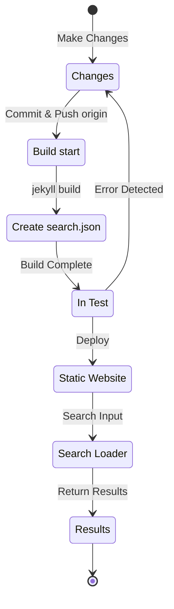

## Visão geral
No início de julho de 12024, implementei suporte multilíngue neste blog hospedado no Github Pages baseado em Jekyll aplicando o plugin [Polyglot](https://github.com/untra/polyglot).
Esta série compartilha os bugs que ocorreram durante o processo de aplicação do plugin Polyglot ao tema Chirpy e seus processos de resolução, além de como escrever cabeçalhos html e sitemap.xml considerando SEO.
A série consiste em 3 posts, e este é o terceiro da série.
- Parte 1: [Aplicação do plugin Polyglot & modificação de cabeçalho html e sitemap](/posts/how-to-support-multi-language-on-jekyll-blog-with-polyglot-1)
- Parte 2: [Implementação de botão de seleção de idioma & localização de layout](/posts/how-to-support-multi-language-on-jekyll-blog-with-polyglot-2)
- Parte 3: Solução de problemas de falha de build do tema Chirpy e erro na função de busca (este post)

> Originalmente foi composta por 2 partes, mas posteriormente foi reorganizada em 3 partes devido ao aumento significativo do conteúdo após várias expansões.
{: .prompt-info }

## Requisitos
- [x] Deve ser possível fornecer o resultado do build (páginas web) separado por caminhos de idioma (ex. `/posts/ko/`{: .filepath}, `/posts/ja/`{: .filepath}).
- [x] Para minimizar o tempo e esforço adicionais necessários para suporte multilíngue, deve ser possível reconhecer automaticamente o idioma durante o build com base no caminho local onde o arquivo está localizado (ex. `/_posts/ko/`{: .filepath}, `/_posts/ja/`{: .filepath}) sem especificar manualmente as tags 'lang' e 'permalink' no YAML front matter do arquivo markdown original.
- [x] A seção de cabeçalho de cada página do site deve incluir tags meta Content-Language apropriadas, tags alternativas hreflang e links canônicos para atender às diretrizes de SEO do Google para busca multilíngue.
- [x] Deve ser possível fornecer links de páginas para cada versão de idioma no site sem omissões através do `sitemap.xml`{: .filepath}, e o próprio `sitemap.xml`{: .filepath} deve existir apenas um no caminho raiz sem duplicação.
- [x] Todas as funcionalidades fornecidas pelo [tema Chirpy](https://github.com/cotes2020/jekyll-theme-chirpy) devem funcionar normalmente em cada página de idioma, caso contrário, devem ser corrigidas para funcionar normalmente.
  - [x] Funcionamento normal das funcionalidades 'Recently Updated' e 'Trending Tags'
  - [x] Não deve ocorrer erros durante o processo de build usando GitHub Actions
  - [x] Funcionamento normal da função de busca de posts no canto superior direito do blog

## Antes de começar
Este post é uma continuação da [Parte 1](/posts/how-to-support-multi-language-on-jekyll-blog-with-polyglot-1) e [Parte 2](/posts/how-to-support-multi-language-on-jekyll-blog-with-polyglot-2), então recomendo ler os posts anteriores primeiro, caso ainda não os tenha lido.

## Solução de problemas ('relative_url_regex': target of repeat operator is not specified)
Após concluir as etapas anteriores, ao executar o comando `bundle exec jekyll serve` para testar a compilação, ocorreu um erro `'relative_url_regex': target of repeat operator is not specified` e a compilação falhou.

```shell
...(omitido)
                    ------------------------------------------------
      Jekyll 4.3.4   Please append `--trace` to the `serve` command 
                     for any additional information or backtrace. 
                    ------------------------------------------------
/Users/yunseo/.gem/ruby/3.2.2/gems/jekyll-polyglot-1.8.1/lib/jekyll/polyglot/
patches/jekyll/site.rb:234:in `relative_url_regex': target of repeat operator 
is not specified: /href="?\/((?:(?!*.gem)(?!*.gemspec)(?!tools)(?!README.md)(
?!LICENSE)(?!*.config.js)(?!rollup.config.js)(?!package*.json)(?!.sass-cache)
(?!.jekyll-cache)(?!gemfiles)(?!Gemfile)(?!Gemfile.lock)(?!node_modules)(?!ve
ndor\/bundle\/)(?!vendor\/cache\/)(?!vendor\/gems\/)(?!vendor\/ruby\/)(?!en\/
)(?!ko\/)(?!es\/)(?!pt-BR\/)(?!ja\/)(?!fr\/)(?!de\/)[^,'"\s\/?.]+\.?)*(?:\/[^
\]\[)("'\s]*)?)"/ (RegexpError)

...(omitido)
```

Após pesquisar se problemas semelhantes já haviam sido relatados, encontrei [exatamente o mesmo problema](https://github.com/untra/polyglot/issues/204) registrado no repositório do Polyglot, junto com uma solução.

No arquivo [`_config.yml`{: .filepath}](https://github.com/cotes2020/jekyll-theme-chirpy/blob/master/_config.yml) do tema Chirpy que estou usando neste blog, existe a seguinte configuração:

```yml
exclude:
  - "*.gem"
  - "*.gemspec"
  - docs
  - tools
  - README.md
  - LICENSE
  - "*.config.js"
  - package*.json
```
{: file='\_config.yml'}

A causa do problema está nas expressões regulares das seguintes funções no arquivo [`site.rb`{: .filepath}](https://github.com/untra/polyglot/blob/master/lib/jekyll/polyglot/patches/jekyll/site.rb) do Polyglot, que não conseguem processar corretamente padrões de globbing como `"*.gem"`, `"*.gemspec"` e `"*.config.js"`:


```ruby
    # a regex that matches relative urls in a html document
    # matches href="baseurl/foo/bar-baz" href="/foo/bar-baz" and others like it
    # avoids matching excluded files.  prepare makes sure
    # that all @exclude dirs have a trailing slash.
    def relative_url_regex(disabled = false)
      regex = ''
      unless disabled
        @exclude.each do |x|
          regex += "(?!#{x})"
        end
        @languages.each do |x|
          regex += "(?!#{x}\/)"
        end
      end
      start = disabled ? 'ferh' : 'href'
      %r{#{start}="?#{@baseurl}/((?:#{regex}[^,'"\s/?.]+\.?)*(?:/[^\]\[)("'\s]*)?)"}
    end

    # a regex that matches absolute urls in a html document
    # matches href="http://baseurl/foo/bar-baz" and others like it
    # avoids matching excluded files.  prepare makes sure
    # that all @exclude dirs have a trailing slash.
    def absolute_url_regex(url, disabled = false)
      regex = ''
      unless disabled
        @exclude.each do |x|
          regex += "(?!#{x})"
        end
        @languages.each do |x|
          regex += "(?!#{x}\/)"
        end
      end
      start = disabled ? 'ferh' : 'href'
      %r{(?<!hreflang="#{@default_lang}" )#{start}="?#{url}#{@baseurl}/((?:#{regex}[^,'"\s/?.]+\.?)*(?:/[^\]\[)("'\s]*)?)"}
    end
```
{: file='(polyglot root path)/lib/jekyll/polyglot/patches/jekyll/site.rb'}


Existem duas maneiras de resolver este problema:

### 1. Fazer um fork do Polyglot e modificar as partes problemáticas
No momento da escrita deste post (11.12024), a [documentação oficial do Jekyll](https://jekyllrb.com/docs/configuration/options/#global-configuration) indica que a configuração `exclude` suporta padrões de globbing para correspondência de arquivos.

>"This configuration option supports Ruby's File.fnmatch filename globbing patterns to match multiple entries to exclude."

Ou seja, a causa do problema não está no tema Chirpy, mas nas funções `relative_url_regex()` e `absolute_url_regex()` do Polyglot, então a solução fundamental é modificá-las para evitar o problema.

Como o bug ainda não foi corrigido no Polyglot, podemos fazer um fork do repositório e modificar as partes problemáticas conforme sugerido ~~neste [post de blog](https://hionpu.com/posts/github_blog_4#4-polyglot-%EC%9D%98%EC%A1%B4%EC%84%B1-%EB%AC%B8%EC%A0%9C)(site removido) e~~ na [resposta ao problema no GitHub](https://github.com/untra/polyglot/issues/204#issuecomment-2143270322):


```ruby
    def relative_url_regex(disabled = false)
      regex = ''
      unless disabled
        @exclude.each do |x|
          escaped_x = Regexp.escape(x)
          regex += "(?!#{escaped_x})"
        end
        @languages.each do |x|
          escaped_x = Regexp.escape(x)
          regex += "(?!#{escaped_x}\/)"
        end
      end
      start = disabled ? 'ferh' : 'href'
      %r{#{start}="?#{@baseurl}/((?:#{regex}[^,'"\s/?.]+\.?)*(?:/[^\]\[)("'\s]*)?)"}
    end

    def absolute_url_regex(url, disabled = false)
      regex = ''
      unless disabled
        @exclude.each do |x|
          escaped_x = Regexp.escape(x)
          regex += "(?!#{escaped_x})"
        end
        @languages.each do |x|
          escaped_x = Regexp.escape(x)
          regex += "(?!#{escaped_x}\/)"
        end
      end
      start = disabled ? 'ferh' : 'href'
      %r{(?<!hreflang="#{@default_lang}" )#{start}="?#{url}#{@baseurl}/((?:#{regex}[^,'"\s/?.]+\.?)*(?:/[^\]\[)("'\s]*)?)"}
    end
```
{: file='(polyglot root path)/lib/jekyll/polyglot/patches/jekyll/site.rb'}


### 2. Substituir os padrões de globbing por nomes de arquivos exatos no arquivo '\_config.yml' do tema Chirpy
A solução ideal seria que o patch acima fosse incorporado ao mainstream do Polyglot. No entanto, até que isso aconteça, seria necessário usar a versão com fork, o que pode ser inconveniente para acompanhar as atualizações do Polyglot. Por isso, optei por uma abordagem diferente.

Verificando os arquivos na raiz do [repositório do tema Chirpy](https://github.com/cotes2020/jekyll-theme-chirpy) que correspondem aos padrões `"*.gem"`, `"*.gemspec"` e `"*.config.js"`, encontrei apenas estes 3:
- `jekyll-theme-chirpy.gemspec`{: .filepath}
- `purgecss.config.js`{: .filepath}
- `rollup.config.js`{: .filepath}

Portanto, podemos modificar a seção `exclude` no arquivo `_config.yml`{: .filepath}, removendo os padrões de globbing e substituindo-os pelos nomes exatos dos arquivos:

```yml
exclude: # Modificado com base na issue https://github.com/untra/polyglot/issues/204
  # - "*.gem"
  - jekyll-theme-chirpy.gemspec # - "*.gemspec"
  - tools
  - README.md
  - LICENSE
  - purgecss.config.js # - "*.config.js"
  - rollup.config.js
  - package*.json
```
{: file='\_config.yml'}

## Modificação da função de busca
Após concluir as etapas anteriores, quase todas as funcionalidades do site funcionavam conforme o esperado. No entanto, descobri tardiamente que a barra de busca localizada no canto superior direito das páginas com o tema Chirpy não indexava páginas em idiomas diferentes do `site.default_lang` (inglês, no caso deste blog) e, ao realizar buscas em páginas de outros idiomas, exibia apenas links de páginas em inglês.

Para entender a causa, vamos examinar quais arquivos estão envolvidos na funcionalidade de busca e onde o problema ocorre.

### '\_layouts/default.html'
Verificando o arquivo [`_layouts/default.html`{: .filepath}](https://github.com/cotes2020/jekyll-theme-chirpy/blob/master/_layouts/default.html), que define a estrutura de todas as páginas do blog, podemos ver que ele carrega os conteúdos de `search-results.html`{: .filepath} e `search-loader.html`{: .filepath} dentro do elemento `<body>`:


```liquid
  <body>
    

    <div id="main-wrapper" class="d-flex justify-content-center">
      <div class="container d-flex flex-column px-xxl-5">
        
        (...omitido...)

        
      </div>

      <aside aria-label="Scroll to Top">
        <button id="back-to-top" type="button" class="btn btn-lg btn-box-shadow">
          <i class="fas fa-angle-up"></i>
        </button>
      </aside>
    </div>

    (...omitido...)

    
  </body>
```
{: file='\_layouts/default.html'}


### '\_includes/search-result.html'
O arquivo [`_includes/search-result.html`{: .filepath}](https://github.com/cotes2020/jekyll-theme-chirpy/blob/master/_includes/search-results.html) cria o container `search-results` para armazenar os resultados da busca quando uma palavra-chave é inserida:


```html
<!-- The Search results -->

<div id="search-result-wrapper" class="d-flex justify-content-center d-none">
  <div class="col-11 content">
    <div id="search-hints">
      
    </div>
    <div id="search-results" class="d-flex flex-wrap justify-content-center text-muted mt-3"></div>
  </div>
</div>
```
{: file='\_includes/search-result.html'}


### '\_includes/search-loader.html'
O arquivo [`_includes/search-loader.html`{: .filepath}](https://github.com/cotes2020/jekyll-theme-chirpy/blob/master/_includes/search-loader.html) é a parte central que implementa a busca baseada na biblioteca [Simple-Jekyll-Search](https://github.com/christian-fei/Simple-Jekyll-Search). Ele executa JavaScript no navegador do visitante para encontrar correspondências entre a palavra-chave inserida e o conteúdo do arquivo de índice [`search.json`{: .filepath}](#assetsjsdatasearchjson), retornando links para os posts correspondentes como elementos `<article>`:


```js

  <article class="px-1 px-sm-2 px-lg-4 px-xl-0">
    <header>
      <h2><a href="{url}">{title}</a></h2>
      <div class="post-meta d-flex flex-column flex-sm-row text-muted mt-1 mb-1">
        {categories}
        {tags}
      </div>
    </header>
    <p>{snippet}</p>
  </article>


<p class="mt-5">{{ site.data.locales[include.lang].search.no_results }}</p>

<script>
   Note: dependent library will be loaded in `js-selector.html` 
  document.addEventListener('DOMContentLoaded', () => {
    SimpleJekyllSearch({
      searchInput: document.getElementById('search-input'),
      resultsContainer: document.getElementById('search-results'),
      json: '{{ '/assets/js/data/search.json' | relative_url }}',
      searchResultTemplate: '{{ result_elem | strip_newlines }}',
      noResultsText: '{{ not_found }}',
      templateMiddleware: function(prop, value, template) {
        if (prop === 'categories') {
          if (value === '') {
            return `${value}`;
          } else {
            return `<div class="me-sm-4"><i class="far fa-folder fa-fw"></i>${value}</div>`;
          }
        }

        if (prop === 'tags') {
          if (value === '') {
            return `${value}`;
          } else {
            return `<div><i class="fa fa-tag fa-fw"></i>${value}</div>`;
          }
        }
      }
    });
  });
</script>
```
{: file='\_includes/search-loader.html'}


### '/assets/js/data/search.json'

```liquid
---
layout: compress
swcache: true
---

[
  
  {
    "title": {{ post.title | jsonify }},
    "url": {{ post.url | relative_url | jsonify }},
    "categories": {{ post.categories | join: ', ' | jsonify }},
    "tags": {{ post.tags | join: ', ' | jsonify }},
    "date": "{{ post.date }}",
    
    
    "snippet": {{ _content | truncate: 200 | jsonify }},
    "content": {{ _content | jsonify }}
  },
  
]
```
{: file='/assets/js/data/search.json'}


Este arquivo usa a sintaxe Liquid do Jekyll para definir um arquivo JSON que contém o título, URL, informações de categorias e tags, data de criação, um snippet dos primeiros 200 caracteres do conteúdo e o conteúdo completo de todos os posts do site.

### Estrutura de funcionamento da busca e identificação do problema
Resumindo, a funcionalidade de busca no tema Chirpy hospedado no GitHub Pages funciona através do seguinte processo:



Verifiquei que o arquivo `search.json`{: .filepath} é gerado pelo Polyglot para cada idioma da seguinte forma:
- `/assets/js/data/search.json`{: .filepath}
- `/ko/assets/js/data/search.json`{: .filepath}
- `/ja/assets/js/data/search.json`{: .filepath}
- `/zh-TW/assets/js/data/search.json`{: .filepath}
- `/es/assets/js/data/search.json`{: .filepath}
- `/pt-BR/assets/js/data/search.json`{: .filepath}
- `/fr/assets/js/data/search.json`{: .filepath}
- `/de/assets/js/data/search.json`{: .filepath}

Portanto, a parte problemática é o "Search Loader". O problema de não encontrar páginas em idiomas diferentes do inglês ocorre porque o arquivo `_includes/search-loader.html`{: .filepath} carrega estaticamente apenas o arquivo de índice em inglês (`/assets/js/data/search.json`{: .filepath}), independentemente do idioma da página que está sendo visitada.

> - No entanto, diferentemente dos arquivos markdown ou html, para arquivos JSON, o wrapper Polyglot funciona para variáveis fornecidas pelo Jekyll como `post.title`, `post.content`, etc., mas a funcionalidade [Relativized Local Urls](https://github.com/untra/polyglot?tab=readme-ov-file#relativized-local-urls) parece não funcionar.
> - Da mesma forma, dentro dos templates de arquivos JSON, não é possível acessar as tags liquid [adicionais fornecidas pelo Polyglot `{{ site.default_lang }}`, `{{ site.active_lang }}`](https://github.com/untra/polyglot?tab=readme-ov-file#features) além das variáveis padrão do Jekyll, como confirmei durante o processo de teste.
>
> Portanto, valores como `title`, `snippet` e `content` no arquivo de índice são gerados diferentemente para cada idioma, mas o valor `url` retorna o caminho padrão sem considerar o idioma, e um tratamento adequado deve ser adicionado à parte "Search Loader".
{: .prompt-warning }

### Solução do problema
Para resolver isso, modifique o conteúdo de `_includes/search-loader.html`{: .filepath} da seguinte forma:


```

  <article class="px-1 px-sm-2 px-lg-4 px-xl-0">
    <header>
      
      <h2><a href="/{{ site.active_lang }}{url}">{title}</a></h2>
      
      <h2><a href="{url}">{title}</a></h2>
      

(...omitido...)

<script>
   Note: dependent library will be loaded in `js-selector.html` 
  document.addEventListener('DOMContentLoaded', () => {
    
    
      
    
    
    SimpleJekyllSearch({
      searchInput: document.getElementById('search-input'),
      resultsContainer: document.getElementById('search-results'),
      json: '{{ search_path | relative_url }}',
      searchResultTemplate: '{{ result_elem | strip_newlines }}',

(...omitido)
```
{: file='\_includes/search-loader.html'}


- Modifiquei a sintaxe liquid na parte `` para adicionar o prefixo `"/{{ site.active_lang }}"` antes da URL do post carregada do arquivo JSON quando `site.active_lang` (idioma da página atual) e `site.default_lang` (idioma padrão do site) são diferentes.
- Da mesma forma, modifiquei a parte `<script>` para comparar o idioma da página atual com o idioma padrão do site durante o processo de compilação e definir `search_path` como o caminho padrão (`/assets/js/data/search.json`{: .filepath}) se forem iguais, ou como o caminho correspondente ao idioma (por exemplo, `/ko/assets/js/data/search.json`{: .filepath}) se forem diferentes.

Após essas modificações e reconstrução do site, confirmei que os resultados de busca são exibidos corretamente para cada idioma.

> Como `{url}` é apenas um espaço reservado para o valor de URL que será lido do arquivo JSON durante a execução da busca pelo JS, e não uma URL válida no momento da compilação, o Polyglot não o reconhece como alvo de localização, então precisamos tratá-lo diretamente de acordo com o idioma. O problema é que o template `"/{{ site.active_lang }}{url}"` processado dessa forma é reconhecido como URL relativa durante a compilação, e embora a localização já esteja concluída, o Polyglot não sabe disso e tenta realizar a localização novamente (por exemplo, `"/ko/ko/posts/example-post"`{: .filepath}). Para evitar isso, especifiquei a tag [``](https://github.com/untra/polyglot?tab=readme-ov-file#disabling-url-relativizing).
{: .prompt-tip }
