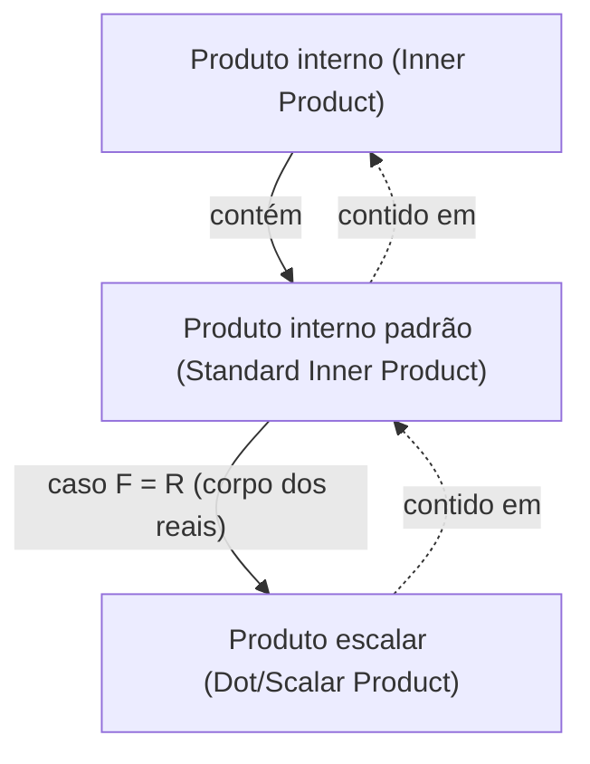

## Pré-requisitos
- [Vetores e combinações lineares](/posts/vectors-and-linear-combinations/)

## Produto interno

Em um espaço vetorial sobre $F$, a definição de **produto interno (inner product)** é a seguinte.

> **Definição de produto interno (inner product) e espaço com produto interno (inner product space)**  
> Considere um espaço vetorial $\mathbb{V}$ sobre $F$. Um **produto interno (inner product)** em $\mathbb{V}$, denotado por $\langle \mathbf{x},\mathbf{y} \rangle$, é uma função que associa a cada par ordenado de vetores $\mathbf{x}$ e $\mathbf{y}$ em $\mathbb{V}$ um escalar em $F$, satisfazendo as condições seguintes.
>
> Para quaisquer $\mathbf{x},\mathbf{y},\mathbf{z} \in \mathbb{V}$ e qualquer $c \in F$:
> 1. $\langle \mathbf{x}+\mathbf{z}, \mathbf{y} \rangle = \langle \mathbf{x}, \mathbf{y} \rangle + \langle \mathbf{z}, \mathbf{y} \rangle$
> 2. $\langle c\mathbf{x}, \mathbf{y} \rangle = c \langle \mathbf{x}, \mathbf{y} \rangle$
> 3. $\overline{\langle \mathbf{x}, \mathbf{y} \rangle} = \langle \mathbf{y}, \mathbf{x} \rangle$ (onde $\overline{\mathbf{z}}$ é o conjugado complexo de $\mathbf{z}$)
> 4. Para $\mathbf{x} \neq \mathbf{0}$, tem-se $\langle \mathbf{x}, \mathbf{x} \rangle > 0$.
>
> Um espaço vetorial $\mathbb{V}$ sobre $F$ munido de produto interno é chamado de **espaço com produto interno (inner product space)**. Em particular, se $F=\mathbb{C}$, diz-se **espaço com produto interno complexo (complex inner product space)**; se $F=\mathbb{R}$, **espaço com produto interno real (real inner product space)**.
{: .prompt-info }

Em particular, o seguinte é chamado de **produto interno padrão (standard inner product)**. Verifica-se que ele satisfaz as quatro condições acima.

> **Definição de produto interno padrão (standard inner product)**  
> Para dois vetores de $F^n$, $\mathbf{x}=(a_1, a_2, \dots, a_n)$ e $\mathbf{y}=(b_1, b_2, \dots, b_n)$, o **produto interno padrão (standard inner product)** em $F^n$ é definido por
>
> $$\langle \mathbf{x}, \mathbf{y} \rangle = \sum_{i=1}^n a_i \overline{b_i} $$
>
{: .prompt-info }

Se $F=\mathbb{R}$, como o conjugado de um número real é ele próprio, o produto interno padrão torna-se $\sum_{i=1}^n a_i b_i$. Nessa situação, costuma-se escrever $\langle \mathbf{x}, \mathbf{y} \rangle$ como $\mathbf{x} \cdot \mathbf{y}$ e chamá-lo de **produto escalar (dot/scalar product)**.

> **Definição de produto escalar (dot/scalar product)**  
> Para $\mathbf{v}=(v_1, v_2, \dots, v_n)$ e $\mathbf{w}=(w_1, w_2, \dots, w_n)$ em $\mathbb{R}^n$, o **produto escalar (dot/scalar product)** é definido por
>
> $$ \mathbf{v} \cdot \mathbf{w} = \sum_{i=1}^n v_i w_i = v_1 w_1 + v_2 w_2 + \cdots + v_n w_n $$
> 
{: .prompt-info }

> Aqui, “produto escalar (**scalar product**)” é uma operação entre vetores, distinta da “multiplicação por escalar (**scalar multiplication**)” — a multiplicação de um vetor por um número — tratada em [Vetores e combinações lineares](/posts/vectors-and-linear-combinations/). Em inglês os termos são parecidos e, <u>em coreano a tradução é até idêntica</u>; portanto, cuidado para não confundir.
>
> Para evitar confusões, doravante usaremos preferencialmente o termo produto escalar (**dot product**).
{: .prompt-warning }

> Em espaços euclidianos, o produto interno coincide com o produto escalar; portanto, quando não houver risco de ambiguidade, é comum chamar o produto escalar simplesmente de produto interno. Tecnicamente, porém, produto interno é um conceito mais geral que inclui o produto escalar.
{: .prompt-tip }

## Comprimento/norma de vetores

Para um vetor $\mathbf{v}=(v_1, v_2, \dots, v_n)$ em $\mathbb{R}^n$, o comprimento euclidiano de $\mathbf{v}$ é definido via produto escalar por

$$ \| \mathbf{v} \| = \sqrt{\mathbf{v} \cdot \mathbf{v}} = \left[ \sum_{i=1}^n |v_i|^2 \right]^{1/2} = \sqrt{v_1^2 + v_2^2 + \cdots + v_n^2} $$

Mais geralmente, em um espaço com produto interno arbitrário, a **norma (norm)** ou **comprimento (length)** de um vetor é definida por

$$ \| \mathbf{x} \| = \sqrt{\langle \mathbf{x}, \mathbf{x} \rangle} $$

Em um espaço com produto interno geral, valem as propriedades importantes a seguir para a norma:

> **Teorema**  
> Seja $\mathbb{V}$ um espaço com produto interno sobre $F$ e sejam $\mathbf{x}, \mathbf{y} \in \mathbb{V}$ e $c \in F$. Então:
> 1. $\\|c\mathbf{x}\\| = \|c\| \cdot \\|\mathbf{x}\\|$
> 2. Valem as duas afirmações:
>    - $\\|\mathbf{x}\\| = 0 \iff \mathbf{x}=\mathbf{0}$
>    - $\\|\mathbf{x}\\| \geq 0 \ \forall \mathbf{x}$
> 3. **Desigualdade de Cauchy–Schwarz**: $\| \langle \mathbf{x}, \mathbf{y} \rangle \| \leq \\|\mathbf{x}\\| \cdot \\|\mathbf{y}\\|$ (com igualdade se e somente se um dos vetores é múltiplo escalar do outro)
> 4. **Desigualdade triangular**: $\\| \mathbf{x} + \mathbf{y} \\| \leq \\|\mathbf{x}\\| + \\|\mathbf{y}\\|$ (com igualdade se e somente se um dos vetores é múltiplo escalar do outro e ambos têm a mesma direção)
{: .prompt-info }

## Ângulo entre vetores e vetores unitários

Um vetor de comprimento $1$ é chamado de **vetor unitário (unit vector)**. Além disso, para dois vetores $\mathbf{v}=(v_1, v_2, \dots, v_n)$ e $\mathbf{w}=(w_1, w_2, \dots, w_n)$ em $\mathbb{R}^n$, vale $\mathbf{v} \cdot \mathbf{w} = \\|\mathbf{v}\\| \cdot \\|\mathbf{w}\\| \cos\theta$, a partir do que obtemos o ângulo $\theta$ ($0 \leq \theta \leq \pi$) entre $\mathbf{v}$ e $\mathbf{w}$:

$$ \theta = \arccos{\frac{\mathbf{v} \cdot \mathbf{w}}{\|\mathbf{v}\| \cdot \|\mathbf{w}\|}} $$

Se $\mathbf{v} \cdot \mathbf{w} = 0$, diz-se que os vetores são **perpendiculares (perpendicular)** ou **ortogonais (orthogonal)**.

> Se dois vetores $\mathbf{v}$ e $\mathbf{w}$ são perpendiculares, então
>
> $$ \begin{align*}
> \| \mathbf{v} + \mathbf{w} \|^2 &= (\mathbf{v} + \mathbf{w}) \cdot (\mathbf{v} + \mathbf{w}) \\
> &= \mathbf{v} \cdot \mathbf{v} + \mathbf{v} \cdot \mathbf{w} + \mathbf{w} \cdot \mathbf{v} + \mathbf{w} \cdot \mathbf{w} \\
> &= \mathbf{v} \cdot \mathbf{v} + \mathbf{w} \cdot \mathbf{w} \\
> &= \|\mathbf{v}\|^2 + \|\mathbf{w}\|^2.
> \end{align*} $$
>
{: .prompt-tip }

Generalizando para um espaço com produto interno arbitrário, temos:

> **Definição**  
> Considere um espaço com produto interno $\mathbb{V}$. Para vetores $\mathbf{x}, \mathbf{y}$ em $\mathbb{V}$, se $\langle \mathbf{x}, \mathbf{y} \rangle = 0$, diz-se que eles são **ortogonais (orthogonal)** ou **perpendiculares (perpendicular)**. Além disso:
> 1. Para um subconjunto $S \subset \mathbb{V}$, se quaisquer dois vetores distintos de $S$ são ortogonais, então $S$ é um **conjunto ortogonal (orthogonal set)**.
> 2. Um vetor $\mathbf{x} \in \mathbb{V}$ com $\\|\mathbf{x}\\|=1$ é um **vetor unitário (unit vector)**.
> 3. Se um subconjunto $S \subset \mathbb{V}$ é ortogonal e é formado apenas por vetores unitários, então $S$ é um **conjunto ortonormal (orthonormal set)**.
{: .prompt-info }

Uma condição necessária e suficiente para que $S = \{ \mathbf{v}_1, \mathbf{v}_2, \dots \}$ seja ortonormal é $\langle \mathbf{v}\_i, \mathbf{v}\_j \rangle = \delta\_{ij}$. Multiplicar um vetor por um escalar não nulo não afeta a ortogonalidade.

Para qualquer vetor não nulo $\mathbf{x}$, $\cfrac{\mathbf{x}}{\\|\mathbf{x}\\|}$ é um vetor unitário; obter um vetor unitário multiplicando-se um vetor não nulo pelo inverso de seu comprimento é chamado de **normalização (normalizing)**.
