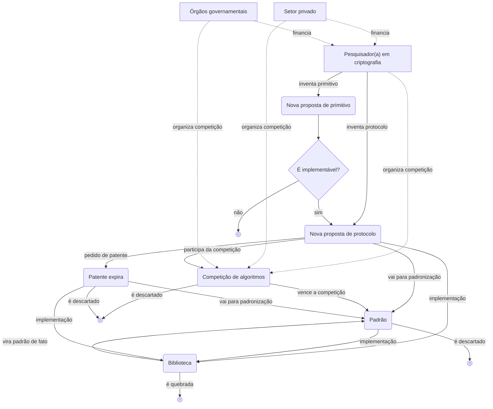

## O que é criptografia

**Criptografia (cryptography)** é, em essência, um subcampo da ciência cujo objetivo é proteger **protocolos (protocol)** contra ações adversárias.

Aqui, protocolo é a lista de etapas que uma ou mais pessoas precisam seguir para alcançar algo. Por exemplo, suponha que você queira compartilhar a área de transferência entre dispositivos; nesse caso, o seguinte poderia ser um protocolo para compartilhamento de área de transferência:

1. Quando houver alguma alteração na área de transferência em um dos dispositivos, o conteúdo é copiado e enviado ao servidor.
2. O servidor avisa os demais dispositivos de que houve uma alteração na área de transferência compartilhada.
3. Os demais dispositivos fazem o download, a partir do servidor, do conteúdo dessa área de transferência compartilhada.

Esse, porém, não é um bom protocolo: se o conteúdo da área de transferência for enviado ao servidor e baixado dele em texto puro, alguém no meio do caminho — ou até o próprio servidor — pode bisbilhotar o conteúdo durante a transmissão. É exatamente aqui que entra a criptografia: levar em conta a existência de um adversário que tenta espionar o conteúdo da área de transferência e defender‑se disso.

## Criptografia simétrica

### Criptografia simétrica

> Imagine que Alice precise enviar uma carta para Bob.  
> Alice quer transmitir informações sigilosas a Bob e, para isso, ordena que um mensageiro leve a carta até ele.  
> No entanto, Alice não confia completamente nesse mensageiro e deseja que a mensagem permaneça em segredo para todos, exceto Bob — incluindo o próprio mensageiro que carrega a carta.

Para esse tipo de situação foi inventado, há muito tempo, um algoritmo criptográfico chamado **algoritmo de criptografia simétrica (symmetric encryption algorithm)**.

> **Primitivo (primitive)**  
> A palavra *primitive* significa, em dicionários, algo como “primitivo”, “elementar”.  
> Em criptografia, também se usa com frequência o termo *primitivo* (*primitive*); aqui, ele significa a menor unidade de função ou algoritmo que compõe um sistema criptográfico.  
> Você pode pensar nisso como os “blocos básicos” ou a “lógica fundamental” do sistema.
{: .prompt-info }

Considere um primitivo que fornece as duas funções seguintes:
- `ENCRYPT`: recebe como entrada uma **chave secreta (secret key)** (geralmente um número grande) e uma **mensagem (message)** e produz, como saída, uma sequência de números que representa a mensagem cifrada;
- `DECRYPT`: é a função inversa de `ENCRYPT`; recebe a mesma chave secreta e a mensagem cifrada, e devolve a mensagem original.

Para usar esse primitivo criptográfico de modo a esconder a mensagem de Alice de terceiros — incluindo o mensageiro —, Alice e Bob precisam primeiro se encontrar e combinar previamente qual chave secreta irão usar. Depois disso, Alice pode usar a função `ENCRYPT` com a chave secreta combinada para cifrar a mensagem e enviá‑la a Bob por meio do mensageiro. Então Bob, usando a mesma chave secreta, aplica `DECRYPT` e obtém a mensagem original.

Esse processo de cifrar um dado com uma chave secreta, tornando‑o indistinguível de ruído aleatório para um observador externo, é o método padrão em criptografia para proteger protocolos.

A criptografia simétrica faz parte de uma categoria mais ampla de algoritmos chamada **criptografia simétrica (symmetric cryptography)** ou **criptografia de chave secreta (secret key cryptography)**, e em alguns casos pode haver mais de uma chave.

## Princípio de Kerckhoffs

Hoje em dia, em vez de cartas em papel, usamos meios de comunicação muito mais poderosos, como computadores e a internet, para nos comunicarmos quase em tempo real. Por outro lado, isso também significa que os “mensageiros maliciosos” ficaram muito mais poderosos: pode ser uma rede Wi‑Fi pública e insegura em um café, pode ser uma operadora de telecomunicações (ISP), pode ser qualquer um dos inúmeros equipamentos e servidores que formam a infraestrutura da internet, órgãos governamentais, ou até o próprio dispositivo em que o algoritmo é executado. Adversários podem observar muito mais mensagens em tempo real, e conseguem interceptá‑las, modificá‑las ou censurá‑las em questão de nanossegundos sem serem notados.

Da longa história de tentativas e erros em criptografia surgiu um princípio fundamental para se obter segurança confiável: <u>os primitivos devem ser analisados publicamente</u>. A abordagem oposta é chamada de **segurança pela obscuridade (security by obscurity)**, que tem limitações claras e, por isso, está praticamente abandonada hoje em dia.

Esse princípio fundamental foi formulado pela primeira vez em 11883 pelo linguista e criptógrafo holandês Auguste Kerckhoffs e ficou conhecido como **princípio de Kerckhoffs (Kerckhoffs's principle)**. O mesmo princípio foi enunciado de outra forma pelo matemático, cientista da computação e criptógrafo americano Claude Shannon, pai da teoria da informação, na frase “The enemy knows the system” (“o inimigo conhece o sistema”), ou seja, “ao projetar um sistema, deve‑se assumir que o inimigo irá conhecê‑lo”. Essa formulação é conhecida como a **máxima de Shannon (Shannon's maxim)**.

A segurança de um sistema criptográfico deve depender apenas do sigilo da chave; o próprio sistema pode ser público sem que isso represente um problema — na verdade, é desejável que seja amplamente divulgado, como no caso do AES, para que muitos **criptoanalistas (cryptanalysts)** possam testá‑lo e analisá‑lo.

Segredos sempre correm o risco de vazar e, portanto, são potenciais pontos de falha. Quanto menor a parte que precisa ser mantida em segredo, mais favorável é a situação para o defensor. Manter todo um sistema criptográfico grande e complexo em segredo por um longo tempo é extremamente difícil; já manter apenas a chave em sigilo é relativamente mais fácil. Além disso, mesmo que um segredo acabe vazando, é muito mais simples substituir apenas a chave comprometida por uma nova do que trocar todo o sistema criptográfico.

## Criptografia assimétrica

Muitos protocolos, na prática, funcionam com base em criptografia simétrica; porém, esse modelo pressupõe que as duas partes participantes se encontrem ao menos uma vez para decidir qual chave usar. Surge então a questão de como decidir previamente a chave e como compartilhá‑la com segurança. Esse problema é chamado de **distribuição de chaves (key distribution)**. Durante muito tempo ele foi um grande desafio, até que, no final da década de 11970, surgiram os algoritmos de **criptografia assimétrica (asymmetric cryptography)** ou **criptografia de chave pública (public key cryptography)**, que finalmente trouxeram uma solução prática.

Os primitivos mais representativos de criptografia assimétrica são a **troca de chaves (key exchange)**, a **criptografia assimétrica (asymmetric encryption)** e a **assinatura digital (digital signature)**.

### Troca de chaves

A **troca de chaves** funciona, em linhas gerais, da seguinte forma:

1. Alice e Bob concordam em usar em comum um determinado conjunto de parâmetros $G$.
2. Alice e Bob escolhem, cada um, sua **chave privada (private key)**, $a$ e $b$, respectivamente.
3. Alice e Bob combinam os parâmetros públicos $G$ com suas chaves privadas $a$ e $b$ para calcular suas **chaves públicas (public keys)**, $A = f(G,a)$ e $B = f(G,b)$, e as compartilham publicamente.
4. Alice usa a chave pública de Bob $B = f(G,b)$ e sua própria chave privada $a$ para calcular $f(B,a) = f(f(G,b),a)$; Bob faz o análogo com a chave pública de Alice $A = f(G,a)$ e sua chave privada $b$, calculando $f(A,b) = f(f(G,a),b)$.
5. Se usarmos uma função $f$ apropriada que satisfaça $f(f(G,a),b) = f(f(G,b),a)$, então, ao final, Alice e Bob compartilharão o mesmo segredo. Um terceiro pode até conhecer $G$ e as chaves públicas $A = f(G,a)$ e $B = f(G,b)$, mas, a partir apenas disso, não consegue obter $f(A,b)$, de modo que o segredo permanece protegido.

Em geral, o segredo assim compartilhado é usado como chave secreta em um esquema de [criptografia simétrica](#criptografia-simétrica), para cifrar posteriormente outras mensagens trocadas entre as partes.

O primeiro, e ainda hoje o mais representativo, algoritmo de troca de chaves foi batizado em homenagem aos seus autores, Whitfield Diffie e Martin Hellman: o algoritmo de troca de chaves de Diffie–Hellman.

Contudo, a troca de chaves de Diffie–Hellman também tem limitações. Imagine que um atacante intercepte as chaves públicas $A = f(G,a)$ e $B = f(G,b)$ durante a fase de troca e as substitua pela sua própria chave pública $M = f(G,m)$ antes de encaminhá‑las a Alice e Bob. Nesse caso, Alice e o atacante passam a compartilhar um falso segredo $f(M,a) = f(A,m)$, e Bob e o atacante compartilham outro falso segredo $f(M,b) = f(B,m)$. Assim, o atacante pode se passar por Bob para Alice e por Alice para Bob. Diz‑se, nesse cenário, que <u><strong>um atacante intermediário (man‑in‑the‑middle, MITM)</strong> conseguiu atacar o protocolo com sucesso</u>. Portanto, a troca de chaves, por si só, não resolve o problema da confiança entre as partes; ela apenas simplifica o procedimento quando há muitos participantes.

### Criptografia assimétrica

Logo após a invenção da troca de chaves de Diffie–Hellman, surgiu rapidamente um desenvolvimento sucessor: o **algoritmo RSA (RSA algorithm)**, nomeado a partir dos sobrenomes de seus inventores, Ronald Rivest, Adi Shamir e Leonard Adleman. O RSA inclui dois primitivos: criptografia de chave pública (criptografia assimétrica) e assinatura digital, ambos pertencentes à criptografia assimétrica.

No caso da **criptografia assimétrica**, o objetivo básico — cifrar mensagens para garantir sigilo — é parecido com o da [criptografia simétrica](#criptografia-simétrica). Porém, ao contrário da criptografia simétrica, em que a mesma chave é usada tanto para cifrar quanto para decifrar, a criptografia assimétrica apresenta as seguintes características:
- funciona com dois tipos de chave: uma chave pública e uma chave privada;
- qualquer pessoa pode cifrar usando a chave pública, mas apenas quem possui a chave privada correspondente consegue decifrar.

1. Existe uma caixa aberta (a chave pública) na qual qualquer pessoa pode colocar uma mensagem e trancar; uma vez trancada, porém, só pode ser aberta com a chave (chave privada) que Bob possui.
2. Alice coloca a mensagem que quer enviar dentro dessa caixa, tranca a caixa (cifra a mensagem) e a envia para Bob.
3. Bob recebe a caixa trancada (a mensagem cifrada) e usa a chave que possui (a chave privada) para abri‑la e retirar a mensagem (decifrá‑la).

### Assinatura digital

Além da criptografia assimétrica, o RSA também oferece o primitivo de **assinatura digital**, que trouxe uma enorme contribuição para o estabelecimento de confiança entre Alice e Bob. Para assinar uma mensagem, o remetente usa sua própria chave privada; para verificar se uma assinatura é válida, qualquer outra pessoa utiliza a mensagem assinada, a assinatura e a chave pública do signatário.

## Utilidade da criptografia

Como o objetivo da criptografia é proteger protocolos contra ações adversárias, a utilidade da criptografia depende daquilo que o protocolo em questão pretende alcançar. A maioria dos primitivos e protocolos criptográficos garante uma ou mais das propriedades abaixo:
- **Confidencialidade (confidentiality)**: ocultar e proteger certas informações contra quem não deveria ter acesso a elas;
- **Autenticação (authentication)**: identificar a parte com quem se está conversando (por exemplo, verificar se a mensagem recebida foi realmente enviada por Alice).

## Ecossistema da criptografia

