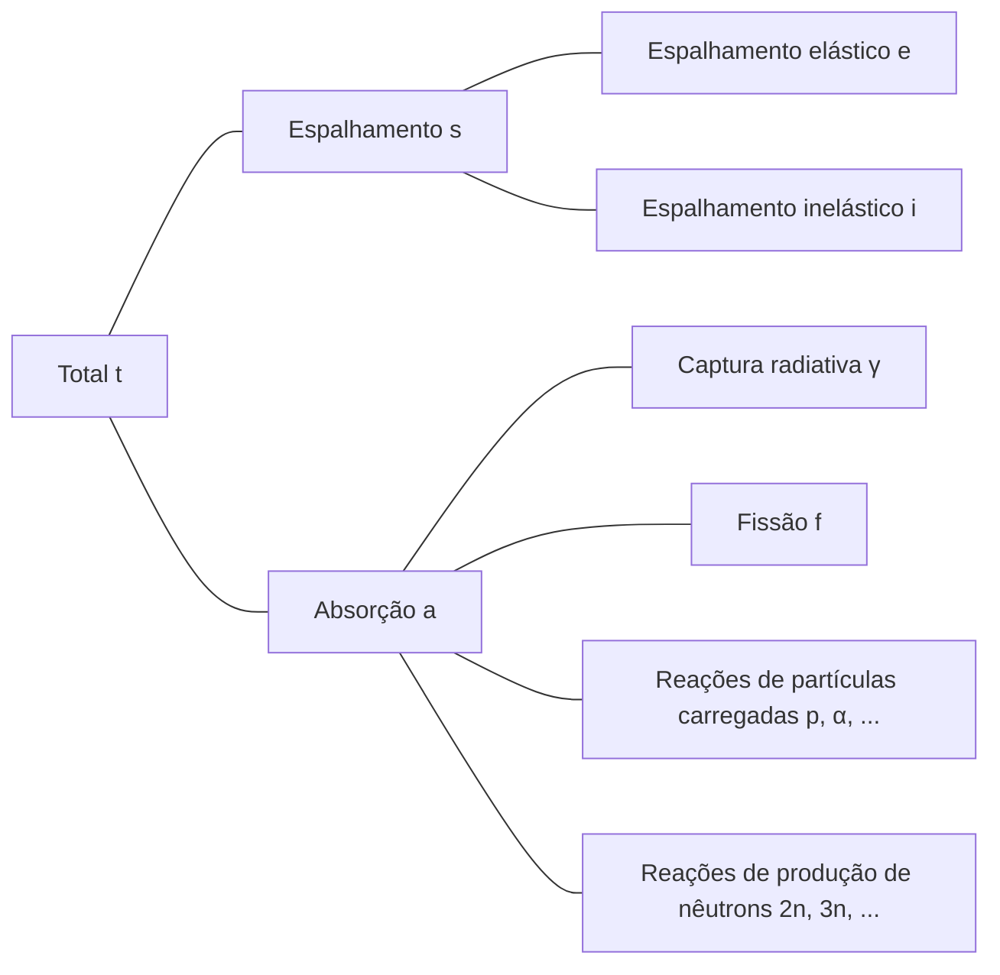

## Interações de Nêutrons
Os nêutrons são eletricamente neutros, portanto não são afetados pelas forças elétricas dos elétrons ou pela carga positiva do núcleo atômico. Consequentemente, os nêutrons podem passar pela nuvem de elétrons do átomo e interagir diretamente com o núcleo.

### Espalhamento Elástico
- O nêutron colide com o núcleo e é defletido
- O núcleo mantém seu estado fundamental sem mudança de energia
- Representado por (n, n)

### Espalhamento Inelástico
- O nêutron colide com o núcleo e é defletido
- Diferentemente do espalhamento elástico, o núcleo absorve parte da energia do nêutron e fica em um estado excitado (reação endotérmica)
- Representado por (n, n′)
- O núcleo excitado retorna ao estado fundamental emitindo raios gama, que são chamados de *raios gama inelásticos*

### Captura Radiativa
- O núcleo captura o nêutron e emite um ou mais raios gama (reação exotérmica)
- Representado por (n, γ)
- Os raios gama emitidos são chamados de *raios gama de captura*

### Reações de Partículas Carregadas
- O núcleo captura o nêutron e emite partículas carregadas como partículas alfa (α) ou prótons (p)
- Representado por (n, α), (n, p), etc.
- Pode ser uma reação exotérmica ou endotérmica, dependendo do caso

### Reações de Produção de Nêutrons
- Nêutrons de alta energia colidem com o núcleo, resultando na emissão de dois ou mais nêutrons (reação endotérmica)
- Representado por (n, 2n), (n, 3n), etc.
- A reação (n, 2n) é particularmente importante em reatores contendo água pesada ou berílio, pois os nêutrons em ²H e ⁹Be têm baixa energia de ligação e podem ser facilmente ejetados mesmo por nêutrons de baixa energia

### Fissão
- Um nêutron colide com certos núcleos, dividindo-os em dois ou mais núcleos filhos

## Seção de Choque ou Seção de Choque Microscópica
Considere um feixe de nêutrons monoenergéticos incidindo sobre um alvo (muito fino) de espessura τ e área A, com I nêutrons/cm²·s incidindo por unidade de área por segundo. Como o volume ocupado pelo núcleo no átomo é muito pequeno e assumimos que o alvo é muito fino, a maioria dos nêutrons passa pelo alvo sem interagir com os núcleos. O número de nêutrons que colidem com os núcleos por unidade de área por segundo é proporcional à intensidade do feixe de nêutrons I, à espessura do alvo τ e à densidade atômica do alvo N.

$$ \Delta I \propto I\tau N $$

Introduzindo uma constante de proporcionalidade σ, podemos expressar isso como:

$$ \Delta I = \sigma I\tau N\ \text{[nêutrons/cm}^2\cdot\text{s]} \tag{1} $$

A fração de nêutrons incidentes que colidem com os núcleos é:

$$ p = \frac {\Delta I}{I} = \sigma\tau N = \frac {\sigma}{A} A\tau N = \frac {\sigma}{A} N_t \tag{2} $$

(N_t: número total de átomos no alvo)

Desta equação, podemos ver que σ tem unidades de área. Esta constante de proporcionalidade σ é chamada de *seção de choque* ou *seção de choque microscópica*. Fisicamente, a seção de choque representa a área efetiva que o núcleo apresenta para interação com nêutrons.

## Unidades da Seção de Choque Microscópica
Como cm² é uma unidade muito grande para expressar seções de choque microscópicas, geralmente usa-se a unidade *barn* (b).

$$ 1\ \text{b} = 10^{-24}\ \text{cm}^2 $$

## Tipos de Seções de Choque Microscópicas
- Total: σ_t
  - Espalhamento: σ_s
    - Espalhamento elástico: σ_e
    - Espalhamento inelástico: σ_i
  - Absorção: σ_a
    - Captura radiativa: σ_γ
    - Fissão: σ_f
    - Reações de partículas carregadas: σ_p, σ_α, ...
    - Reações de produção de nêutrons: σ_2n, σ_3n, ...

## Seção de Choque Macroscópica
Da equação (2), a taxa de colisão por unidade de distância do feixe de nêutrons é:

$$ \frac {p}{\tau} = \frac {1}{\tau} \frac {\Delta I}{I} = \sigma N \equiv \Sigma\ \text{[cm}^{-1}\text{]} \tag{3}$$

A *seção de choque macroscópica* é definida como o produto da densidade atômica N e da seção de choque. Fisicamente, a seção de choque macroscópica representa a taxa de colisão por unidade de distância percorrida pelos nêutrons em um alvo. Assim como a seção de choque microscópica, ela pode ser subdividida em:

- Seção de choque macroscópica total Σ_t = Nσ_t
  - Seção de choque macroscópica de espalhamento Σ_s = Nσ_s
  - Seção de choque macroscópica de absorção Σ_a = Nσ_a

Em geral, para qualquer reação, a seção de choque macroscópica é Σ_reação = Nσ_reação.

## Densidade de Colisão, ou seja, Taxa de Reação
A *densidade de colisão* ou *taxa de reação* representa o número de colisões por unidade de tempo e volume no alvo. Das equações (1) e (3), podemos defini-la como:

$$ F = \frac {\Delta I}{\tau} = I\sigma N = I\Sigma \tag{4} $$