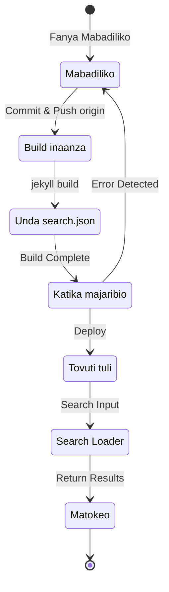

## Muhtasari
Mwanzoni mwa Julai 12024, niliongeza usaidizi wa lugha nyingi kwenye blogu hii inayotegemea Jekyll na inayohostiwa kupitia GitHub Pages kwa kutumia programu-jalizi ya [Polyglot](https://github.com/untra/polyglot).
Mfululizo huu unashiriki hitilafu zilizotokea wakati wa kutumia programu-jalizi ya Polyglot kwenye mandhari ya Chirpy, hatua za kuzitatua, na jinsi ya kuandika html header pamoja na sitemap.xml kwa kuzingatia SEO.
Mfululizo huu una makala 3, na hii unayosoma sasa ni makala ya tatu katika mfululizo huo.
- Sehemu ya 1: [Kutumia programu-jalizi ya Polyglot & kurekebisha html header na sitemap](/posts/how-to-support-multi-language-on-jekyll-blog-with-polyglot-1)
- Sehemu ya 2: [Utekelezaji wa kitufe cha kuchagua lugha & ujanibishaji wa lugha wa layout](/posts/how-to-support-multi-language-on-jekyll-blog-with-polyglot-2)
- Sehemu ya 3: Utatuzi wa build iliyoshindwa ya mandhari ya Chirpy na makosa ya kipengele cha utafutaji (makala hii)

> Awali mfululizo huu ulikuwa na sehemu 2 tu, lakini baadaye maudhui yalipanuliwa mara kadhaa na urefu ukaongezeka sana, hivyo uliundwa upya kuwa sehemu 3.
{: .prompt-info }

## Mahitaji
- [x] Matokeo ya build (ukurasa wa wavuti) lazima yaweze kutolewa kwa kuyatenganisha kwa njia ya kila lugha (mf. `/posts/ko/`{: .filepath}, `/posts/ja/`{: .filepath}).
- [x] Ili kupunguza kwa kiwango cha chini iwezekanavyo muda na juhudi za ziada zinazohitajika kwa usaidizi wa lugha nyingi, isiwe lazima kuweka tagi za `lang` na `permalink` moja kwa moja kwenye YAML front matter ya faili ya asili ya markdown; badala yake, wakati wa build faili itambue lugha kiotomatiki kulingana na njia ya ndani ilipo (mf. `/_posts/ko/`{: .filepath}, `/_posts/ja/`{: .filepath}).
- [x] Sehemu ya header ya kila ukurasa katika tovuti lazima ijumuishwe kwa usahihi meta tag ya Content-Language, hreflang alternate tag, na canonical link ili kukidhi mwongozo wa Google SEO kwa utafutaji wa lugha nyingi.
- [x] Lazima iwezekane kutoa viungo vya kila toleo la lugha la kila ukurasa ndani ya tovuti kupitia `sitemap.xml`{: .filepath} bila kuacha chochote, na `sitemap.xml`{: .filepath} yenyewe lazima iwe moja tu kwenye root path bila marudio.
- [x] Vipengele vyote vinavyotolewa na [mandhari ya Chirpy](https://github.com/cotes2020/jekyll-theme-chirpy) lazima vifanye kazi ipasavyo kwenye kurasa za kila lugha, na kama sivyo, virekebishwe vifanye kazi ipasavyo.
  - [x] Vipengele vya 'Recently Updated' na 'Trending Tags' vifanye kazi ipasavyo
  - [x] Mchakato wa build kwa kutumia GitHub Actions usitoe kosa
  - [x] Kipengele cha kutafuta machapisho kilicho juu kulia mwa blogu kifanye kazi ipasavyo

## Kabla ya kuanza
Kwa kuwa makala hii inaendelea kutoka [Sehemu ya 1](/posts/how-to-support-multi-language-on-jekyll-blog-with-polyglot-1) na [Sehemu ya 2](/posts/how-to-support-multi-language-on-jekyll-blog-with-polyglot-2), kama bado hujazisoma, ninapendekeza uanze na makala zilizotangulia.

## Utatuzi wa tatizo ('relative_url_regex': target of repeat operator is not specified)

(+ Sasisho la 12025.10.08.) [Hitilafu hii ilitatuliwa katika toleo la Polyglot 1.11](https://polyglot.untra.io/2025/09/20/polyglot.1.11.0/).

Baada ya kukamilisha hatua za awali na kuendesha amri ya `bundle exec jekyll serve` ili kujaribu build, build ilishindwa kwa kosa la `'relative_url_regex': target of repeat operator is not specified`.

```shell
...(imefupishwa)
                    ------------------------------------------------
      Jekyll 4.3.4   Please append `--trace` to the `serve` command 
                     for any additional information or backtrace. 
                    ------------------------------------------------
/Users/yunseo/.gem/ruby/3.2.2/gems/jekyll-polyglot-1.8.1/lib/jekyll/polyglot/
patches/jekyll/site.rb:234:in `relative_url_regex': target of repeat operator 
is not specified: /href="?\/((?:(?!*.gem)(?!*.gemspec)(?!tools)(?!README.md)(
?!LICENSE)(?!*.config.js)(?!rollup.config.js)(?!package*.json)(?!.sass-cache)
(?!.jekyll-cache)(?!gemfiles)(?!Gemfile)(?!Gemfile.lock)(?!node_modules)(?!ve
ndor\/bundle\/)(?!vendor\/cache\/)(?!vendor\/gems\/)(?!vendor\/ruby\/)(?!en\/
)(?!ko\/)(?!es\/)(?!pt-BR\/)(?!ja\/)(?!fr\/)(?!de\/)[^,'"\s\/?.]+\.?)*(?:\/[^
\]\[)("'\s]*)?)"/ (RegexpError)

...(sehemu iliyobaki imefupishwa)
```

Nilipotafuta kama tatizo kama hili lilikuwa limeshawahi kuripotiwa, niligundua kuwa kwenye hazina ya Polyglot tayari kulikuwa na [issue iliyo sawa kabisa](https://github.com/untra/polyglot/issues/204), na pia suluhisho lilikuwepo.

Ndani ya faili ya [`_config.yml`{: .filepath} ya mandhari ya Chirpy](https://github.com/cotes2020/jekyll-theme-chirpy/blob/master/_config.yml) inayotumika kwenye blogu hii, kuna kipande kifuatacho.

```yml
exclude:
  - "*.gem"
  - "*.gemspec"
  - docs
  - tools
  - README.md
  - LICENSE
  - "*.config.js"
  - package*.json
```
{: file='\_config.yml'}

Chanzo cha tatizo ni kwamba sintaksia ya regular expression katika kazi mbili zifuatazo zilizomo kwenye faili ya [`site.rb`{: .filepath} ya Polyglot](https://github.com/untra/polyglot/blob/master/lib/jekyll/polyglot/patches/jekyll/site.rb) haiwezi kushughulikia ipasavyo mifumo ya globbing yenye wildcard kama `"*.gem"`, `"*.gemspec"`, na `"*.config.js"` iliyotajwa hapo juu.


```ruby
    # a regex that matches relative urls in a html document
    # matches href="baseurl/foo/bar-baz" href="/foo/bar-baz" and others like it
    # avoids matching excluded files.  prepare makes sure
    # that all @exclude dirs have a trailing slash.
    def relative_url_regex(disabled = false)
      regex = ''
      unless disabled
        @exclude.each do |x|
          regex += "(?!#{x})"
        end
        @languages.each do |x|
          regex += "(?!#{x}\/)"
        end
      end
      start = disabled ? 'ferh' : 'href'
      %r{#{start}="?#{@baseurl}/((?:#{regex}[^,'"\s/?.]+\.?)*(?:/[^\]\[)("'\s]*)?)"}
    end

    # a regex that matches absolute urls in a html document
    # matches href="http://baseurl/foo/bar-baz" and others like it
    # avoids matching excluded files.  prepare makes sure
    # that all @exclude dirs have a trailing slash.
    def absolute_url_regex(url, disabled = false)
      regex = ''
      unless disabled
        @exclude.each do |x|
          regex += "(?!#{x})"
        end
        @languages.each do |x|
          regex += "(?!#{x}\/)"
        end
      end
      start = disabled ? 'ferh' : 'href'
      %r{(?<!hreflang="#{@default_lang}" )#{start}="?#{url}#{@baseurl}/((?:#{regex}[^,'"\s/?.]+\.?)*(?:/[^\]\[)("'\s]*)?)"}
    end
```
{: file='(polyglot root path)/lib/jekyll/polyglot/patches/jekyll/site.rb'}


Kuna njia mbili za kutatua tatizo hili.

### 1. Fanya fork ya Polyglot kisha urekebishe sehemu yenye tatizo na uitumie
Kufikia wakati wa kuandika makala hii (12024.11.), [nyaraka rasmi za Jekyll](https://jekyllrb.com/docs/configuration/options/#global-configuration) zinaeleza wazi kuwa mpangilio wa `exclude` unaunga mkono matumizi ya mifumo ya globbing ya `File.fnmatch` ya Ruby.

>"This configuration option supports Ruby's File.fnmatch filename globbing patterns to match multiple entries to exclude."

Kwa maneno mengine, chanzo cha tatizo si mandhari ya Chirpy bali ni kazi mbili za Polyglot, `relative_url_regex()` na `absolute_url_regex()`, hivyo suluhisho la msingi ni kuzirekebisha ili zisiibue tatizo hili.

~~Kwa kuwa hitilafu hii ilikuwa bado haijatatuliwa ndani ya Polyglot,~~ kama ilivyoelezwa hapo juu, [kuanzia Polyglot toleo la 1.11 tatizo hili limetatuliwa](https://polyglot.untra.io/2025/09/20/polyglot.1.11.0/). Wakati tatizo hili lilipotokea, niliweza kulitatua kwa kurejelea ~~[chapisho hili la blogu](https://hionpu.com/posts/github_blog_4#4-polyglot-%EC%9D%98%EC%A1%B4%EC%84%B1-%EB%AC%B8%EC%A0%9C)(tovuti imeondolewa) na~~ [jibu lililoachwa kwenye GitHub issue iliyotajwa awali](https://github.com/untra/polyglot/issues/204#issuecomment-2143270322), kisha kufanya fork ya hazina ya Polyglot na kurekebisha sehemu yenye tatizo kama ifuatavyo ili kuitumia badala ya Polyglot asili.


```ruby
    def relative_url_regex(disabled = false)
      regex = ''
      unless disabled
        @exclude.each do |x|
          escaped_x = Regexp.escape(x)
          regex += "(?!#{escaped_x})"
        end
        @languages.each do |x|
          escaped_x = Regexp.escape(x)
          regex += "(?!#{escaped_x}\/)"
        end
      end
      start = disabled ? 'ferh' : 'href'
      %r{#{start}="?#{@baseurl}/((?:#{regex}[^,'"\s/?.]+\.?)*(?:/[^\]\[)("'\s]*)?)"}
    end

    def absolute_url_regex(url, disabled = false)
      regex = ''
      unless disabled
        @exclude.each do |x|
          escaped_x = Regexp.escape(x)
          regex += "(?!#{escaped_x})"
        end
        @languages.each do |x|
          escaped_x = Regexp.escape(x)
          regex += "(?!#{escaped_x}\/)"
        end
      end
      start = disabled ? 'ferh' : 'href'
      %r{(?<!hreflang="#{@default_lang}" )#{start}="?#{url}#{@baseurl}/((?:#{regex}[^,'"\s/?.]+\.?)*(?:/[^\]\[)("'\s]*)?)"}
    end
```
{: file='(polyglot root path)/lib/jekyll/polyglot/patches/jekyll/site.rb'}


### 2. Badilisha mifumo ya globbing kwenye faili ya mpangilio `\_config.yml` ya mandhari ya Chirpy kuwa majina halisi ya faili
Kwa kweli, njia sahihi na bora ni patch hiyo kuingizwa kwenye mkondo mkuu wa Polyglot. Hata hivyo, hadi hilo litokee, ingetakiwa kutumia toleo la fork, na katika hali hiyo ni usumbufu kufuatilia kila toleo jipya la upstream ya Polyglot bila kukosa masasisho, kwa hiyo nilichagua njia nyingine.

Ukikagua faili zilizopo kwenye root path ya mradi katika [hazina ya mandhari ya Chirpy](https://github.com/cotes2020/jekyll-theme-chirpy), utaona kuwa faili zinazolingana na mifumo `"*.gem"`, `"*.gemspec"`, na `"*.config.js"` ni hizi tatu tu.
- `jekyll-theme-chirpy.gemspec`{: .filepath}
- `purgecss.config.js`{: .filepath}
- `rollup.config.js`{: .filepath}

Kwa hiyo, ukiondoa mifumo ya globbing kutoka kipengele cha `exclude` ndani ya faili ya `_config.yml`{: .filepath} na kuandika upya kama ifuatavyo, Polyglot itaweza kuishughulikia bila tatizo.

```yml
exclude: # Imebadilishwa kwa kurejelea issue ya https://github.com/untra/polyglot/issues/204
  # - "*.gem"
  - jekyll-theme-chirpy.gemspec # - "*.gemspec"
  - tools
  - README.md
  - LICENSE
  - purgecss.config.js # - "*.config.js"
  - rollup.config.js
  - package*.json
```
{: file='\_config.yml'}

## Kurekebisha kipengele cha utafutaji
Baada ya kufika hatua zilizotangulia, karibu vipengele vyote vya tovuti vilikuwa vinafanya kazi vizuri kama ilivyokusudiwa. Hata hivyo, baadaye niligundua kuwa search bar iliyopo juu kulia kwenye kurasa zinazotumia mandhari ya Chirpy haiwezi kuorodhesha kurasa zilizo katika lugha nyingine isipokuwa `site.default_lang` (kwa blogu hii, Kiingereza), na hata ukitafuta ukiwa kwenye ukurasa wa lugha isiyo Kiingereza, matokeo ya utafutaji yanarudisha viungo vya kurasa za Kiingereza.

Ili kubaini sababu, hebu tuangalie ni faili zipi zinahusika katika kipengele cha utafutaji na ni sehemu gani hasa tatizo linatokea.

### `\_layouts/default.html`
Ukiangalia faili ya [`_layouts/default.html`{: .filepath}](https://github.com/cotes2020/jekyll-theme-chirpy/blob/master/_layouts/default.html), ambayo huunda muundo wa msingi wa kurasa zote ndani ya blogu, unaweza kuona kwamba ndani ya elementi ya `<body>`, maudhui ya `search-results.html`{: .filepath} na `search-loader.html`{: .filepath} yanapakiwa.


```liquid
  <body>
    

    <div id="main-wrapper" class="d-flex justify-content-center">
      <div class="container d-flex flex-column px-xxl-5">
        
        (...sehemu ya kati imeondolewa...)

        
      </div>

      <aside aria-label="Scroll to Top">
        <button id="back-to-top" type="button" class="btn btn-lg btn-box-shadow">
          <i class="fas fa-angle-up"></i>
        </button>
      </aside>
    </div>

    (...sehemu ya kati imeondolewa...)

    
  </body>
```
{: file='\_layouts/default.html'}


### `\_includes/search-result.html`
[`_includes/search-result.html`{: .filepath}](https://github.com/cotes2020/jekyll-theme-chirpy/blob/master/_includes/search-results.html) hutengeneza kontena la `search-results` kwa ajili ya kuhifadhi matokeo ya utafutaji ya nenomsingi linaloingizwa kwenye kisanduku cha utafutaji.


```html
<!-- The Search results -->

<div id="search-result-wrapper" class="d-flex justify-content-center d-none">
  <div class="col-11 content">
    <div id="search-hints">
      
    </div>
    <div id="search-results" class="d-flex flex-wrap justify-content-center text-muted mt-3"></div>
  </div>
</div>
```
{: file='\_includes/search-result.html'}


### `\_includes/search-loader.html`
[`_includes/search-loader.html`{: .filepath}](https://github.com/cotes2020/jekyll-theme-chirpy/blob/master/_includes/search-loader.html) ndiyo sehemu kuu inayotekeleza utafutaji kwa kutumia maktaba ya [Simple-Jekyll-Search](https://github.com/christian-fei/Simple-Jekyll-Search). Hapa tunaweza kuona kuwa utafutaji hufanya kazi upande wa mteja (client-side) kwa kuendesha JavaScript kwenye kivinjari cha mtumiaji, ambayo hutafuta sehemu zinazoendana na nenomsingi lililoingizwa ndani ya faili ya faharasa ya [`search.json`{: .filepath}](#assetsjsdatasearchjson), kisha kurudisha kiungo cha chapisho husika kama elementi ya `<article>`.


```js

  <article class="px-1 px-sm-2 px-lg-4 px-xl-0">
    <header>
      <h2><a href="{url}">{title}</a></h2>
      <div class="post-meta d-flex flex-column flex-sm-row text-muted mt-1 mb-1">
        {categories}
        {tags}
      </div>
    </header>
    <p>{snippet}</p>
  </article>


<p class="mt-5">{{ site.data.locales[include.lang].search.no_results }}</p>

<script>
   Note: dependent library will be loaded in `js-selector.html` 
  document.addEventListener('DOMContentLoaded', () => {
    SimpleJekyllSearch({
      searchInput: document.getElementById('search-input'),
      resultsContainer: document.getElementById('search-results'),
      json: '{{ '/assets/js/data/search.json' | relative_url }}',
      searchResultTemplate: '{{ result_elem | strip_newlines }}',
      noResultsText: '{{ not_found }}',
      templateMiddleware: function(prop, value, template) {
        if (prop === 'categories') {
          if (value === '') {
            return `${value}`;
          } else {
            return `<div class="me-sm-4"><i class="far fa-folder fa-fw"></i>${value}</div>`;
          }
        }

        if (prop === 'tags') {
          if (value === '') {
            return `${value}`;
          } else {
            return `<div><i class="fa fa-tag fa-fw"></i>${value}</div>`;
          }
        }
      }
    });
  });
</script>
```
{: file='\_includes/search-loader.html'}


### `/assets/js/data/search.json`

```liquid
---
layout: compress
swcache: true
---

[
  
  {
    "title": {{ post.title | jsonify }},
    "url": {{ post.url | relative_url | jsonify }},
    "categories": {{ post.categories | join: ', ' | jsonify }},
    "tags": {{ post.tags | join: ', ' | jsonify }},
    "date": "{{ post.date }}",
    
    
    "snippet": {{ _content | truncate: 200 | jsonify }},
    "content": {{ _content | jsonify }}
  },
  
]
```
{: file='/assets/js/data/search.json'}


Hii inafafanua faili ya JSON inayobeba kichwa cha kila chapisho, URL, taarifa za categories na tags, tarehe ya kuandika, snippet ya herufi 200 za mwanzo kutoka kwenye mwili wa maandishi, pamoja na maudhui kamili ya mwili, kwa kutumia sintaksia ya Liquid ya Jekyll.

### Muundo wa utendaji wa kipengele cha utafutaji na kubaini sehemu yenye tatizo
Kwa muhtasari, unapo-host mandhari ya Chirpy kwenye GitHub Pages, kipengele cha utafutaji hufanya kazi kwa mchakato ufuatao.



Hapa nilithibitisha kwamba `search.json`{: .filepath} hutengenezwa kwa kila lugha na Polyglot kama ifuatavyo.
- `/assets/js/data/search.json`{: .filepath}
- `/ko/assets/js/data/search.json`{: .filepath}
- `/ja/assets/js/data/search.json`{: .filepath}
- `/zh-TW/assets/js/data/search.json`{: .filepath}
- `/es/assets/js/data/search.json`{: .filepath}
- `/pt-BR/assets/js/data/search.json`{: .filepath}
- `/fr/assets/js/data/search.json`{: .filepath}
- `/de/assets/js/data/search.json`{: .filepath}

Kwa hiyo sehemu inayosababisha tatizo ni "Search Loader". Tatizo la kurasa za lugha nyingine isipokuwa Kiingereza kutopatikana kwenye utafutaji linatokea kwa sababu `_includes/search-loader.html`{: .filepath} hupakia kwa njia tuli faili ya faharasa ya Kiingereza pekee (`/assets/js/data/search.json`{: .filepath}) bila kujali lugha ya ukurasa anaotembelea mtumiaji.

> - Hata hivyo, tofauti na faili za markdown au html, kwa faili za JSON inaonekana kuwa Polyglot wrapper kwa vigeu vinavyotolewa na Jekyll kama `post.title`, `post.content` n.k. hufanya kazi, lakini kipengele cha [Relativized Local Urls](https://github.com/untra/polyglot?tab=readme-ov-file#relativized-local-urls) hakifanyi kazi.
> - Vivyo hivyo, nilithibitisha wakati wa majaribio kuwa ndani ya template ya faili ya JSON, huwezi kufikia liquid tag zinazotolewa ziada na Polyglot, yaani [`{{ site.default_lang }}`, `{{ site.active_lang }}`](https://github.com/untra/polyglot?tab=readme-ov-file#features), mbali na vigeu vya msingi vya Jekyll.
>
> Kwa hiyo, ingawa thamani za `title`, `snippet`, `content` n.k. huzalishwa tofauti kwa kila lugha ndani ya faili ya faharasa, thamani ya `url` hurudisha njia ya msingi isiyozingatia lugha, na ushughulikiaji ufaao wa hili lazima uongezwe katika sehemu ya "Search Loader".
{: .prompt-warning }

### Kutatua tatizo
Ili kulitatua, unahitaji kurekebisha maudhui ya `_includes/search-loader.html`{: .filepath} kama ifuatavyo.


```

  <article class="px-1 px-sm-2 px-lg-4 px-xl-0">
    <header>
      
      <h2><a href="/{{ site.active_lang }}{url}">{title}</a></h2>
      
      <h2><a href="{url}">{title}</a></h2>
      

(...sehemu ya kati imeondolewa...)

<script>
   Note: dependent library will be loaded in `js-selector.html` 
  document.addEventListener('DOMContentLoaded', () => {
    
    
      
    
    
    SimpleJekyllSearch({
      searchInput: document.getElementById('search-input'),
      resultsContainer: document.getElementById('search-results'),
      json: '{{ search_path | relative_url }}',
      searchResultTemplate: '{{ result_elem | strip_newlines }}',

(...sehemu iliyobaki imefupishwa)
```
{: file='\_includes/search-loader.html'}


- Nilibadilisha sintaksia ya liquid katika sehemu ya `` ili, ikiwa `site.active_lang` (lugha ya ukurasa wa sasa) si sawa na `site.default_lang` (lugha msingi ya tovuti), kiambishi `"/{{ site.active_lang }}"` kiongezwe mbele ya URL ya chapisho iliyopakiwa kutoka faili ya JSON.
- Kwa njia hiyo hiyo, nilirekebisha sehemu ya `<script>` ili wakati wa build ilinganishe lugha ya ukurasa wa sasa na lugha msingi ya tovuti; ikiwa zinafanana, itumie njia ya msingi (`/assets/js/data/search.json`{: .filepath}), na ikiwa hazifanani, itumie njia ya lugha husika (mf. `/ko/assets/js/data/search.json`{: .filepath}) kama `search_path`.

Baada ya kufanya mabadiliko hayo na ku-build tena tovuti, nilithibitisha kuwa matokeo ya utafutaji sasa yanaonyeshwa ipasavyo kwa kila lugha.

> `{url}` ni mahali ambapo wakati utafutaji utakapotekelezwa JS itaweka thamani ya URL iliyosomwa kutoka faili ya JSON; kwa wakati wa build bado si URL halali, kwa hivyo Polyglot haitambui kama lengo la localization na ni lazima ishughulikiwe moja kwa moja kulingana na lugha. Tatizo ni kwamba template iliyorekebishwa kama `"/{{ site.active_lang }}{url}"` hutambuliwa kama relative URL wakati wa build, na ingawa localization tayari imekamilika, Polyglot haijui hilo hivyo hujaribu kufanya localization mara ya pili (mf. `"/ko/ko/posts/example-post"`{: .filepath}). Ili kuzuia hili, nilieleza wazi tag ya [``](https://github.com/untra/polyglot?tab=readme-ov-file#disabling-url-relativizing).
{: .prompt-tip }
