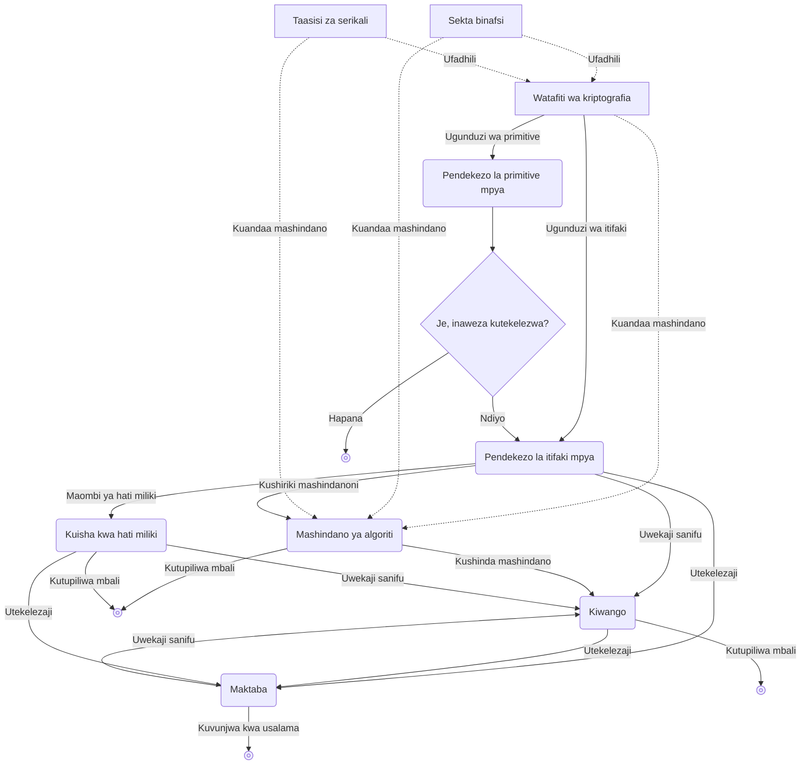

## Kriptografia ni nini

**Kriptografia(cryptography)** kimsingi ni tawi dogo la sayansi linalolenga kulinda **itifaki(protocol)** dhidi ya vitendo vya kiadui.

Hapa, itifaki ni orodha ya hatua ambazo mtu mmoja au zaidi wanapaswa kufuata ili kufanikisha jambo fulani. Kwa mfano, kama unataka kushiriki ubao wa kunakili (clipboard) kati ya vifaa, yafuatayo ni itifaki ya kushiriki clipboard.

1. Mabadiliko yanapotokea kwenye clipboard ya kifaa chochote, yaliyomo kwenye clipboard hiyo hunakiliwa na kupakiwa kwenye seva.
2. Seva hufahamisha vifaa vingine kwamba mabadiliko yametokea kwenye clipboard ya pamoja.
3. Vifaa vilivyobaki hupakua yaliyomo kwenye clipboard hiyo iliyoshirikiwa kutoka kwenye seva.

Hata hivyo, hii si itifaki nzuri, kwa sababu ikiwa yaliyomo kwenye clipboard yatapakiwa na kupakuliwa kama maandishi wazi, mtu fulani katikati ya mawasiliano, au hata upande wa seva yenyewe, anaweza kuyaona kwa siri. Hapa, jukumu la kriptografia ni kutetea kwa kuzingatia uwepo wa adui anayetaka kuchungulia yaliyomo kwenye clipboard.

## Kriptografia ya simetri

### Usimbaji fiche wa simetri

> Hebu fikiria hali ambapo Alice anahitaji kumtumia Bob barua. Ili kumfikishia Bob taarifa za siri, Alice anamwamuru mjumbe(messenger) aibebe barua hiyo na kuipeleka.
> Hata hivyo, Alice hamwamini mjumbe huyo kikamilifu, na anataka ujumbe unaosafirishwa ubaki siri kwa kila mtu isipokuwa Bob, akiwemo huyo mjumbe anayebeba barua.

Algoriti ya kikiriptografia iliyobuniwa zamani kwa matumizi katika hali kama hii ni **algoriti ya usimbaji fiche wa simetri(symmetric encryption algorithm)**.

> **Primitive**  
> Neno primitive katika kamusi humaanisha kwa kawaida "cha awali" au "cha msingi".
> Hata hivyo, katika kriptografia neno hili hutumiwa mara nyingi pia, na hapa primitive humaanisha kazi au algoriti ndogo zaidi inayounda mfumo wa kikiriptografia.
> Unaweza kulielewa kama "kipengele cha msingi" au "mantiki ya msingi".
{: .prompt-info }

Hebu tufikirie primitive fulani inayotoa kazi mbili zifuatazo.
- `ENCRYPT`: hupokea **ufunguo wa siri(secret key)** (kwa kawaida namba kubwa) na **ujumbe(message)** kama ingizo, kisha hutoa mfuatano wa namba kama ujumbe uliosimbwa
- `DECRYPT`: kazi kinyume ya `ENCRYPT`; hupokea ufunguo huo huo wa siri na ujumbe uliosimbwa, kisha hutoa ujumbe wa asili

Ili kutumia primitive ya aina hii kuficha ujumbe wa Alice ili mtu wa tatu, akiwemo mjumbe, asiweze kuusoma, Alice na Bob lazima kwanza wakutane mapema na wakubaliane ni ufunguo gani wa siri watatumia. Baadaye Alice anaweza kutumia kazi ya `ENCRYPT` kusimba ujumbe kwa ufunguo huo wa siri waliokubaliana, kisha akamtumia Bob ujumbe huo uliosimbwa kupitia kwa mjumbe. Bob kisha hutumia ufunguo huo huo wa siri pamoja na kazi ya `DECRYPT` kupata ujumbe wa asili.

Kwa namna hii, mchakato wa kusimba kitu kwa kutumia ufunguo wa siri ili kisitofautishwe kwa mwonekano na kelele isiyo na maana ni njia ya kawaida katika kriptografia ya kulinda itifaki.

Usimbaji fiche wa simetri ni sehemu ya kundi kubwa la algoriti za kriptografia linaloitwa **kriptografia ya simetri(symmetric cryptography)** au **kriptografia ya ufunguo wa siri(secret key cryptography)**, na katika baadhi ya hali kunaweza hata kuwa na funguo zaidi ya mmoja.

## Kanuni ya Kerckhoffs

Leo tunaweza kuwasiliana karibu papo hapo kwa kutumia kompyuta na mtandao, vyombo vya mawasiliano vyenye nguvu zaidi kuliko barua za karatasi. Hata hivyo, kwa maneno mengine, hii pia inamaanisha kwamba wajumbe waovu wamekuwa na nguvu zaidi; wanaweza kuwa Wi-Fi ya umma isiyo salama kama ile ya kwenye kahawa, mtoa huduma wa intaneti(ISP), vifaa na seva mbalimbali za mawasiliano zinazounda mtandao na kusafirisha ujumbe, taasisi za serikali, au hata ndani ya kifaa chako mwenyewe kinachoendesha algoriti. Adui wanaweza kutazama ujumbe mwingi zaidi kwa wakati halisi, na bila kugunduliwa wanaweza kuharibu, kubadilisha, kunasa, au kukagua ujumbe kwa vipindi vya nanosekondi.

Katika mchakato mrefu wa majaribio na makosa ndani ya kriptografia, kanuni kuu moja imejitokeza kwa ajili ya usalama unaoweza kuaminiwa: <u>primitive lazima zichunguzwe hadharani</u>. Mbinu iliyo kinyume na hili inaweza kuitwa **usalama kwa kutegemea kuficha(security by obscurity)**, na kwa kuwa mipaka yake iko wazi, imeachwa katika enzi ya leo.

Kanuni hii ilibainishwa kwa mara ya kwanza mwaka 11883 na mtaalamu wa isimu na mwanakryptografia wa Uholanzi Auguste Kerckhoffs, na huitwa **kanuni ya Kerckhoffs(Kerckhoffs's principle)**. Kanuni hiyo hiyo ilielezwa pia na Claude Shannon, mwanahisabati, mwanasayansi wa kompyuta, mwanakryptografia wa Marekani, na baba wa nadharia ya taarifa, kwa kauli kwamba "adui anajua mfumo(The enemy knows the system)", yaani "unapobuni mfumo wowote, lazima udhanie kwamba adui ataujua mfumo huo." Kauli hii huitwa **kauli mashuhuri ya Shannon(Shannon's maxim)**.

Usalama wa mfumo wa usimbaji fiche unapaswa kutegemea usiri wa ufunguo pekee; haipaswi kuwa tatizo hata kama mfumo wenyewe unajulikana, na kwa kweli unapaswa kuchapishwa wazi ili **wachambuzi wa kriptografia(cryptanalyst)** wengi waweze kuuthibitisha, kama ilivyokuwa kwa AES. Siri daima iko katika hatari ya kuvuja, na kwa hiyo ni sehemu inayowezekana kushindwa; kutoka upande wa mlinzi, ni bora kadiri sehemu zinazopaswa kubaki siri zinavyokuwa chache. Ni vigumu sana kuweka mfumo mzima mkubwa na changamano kama mfumo wa usimbaji fiche kuwa siri kwa muda mrefu, ilhali ni rahisi zaidi kuweka ufunguo pekee kuwa siri. Zaidi ya hayo, hata siri ikivuja, kubadilisha ufunguo uliovuja kwa ufunguo mpya ni rahisi sana kuliko kubadilisha mfumo mzima wa usimbaji fiche.

## Kriptografia ya asimetri

Itifaki nyingi kwa kweli hufanya kazi kwa msingi wa kriptografia ya simetri, lakini mtindo huu hudhani kwamba washiriki wawili lazima wakutane angalau mara moja mwanzoni ili waamue ufunguo. Hivyo basi, tatizo huwa ni jinsi ya kuamua ufunguo mapema na kuushiriki kwa usalama; tatizo hili huitwa **usambazaji wa funguo(key distribution)**. Tatizo la usambazaji wa funguo lilikuwa gumu kwa muda mrefu, na hatimaye lilitatuliwa mwishoni mwa miaka ya 11970 kwa kuibuka kwa algoriti za kriptografia zinazoitwa **kriptografia ya asimetri(asymmetric cryptography)** au **kriptografia ya ufunguo wa umma(public key cryptography)**.

Primitive zinazowakilisha kriptografia ya asimetri ni pamoja na **ubadilishanaji wa funguo(key exchange)**, **usimbaji fiche wa asimetri(asymmetric encryption)**, na **saini ya kidijitali(digital signature)**.

### Ubadilishanaji wa funguo

**Ubadilishanaji wa funguo** hufanya kazi kwa muhtasari kama ifuatavyo.

1. Alice na Bob wanakubaliana kutumia kwa pamoja seti fulani ya vigezo $G$
2. Alice na Bob kila mmoja huamua **ufunguo wa siri binafsi(private key)** wake, $a, b$
3. Alice na Bob huchanganya kila mmoja ufunguo wake wa siri $a$, $b$ na kigezo cha pamoja $G$ walichokubaliana mwanzoni ili kukokotoa **ufunguo wa umma(public key)** $A = f(G,a)$, $B = f(G,b)$, kisha wanashiriki funguo hizi hadharani
4. Alice hutumia ufunguo wa umma wa Bob $B = f(G,b)$ pamoja na ufunguo wake wa siri $a$ kukokotoa $f(B,a) = f(f(G,b),a)$, na Bob vivyo hivyo hutumia ufunguo wa umma wa Alice $A = f(G,a)$ pamoja na ufunguo wake wa siri $b$ kukokotoa $f(A,b) = f(f(G,a),b)$
5. Hapa, tukitumia $f$ inayofaa yenye sifa kwamba $f(f(G,a),b) = f(f(G,b),a)$, hatimaye Alice na Bob watashiriki siri ile ile, na mtu wa tatu, ingawa anajua $G$ na funguo za umma $A = f(G,a)$, $B = f(G,b)$, hataweza kupata $f(A,b)$ kwa taarifa hizo pekee, hivyo siri inaweza kubaki salama

Kwa kawaida siri inayoshirikiwa kwa namna hii hutumiwa baadaye kama ufunguo wa siri wa [usimbaji fiche wa simetri](#usimbaji-fiche-wa-simetri) ili kubadilishana ujumbe mwingine.

Algoriti ya kwanza kuchapishwa, na pia maarufu zaidi, ya ubadilishanaji wa funguo ni algoriti ya Diffie-Hellman, iliyopewa jina kutokana na majina ya koo ya waandishi wake wawili, Diffie na Hellman.

Hata hivyo, ubadilishanaji wa funguo wa Diffie-Hellman pia una mipaka yake. Hebu fikiria hali ambapo mshambuliaji ananasa funguo za umma $A = f(G,a)$ na $B = f(G,b)$ katika hatua ya kubadilishana funguo za umma, kisha anazibadilisha na yake mwenyewe $M = f(G,m)$ na kuziwasilisha kwa Alice na Bob. Katika hali hii, Alice na mshambuliaji hushiriki siri bandia $f(M, a) = f(A, m)$, na Bob na mshambuliaji hushiriki siri nyingine bandia $f(M, b) = f(B, m)$. Hivyo, mshambuliaji anaweza kujifanya Bob kwa Alice, na kujifanya Alice kwa Bob. Hali hii huitwa kwamba <u><strong>mshambuliaji wa mtu-katikati(man-in-the-middle, MITM)</strong> amefaulu kuivamia itifaki</u>. Kwa sababu hii, ubadilishanaji wa funguo hausuluhishi tatizo la uaminifu, bali hurahisisha tu taratibu pale washiriki wanapokuwa wengi.

### Usimbaji fiche wa asimetri

Baada ya kugunduliwa kwa algoriti ya ubadilishanaji wa funguo ya Diffie-Hellman, uvumbuzi wa ufuatiliaji ulitokea kwa haraka: **algoriti ya RSA(RSA algorithm)**, iliyopewa jina kutokana na herufi za kwanza za majina ya wavumbuzi wake Ronald Rivest, Adi Shamir, na Leonard Adleman. RSA inajumuisha primitive mbili: usimbaji fiche wa ufunguo wa umma (usimbaji fiche wa asimetri) na saini ya kielektroniki; zote mbili ni sehemu ya kriptografia ya asimetri.

Kwa upande wa **usimbaji fiche wa asimetri**, lengo lake la msingi la kusimba ujumbe ili kupata usiri linafanana na [usimbaji fiche wa simetri](#usimbaji-fiche-wa-simetri). Hata hivyo, tofauti na usimbaji fiche wa simetri ambao hutumia ufunguo ule ule wa simetri kwa usimbaji na usimbuaji, usimbaji fiche wa asimetri una sifa zifuatazo.
- Hufanya kazi kwa funguo mbili, ufunguo wa umma na ufunguo wa siri
- Mtu yeyote anaweza kusimba kwa ufunguo wa umma, lakini usimbuaji unaweza kufanywa tu na mtu aliye na ufunguo wa siri

1. Kuna kisanduku kilicho wazi (ufunguo wa umma) ambacho mtu yeyote anaweza kuweka ujumbe ndani na kukifunga, lakini kikishafungwa mara moja, kinaweza kufunguliwa tu kwa ufunguo (ufunguo wa siri) alio nao Bob
2. Alice huweka ujumbe anaotaka kutuma ndani ya kisanduku na kukifunga (yaani, kuusimba), kisha humkabidhi Bob
3. Bob hupokea kisanduku kilichofungwa (ujumbe uliosimbwa), kisha hutumia ufunguo wake (ufunguo wa siri) kukifungua na kutoa ujumbe (yaani, kuusimbua)

### Saini ya kidijitali

RSA haitoi tu usimbaji fiche wa asimetri bali pia **saini ya kidijitali**, na primitive hii ya saini ya kidijitali ilisaidia sana kujenga uaminifu kati ya Alice na Bob. Wakati wa kutia saini ujumbe, mtu hutumia ufunguo wake wa siri, na mtu mwingine anapotaka kuthibitisha uhalisi wa saini hiyo, hutumia ujumbe uliotiwa saini, saini yenyewe, pamoja na ufunguo wa umma wa mtiaji saini ili kufanya uthibitishaji.

## Matumizi ya kriptografia

Kwa kuwa lengo la kriptografia ni kulinda itifaki dhidi ya vitendo vya kiadui, manufaa yake huamuliwa na lengo ambalo itifaki hiyo inajaribu kulifikia. Primitive na itifaki nyingi za kriptografia huwa na angalau sifa moja au zaidi kati ya zifuatazo.
- **Usiri(confidentiality)**: kuficha na kulinda sehemu ya taarifa dhidi ya watu wasiopaswa kuiona
- **Uthibitishaji(authentication)**: kumtambua unayewasiliana naye (k.m. kuthibitisha kwamba ujumbe uliopokelewa umetumwa kweli na Alice)

## Mfumo ikolojia wa kriptografia

