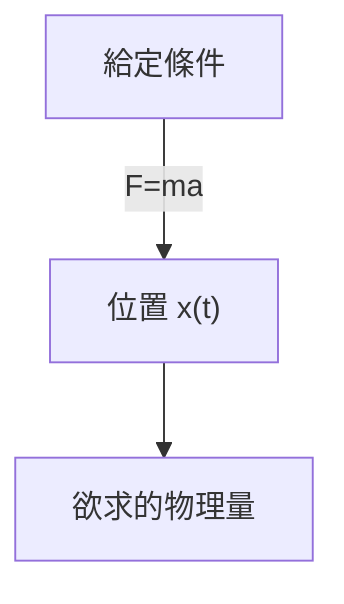
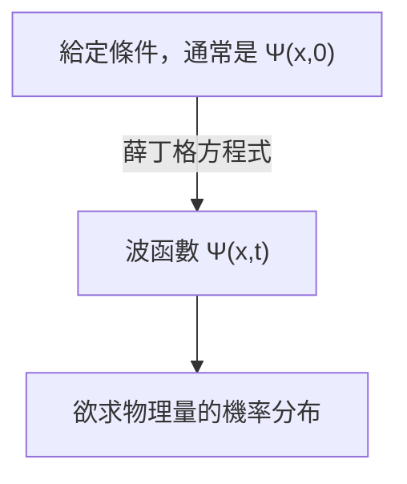

## TL;DR
> - (時間相依的)薛丁格方程式：
>
> $$ i\hbar\frac{\partial \Psi}{\partial t} = - \frac{\hbar^2}{2m}\frac{\partial^2 \Psi}{\partial x^2} + V\Psi $$
>
> - 波函數 $\Psi(x,t)$ 的統計解釋（Born 解釋）：波函數絕對值的平方 $\|\Psi(x,t)\|^2$ 是在時間 $t$、位置 $x$ 處發現粒子的**機率密度函數**。
> - 波函數的規範化：
>   - $\int_{-\infty}^{\infty} \|\Psi(x,t)\|^2 dx = 1$
>   - 若 $\Psi(x,t)$ 是薛丁格方程式的解，則對任意複數常數 $A$，$A\Psi(x,t)$ 也同樣是解，此時決定常數 $A$ 使其滿足上式的過程稱為規範化（normalization）
>   - **無法規範化的解（non-normalizable solutions）**不能表示粒子，因此不是有效的波函數，只有**平方可積的（square-integrable）**解才是物理上可能的狀態
>   - 在某一時刻規範化的波函數，隨著時間的推移，即使 $\Psi$ 發生變化，仍然會保持規範化狀態
> - 機率流：
>   - $J(x,t) \equiv \cfrac{i\hbar}{2m}\left(\Psi\cfrac{\partial \Psi^\*}{\partial x}-\Psi^\*\cfrac{\partial \Psi}{\partial x}\right)$
>   - 粒子被發現的機率通過點 $x$ 的流量（單位時間的機率）
>   - 若在時間 $t$、區域 $a<x<b$ 中發現粒子的機率為 $P_{ab}(t)$，則 $\cfrac{dP_{ab}}{dt} = J(a,t) - J(b,t)$
{: .prompt-info }

## Prerequisites
- 連續機率分布與機率密度

## 薛丁格方程式（Schrödinger equation）
考慮一個質量為 $m$ 的粒子在受到給定力 $F(x,t)$ 的情況下沿著 $x$ 軸移動的情況。

在經典力學中，主要目標是應用牛頓運動方程式 $F=ma$ 來確定任意時間粒子的位置 $x(t)$。這個過程可以用以下圖表表示：

在量子力學中，同樣的問題用非常不同的方法來處理，量子力學的方法是解決以下**薛丁格方程式（Schrödinger equation）**來求得粒子的**波函數** $\Psi(x,t)$。

$$ \begin{gather*}
i\hbar\frac{\partial \Psi}{\partial t} = - \frac{\hbar^2}{2m}\frac{\partial^2 \Psi}{\partial x^2} + V\Psi. \label{eqn:schrodinger_eqn}\tag{1}\\
\text{(} i=\sqrt{-1}\text{, } \hbar=\frac{h}{2\pi}=1.054573\times10^{-34}\text{, } h\text{: 普朗克常數, } V(x)\text{: 勢能)}
\end{gather*} $$

> *圖片來源*
> - 作者：維基媒體用戶 Xcodexif
> - 授權：[CC BY-SA 4.0](https://creativecommons.org/licenses/by-sa/4.0/)

## 波函數 $\Psi(x,t)$ 的統計解釋（Born 解釋）
在經典力學中，粒子位於一個點，而在量子力學中，表示粒子狀態的波函數在給定 $t$ 時是 $x$ 的函數，也就是說它分布在空間中。這在物理上應該如何解釋呢？

根據玻恩（Born）的**統計解釋**，波函數絕對值的平方 $\|\Psi(x,t)\|^2$ 是在時間 $t$、位置 $x$ 處發現粒子的機率密度函數。波函數 $\Psi$ 本身是複數，但 $\|\Psi\|^2=\Psi^\*\Psi$（$\Psi^\*$ 是 $\Psi$ 的共軛複數）是大於或等於 0 的實數，因此這種解釋成立。即可表示為：

$$ \int_a^b |\Psi(x,t)|^2 dx = \text{在時間 }t\text{ 中於 }a\text{ 和 }b\text{ 之間找到粒子的機率}. \tag{2}$$

這種統計解釋意味著量子力學包含一種**不確定性（indeterminacy）**。即使知道關於粒子的一切（波函數），也只能知道可能結果的機率分布，而無法確定特定值。

這在直覺上難以接受，因此自然而然地產生了疑問：這種不確定性是量子力學某種缺陷造成的，還是自然界的本質特性？

## 看待量子力學不確定性（quantum indeterminacy）的觀點
假設我們測量某個粒子的位置，發現這個粒子位於點 $C$。那麼，在測量之前，這個粒子在哪裡？

### 實在論（realist）立場

> "上帝不玩骰子。"（"God does not play dice."）  
> *by Albert Einstein*

粒子本來就在 $C$ 點。這也是愛因斯坦（Einstein）和薛丁格（Schrödinger）的觀點。然而，從這個觀點來看，實際上粒子確實位於 $C$ 點，但由於理論的限制，在測量前只能以機率分布的形式了解粒子的位置，因此量子力學是不完整的理論。也就是說，根據這個觀點，不確定性不是自然界的本質特性，而是量子力學限制的結果，除了 $\Psi$ 外還存在某些隱藏變數，只有知道這些變數才能完美描述粒子。

> 薛丁格（Schrödinger）曾是愛因斯坦（Einstein）的學生，曾在他手下擔任助教，之後也與愛因斯坦保持交流，薛丁格的實在論和決定論立場很可能受到了這種影響。
{: .prompt-info }

### 正統（orthodox）立場

> "別告訴上帝該怎麼擲骰子。"（"Stop telling God what to do with his dice."）  
> *by Niels Bohr, In answer to Einstein's earlier quote*
>
> "觀測不僅干擾被測量的對象，還產生它"（"Observations not only disturb what is to be measured, they produce it"）  
> ...  
> "我們迫使它呈現一個確定的位置。"（"We compel to assume a definite position."）  
> *by Pascual Jordan*

在測量之前，粒子只以機率分布的形式存在，不在任何特定位置，只有在進行測量時，粒子才會出現在某個位置。這種解釋被稱為**哥本哈根詮釋**，由波爾（Bohr）和海森堡（Heisenberg）在哥本哈根大學提出。

> 有趣的是，就像愛因斯坦和薛丁格的關係一樣，海森堡（Heisenberg）也是波爾（Bohr）的學生。
{: .prompt-info }

### 不可知論（agnostic）立場

> "就像那個古老的問題：針尖上能坐多少天使一樣，沒必要為了思考一些完全無法知道的東西是否存在而傷腦筋。"（"One should no more rack one's brain about the problem of whether something one cannot know anything about exists all the same, than about the ancient question of how many angels are able to sit on the point of a needle."）  
> *by Wolfgang Pauli*

拒絕回答。無論對測量前粒子狀態做出什麼主張，如果驗證這個主張的唯一方法是測量，那麼它就不再是「測量前」的狀態了，這有什麼意義呢？本質上，這只是對無法測試和無法知道的事物進行形而上學的討論。

### 當今的共識
在人類紀元（Holocene calendar）11964年，約翰·貝爾（John Bell）證明了無論在測量前還是測量後，粒子是否存在於確切位置會導致可觀測的差異，從而排除了不可知論立場，之後通過實驗，哥本哈根詮釋成為主流。因此，除非另有說明，通常討論量子力學時都以哥本哈根詮釋為前提。

> 仍然存在一些可能正確的其他解釋，如非局域隱變數理論（nonlocal hidden variable theories）或多世界詮釋（many worlds interpretation）等。
{: .prompt-info }

## 測量與波函數坍縮
粒子在測量前沒有確切位置，通過測量才獲得特定位置 $C$（後面會在其他文章中討論，根據海森堡不確定性原理，這個位置也不是完全精確的值，而是有一定誤差範圍）。但是，在第一次測量後立即進行額外測量時，不會每次測量都得到不同的值，而是必定得到相同的結果。這可以這樣解釋：

在進行第一次測量的瞬間，測量對象的波函數劇烈變化，集中在點 $C$ 附近形成窄而尖的 $\|\Psi(x,t)\|^2$ 圖形。這被稱為波函數因測量而**坍縮（collapse）**到點 $C$。

因此，物理過程可分為兩種不同類型：
- 波函數根據薛丁格方程式緩慢變化的一般（ordinary）過程
- $\Psi$ 突然且不連續坍縮的測量（measurement）過程

> 因測量而坍縮的波函數隨著時間的推移會根據薛丁格方程式再次在空間中擴散。因此，要重現相同的測量結果，必須立即進行第二次測量。
{: .prompt-tip }

## 波函數的規範化（Normalization）
由於波函數絕對值的平方 $\|\Psi(x,t)\|^2$ 是在時間 $t$、位置 $x$ 處發現粒子的機率密度，因此對所有 $x$ 積分 $\|\Psi\|^2$ 應等於 1。

$$ \int_{-\infty}^{\infty} |\Psi(x,t)|^2 dx = 1. \label{eqn:wavefunction_norm}\tag{3} $$

在式 ($\ref{eqn:schrodinger_eqn}$) 中，如果 $\Psi(x,t)$ 是解，那麼對於任意複數常數 $A$，$A\Psi(x,t)$ 也是解。因此，需要確定 $A$ 使其滿足式 ($\ref{eqn:wavefunction_norm}$)，這個過程稱為波函數的規範化（normalization）。薛丁格方程式的某些解在積分時會發散到無窮大，在這種情況下，不存在滿足式 ($\ref{eqn:wavefunction_norm}$) 的常數 $A$。平凡解（trivial solution）$\Psi=0$ 也是如此。這些**無法規範化的解（non-normalizable solutions）**不能表示粒子，因此不是有效的波函數。物理上可能的狀態對應於薛丁格方程式的**平方可積（square-integrable）**解。

此外，薛丁格方程式的一個重要性質是，<u>在某一時刻規範化的波函數，隨著時間的推移，即使 $\Psi$ 發生變化，仍然會保持規範化狀態（$\int_{-\infty}^{\infty} |\Psi(x,t)|^2 dx = 1$）</u>。如果每個時刻都需要用不同的 $A$ 值來規範化波函數，那麼 $A$ 就不是常數而是時間 $t$ 的函數，這樣就無法求解薛丁格方程式了。但由於這個性質，在初始條件（$t=0$）下規範化的 $A$ 值會與時間 $t$ 無關地保持不變。

### 證明

$$ \frac{d}{dt}\int_{-\infty}^{\infty} |\Psi(x,t)|^2 dx = \int_{-\infty}^{\infty} \frac{\partial}{\partial t}|\Psi(x,t)|^2 dx. \label{eqn:norm_proof_1}\tag{4} $$

> $\|\Psi\|^2$ 對 $x$ 積分的結果只是 $t$ 的函數，所以左邊使用全微分（$d/dt$），而 $\|\Psi\|^2$ 本身是 $x$ 和 $t$ 的二元函數，所以右邊使用偏微分（$\partial/\partial t$）。
{: .prompt-tip }

上式可以根據乘積的微分規則改寫為：

$$ \frac{\partial}{\partial t}|\Psi|^2 = \frac{\partial}{\partial t}(\Psi^*\Psi) = \Psi^*\frac{\partial \Psi}{\partial t} + \frac{\partial \Psi^*}{\partial t}\Psi. \label{eqn:norm_proof_2}\tag{5}$$

將式 ($\ref{eqn:schrodinger_eqn}$) 薛丁格方程式兩邊乘以 $-\cfrac{i}{\hbar}$，得到

$$ \frac{\partial \Psi}{\partial t} = \frac{i\hbar}{2m}\frac{\partial^2 \Psi}{\partial x^2}-\frac{i}{\hbar}V\Psi \label{eqn:norm_proof_3}\tag{6}$$

從上式中取 $\cfrac{\partial \Psi}{\partial t}$ 的共軛複數，得到

$$ \frac{\partial \Psi^*}{\partial t} = -\frac{i\hbar}{2m}\frac{\partial^2 \Psi^*}{\partial x^2}+\frac{i}{\hbar}V\Psi^* \label{eqn:norm_proof_4}\tag{7}$$

現在將式 ($\ref{eqn:norm_proof_3}$) 和 ($\ref{eqn:norm_proof_4}$) 代入式 ($\ref{eqn:norm_proof_2}$)，得到

$$\begin{align*}
\frac{\partial}{\partial t}|\Psi|^2 &= \frac{i\hbar}{2m}\left(\Psi^*\frac{\partial^2\Psi}{\partial x^2}-\frac{\partial^2\Psi^*}{\partial x^2}\Psi\right) \\
&= \frac{\partial}{\partial x}\left[\frac{i\hbar}{2m}\left(\Psi^*\frac{\partial\Psi}{\partial x}-\frac{\partial\Psi^*}{\partial x}\Psi \right) \right] 
\end{align*} \label{eqn:norm_proof_5}\tag{8}$$

將此結果代入式 ($\ref{eqn:norm_proof_1}$) 的右邊，得到

$$ \frac{d}{dt}\int_{-\infty}^{\infty} |\Psi(x,t)|^2 dx = \frac{i\hbar}{2m}\left(\Psi^*\frac{\partial\Psi}{\partial x}-\frac{\partial\Psi^*}{\partial x}\Psi \right)\Bigg|_{-\infty}^{\infty}. \label{eqn:norm_proof_6}\tag{9} $$

但是，為了使波函數規範化且物理上有效，當 $x$ 趨近 $\pm\infty$ 時，$\Psi(x,t)$ 必須收斂到 $0$。因此

$$ \frac{d}{dt}\int_{-\infty}^{\infty} |\Psi(x,t)|^2 dx = 0 \label{eqn:norm_proof_fin}\tag{10} $$

所以，$\int_{-\infty}^{\infty} \|\Psi(x,t)\|^2 dx$ 是與時間無關的常數。

$$ \therefore \text{如果 }\Psi\text{ 在某一時刻 }t\text{ 是規範化的，那麼對於所有其他時刻 }t\text{ 也是規範化的。} \blacksquare $$

## 機率流（probability current）
現在，讓我們將在時間 $t$、區域 $a<x<b$ 中發現粒子的機率表示為 $P_{ab}(t)$。那麼

$$ P_{ab}(t) = \int_a^b |\Psi(x,t)|^2 dx \tag{11}$$

且

$$ \begin{align*}
\frac{dP_{ab}}{dt} &= \frac{d}{dt}\int_a^b |\Psi(x,t)|^2 dx \\
&= \int_a^b \frac{\partial}{\partial t}|\Psi(x,t)|^2 dx \quad \text{(}\because\text{參考式 }\ref{eqn:norm_proof_1}\text{)}\\
&= \int_a^b \left(\frac{\partial \Psi^*}{\partial t}\Psi + \Psi^*\frac{\partial \Psi}{\partial t} \right)dx \quad \text{(}\because\text{參考式 }\ref{eqn:norm_proof_2}\text{)} \\
&= \frac{i\hbar}{2m}\int_a^b \left(\Psi^*\frac{\partial^2\Psi}{\partial x^2}-\frac{\partial^2\Psi^*}{\partial x^2}\Psi\right)dx \\
&= \frac{i\hbar}{2m}\int_a^b\frac{\partial}{\partial x}\left(\Psi^*\frac{\partial\Psi}{\partial x}-\frac{\partial\Psi^*}{\partial x}\Psi \right)dx \quad \text{(}\because\text{參考式 }\ref{eqn:norm_proof_3},\ref{eqn:norm_proof_4},\ref{eqn:norm_proof_5}\text{)}\\
&= \frac{i\hbar}{2m}\left(\Psi^*\frac{\partial \Psi}{\partial x}-\frac{\partial \Psi^*}{\partial x}\Psi \right)\Bigg|^b_a \\
&= \frac{i\hbar}{2m}\left(\Psi\frac{\partial \Psi^*}{\partial x}-\Psi^*\frac{\partial \Psi}{\partial x} \right)\Bigg|^a_b
\end{align*} $$

在這裡，如果我們定義

$$ J(x,t) \equiv \frac{i\hbar}{2m}\left(\Psi\frac{\partial \Psi^*}{\partial x}-\Psi^*\frac{\partial \Psi}{\partial x}\right) \label{eqn:probability_current}\tag{12}$$

則

$$ \frac{dP_{ab}}{dt} = J(a,t) - J(b,t) \label{eqn:probability_over_time}\tag{13}$$

式 ($\ref{eqn:probability_current}$) 定義的 $J(x,t)$ 被稱為**機率流（probability current）**，表示粒子被發現的機率通過點 $x$ 的流量*（即單位時間的機率）。從式 ($\ref{eqn:probability_over_time}$) 可以看出，如果在特定時間 $t$，從一端流入的機率流 $J(a,t)$ 大於從另一端流出的機率流 $J(b,t)$，則 $P_{ab}$ 增加；反之則減少。

> *流體力學中的流量（flow rate）概念，這裡流體的質量或體積被替換為機率。
{: .prompt-info }
