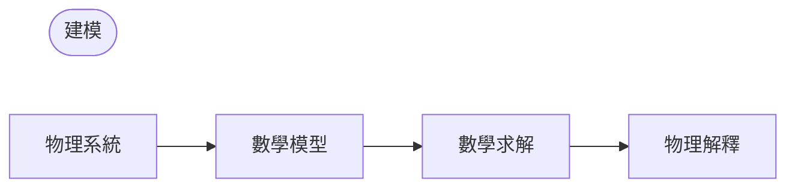

## 建模（Modeling）
- **模型（model）**：將欲解決的工程問題通過變量、函數、方程等數學式子形式化的結果
- **數學建模（mathematical modeling）**或**建模（modeling）**：建立模型、數學求解並解釋結果的過程

由於速度或加速度等許多物理概念都是導數，因此模型通常是包含未知函數導數的方程，即**微分方程（differential equation）**的形式。

## 常微分方程（ODE）和偏微分方程（PDE）
### 常微分方程（ODE）
**常微分方程（ordinary differential equation; ODE）**：包含未知函數的 $n$ 階導數的方程

例如：

$$y' = \cos x$$

$$ y'' + 9y = e^{-2x} $$

$$ y'y''' - \frac{3}{2}y'^{2} = 0 $$

### 偏微分方程（PDE）
**偏微分方程（partial differential equation; PDE）**：包含具有兩個或以上變量的未知函數偏導數的方程

例如：

$$ \frac{\partial^2 u}{\partial x^2} + \frac{\partial^2 u}{\partial y^2} = 0 $$

## 解（Solution）
如果函數 $h(x)$ 在某個開區間 $(a, b)$ 上定義且可微，並且當 $y$ 和 $y'$ 分別被 $h$ 和 $h'$ 替換時，給定的常微分方程成為恆等式，則函數

$$ y = h(x) $$

被稱為區間 $(a, b)$ 上給定常微分方程的**解（solution）**，$h$ 的曲線被稱為**解曲線（solution curve）**。

例如：

$$ y'=\cos x \Leftrightarrow y=\sin x+c $$

$$ y'=0.2y \Leftrightarrow y=ce^{0.2t} $$

像這樣包含任意常數 $c$ 的解被稱為常微分方程的**通解（general solution）**。

從幾何學角度來看，常微分方程的通解是無限多個解曲線的集合，常數 $c$ 的每個值對應一條曲線。選擇特定的常數 $c$ 值，我們就得到常微分方程的**特解（particular solution）**。

## 初值問題（Initial Value Problem）
為了得到給定問題的特解，我們需要確定任意常數 $c$ 的值，在許多情況下，可以通過 $y(x_{0})=y_{0}$ 或 $y(t_{0})=y_{0}$ 這樣的**初始條件（initial condition）**來確定（即使自變量不是時間或 $t_{0}\neq0$，我們仍稱之為初始條件）。具有初始條件的常微分方程被稱為**初值問題（initial value problem）**。

例如：

$$ y'=f(x,y),\qquad y(x_{0})=y_{0} $$

## 建模示例：放射性物質的指數衰變
給定 0.5g 的放射性物質，求之後時間內剩餘的量。
> 根據實驗，放射性物質在每一瞬間以與剩餘物質量成比例的速度分解，因此隨時間衰變。
{: .prompt-info }

### 1. 建立數學模型
讓我們用 $y(t)$ 表示時間 $t$ 時剩餘的物質量。由於 $y'(t)$ 與 $y(t)$ 成比例，我們得到以下**一階常微分方程**：

$$ \frac {dy}{dt} = -ky$$ 

其中常數 $k>0$。

我們還知道**初始條件** $y(0)=0.5$。因此，我們可以將數學模型設定為以下**初值問題**：

$$ \frac {dy}{dt} = -ky, \qquad y(0)=0.5 $$

### 2. 數學求解
前面建立的常微分方程的通解如下（參考[分離變數法](/posts/Separation-of-Variables/#模型示例放射性碳定年法radiocarbon-dating)）：

$$ y(t)=ce^{-kt} $$

由於 $y(0)=c$，從初始條件我們得到 $y(0)=c=0.5$。因此，我們要求的特解是：

$$ y(t)=0.5e^{-kt} \quad(k>0)$$

### 3. 解的物理解釋
我們得到的解表示任意時間 $t$ 時放射性物質的量。放射性物質的量從初始值 0.5（g）開始，隨時間減少，當 $t \to \infty$ 時，$y$ 的極限值為 $0$。
