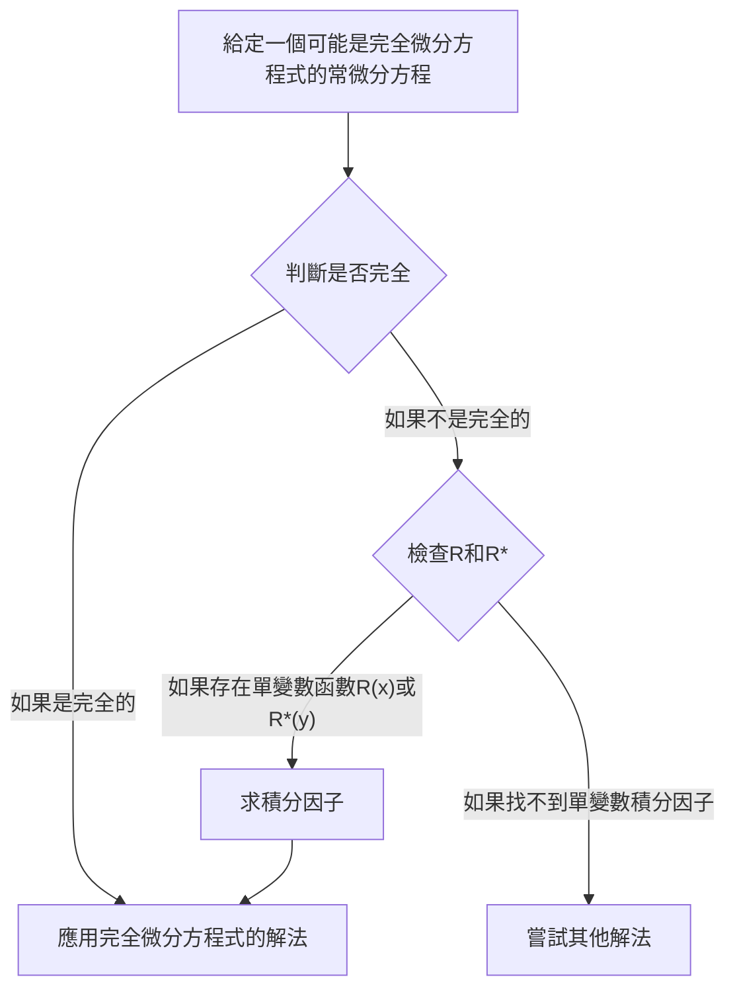

## TL;DR

## 完全微分方程式（Exact Differential Equation）
一階常微分方程 $M(x,y)+N(x,y)y'=0$ 可以寫成

$$ M(x,y)dx+N(x,y)dy=0 \tag{1} $$

如果存在

$$ \exists u(x,y): \frac{\partial u}{\partial x}=M(x,y) \land \frac{\partial u}{\partial y}=N(x,y) \tag{2} $$

則

$$ M(x,y)dx+N(x,y)dy=\frac{\partial u}{\partial x}dx+\frac{\partial u}{\partial y}dy=du \tag{3} $$

此時，我們稱常微分方程 $M(x,y)dx+N(x,y)dy=0$ 為**完全微分方程式（exact differential equation）**。這樣，這個常微分方程可以寫成

$$ du=0 $$

積分後，我們可以直接得到通解的形式

$$ u(x,y)=c \tag{4} $$

## 完全微分方程式的判別
假設在 $xy$ 平面上，在一個以不與自身相交的閉曲線為邊界的閉區域內，$M$ 和 $N$ 及其各自的一階偏導數都是連續的。再次看條件 (2)：

$$ \begin{align*}
\frac {\partial u}{\partial x}&=M(x,y) \tag{2a}
\\ \frac {\partial u}{\partial y}&=N(x,y) \tag{2b}
\end{align*}$$

對上式進行偏微分，得到

$$ \begin{align*}
\frac {\partial M}{\partial y} &= \frac{\partial^2 u}{\partial y \partial x}
\\ \frac {\partial N}{\partial x} &= \frac{\partial^2 u}{\partial x \partial y}
\end{align*}$$

由於假設了連續性，這兩個二階偏導數是相等的。

$$ \therefore \frac {\partial M}{\partial y}=\frac {\partial N}{\partial x} \tag{5}$$

因此，我們可以看出條件 (5) 是常微分方程 (1) 成為完全微分方程式的必要條件，雖然這裡沒有證明，但事實上它也是充分條件。也就是說，我們可以通過檢查這個條件是否滿足來判斷是否為完全微分方程式。

## 完全微分方程式的解法
將式 (2a) 視 $y$ 為常數，對 $x$ 積分，得到

$$ u = \int M(x,y) dx + k(y) \tag{6} $$

這裡，$k(y)$ 扮演積分常數的角色，因為我們將 $y$ 視為常數。現在，將 $x$ 視為常數，對式 (6) 關於 $y$ 求導，得到 $\partial u/\partial y$：

$$ \frac{\partial u}{\partial y} = \frac{\partial}{\partial y}\int M(x,y) dx + \frac{dk}{dy} $$

將上式與式 (2b) 比較，我們可以求出 $dk/dy$：

$$ \frac{\partial}{\partial y}\int M(x,y) dx + \frac{dk}{dy} = N(x,y) $$

$$ \frac{dk}{dy} = N(x,y) - \frac{\partial}{\partial y}\int M(x,y) dx $$

最後，積分上式以確定 $k(y)$，然後代入式 (6)，我們就可以得到隱函數解 $u(x,y)=c$：

$$ k(y) = \int N(x,y)dy - \int \left(\frac{\partial}{\partial y}\int Mdx\right)dy + c^* $$

$$ \int M(x,y)dx + \int N(x,y)dy - \int \left(\frac{\partial}{\partial y}\int Mdx\right)dy = c $$

> 比起將這個通解形式記為公式並應用，更重要的是理解解題的過程。
{: .prompt-tip }

## 積分因子（Integrating Factor）
假設給定一個非完全（Inexact）常微分方程：

$$ P(x,y)dx+Q(x,y)dy = 0 \quad \left( \frac {\partial P}{\partial y} \neq \frac {\partial Q}{\partial x} \right) \tag{7} $$

如果存在

$$ \exists F(x,y): \frac {\partial}{\partial y}(FP) = \frac {\partial}{\partial x}(FQ) \tag{8} $$

則我們可以將函數 $F$ 乘到給定的常微分方程 (7) 上，得到以下完全微分方程：

$$ FP\ dx+FQ\ dy = 0 \tag{9} $$

此時，我們稱函數 $F(x,y)$ 為式 (7) 的**積分因子（integrating factor）**。

## 求積分因子的方法
對式 (8) 應用乘積求導法則，並用下標表示偏導數，得到：

$$ F_y P + FP_y = F_x Q + FQ_x $$

在許多實際情況中，存在只依賴於一個變數的積分因子。假設 $F=F(x)$，則 $F_y=0$ 且 $F_x=F'=dF/dx$，因此我們得到：

$$ FP_y = F'Q + FQ_x $$

兩邊除以 $FQ$ 並整理項，得到：

$$ \begin{align*}
\frac{1}{F} \frac{dF}{dx} &= \frac{P_y}{Q} - \frac{Q_x}{Q}
\\ &= \frac{1}{Q}\left(\frac{\partial P}{\partial y}-\frac{\partial Q}{\partial x} \right)
\end{align*} \tag{10} $$

因此，我們可以得出以下結論：

> 對於給定的常微分方程 (7)，如果式 (10) 的右邊 $R$ 只是 $x$ 的函數，則式 (7) 有積分因子 $F=F(x)$。
>
> $$ F(x)=e^{\int R(x)dx}, \quad \text{其中 }R=\frac{1}{Q}\left(\frac{\partial P}{\partial y}-\frac{\partial Q}{\partial x} \right) \tag{11} $$
{: .prompt-info }

同樣地，如果 $F^*=F^*(y)$，我們可以得到式 (10) 的對應式：

$$ \frac{1}{F^*} \frac{dF^*}{dy} = \frac{1}{P}\left(\frac{\partial Q}{\partial x}-\frac{\partial P}{\partial y} \right) \tag{12} $$

因此，我們可以得出以下結論：

> 對於給定的常微分方程 (7)，如果式 (12) 的右邊 $R^*$ 只是 $y$ 的函數，則式 (7) 有積分因子 $F^*=F^*(y)$。
>
> $$ F^*(y)=e^{\int R^*(y)dy}, \quad \text{其中 }R^*=\frac{1}{P}\left(\frac{\partial Q}{\partial x}-\frac{\partial P}{\partial y} \right) \tag{13} $$
{: .prompt-info }
