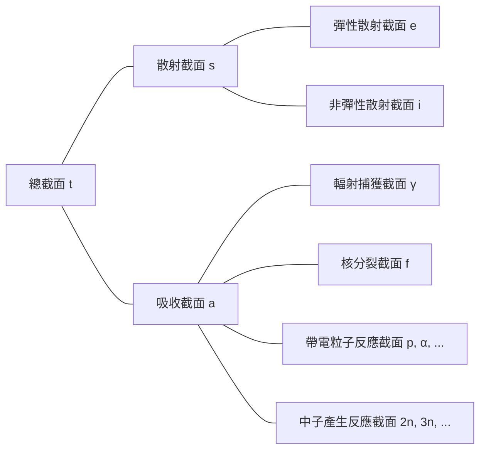

## 中子交互作用
中子是電中性的，因此不受原子內電子或原子核正電荷的電力影響。因此，中子可以穿過原子的電子雲直接與原子核反應。

### 彈性散射（elastic scattering）
- 中子與原子核碰撞後彈開
- 原子核保持基態，能量不變
- 表示為（n, n）

### 非彈性散射（inelastic scattering）
- 中子與原子核碰撞後彈開
- 與彈性散射不同，原子核吸收部分中子能量而進入激發態（吸熱反應）
- 表示為（n, n′）
- 激發態的原子核會釋放伽瑪射線回到基態，這時產生的伽瑪射線稱為*非彈性伽瑪射線（inelastic γ-ray）*

### 輻射捕獲（radiative capture）
- 原子核捕獲中子並釋放一個或多個伽瑪射線（放熱反應）
- 表示為（n, γ）
- 這時產生的伽瑪射線稱為*捕獲伽瑪射線（capture γ-ray）*

### 帶電粒子反應
- 原子核捕獲中子並釋放如阿爾法粒子（α）或質子（p）等帶電粒子
- 表示為（n, α）、（n, p）等
- 根據情況可能是放熱反應或吸熱反應

### 中子產生反應
- 高能中子與原子核碰撞，產生兩個或更多新的中子（吸熱反應）
- 表示為（n, 2n）、（n, 3n）等
- （n, 2n）反應在含重水或鈹的反應堆中特別重要，因為 $^2\text{H}$ 和 $^9\text{Be}$ 的中子結合能較低，即使與低能中子碰撞也容易被釋放

### 核分裂（fission）
- 中子與某些原子核碰撞，使該原子核分裂成兩個或更多的子核

## 截面（cross-section）或微觀截面（microscopic cross-section）
假設單一能量的中子束入射到（非常薄的）厚度為 $\tau$ 和面積為 $A$ 的靶材上，每秒每單位面積入射到靶材的中子數為 $I\ \text{neutrons/cm}^2\cdot \text{s}$。由於原子核在原子中所佔的體積比例非常小，且我們假設靶材非常薄，因此大部分中子會穿過靶材而不與原子核反應。那麼，每秒每單位面積與原子核碰撞的中子數與中子束強度 $I$、靶材厚度 $\tau$ 和靶材的原子密度 $N$ 成正比。

$$ \Delta I \propto I\tau N $$

引入比例常數 $\sigma$，可以表示為：

$$ \Delta I = \sigma I\tau N\ \text{[neutrons/cm}^2\cdot\text{s]} \tag{1} $$

計算入射中子中與原子核碰撞的中子比例：

$$ p = \frac {\Delta I}{I} = \sigma\tau N = \frac {\sigma}{A} A\tau N = \frac {\sigma}{A} N_t \tag{2} $$

（$N_t$：靶材的總原子數）

從這個式子可以看出 $\sigma$ 的單位是面積。這個比例常數 $\sigma$ 稱為*截面（cross-section）*或*微觀截面（microscopic cross-section）*。物理上，截面表示原子核與中子可能發生反應的有效面積。

## 微觀截面的單位
cm$^2$ 對於表示微觀截面來說太大了，因此通常使用 *barn*（b）作為單位。

$$ 1\ \text{b} = 10^{-24}\ \text{cm}^2 $$

## 微觀截面的類型
- 總截面（total）：$\sigma_t$
  - 散射截面（scattering）：$\sigma_s$
    - 彈性散射截面（elastic scattering）：$\sigma_e$
    - 非彈性散射截面（inelastic scattering）：$\sigma_i$
  - 吸收截面（absorption）：$\sigma_a$
    - 輻射捕獲截面（radiative capture）：$\sigma_\gamma$
    - 核分裂截面（fission）：$\sigma_f$
    - 帶電粒子反應截面：$\sigma_p, \sigma_\alpha, \cdots$
    - 中子產生反應截面：$\sigma_{2n}, \sigma_{3n}, \cdots$

## 巨觀截面（macroscopic cross-section）
從式（2）中，我們可以得到中子束每單位距離的碰撞率：

$$ \frac {p}{\tau} = \frac {1}{\tau} \frac {\Delta I}{I} = \sigma N \equiv \Sigma\ \text{[cm}^{-1}\text{]} \tag{3}$$

*巨觀截面（macroscopic cross-section）* 定義為原子密度 $N$ 與截面的乘積。物理上，巨觀截面表示中子在某個靶材中每單位行進距離的碰撞率。與微觀截面類似，可以細分如下：

- 巨觀總截面 $\Sigma_t=N\sigma_t$
  - 巨觀散射截面 $\Sigma_s=N\sigma_s$
  - 巨觀吸收截面 $\Sigma_a=N\sigma_a$

一般來說，對於任何反應，巨觀截面 $\Sigma_{reaction}=N\sigma_{reaction}$。

## 碰撞密度（collision density），即反應率（reaction rate）
*碰撞密度（collision density）*或*反應率（reaction rate）*表示靶材中每單位時間、每單位體積的碰撞次數。從式（1）和（3）可以得到以下定義：

$$ F = \frac {\Delta I}{\tau} = I\sigma N = I\Sigma \tag{4} $$
