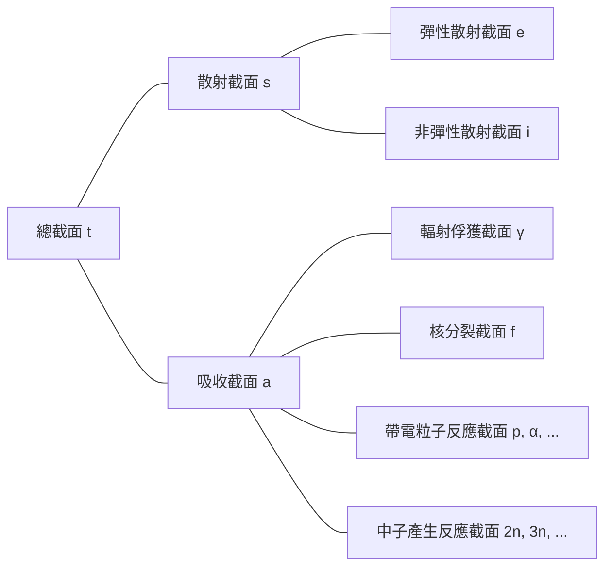

## 截面（cross-section）或微觀截面（microscopic cross-section）
假設單一能量中子束入射到（非常薄的）厚度為 $\tau$ 和面積為 $A$ 的目標物上，且每秒每單位面積入射到目標物上的中子數為 $I\ \text{neutrons/cm}^2\cdot \text{s}$。由於原子中原子核所佔的體積比例非常小，且假設目標物非常薄，因此大部分中子不會與原子核反應而直接穿過目標物。那麼，每秒每單位面積與原子核碰撞的中子數與中子束強度 $I$、目標物厚度 $\tau$ 和目標物的原子密度 $N$ 成正比。

$$ \Delta I \propto I\tau N $$

引入比例常數 $\sigma$，可以表示為：

$$ \Delta I = \sigma I\tau N\ \mathrm{[neutrons/cm^2\cdot s]} \label{eqn:microscopic_cross_section}\tag{1} $$

入射中子中與原子核碰撞的中子比例可以計算為：

$$ p = \frac {\Delta I}{I} = \sigma\tau N = \frac {\sigma}{A} A\tau N = \frac {\sigma}{A} N_t \label{eqn:collision_rate}\tag{2} $$

（$N_t$：目標物的總原子數）

從這個式子可以看出 $\sigma$ 具有面積的單位。這個比例常數 $\sigma$ 被稱為*截面（cross-section）*或*微觀截面（microscopic cross-section）*。物理上，截面代表原子核與中子反應的有效截面積。

## 微觀截面的單位
cm$^2$ 對於表示微觀截面來說太大了，因此通常使用*巴恩（barn）*（b）作為單位。

$$ 1\ \text{b} = 10^{-24}\ \text{cm}^2 \label{eqn:barn}\tag{3}$$

## 微觀截面的類型
- 總（total）截面：$\sigma_t$
  - 散射（scattering）截面：$\sigma_s$
    - 彈性散射（elastic scattering）截面：$\sigma_e$
    - 非彈性散射（inelastic scattering）截面：$\sigma_i$
  - 吸收（absorption）截面：$\sigma_a$
    - 輻射俘獲（radiative capture）截面：$\sigma_\gamma$
    - 核分裂（fission）截面：$\sigma_f$
    - 帶電粒子反應（charged-particle reactions）截面：$\sigma_p, \sigma_\alpha, \cdots$
    - 中子產生反應（neutron-producing reactions）截面：$\sigma_{2n}, \sigma_{3n}, \cdots$

## 中子交互作用
中子電中性，因此不受原子內電子或原子核正電荷的電場影響。因此，中子可以穿過原子的電子雲直接與原子核反應。

### 複合核形成
大多數物質與中子的反應分為兩個階段：
1. 中子與原子核結合形成複合核（compound nucleus）
2. 複合核以多種方式衰變

$$ \begin{align*}
\mathrm{^A Z} + \mathrm{n} \to \left( \mathrm{^{A+1}Z} \right)^*
&\to \mathrm{^A Z} + \mathrm{n} \text{ (彈性散射)} \\
&\to \mathrm{^A Z} + \mathrm{n}^\prime \text{ (非彈性散射)} \\
&\to \mathrm{^{A+1}Z} + \gamma \text{ (輻射俘獲)} \\
&\qquad \vdots
\end{align*} $$

原子核根據其組成核子的排列具有多個量子化能級，當入射中子的能量對應於目標核的某一激發態時，複合核更容易形成。因此，對於特定能量的中子，截面會達到最大值，這種現象稱為*共振（resonance）*。

### 彈性散射（elastic scattering）
- 中子碰撞原子核後彈出
- 原子核保持基態，能量不變
- 表示為 $(\mathrm{n}, \mathrm{n})$

當彈性散射截面表示為入射中子能量的函數時，可以分為三個不同區域：

> **碳-12的彈性散射截面與總截面**  
> - 圖表來源：韓國原子能研究院核數據中心（Nuclear Data Center at KAERI），核素表（Table of Nuclides）(<https://atom.kaeri.re.kr/nuchart/>)

> **U-238的彈性散射截面與總截面**  
> - 圖表來源：韓國原子能研究院核數據中心（Nuclear Data Center at KAERI），核素表（Table of Nuclides）(<https://atom.kaeri.re.kr/nuchart/>)

#### 低能區（low-energy region）
在這個區域，彈性散射截面近似為常數。此區域不形成複合核，而是原子核對經過其周圍的中子施加力，產生微弱的散射現象。這稱為勢能散射（potential scattering），當原子半徑為 $R$ 時，勢能散射截面為：

$$ \sigma_e = 4\pi R^2 \label{eqn:potential_scattering}\tag{4}$$

> **極低能量區域散射截面非常數的原因**  
> 上述近似公式在碳-12約0.02eV到0.01MeV的能量範圍內有效，但在更低的極低能量區域，$\sigma_e \propto 1/E$，這可從上面的實際數據中確認。
>
> 根據**拉姆薩爾模型（Ramsauer model）**，低能區的散射截面與中子能量之間有以下關係：
>
> $$ \sigma(E) \propto \left(R+\lambda(E)\right)^2. $$
>
> 根據[中子的德布羅意波長公式](/posts/Mass-and-Energy-Particles-and-Waves/#忽略相對論效應的情況例如中子)，$\lambda(E) \propto \cfrac{1}{\sqrt{E}}$。通常 $\lambda(E) \ll R$，因此可忽略 $\lambda(E)$ 並近似為 $\sigma(E) \propto R^2$，但在極低能量區域，中子的行為更像波而非粒子，德布羅意波長大於原子半徑，使 $\lambda(E)$ 成為主導項，因此 $\sigma(E) \propto \lambda(E)^2 \propto \cfrac{1}{E}$。
{: .prompt-info }

#### 共振區（resonance region）
從這個區域開始，原子核會暫時吸收中子形成複合核，然後再釋放與入射中子能量相同的中子，產生彈性共振散射（elastic resonance scattering）。由於共振發生在對應於目標原子核能級差的中子能量上，因此在特定能量值處中子截面會顯著增大。

核種越重，共振區出現在越低的中子能量。鈾-238的共振區從約6 eV開始，一直持續到約1 keV，比碳-12的共振區低得多。

#### 高能區（smooth region）
在高能區，原子核各能級間隔變得非常小，以至於各個共振無法區分。在這個區域，$\sigma_e$ 隨中子能量變化緩慢，呈現連續函數形式。

### 非彈性散射（inelastic scattering）
- 中子碰撞原子核後彈出
- 與彈性散射不同，原子核吸收部分中子能量進入激發態（[吸熱反應](/posts/nuclear-reactions-and-binding-energy/#放熱反應exothermic-reaction--吸熱反應endothermic-reaction)）
- 由於原子核能級量子化，只有當碰撞中子能量大於或等於該原子核兩能級差時才會發生
  - 重核種能級更細分，更容易發生；輕核種則較少發生
  - 從下圖可見，碳的非彈性散射閾能（threshold energy）為4.80 MeV，而鈾-238的非彈性散射閾能僅為44 keV
- 超過閾能後，非彈性散射截面 $\sigma_i$ 大致與彈性散射截面 $\sigma_e$ 相當
- 表示為 $(\mathrm{n}, \mathrm{n}^{\prime})$
- 激發態原子核隨後釋放伽馬射線回到基態，這種伽馬射線稱為*非彈性伽馬射線（inelastic $\gamma$-ray）*

> **C-12的彈性散射截面與非彈性散射截面**  
> - 圖表來源：韓國原子能研究院核數據中心（Nuclear Data Center at KAERI），核素表（Table of Nuclides）(<https://atom.kaeri.re.kr/nuchart/>)

> **U-238的彈性散射截面與非彈性散射截面**  
> - 圖表來源：韓國原子能研究院核數據中心（Nuclear Data Center at KAERI），核素表（Table of Nuclides）(<https://atom.kaeri.re.kr/nuchart/>)

### 輻射俘獲（radiative capture）
- 原子核俘獲中子並釋放一個或多個伽馬射線（[放熱反應](/posts/nuclear-reactions-and-binding-energy/#放熱反應exothermic-reaction--吸熱反應endothermic-reaction)）
- 表示為 $(\mathrm{n}, \gamma)$
- 產生的伽馬射線稱為*俘獲伽馬射線（capture $\gamma$-ray）*
- 碰撞中子被吸收進入原子核，因此屬於吸收反應

與[彈性散射](#彈性散射elastic-scattering)類似，輻射俘獲截面 $\sigma_\gamma$ 也可分為三個區域：

> **Au-197的輻射俘獲截面**  
> - 圖表來源：韓國原子能研究院核數據中心（Nuclear Data Center at KAERI），核素表（Table of Nuclides）(<https://atom.kaeri.re.kr/nuchart/>)

#### 低能區（$1/v$ 區）
在低能區，大多數核種的 $\sigma_\gamma$ 與 $1/\sqrt{E}$，即 $1/v$ 成正比。在上面的對數-對數尺度金-197輻射俘獲截面圖中，可以看到斜率為 $-1/2$ 的直線段。

某些重要核種的 $\sigma_\gamma$ 在低中子能量區域不完全遵循 $1/v$ 行為，這些核種稱為非-$1/v$ 吸收體（non-$1/v$ absorber）。

#### 共振區
超過 $1/v$ 區後，在與散射反應相同的能量區域觀察到共振區。當共振發生在能量 $E_r$ 時，該共振附近的 $\sigma_\gamma$ 由以下布萊特-維格納（Breit-Wigner）單級公式給出：

$$ \sigma_\gamma = \frac{\gamma_r^2 g}{4\pi}\frac{\Gamma_n\Gamma_g}{(E-E_r)^2 + \Gamma^2/4} \label{eqn:breit_wigner}\tag{5}$$

- $\gamma_r$：能量為 $E_r$ 的中子的[德布羅意波長](/posts/Mass-and-Energy-Particles-and-Waves/#忽略相對論效應的情況例如中子)
- $g$：*統計因子（statistical factor）*，常數
- $\Gamma \ (=\Gamma_n + \Gamma_\gamma)$：*總寬度（total width）*，常數
  - $\Gamma_n$：*中子寬度（neutron width）*，常數
  - $\Gamma_\gamma$：*輻射寬度（radiation width）*，常數

> $\sigma_\gamma(E_r \pm \Gamma/2) = \cfrac{1}{2}\sigma_\gamma(E_r)$，即截面降至最大值一半的兩點間的共振寬度為 $\Gamma$。這是*寬度（width）*一詞的由來。
{: .prompt-tip }

#### 高能區（共振區以上）
在共振區之上的更高能量區域（重核種約1 keV以上，輕核種則更高），$\sigma_\gamma$ 先急劇下降，然後以很小的值緩慢減少。

### 帶電粒子反應（charged-particle reactions）
- 原子核俘獲中子並釋放阿爾法粒子（$\alpha$）或質子（$\mathrm{p}$）等帶電粒子
- 表示為 $(\mathrm{n}, \alpha)$、$(\mathrm{n}, \mathrm{p})$ 等
- 根據情況可能是[放熱反應](/posts/nuclear-reactions-and-binding-energy/#放熱反應exothermic-reaction--吸熱反應endothermic-reaction)或[吸熱反應](/posts/nuclear-reactions-and-binding-energy/#放熱反應exothermic-reaction--吸熱反應endothermic-reaction)，但通常是[吸熱反應](/posts/nuclear-reactions-and-binding-energy/#放熱反應exothermic-reaction--吸熱反應endothermic-reaction)
- 在閾能未滿時不會發生，即使在閾能以上，截面通常也很小（尤其對重核而言更明顯）

雖然帶電粒子反應需要超過閾能才能發生，且截面通常較小，但輕核中有幾個重要的帶電粒子反應：

#### 放熱反應
##### $^{10}\mathrm{B}(\mathrm{n},\alpha){^7\mathrm{Li}}$

> **$^{10}\mathrm{B}(\mathrm{n},\alpha){^7\mathrm{Li}}$ 反應的截面**  
> - 圖表來源：韓國原子能研究院核數據中心（Nuclear Data Center at KAERI），核素表（Table of Nuclides）(<https://atom.kaeri.re.kr/nuchart/>)

- 在 $100\ \mathrm{keV}$ 以下的能量區域，$\sigma_\alpha \propto 1/v$
- $\sigma_\alpha$ 在低中子能量區域非常大，因此常用於吸收低能中子

> 在使用水作為冷卻劑和減速劑的反應堆中，當需要控制反應或緊急停機時，會在減速劑中添加硼來吸收多餘的中子。
{: .prompt-tip }

##### $^{6}\mathrm{Li}(\mathrm{n},\alpha){^3\mathrm{H}}$

> **$^{6}\mathrm{Li}(\mathrm{n},\alpha){^3\mathrm{H}}$ 反應的截面**  
> - 圖表來源：韓國原子能研究院核數據中心（Nuclear Data Center at KAERI），核素表（Table of Nuclides）(<https://atom.kaeri.re.kr/nuchart/>)

- 同樣在約 $100\ \mathrm{keV}$ 以下的能量區域，$\sigma_\alpha \propto 1/v$
- 用於產生氚（$^3\mathrm{H}$）

> 這個反應在核融合反應堆的包層（blanket）中特別重要。[氚半衰期短，自然界幾乎不存在](/posts/Nuclear-Stability-and-Radioactive-Decay/#氚)，因此核融合反應堆需要自行生產。核融合反應容器外包覆鋰包層，來自核融合反應的中子被包層中的鋰吸收，通過這個反應轉化為氚，然後收集用作核融合燃料。
> 此外，由於這是放熱反應，核融合反應產生的中子能量部分通過此反應轉化為熱能，在核融合發電中這些熱能被轉換為電能。
{: .prompt-tip }

#### 吸熱反應
##### $^{16}\mathrm{O}(\mathrm{n},\mathrm{p}){^{16}\mathrm{N}}$

> **$^{16}\mathrm{O}(\mathrm{n},\mathrm{p}){^{16}\mathrm{N}}$ 反應的截面**  
> - 圖表來源：韓國原子能研究院核數據中心（Nuclear Data Center at KAERI），核素表（Table of Nuclides）(<https://atom.kaeri.re.kr/nuchart/>)

- 閾能約9 MeV，遠高於鈾-235核分裂產生的中子平均能量（2-3 MeV），因此反應頻率較低，約每幾千個中子中有1個
- 儘管如此，這是使用水作為冷卻劑和減速劑的反應堆中水被活化的主要原因
  - 水分子中的 $^{16}\mathrm{O}$ 通過此反應變成 $^{16}\mathrm{N}$，$^{16}\mathrm{N}$ 半衰期約7秒，通過[貝塔衰變](/posts/Nuclear-Stability-and-Radioactive-Decay/#貝他衰變β-decay)並[釋放6-7 MeV的伽馬射線](/posts/Nuclear-Stability-and-Radioactive-Decay/#同質異能態轉變isomeric-transition)

### 中子產生反應（neutron-producing reactions）
- 高能中子與原子核碰撞產生2個或更多新中子（吸熱反應）
- 表示為 (n, 2n)、(n, 3n) 等
- (n, 2n) 反應在含重水或鈹的反應堆中特別重要，因為 $^2\text{H}$ 和 $^9\text{Be}$ 中的中子結合能較低，即使與低能中子碰撞也容易被釋放

> **$\mathrm{D}(\mathrm{n},\mathrm{2n})\mathrm{p}$ 反應與 $^{9}\mathrm{Be}(\mathrm{n},\mathrm{2n}){^{8}\mathrm{Be}}$ 反應的截面**  
> - 圖表來源：韓國原子能研究院核數據中心（Nuclear Data Center at KAERI），核素表（Table of Nuclides）(<https://atom.kaeri.re.kr/nuchart/>)

### 核分裂（fission）
- 中子與某些原子核碰撞，使該原子核分裂為兩個或多個子核

> 關於核分裂和核分裂截面的詳細內容將在另一篇文章中整理。
{: .prompt-info }

### 總截面
#### 低能區

$$ \sigma_t = 4\pi R^2 + \frac{C}{\sqrt{E}} \label{eqn:total_cross_section}\tag{6}$$

- 第一項代表[彈性散射截面](#低能區low-energy-region)，第二項代表[輻射俘獲](#低能區1v-區)及該能量下可能的所有放熱反應截面
- 如果第一項占主導，則低能區為常數；反之則呈 $1/v$ 行為

#### 共振區
包含[$\sigma_s$](#共振區resonance-region)和[$\sigma_\gamma$](#共振區)中出現的共振，與這兩個截面在相同能量下出現共振區。輕核種在較高、較寬的能量區域出現共振，重核種則在較低、較窄的能量區域出現共振區。

#### 高能區
在超過共振區的高能區，$\sigma_t$ 隨能量緩慢下降。

## 氫和氘的截面
許多反應堆中含有大量 $^1\mathrm{H}$ 和 $^2\mathrm{H}$ 核*，這些核與中子的反應方式與其他核有所不同：
- 不形成[複合核](#複合核形成)
- 沒有[共振區](#共振區-1)
  - [彈性散射截面為常數](#低能區low-energy-region)
  - [輻射俘獲截面在所有中子能量下呈 $1/v$ 行為](#低能區1v-區)
- 特別是 $^1\mathrm{H}$ 僅由一個質子組成，沒有激發態，因此也不發生[非彈性散射](#非彈性散射inelastic-scattering)

> * 通常在使用水作為冷卻劑和減速劑的反應堆中，主要以輕水（$\mathrm{H_2O}$）或重水（$\mathrm{D_2O}$）形式存在。
{: .prompt-info }

> **H-1的截面**  
> - 圖表來源：韓國原子能研究院核數據中心（Nuclear Data Center at KAERI），核素表（Table of Nuclides）(<https://atom.kaeri.re.kr/nuchart/>)

> **H-2的截面**  
> - 圖表來源：韓國原子能研究院核數據中心（Nuclear Data Center at KAERI），核素表（Table of Nuclides）(<https://atom.kaeri.re.kr/nuchart/>)

## 宏觀截面（macroscopic cross-section）
從式（$\ref{eqn:collision_rate}$）計算中子束單位距離的碰撞率：

$$ \frac {p}{\tau} = \frac {1}{\tau} \frac {\Delta I}{I} = \sigma N \equiv \Sigma\ \text{[cm}^{-1}\text{]} \label{eqn:macroscopic_cross_section}\tag{7}$$

*宏觀截面（macroscopic cross-section）*定義為原子密度 $N$ 與[截面](#截面cross-section或微觀截面microscopic-cross-section)的乘積。物理上，宏觀截面表示中子在目標物中每單位行進距離的碰撞率。與微觀截面類似，可細分為：

- 宏觀總截面 $\Sigma_t=N\sigma_t$
  - 宏觀散射截面 $\Sigma_s=N\sigma_s$
  - 宏觀吸收截面 $\Sigma_a=N\sigma_a$

一般而言，對於任何反應，宏觀截面 $\Sigma_{reaction}=N\sigma_{reaction}$。

## 碰撞密度（collision density），即反應率（reaction rate）
*碰撞密度（collision density）*或*反應率（reaction rate）*表示目標物中單位時間、單位體積的碰撞次數。從式（$\ref{eqn:microscopic_cross_section}$）和（$\ref{eqn:macroscopic_cross_section}$）可定義為：

$$ F = \frac {\Delta I}{\tau} = I\sigma N = I\Sigma \label{eqn:reaction_rate}\tag{8} $$
