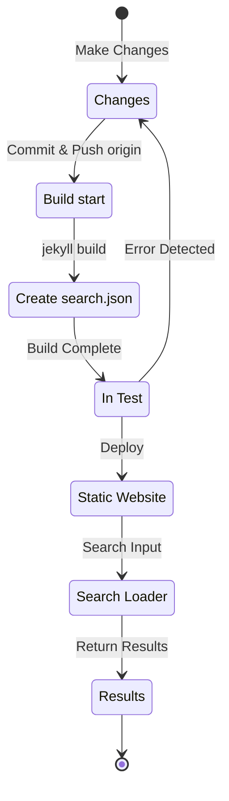

## 概述
大約在四個月前，也就是 12024 年 7 月初，我為這個透過 Github Pages 託管、基於 Jekyll 的部落格，應用了 [Polyglot](https://github.com/untra/polyglot) 外掛，新增了多語言支援功能。
本系列文章將分享在 Chirpy 主題上應用 Polyglot 外掛時遇到的錯誤及其解決過程，以及考量到 SEO 的 HTML 標頭和 sitemap.xml 的撰寫方法。
本系列共有兩篇文章，您正在閱讀的是系列中的第二篇。
- 第1篇：[Polyglot外掛程式應用 & 實現hreflang alt標籤、sitemap及語言選擇按鈕](/posts/how-to-support-multi-language-on-jekyll-blog-with-polyglot-1)
- 第2篇：Chirpy主題構建失敗及搜尋功能錯誤故障排除（本文）

## 需求條件
- [x] 構建的結果（網頁）應按語言路徑（例如 `/posts/ko/`{: .filepath}、`/posts/ja/`{: .filepath}）分類提供。
- [x] 為了盡量減少多語言支援所需的額外時間和精力，不必在原始markdown文件的YAML front matter中逐一指定'lang'和'permalink'標籤，而是在構建時根據文件所在的本地路徑（例如 `/_posts/ko/`{: .filepath}、`/_posts/ja/`{: .filepath}）自動識別語言。
- [x] 網站中每個頁面的標頭部分應包含適當的Content-Language元標籤、hreflang替代標籤和canonical連結，以滿足Google多語言搜尋的SEO指南。
- [x] 網站中每個語言版本的頁面連結應完整地在`sitemap.xml`{: .filepath}中提供，而`sitemap.xml`{: .filepath}本身應只存在於根路徑中，不得重複。
- [x] [Chirpy主題](https://github.com/cotes2020/jekyll-theme-chirpy)提供的所有功能應在各語言頁面中正常運作，如果不正常，則需進行修改使其正常運作。
  - [x] 'Recently Updated'、'Trending Tags'功能正常運作
  - [x] 使用GitHub Actions構建過程中不出現錯誤
  - [x] 部落格右上角的文章搜尋功能正常運作

## 開始之前
這篇文章是[第1篇](/posts/how-to-support-multi-language-on-jekyll-blog-with-polyglot-1)的延續，如果您還沒有閱讀，建議先閱讀前一篇文章。

## 故障排除 ('relative_url_regex': target of repeat operator is not specified)
完成前面的步驟後，執行`bundle exec jekyll serve`命令進行構建測試時，出現了`'relative_url_regex': target of repeat operator is not specified`錯誤，導致構建失敗。

```shell
...(前略)
                    ------------------------------------------------
      Jekyll 4.3.4   Please append `--trace` to the `serve` command 
                     for any additional information or backtrace. 
                    ------------------------------------------------
/Users/yunseo/.gem/ruby/3.2.2/gems/jekyll-polyglot-1.8.1/lib/jekyll/polyglot/
patches/jekyll/site.rb:234:in `relative_url_regex': target of repeat operator 
is not specified: /href="?\/((?:(?!*.gem)(?!*.gemspec)(?!tools)(?!README.md)(
?!LICENSE)(?!*.config.js)(?!rollup.config.js)(?!package*.json)(?!.sass-cache)
(?!.jekyll-cache)(?!gemfiles)(?!Gemfile)(?!Gemfile.lock)(?!node_modules)(?!ve
ndor\/bundle\/)(?!vendor\/cache\/)(?!vendor\/gems\/)(?!vendor\/ruby\/)(?!en\/
)(?!ko\/)(?!es\/)(?!pt-BR\/)(?!ja\/)(?!fr\/)(?!de\/)[^,'"\s\/?.]+\.?)*(?:\/[^
\]\[)("'\s]*)?)"/ (RegexpError)

...(後略)
```

搜尋類似問題後，發現Polyglot倉庫中已有[完全相同的問題](https://github.com/untra/polyglot/issues/204)被報告，且已有解決方案。

本部落格使用的[Chirpy主題的`_config.yml`{: .filepath}](https://github.com/cotes2020/jekyll-theme-chirpy/blob/master/_config.yml)文件中有以下內容：

```yml
exclude:
  - "*.gem"
  - "*.gemspec"
  - docs
  - tools
  - README.md
  - LICENSE
  - "*.config.js"
  - package*.json
```
{: file='_config.yml'}

問題的原因在於[Polyglot的`site.rb`{: .filepath}](https://github.com/untra/polyglot/blob/master/lib/jekyll/polyglot/patches/jekyll/site.rb)文件中的以下兩個函數的正則表達式無法正確處理像`"*.gem"`、`"*.gemspec"`、`"*.config.js"`這樣包含萬用字元的glob模式。


```ruby
    # a regex that matches relative urls in a html document
    # matches href="baseurl/foo/bar-baz" href="/foo/bar-baz" and others like it
    # avoids matching excluded files.  prepare makes sure
    # that all @exclude dirs have a trailing slash.
    def relative_url_regex(disabled = false)
      regex = ''
      unless disabled
        @exclude.each do |x|
          regex += "(?!#{x})"
        end
        @languages.each do |x|
          regex += "(?!#{x}\/)"
        end
      end
      start = disabled ? 'ferh' : 'href'
      %r{#{start}="?#{@baseurl}/((?:#{regex}[^,'"\s/?.]+\.?)*(?:/[^\]\[)("'\s]*)?)"}
    end

    # a regex that matches absolute urls in a html document
    # matches href="http://baseurl/foo/bar-baz" and others like it
    # avoids matching excluded files.  prepare makes sure
    # that all @exclude dirs have a trailing slash.
    def absolute_url_regex(url, disabled = false)
      regex = ''
      unless disabled
        @exclude.each do |x|
          regex += "(?!#{x})"
        end
        @languages.each do |x|
          regex += "(?!#{x}\/)"
        end
      end
      start = disabled ? 'ferh' : 'href'
      %r{(?<!hreflang="#{@default_lang}" )#{start}="?#{url}#{@baseurl}/((?:#{regex}[^,'"\s/?.]+\.?)*(?:/[^\]\[)("'\s]*)?)"}
    end
```
{: file='(polyglot root path)/lib/jekyll/polyglot/patches/jekyll/site.rb'}


解決這個問題有兩種方法：

### 1. Fork Polyglot並修改問題部分
截至撰寫本文時（12024.11.），[Jekyll官方文檔](https://jekyllrb.com/docs/configuration/options/#global-configuration)指出`exclude`設定支援Ruby的File.fnmatch文件名glob模式來匹配多個要排除的項目。

>"This configuration option supports Ruby's File.fnmatch filename globbing patterns to match multiple entries to exclude."

也就是說，問題的根源不在Chirpy主題，而在Polyglot的`relative_url_regex()`和`absolute_url_regex()`兩個函數，因此根本解決方案是修改這些函數以避免問題發生。

由於Polyglot尚未修復此錯誤，可以參考[這篇部落格文章](https://hionpu.com/posts/github_blog_4#4-polyglot-%EC%9D%98%EC%A1%B4%EC%84%B1-%EB%AC%B8%EC%A0%9C)和[GitHub問題中的回覆](https://github.com/untra/polyglot/issues/204#issuecomment-2143270322)，fork Polyglot倉庫後修改問題部分如下，然後使用修改後的版本替代原始Polyglot：


```ruby
    def relative_url_regex(disabled = false)
      regex = ''
      unless disabled
        @exclude.each do |x|
          escaped_x = Regexp.escape(x)
          regex += "(?!#{escaped_x})"
        end
        @languages.each do |x|
          escaped_x = Regexp.escape(x)
          regex += "(?!#{escaped_x}\/)"
        end
      end
      start = disabled ? 'ferh' : 'href'
      %r{#{start}="?#{@baseurl}/((?:#{regex}[^,'"\s/?.]+\.?)*(?:/[^\]\[)("'\s]*)?)"}
    end

    def absolute_url_regex(url, disabled = false)
      regex = ''
      unless disabled
        @exclude.each do |x|
          escaped_x = Regexp.escape(x)
          regex += "(?!#{escaped_x})"
        end
        @languages.each do |x|
          escaped_x = Regexp.escape(x)
          regex += "(?!#{escaped_x}\/)"
        end
      end
      start = disabled ? 'ferh' : 'href'
      %r{(?<!hreflang="#{@default_lang}" )#{start}="?#{url}#{@baseurl}/((?:#{regex}[^,'"\s/?.]+\.?)*(?:/[^\]\[)("'\s]*)?)"}
    end
```
{: file='(polyglot root path)/lib/jekyll/polyglot/patches/jekyll/site.rb'}


### 2. 在Chirpy主題的'_config.yml'設定文件中將glob模式替換為確切的文件名
理想的方法是將上述修補程式合併到Polyglot主線中。但在此之前，需要使用fork版本，這樣每次Polyglot上游更新時都需要跟進，比較麻煩，所以我選擇了另一種方法。

檢查[Chirpy主題倉庫](https://github.com/cotes2020/jekyll-theme-chirpy)中項目根目錄下符合`"*.gem"`、`"*.gemspec"`、`"*.config.js"`模式的文件，實際上只有以下3個：
- `jekyll-theme-chirpy.gemspec`{: .filepath}
- `purgecss.config.js`{: .filepath}
- `rollup.config.js`{: .filepath}

因此，可以在`_config.yml`{: .filepath}文件的`exclude`部分刪除glob模式，改為如下具體文件名：

```yml
exclude: # 參考 https://github.com/untra/polyglot/issues/204 問題進行修改。
  # - "*.gem"
  - jekyll-theme-chirpy.gemspec # - "*.gemspec"
  - tools
  - README.md
  - LICENSE
  - purgecss.config.js # - "*.config.js"
  - rollup.config.js
  - package*.json
```
{: file='_config.yml'}

## 修改搜尋功能
完成前面的步驟後，大部分網站功能都按預期運作良好。然而，我後來發現Chirpy主題頁面右上角的搜尋欄無法索引`site.default_lang`（本部落格為英文）以外語言的頁面，且在非英文語言中搜尋時也只顯示英文頁面的搜尋結果。

為了找出原因，讓我們看看哪些文件與搜尋功能相關，以及問題出在哪裡。

### '_layouts/default.html'
檢查構成部落格所有頁面框架的[`_layouts/default.html`{: .filepath}](https://github.com/cotes2020/jekyll-theme-chirpy/blob/master/_layouts/default.html)文件，可以看到在`<body>`元素內載入了`search-results.html`{: .filepath}和`search-loader.html`{: .filepath}的內容。


```liquid
  <body>
    

    <div id="main-wrapper" class="d-flex justify-content-center">
      <div class="container d-flex flex-column px-xxl-5">
        
        (...中略...)

        
      </div>

      <aside aria-label="Scroll to Top">
        <button id="back-to-top" type="button" class="btn btn-lg btn-box-shadow">
          <i class="fas fa-angle-up"></i>
        </button>
      </aside>
    </div>

    (...中略...)

    
  </body>
```
{: file='_layouts/default.html'}


### '_includes/search-result.html'
[`_includes/search-result.html`{: .filepath}](https://github.com/cotes2020/jekyll-theme-chirpy/blob/master/_includes/search-results.html)構建了一個`search-results`容器，用於在搜尋框輸入關鍵字時存儲該關鍵字的搜尋結果。


```html
<!-- The Search results -->

<div id="search-result-wrapper" class="d-flex justify-content-center d-none">
  <div class="col-11 content">
    <div id="search-hints">
      
    </div>
    <div id="search-results" class="d-flex flex-wrap justify-content-center text-muted mt-3"></div>
  </div>
</div>
```
{: file='_includes/search-result.html'}


### '_includes/search-loader.html'
[`_includes/search-loader.html`{: .filepath}](https://github.com/cotes2020/jekyll-theme-chirpy/blob/master/_includes/search-loader.html)是基於[Simple-Jekyll-Search](https://github.com/christian-fei/Simple-Jekyll-Search)庫實現搜尋功能的核心部分，它在訪問者的瀏覽器中執行JavaScript，從[`search.json`{: .filepath}](#assetsjsdatasearchjson)索引文件中找出與輸入關鍵字匹配的部分，並以`<article>`元素形式返回相應文章連結，實現客戶端搜尋。


```js

  <article class="px-1 px-sm-2 px-lg-4 px-xl-0">
    <header>
      <h2><a href="{url}">{title}</a></h2>
      <div class="post-meta d-flex flex-column flex-sm-row text-muted mt-1 mb-1">
        {categories}
        {tags}
      </div>
    </header>
    <p>{snippet}</p>
  </article>


<p class="mt-5">{{ site.data.locales[include.lang].search.no_results }}</p>

<script>
   Note: dependent library will be loaded in `js-selector.html` 
  document.addEventListener('DOMContentLoaded', () => {
    SimpleJekyllSearch({
      searchInput: document.getElementById('search-input'),
      resultsContainer: document.getElementById('search-results'),
      json: '{{ '/assets/js/data/search.json' | relative_url }}',
      searchResultTemplate: '{{ result_elem | strip_newlines }}',
      noResultsText: '{{ not_found }}',
      templateMiddleware: function(prop, value, template) {
        if (prop === 'categories') {
          if (value === '') {
            return `${value}`;
          } else {
            return `<div class="me-sm-4"><i class="far fa-folder fa-fw"></i>${value}</div>`;
          }
        }

        if (prop === 'tags') {
          if (value === '') {
            return `${value}`;
          } else {
            return `<div><i class="fa fa-tag fa-fw"></i>${value}</div>`;
          }
        }
      }
    });
  });
</script>
```
{: file='_includes/search-loader.html'}


### '/assets/js/data/search.json'

```liquid
---
layout: compress
swcache: true
---

[
  
  {
    "title": {{ post.title | jsonify }},
    "url": {{ post.url | relative_url | jsonify }},
    "categories": {{ post.categories | join: ', ' | jsonify }},
    "tags": {{ post.tags | join: ', ' | jsonify }},
    "date": "{{ post.date }}",
    
    
    "snippet": {{ _content | truncate: 200 | jsonify }},
    "content": {{ _content | jsonify }}
  },
  
]
```
{: file='/assets/js/data/search.json'}


使用Jekyll的Liquid語法定義了一個JSON文件，包含網站中所有文章的標題、URL、分類和標籤信息、發布日期、前200字摘要以及全文內容。

### 搜尋功能運作結構及問題識別
總結來說，在GitHub Pages上託管Chirpy主題時，搜尋功能按以下流程運作：



我確認`search.json`{: .filepath}被Polyglot按以下語言分別生成：
- `/assets/js/data/search.json`{: .filepath}
- `/ko/assets/js/data/search.json`{: .filepath}
- `/es/assets/js/data/search.json`{: .filepath}
- `/pt-BR/assets/js/data/search.json`{: .filepath}
- `/ja/assets/js/data/search.json`{: .filepath}
- `/fr/assets/js/data/search.json`{: .filepath}
- `/de/assets/js/data/search.json`{: .filepath}

因此，問題出在"Search Loader"部分。非英文頁面無法被搜尋到的問題是因為`_includes/search-loader.html`{: .filepath}無論當前訪問頁面的語言是什麼，都只靜態加載英文索引文件（`/assets/js/data/search.json`{: .filepath}）。

> - 不過，與Markdown或html格式文件不同，對於JSON文件，Polyglot wrapper可以處理`post.title`、`post.content`等Jekyll提供的變數，但[Relativized Local Urls](https://github.com/untra/polyglot?tab=readme-ov-file#relativized-local-urls)功能似乎不起作用。
> - 同樣，在JSON文件模板中，除了Jekyll基本提供的變數外，無法訪問[Polyglot額外提供的`{{ site.default_lang }}`、`{{ site.active_lang }}` liquid標籤](https://github.com/untra/polyglot?tab=readme-ov-file#features)，這在測試過程中得到確認。
>
> 因此，索引文件中的`title`、`snippet`、`content`等值會根據語言不同而生成不同內容，但`url`值返回的是不考慮語言的基本路徑，需要在"Search Loader"部分添加適當處理。
{: .prompt-warning }

### 問題解決
要解決這個問題，需要修改`_includes/search-loader.html`{: .filepath}的內容如下：


```

  <article class="px-1 px-sm-2 px-lg-4 px-xl-0">
    <header>
      
      <h2><a href="/{{ site.active_lang }}{url}">{title}</a></h2>
      
      <h2><a href="{url}">{title}</a></h2>
      

(...中略...)

<script>
   Note: dependent library will be loaded in `js-selector.html` 
  document.addEventListener('DOMContentLoaded', () => {
    
    
      
    
    
    SimpleJekyllSearch({
      searchInput: document.getElementById('search-input'),
      resultsContainer: document.getElementById('search-results'),
      json: '{{ search_path | relative_url }}',
      searchResultTemplate: '{{ result_elem | strip_newlines }}',

(...後略)
```
{: file='_includes/search-loader.html'}


- 當`site.active_lang`（當前頁面語言）與`site.default_lang`（網站默認語言）不同時，在從JSON文件加載的文章URL前添加`"/{{ site.active_lang }}"`前綴，修改了``部分的liquid語法。
- 同樣，在構建過程中比較當前頁面語言和網站默認語言，如果相同則使用默認路徑（`/assets/js/data/search.json`{: .filepath}），如果不同則使用對應語言的路徑（例如`/ko/assets/js/data/search.json`{: .filepath}）作為`search_path`，修改了`<script>`部分。

進行上述修改後重新構建網站，確認各語言的搜尋結果都能正常顯示。

> `{url}`是JSON文件中讀取的URL值的佔位符，而非URL本身，因此Polyglot不會將其識別為本地化目標，需要根據語言直接處理。問題是處理後的`"/{{ site.active_lang }}{url}"`會被識別為URL，雖然已完成本地化，但Polyglot不知道這一點，會嘗試重複本地化（例如`"/ko/ko/posts/example-post"`{: .filepath}）。為防止這種情況，使用了[``標籤](https://github.com/untra/polyglot?tab=readme-ov-file#disabling-url-relativizing)。
{: .prompt-tip }
