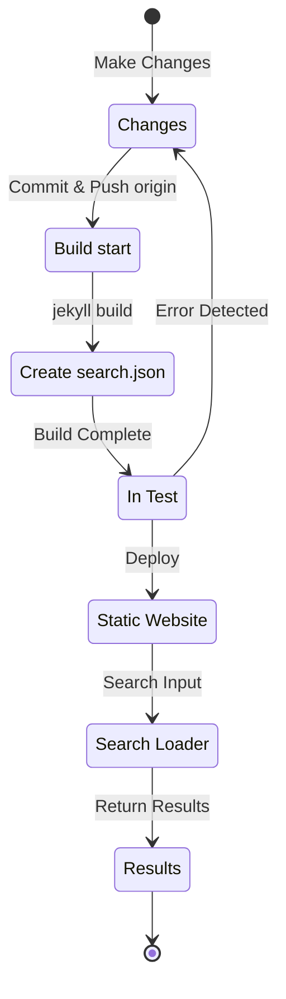

## 概述
大約4個月前，也就是2024年7月初，我在這個通過Github Pages託管的Jekyll基礎部落格上應用了[Polyglot](https://github.com/untra/polyglot)外掛程式來實現多語言支援。
這個系列分享了在Chirpy主題上應用Polyglot外掛程式過程中遇到的錯誤及其解決方法，以及考慮SEO的html標頭和sitemap.xml的編寫方法。
該系列由兩篇文章組成，您正在閱讀的這篇是該系列的第二篇。
- 第1篇：[應用Polyglot外掛程式 & 實現hreflang alt標籤、sitemap和語言選擇按鈕](/posts/how-to-support-multi-language-on-jekyll-blog-with-polyglot-1)
- 第2篇：Chirpy主題構建失敗和搜尋功能錯誤的故障排除（本文）

## 需求
- [x] 必須能夠按語言路徑（例如 `/posts/ko/`{: .filepath}、`/posts/ja/`{: .filepath}）區分提供構建結果（網頁）。
- [x] 為了盡可能減少多語言支援所需的額外時間和精力，即使不在原始markdown檔案的YAML front matter中指定'lang'和'permalink'標籤，也應該能夠根據檔案所在的本地路徑（例如 `/_posts/ko/`{: .filepath}、`/_posts/ja/`{: .filepath}）在構建時自動識別語言。
- [x] 網站內每個頁面的標頭部分應包含適當的Content-Language元標籤和hreflang替代標籤，以滿足Google多語言搜尋的SEO指南。
- [x] 必須能夠在 `sitemap.xml`{: .filepath} 中提供網站內支援每種語言的所有頁面連結，且不遺漏，而 `sitemap.xml`{: .filepath} 本身應該只存在於根路徑中，不得重複。
- [x] [Chirpy主題](https://github.com/cotes2020/jekyll-theme-chirpy)提供的所有功能都應在每種語言頁面上正常運作，如果不正常，則必須進行修改使其正常運作。
  - [x] 'Recently Updated'、'Trending Tags'功能正常運作
  - [x] 使用GitHub Actions的構建過程中不會出現錯誤
  - [x] 部落格右上角的文章搜尋功能正常運作

## 開始之前
這篇文章是[第1篇](/posts/how-to-support-multi-language-on-jekyll-blog-with-polyglot-1)的延續，如果您還沒有閱讀，建議先閱讀前一篇文章。

## 故障排除（'relative_url_regex': target of repeat operator is not specified）
完成前面的步驟後，當執行 `bundle exec jekyll serve` 命令進行構建測試時，出現了 `'relative_url_regex': target of repeat operator is not specified` 錯誤，導致構建失敗。

```shell
...(前略)
                    ------------------------------------------------
      Jekyll 4.3.4   Please append `--trace` to the `serve` command 
                     for any additional information or backtrace. 
                    ------------------------------------------------
/Users/yunseo/.gem/ruby/3.2.2/gems/jekyll-polyglot-1.8.1/lib/jekyll/polyglot/
patches/jekyll/site.rb:234:in `relative_url_regex': target of repeat operator 
is not specified: /href="?\/((?:(?!*.gem)(?!*.gemspec)(?!tools)(?!README.md)(
?!LICENSE)(?!*.config.js)(?!rollup.config.js)(?!package*.json)(?!.sass-cache)
(?!.jekyll-cache)(?!gemfiles)(?!Gemfile)(?!Gemfile.lock)(?!node_modules)(?!ve
ndor\/bundle\/)(?!vendor\/cache\/)(?!vendor\/gems\/)(?!vendor\/ruby\/)(?!en\/
)(?!ko\/)(?!es\/)(?!pt-BR\/)(?!ja\/)(?!fr\/)(?!de\/)[^,'"\s\/?.]+\.?)*(?:\/[^
\]\[)("'\s]*)?)"/ (RegexpError)

...(後略)
```

搜尋是否有類似問題被報告過後，發現在Polyglot儲存庫中已經有[完全相同的問題](https://github.com/untra/polyglot/issues/204)被登記，並且也存在解決方案。

在本部落格應用的[Chirpy主題的 `_config.yml`{: .filepath}](https://github.com/cotes2020/jekyll-theme-chirpy/blob/master/_config.yml) 檔案中存在以下語句：

```yml
exclude:
  - "*.gem"
  - "*.gemspec"
  - docs
  - tools
  - README.md
  - LICENSE
  - "*.config.js"
  - package*.json
```
{: file='_config.yml'}

問題的原因在於[Polyglot的 `site.rb`{: .filepath}](https://github.com/untra/polyglot/blob/master/lib/jekyll/polyglot/patches/jekyll/site.rb) 檔案中包含的以下兩個函數的正則表達式語句無法正確處理上述 `"*.gem"`、`"*.gemspec"`、`"*.config.js"` 等包含萬用字元的全域模式（globbing pattern）。


```ruby
    # a regex that matches relative urls in a html document
    # matches href="baseurl/foo/bar-baz" href="/foo/bar-baz" and others like it
    # avoids matching excluded files.  prepare makes sure
    # that all @exclude dirs have a trailing slash.
    def relative_url_regex(disabled = false)
      regex = ''
      unless disabled
        @exclude.each do |x|
          regex += "(?!#{x})"
        end
        @languages.each do |x|
          regex += "(?!#{x}\/)"
        end
      end
      start = disabled ? 'ferh' : 'href'
      %r{#{start}="?#{@baseurl}/((?:#{regex}[^,'"\s/?.]+\.?)*(?:/[^\]\[)("'\s]*)?)"}
    end

    # a regex that matches absolute urls in a html document
    # matches href="http://baseurl/foo/bar-baz" and others like it
    # avoids matching excluded files.  prepare makes sure
    # that all @exclude dirs have a trailing slash.
    def absolute_url_regex(url, disabled = false)
      regex = ''
      unless disabled
        @exclude.each do |x|
          regex += "(?!#{x})"
        end
        @languages.each do |x|
          regex += "(?!#{x}\/)"
        end
      end
      start = disabled ? 'ferh' : 'href'
      %r{(?<!hreflang="#{@default_lang}" )#{start}="?#{url}#{@baseurl}/((?:#{regex}[^,'"\s/?.]+\.?)*(?:/[^\]\[)("'\s]*)?)"}
    end
```
{: file='(polyglot root path)/lib/jekyll/polyglot/patches/jekyll/site.rb'}


解決這個問題有兩種方法。

### 1. 分叉（fork）Polyglot後修改問題部分並使用
截至撰寫本文時（2024.11.），[Jekyll官方文件](https://jekyllrb.com/docs/configuration/options/#global-configuration)中明確指出 `exclude` 設置支援使用全域模式（globbing pattern）。

>"This configuration option supports Ruby's File.fnmatch filename globbing patterns to match multiple entries to exclude."

也就是說，問題的根源不在Chirpy主題，而在於Polyglot的 `relative_url_regex()`、`absolute_url_regex()` 這兩個函數，因此修改這些函數使其不會出現問題是根本的解決方案。

由於Polyglot中該錯誤尚未解決，可以參考[這篇部落格文章](https://hionpu.com/posts/github_blog_4#4-polyglot-%EC%9D%98%EC%A1%B4%EC%84%B1-%EB%AC%B8%EC%A0%9C)和[前面GitHub問題中的回答](https://github.com/untra/polyglot/issues/204#issuecomment-2143270322)，分叉（fork）Polyglot儲存庫後，將問題部分修改如下，然後使用修改後的版本代替原始Polyglot。


```ruby
    def relative_url_regex(disabled = false)
      regex = ''
      unless disabled
        @exclude.each do |x|
          escaped_x = Regexp.escape(x)
          regex += "(?!#{escaped_x})"
        end
        @languages.each do |x|
          escaped_x = Regexp.escape(x)
          regex += "(?!#{escaped_x}\/)"
        end
      end
      start = disabled ? 'ferh' : 'href'
      %r{#{start}="?#{@baseurl}/((?:#{regex}[^,'"\s/?.]+\.?)*(?:/[^\]\[)("'\s]*)?)"}
    end

    def absolute_url_regex(url, disabled = false)
      regex = ''
      unless disabled
        @exclude.each do |x|
          escaped_x = Regexp.escape(x)
          regex += "(?!#{escaped_x})"
        end
        @languages.each do |x|
          escaped_x = Regexp.escape(x)
          regex += "(?!#{escaped_x}\/)"
        end
      end
      start = disabled ? 'ferh' : 'href'
      %r{(?<!hreflang="#{@default_lang}" )#{start}="?#{url}#{@baseurl}/((?:#{regex}[^,'"\s/?.]+\.?)*(?:/[^\]\[)("'\s]*)?)"}
    end
```
{: file='(polyglot root path)/lib/jekyll/polyglot/patches/jekyll/site.rb'}


### 2. 在Chirpy主題的 '_config.yml' 設定檔中將全域模式（globbing pattern）替換為精確的檔案名
事實上，最正統和理想的方法是將上述修補程式合併到Polyglot的主線中。然而，在此之前，我們必須使用分叉版本代替，但這種情況下，每次Polyglot上游版本更新時，都需要不遺漏地反映和跟進該更新，這會很麻煩，所以我使用了另一種方法。

如果查看[Chirpy主題儲存庫](https://github.com/cotes2020/jekyll-theme-chirpy)中專案根目錄下的檔案，對應 `"*.gem"`、`"*.gemspec"`、`"*.config.js"` 模式的檔案其實只有以下3個：
- `jekyll-theme-chirpy.gemspec`{: .filepath}
- `purgecss.config.js`{: .filepath}
- `rollup.config.js`{: .filepath}

因此，在 `_config.yml`{: .filepath} 檔案的 `exclude` 語句中刪除全域模式（globbing pattern），並按以下方式重寫，Polyglot就能夠正常處理：

```yml
exclude: # 參考 https://github.com/untra/polyglot/issues/204 問題進行修改。
  # - "*.gem"
  - jekyll-theme-chirpy.gemspec # - "*.gemspec"
  - tools
  - README.md
  - LICENSE
  - purgecss.config.js # - "*.config.js"
  - rollup.config.js
  - package*.json
```
{: file='_config.yml'}

## 修改搜尋功能
完成前面的步驟後，幾乎所有的網站功能都按預期令人滿意地運作。然而，我後來發現應用Chirpy主題的頁面右上角的搜尋欄無法索引 `site.default_lang`（在本部落格的情況下是英語）以外的語言頁面，而且在英語以外的其他語言中搜尋時，搜尋結果也會顯示英語頁面，這是一個問題。

為了了解原因，讓我們看看哪些檔案與搜尋功能有關，以及問題出在哪裡。

### '_layouts/default.html'
檢查構成部落格內所有頁面框架的 [`_layouts/default.html`{: .filepath}](https://github.com/cotes2020/jekyll-theme-chirpy/blob/master/_layouts/default.html) 檔案，可以看到在 `<body>` 元素內載入了 `search-results.html`{: .filepath} 和 `search-loader.html`{: .filepath} 的內容。


```liquid
  <body>
    

    <div id="main-wrapper" class="d-flex justify-content-center">
      <div class="container d-flex flex-column px-xxl-5">
        
        (...中略...)

        
      </div>

      <aside aria-label="Scroll to Top">
        <button id="back-to-top" type="button" class="btn btn-lg btn-box-shadow">
          <i class="fas fa-angle-up"></i>
        </button>
      </aside>
    </div>

    (...中略...)

    
  </body>
```
{: file='_layouts/default.html'}


### '_includes/search-result.html'
[`_includes/search-result.html`{: .filepath}](https://github.com/cotes2020/jekyll-theme-chirpy/blob/master/_includes/search-results.html) 構建了一個 `search-results` 容器，用於在搜尋框輸入搜尋詞時儲存該關鍵字的搜尋結果。


```html
<!-- The Search results -->

<div id="search-result-wrapper" class="d-flex justify-content-center d-none">
  <div class="col-11 content">
    <div id="search-hints">
      
    </div>
    <div id="search-results" class="d-flex flex-wrap justify-content-center text-muted mt-3"></div>
  </div>
</div>
```
{: file='_includes/search-result.html'}


### '_includes/search-loader.html'
[`_includes/search-loader.html`{: .filepath}](https://github.com/cotes2020/jekyll-theme-chirpy/blob/master/_includes/search-loader.html) 是基於 [Simple-Jekyll-Search](https://github.com/christian-fei/Simple-Jekyll-Search) 庫實現搜尋的核心部分，它通過在訪客的瀏覽器上執行JavaScript來查找 [`search.json`{: .filepath}](#assetsjsdatasearchjson) 索引檔案內容中與輸入關鍵字匹配的部分，並將相應的文章連結作為 `<article>` 元素返回，從而實現客戶端搜尋功能。


```js

  <article class="px-1 px-sm-2 px-lg-4 px-xl-0">
    <header>
      <h2><a href="{url}">{title}</a></h2>
      <div class="post-meta d-flex flex-column flex-sm-row text-muted mt-1 mb-1">
        {categories}
        {tags}
      </div>
    </header>
    <p>{snippet}</p>
  </article>


<p class="mt-5">{{ site.data.locales[include.lang].search.no_results }}</p>

<script>
   Note: dependent library will be loaded in `js-selector.html` 
  document.addEventListener('DOMContentLoaded', () => {
    SimpleJekyllSearch({
      searchInput: document.getElementById('search-input'),
      resultsContainer: document.getElementById('search-results'),
      json: '{{ '/assets/js/data/search.json' | relative_url }}',
      searchResultTemplate: '{{ result_elem | strip_newlines }}',
      noResultsText: '{{ not_found }}',
      templateMiddleware: function(prop, value, template) {
        if (prop === 'categories') {
          if (value === '') {
            return `${value}`;
          } else {
            return `<div class="me-sm-4"><i class="far fa-folder fa-fw"></i>${value}</div>`;
          }
        }

        if (prop === 'tags') {
          if (value === '') {
            return `${value}`;
          } else {
            return `<div><i class="fa fa-tag fa-fw"></i>${value}</div>`;
          }
        }
      }
    });
  });
</script>
```
{: file='_includes/search-loader.html'}


### '/assets/js/data/search.json'

```liquid
---
layout: compress
swcache: true
---

[
  
  {
    "title": {{ post.title | jsonify }},
    "url": {{ post.url | relative_url | jsonify }},
    "categories": {{ post.categories | join: ', ' | jsonify }},
    "tags": {{ post.tags | join: ', ' | jsonify }},
    "date": "{{ post.date }}",
    
    
    "snippet": {{ _content | truncate: 200 | jsonify }},
    "content": {{ _content | jsonify }}
  },
  
]
```
{: file='/assets/js/data/search.json'}


使用Jekyll的Liquid語法定義了一個JSON檔案，包含網站內所有文章的標題、URL、分類和標籤信息、撰寫日期、前200字的摘要，以及全文內容。

### 搜尋功能運作結構和問題發生部分識別
總結一下，在GitHub Pages上託管Chirpy主題時，搜尋功能按以下流程運作：



在這裡，我確認 `search.json`{: .filepath} 被Polyglot按以下方式為每種語言生成：
- `/assets/js/data/search.json`{: .filepath}
- `/ko/assets/js/data/search.json`{: .filepath}
- `/es/assets/js/data/search.json`{: .filepath}
- `/pt-BR/assets/js/data/search.json`{: .filepath}
- `/ja/assets/js/data/search.json`{: .filepath}
- `/fr/assets/js/data/search.json`{: .filepath}
- `/de/assets/js/data/search.json`{: .filepath}

因此，問題的根源在於"Search Loader"部分。無法搜尋到英文以外其他語言版本頁面的問題是因為 `_includes/search-loader.html`{: .filepath} 無論當前訪問的頁面語言如何，都只靜態地載入英文索引檔案（`/assets/js/data/search.json`{: .filepath}）。

> - 然而，與Markdown或html格式檔案不同，對於JSON檔案，Polyglot wrapper雖然對 `post.title`、`post.content` 等Jekyll提供的變數有效，但[Relativized Local Urls](https://github.com/untra/polyglot?tab=readme-ov-file#relativized-local-urls)功能似乎不起作用。
> - 同樣，在JSON檔案模板中，除了Jekyll默認提供的變數外，無法訪問[Polyglot額外提供的 `{{ site.default_lang }}`、`{{ site.active_lang }}` liquid標籤](https://github.com/untra/polyglot?tab=readme-ov-file#features)，這一點在測試過程中得到確認。
>
> 因此，索引檔案中的 `title`、`snippet`、`content` 等值會根據語言不同而生成不同的內容，但 `url` 值會返回不考慮語言的默認路徑，需要在"Search Loader"部分添加適當的處理。
{: .prompt-warning }

### 問題解決
要解決這個問題，需要將 `_includes/search-loader.html`{: .filepath} 的內容修改如下：


```

  <article class="px-1 px-sm-2 px-lg-4 px-xl-0">
    <header>
      
      <h2><a href="/{{ site.active_lang }}{url}">{title}</a></h2>
      
      <h2><a href="{url}">{title}</a></h2>
      

(...中略...)

<script>
   Note: dependent library will be loaded in `js-selector.html` 
  document.addEventListener('DOMContentLoaded', () => {
    
    
      
    
    
    SimpleJekyllSearch({
      searchInput: document.getElementById('search-input'),
      resultsContainer: document.getElementById('search-results'),
      json: '{{ search_path | relative_url }}',
      searchResultTemplate: '{{ result_elem | strip_newlines }}',

(...後略)
```
{: file='_includes/search-loader.html'}


- 修改了 `` 部分的liquid語句，當 `site.active_lang`（當前頁面語言）和 `site.default_lang`（網站默認語言）不同時，在從JSON檔案讀取的文章URL前加上 `"/{{ site.active_lang }}"` 前綴。
- 使用相同的方法，修改了 `<script>` 部分，在構建過程中比較當前頁面的語言和網站默認語言，如果相同則指定默認路徑（`/assets/js/data/search.json`{: .filepath}），如果不同則指定對應語言的路徑（例如 `/ko/assets/js/data/search.json`{: .filepath}）作為 `search_path`。

進行上述修改後重新構建網站，確認每種語言的搜尋結果都能正常顯示。

> `{url}` 是未來從JSON檔案中讀取的URL值的佔位符，而不是URL本身，因此Polyglot不會將其識別為本地化目標，需要直接根據語言進行處理。問題是，經過這樣處理的 `"/{{ site.active_lang }}{url}"` 會被識別為URL，雖然本地化已經完成，但Polyglot並不知道這一點，因此會嘗試重複進行本地化（例如 `"/ko/ko/posts/example-post"`{: .filepath}）。為了防止這種情況，我們明確使用了 [`` 標籤](https://github.com/untra/polyglot?tab=readme-ov-file#disabling-url-relativizing)。
{: .prompt-tip }
