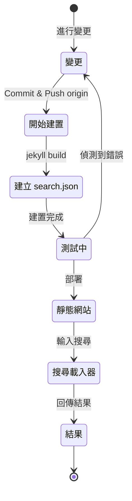

## 概述
12024 年 7 月初，我為這個透過 Github Pages 託管、基於 Jekyll 的部落格，應用了 [Polyglot](https://github.com/untra/polyglot) 外掛，新增了多語言支援功能。
本系列將分享在 Chirpy 主題上應用 Polyglot 外掛過程中遇到的錯誤及其解決過程，並分享考量到 SEO 的 html 標頭與 sitemap.xml 的撰寫方法。
本系列由三篇文章組成，您正在閱讀的是系列中的第三篇。
- 第1篇：[Polyglot外掛程式應用 & html標頭及sitemap修改](/posts/how-to-support-multi-language-on-jekyll-blog-with-polyglot-1)
- 第2篇：[實現語言選擇按鈕 & 版面配置語言本地化](/posts/how-to-support-multi-language-on-jekyll-blog-with-polyglot-2)
- 第3篇：Chirpy主題構建失敗及搜尋功能錯誤故障排除（本文）

> 原本此系列為兩篇文章，但經過數次內容補充後，篇幅大幅增加，因此改為三篇文章。
{: .prompt-info }

## 需求條件
- [x] 構建的結果（網頁）應按語言路徑（例如 `/posts/ko/`{: .filepath}、`/posts/ja/`{: .filepath}）分類提供。
- [x] 為了盡量減少多語言支援所需的額外時間和精力，不必在原始markdown文件的YAML front matter中逐一指定'lang'和'permalink'標籤，而是在構建時根據文件所在的本地路徑（例如 `/_posts/ko/`{: .filepath}、`/_posts/ja/`{: .filepath}）自動識別語言。
- [x] 網站中每個頁面的標頭部分應包含適當的Content-Language元標籤、hreflang替代標籤和canonical連結，以滿足Google多語言搜尋的SEO指南。
- [x] 網站中每個語言版本的頁面連結應完整地在`sitemap.xml`{: .filepath}中提供，而`sitemap.xml`{: .filepath}本身應只存在於根路徑中，不得重複。
- [x] [Chirpy主題](https://github.com/cotes2020/jekyll-theme-chirpy)提供的所有功能應在各語言頁面中正常運作，如果不正常，則需進行修改使其正常運作。
  - [x] 'Recently Updated'、'Trending Tags'功能正常運作
  - [x] 使用GitHub Actions構建過程中不出現錯誤
  - [x] 部落格右上角的文章搜尋功能正常運作

## 開始之前
本文接續自[第1篇](/posts/how-to-support-multi-language-on-jekyll-blog-with-polyglot-1)與[第2篇](/posts/how-to-support-multi-language-on-jekyll-blog-with-polyglot-2)，如果您尚未閱讀，建議先從前兩篇文章開始。

## 疑難排解 ('relative_url_regex': target of repeat operator is not specified)
完成前述步驟後，當我執行`bundle exec jekyll serve`指令進行建置測試時，發生了`'relative_url_regex': target of repeat operator is not specified`的錯誤，導致建置失敗。

```shell
...(略)
                    ------------------------------------------------
      Jekyll 4.3.4   Please append `--trace` to the `serve` command 
                     for any additional information or backtrace. 
                    ------------------------------------------------
/Users/yunseo/.gem/ruby/3.2.2/gems/jekyll-polyglot-1.8.1/lib/jekyll/polyglot/
patches/jekyll/site.rb:234:in `relative_url_regex': target of repeat operator 
is not specified: /href="?\/((?:(?!*.gem)(?!*.gemspec)(?!tools)(?!README.md)(
?!LICENSE)(?!*.config.js)(?!rollup.config.js)(?!package*.json)(?!.sass-cache)
(?!.jekyll-cache)(?!gemfiles)(?!Gemfile)(?!Gemfile.lock)(?!node_modules)(?!ve
ndor\/bundle\/)(?!vendor\/cache\/)(?!vendor\/gems\/)(?!vendor\/ruby\/)(?!en\/
)(?!ko\/)(?!es\/)(?!pt-BR\/)(?!ja\/)(?!fr\/)(?!de\/)[^,'"\s\/?.]+\.?)*(?:\/[^
\]\[)("'\s]*)?)"/ (RegexpError)

...(略)
```

經過搜尋，我發現在 Polyglot 的儲存庫中，已經有人回報了[完全相同的問題](https://github.com/untra/polyglot/issues/204)，並且已經有了可行的解決方案。

在本部落格正在使用的 [Chirpy 主題的 `_config.yml`{: .filepath} 檔案](https://github.com/cotes2020/jekyll-theme-chirpy/blob/master/_config.yml) 中，存在以下這段設定。

```yml
exclude:
  - "*.gem"
  - "*.gemspec"
  - docs
  - tools
  - README.md
  - LICENSE
  - "*.config.js"
  - package*.json
```
{: file='\_config.yml'}

問題的原因在於，[Polyglot 的 `site.rb`{: .filepath} 檔案](https://github.com/untra/polyglot/blob/master/lib/jekyll/polyglot/patches/jekyll/site.rb) 中包含的兩個函式，其正規表示式語法無法正常處理像上述 `"*.gem"`、`"*.gemspec"`、`"*.config.js"` 這樣包含萬用字元的 globbing 模式 (globbing pattern)。


```ruby
    # a regex that matches relative urls in a html document
    # matches href="baseurl/foo/bar-baz" href="/foo/bar-baz" and others like it
    # avoids matching excluded files.  prepare makes sure
    # that all @exclude dirs have a trailing slash.
    def relative_url_regex(disabled = false)
      regex = ''
      unless disabled
        @exclude.each do |x|
          regex += "(?!#{x})"
        end
        @languages.each do |x|
          regex += "(?!#{x}\/)"
        end
      end
      start = disabled ? 'ferh' : 'href'
      %r{#{start}="?#{@baseurl}/((?:#{regex}[^,'"\s/?.]+\.?)*(?:/[^\]\[)("'\s]*)?)"}
    end

    # a regex that matches absolute urls in a html document
    # matches href="http://baseurl/foo/bar-baz" and others like it
    # avoids matching excluded files.  prepare makes sure
    # that all @exclude dirs have a trailing slash.
    def absolute_url_regex(url, disabled = false)
      regex = ''
      unless disabled
        @exclude.each do |x|
          regex += "(?!#{x})"
        end
        @languages.each do |x|
          regex += "(?!#{x}\/)"
        end
      end
      start = disabled ? 'ferh' : 'href'
      %r{(?<!hreflang="#{@default_lang}" )#{start}="?#{url}#{@baseurl}/((?:#{regex}[^,'"\s/?.]+\.?)*(?:/[^\]\[)("'\s]*)?)"}
    end
```
{: file='(polyglot 根目錄)/lib/jekyll/polyglot/patches/jekyll/site.rb'}


解決這個問題的方法有兩種。

### 1. Fork Polyglot並修改問題部分
截至撰寫本文時（12024.11.），[Jekyll官方文檔](https://jekyllrb.com/docs/configuration/options/#global-configuration)中明確指出 `exclude` 設定支援使用 globbing 模式。

>"This configuration option supports Ruby's File.fnmatch filename globbing patterns to match multiple entries to exclude."

也就是說，問題的根源不在於 Chirpy 主題，而是在 Polyglot 的 `relative_url_regex()` 和 `absolute_url_regex()` 這兩個函式，因此，修改這兩個函式以避免問題發生，才是根本的解決方案。

由於 Polyglot 中的這個錯誤尚未被修復，因此可以~~參考[這篇部落格文章](https://hionpu.com/posts/github_blog_4#4-polyglot-%EC%9D%98%EC%A1%B4%EC%84%B1-%EB%AC%B8%EC%A0%9C)（網站已失效）和~~[前面提到的 GitHub issue 中的回覆](https://github.com/untra/polyglot/issues/204#issuecomment-2143270322)，將 Polyglot 儲存庫派生 (fork) 後，將有問題的部分修改如下，即可用來取代原始的 Polyglot。


```ruby
    def relative_url_regex(disabled = false)
      regex = ''
      unless disabled
        @exclude.each do |x|
          escaped_x = Regexp.escape(x)
          regex += "(?!#{escaped_x})"
        end
        @languages.each do |x|
          escaped_x = Regexp.escape(x)
          regex += "(?!#{escaped_x}\/)"
        end
      end
      start = disabled ? 'ferh' : 'href'
      %r{#{start}="?#{@baseurl}/((?:#{regex}[^,'"\s/?.]+\.?)*(?:/[^\]\[)("'\s]*)?)"}
    end

    def absolute_url_regex(url, disabled = false)
      regex = ''
      unless disabled
        @exclude.each do |x|
          escaped_x = Regexp.escape(x)
          regex += "(?!#{escaped_x})"
        end
        @languages.each do |x|
          escaped_x = Regexp.escape(x)
          regex += "(?!#{escaped_x}\/)"
        end
      end
      start = disabled ? 'ferh' : 'href'
      %r{(?<!hreflang="#{@default_lang}" )#{start}="?#{url}#{@baseurl}/((?:#{regex}[^,'"\s/?.]+\.?)*(?:/[^\]\[)("'\s]*)?)"}
    end
```
{: file='(polyglot 根目錄)/lib/jekyll/polyglot/patches/jekyll/site.rb'}


### 2. 在Chirpy主題的'\_config.yml'設定文件中將glob模式替換為確切的文件名
理想的方法是將上述修補程式合併到Polyglot主線中。但在此之前，需要使用fork版本，這樣每次Polyglot上游更新時都需要跟進，比較麻煩，所以我選擇了另一種方法。

在[Chirpy主題的儲存庫](https://github.com/cotes2020/jekyll-theme-chirpy)中，檢查位於專案根目錄且符合`"*.gem"`、`"*.gemspec"`、`"*.config.js"`模式的檔案，會發現其實也只有以下這三個檔案。
- `jekyll-theme-chirpy.gemspec`{: .filepath}
- `purgecss.config.js`{: .filepath}
- `rollup.config.js`{: .filepath}

因此，在`_config.yml`{: .filepath}檔案的`exclude`區塊中，刪除globbing模式並改成如下所示的內容，Polyglot 就能夠順利處理了。

```yml
exclude: # 參考 https://github.com/untra/polyglot/issues/204 issue 進行修改。
  # - "*.gem"
  - jekyll-theme-chirpy.gemspec # - "*.gemspec"
  - tools
  - README.md
  - LICENSE
  - purgecss.config.js # - "*.config.js"
  - rollup.config.js
  - package*.json
```
{: file='\_config.yml'}

## 修改搜尋功能
完成前述步驟後，網站上絕大部分的功能都如預期般正常運作。然而，我後來才發現一個問題：套用Chirpy主題的頁面右上角的搜尋欄，無法索引`site.default_lang`（以本部落格為例，即英文）以外的語言頁面；且在非英文頁面進行搜尋時，搜尋結果也只會顯示英文頁面的連結。

為了找出原因，我們來檢視一下與搜尋功能相關的檔案，並找出問題出在哪個環節。

### '\_layouts/default.html'
檢視構成部落格所有頁面框架的 [`_layouts/default.html`{: .filepath} 檔案](https://github.com/cotes2020/jekyll-theme-chirpy/blob/master/_layouts/default.html)，可以看到它在 `<body>` 元素中載入了 `search-results.html`{: .filepath} 和 `search-loader.html`{: .filepath} 的內容。


```liquid
  <body>
    

    <div id="main-wrapper" class="d-flex justify-content-center">
      <div class="container d-flex flex-column px-xxl-5">
        
        (...略...)

        
      </div>

      <aside aria-label="Scroll to Top">
        <button id="back-to-top" type="button" class="btn btn-lg btn-box-shadow">
          <i class="fas fa-angle-up"></i>
        </button>
      </aside>
    </div>

    (...略...)

    
  </body>
```
{: file='\_layouts/default.html'}


### '\_includes/search-result.html'
[`_includes/search-result.html`{: .filepath}](https://github.com/cotes2020/jekyll-theme-chirpy/blob/master/_includes/search-results.html)用於建構`search-results`容器，以便在搜尋框中輸入關鍵字時，儲存對應的搜尋結果。


```html
<!-- 搜尋結果 -->

<div id="search-result-wrapper" class="d-flex justify-content-center d-none">
  <div class="col-11 content">
    <div id="search-hints">
      
    </div>
    <div id="search-results" class="d-flex flex-wrap justify-content-center text-muted mt-3"></div>
  </div>
</div>
```
{: file='\_includes/search-result.html'}


### '\_includes/search-loader.html'
[`_includes/search-loader.html`{: .filepath}](https://github.com/cotes2020/jekyll-theme-chirpy/blob/master/_includes/search-loader.html)正是實作基於[Simple-Jekyll-Search](https://github.com/christian-fei/Simple-Jekyll-Search)函式庫的搜尋功能的關鍵部分。它會在[`search.json`{: .filepath}](#assetsjsdatasearchjson)索引檔的內容中尋找與輸入關鍵字相符的部分，並透過在訪客的瀏覽器上執行 JavaScript，將對應的文章連結以`<article>`元素的形式回傳，由此可知它是以客戶端(Client-Side)的方式運作。


```js

  <article class="px-1 px-sm-2 px-lg-4 px-xl-0">
    <header>
      <h2><a href="{url}">{title}</a></h2>
      <div class="post-meta d-flex flex-column flex-sm-row text-muted mt-1 mb-1">
        {categories}
        {tags}
      </div>
    </header>
    <p>{snippet}</p>
  </article>


<p class="mt-5">{{ site.data.locales[include.lang].search.no_results }}</p>

<script>
   注意：相依的函式庫將在 'js-selector.html' 中載入 
  document.addEventListener('DOMContentLoaded', () => {
    SimpleJekyllSearch({
      searchInput: document.getElementById('search-input'),
      resultsContainer: document.getElementById('search-results'),
      json: '{{ '/assets/js/data/search.json' | relative_url }}',
      searchResultTemplate: '{{ result_elem | strip_newlines }}',
      noResultsText: '{{ not_found }}',
      templateMiddleware: function(prop, value, template) {
        if (prop === 'categories') {
          if (value === '') {
            return `${value}`;
          } else {
            return `<div class="me-sm-4"><i class="far fa-folder fa-fw"></i>${value}</div>`;
          }
        }

        if (prop === 'tags') {
          if (value === '') {
            return `${value}`;
          } else {
            return `<div><i class="fa fa-tag fa-fw"></i>${value}</div>`;
          }
        }
      }
    });
  });
</script>
```
{: file='\_includes/search-loader.html'}


### '/assets/js/data/search.json'

```liquid
---
layout: compress
swcache: true
---

[
  
  {
    "title": {{ post.title | jsonify }},
    "url": {{ post.url | relative_url | jsonify }},
    "categories": {{ post.categories | join: ', ' | jsonify }},
    "tags": {{ post.tags | join: ', ' | jsonify }},
    "date": "{{ post.date }}",
    
    
    "snippet": {{ _content | truncate: 200 | jsonify }},
    "content": {{ _content | jsonify }}
  },
  
]
```
{: file='/assets/js/data/search.json'}


此檔案利用Jekyll的Liquid語法，定義了一個JSON檔案，其中包含了網站內所有文章的標題、URL、分類與標籤資訊、撰寫日期、內文前200字的摘要，以及完整的內文內容。

### 搜尋功能運作架構及問題點分析
總結來說，在GitHub Pages上託管Chirpy主題時，搜尋功能的運作流程如下。



在此過程中，我確認了`search.json`{: .filepath}會由Polyglot針對各種語言分別產生，如下所示。
- `/assets/js/data/search.json`{: .filepath}
- `/ko/assets/js/data/search.json`{: .filepath}
- `/ja/assets/js/data/search.json`{: .filepath}
- `/zh-TW/assets/js/data/search.json`{: .filepath}
- `/es/assets/js/data/search.json`{: .filepath}
- `/pt-BR/assets/js/data/search.json`{: .filepath}
- `/fr/assets/js/data/search.json`{: .filepath}
- `/de/assets/js/data/search.json`{: .filepath}

因此，問題的根源在於「搜尋載入器 (Search Loader)」。之所以無法搜尋到英文以外的其他語言版本頁面，是因為 `_includes/search-loader.html`{: .filepath} 無論當前瀏覽頁面的語言為何，都只會靜態地載入英文的索引檔 (`/assets/js/data/search.json`{: .filepath})。

> - 不過，與Markdown或HTML格式的檔案不同，對於JSON檔案，Polyglot針對`post.title`、`post.content` 等 Jekyll 內建變數的包裝器(wrapper)雖然能正常運作，但[Relativized Local Urls](https://github.com/untra/polyglot?tab=readme-ov-file#relativized-local-urls)功能似乎無法作用。
> - 同樣地，在測試過程中我已確認，在JSON檔案範本中，除了Jekyll內建的變數外，無法存取[Polyglot額外提供的`{{ site.default_lang }}`、`{{ site.active_lang }}` liquid標籤](https://github.com/untra/polyglot?tab=readme-ov-file#features)。
>
> 因此，索引檔中的`title`、`snippet`、`content`等值會根據語言產生不同的內容，但`url`的值回傳的卻是未考慮語言的基本路徑，所以必須在「搜尋載入器 (Search Loader)」部分為其追加適當的處理。
{: .prompt-warning }

### 解決問題
要解決這個問題，只需將`_includes/search-loader.html`{: .filepath}的內容修改如下即可。


```

  <article class="px-1 px-sm-2 px-lg-4 px-xl-0">
    <header>
      
      <h2><a href="/{{ site.active_lang }}{url}">{title}</a></h2>
      
      <h2><a href="{url}">{title}</a></h2>
      

(...略...)

<script>
   注意：相依的函式庫將在 'js-selector.html' 中載入 
  document.addEventListener('DOMContentLoaded', () => {
    
    
      
    
    
    SimpleJekyllSearch({
      searchInput: document.getElementById('search-input'),
      resultsContainer: document.getElementById('search-results'),
      json: '{{ search_path | relative_url }}',
      searchResultTemplate: '{{ result_elem | strip_newlines }}',

(...略...)
```
{: file='\_includes/search-loader.html'}


- 當`site.active_lang`（當前頁面語言）和`site.default_lang`（網站預設語言）不相同時，我修改了 `` 部分的liquid語法，在從JSON檔案讀取的文章URL前方加上`"/{{ site.active_lang }}"`的前綴。
- 用同樣的方法，我修改了`<script>`部分，使其在建置過程中比較當前頁面的語言和網站的預設語言。如果兩者相同，則將`search_path`指定為預設路徑(`/assets/js/data/search.json`{: .filepath})；如果不同，則指定為對應語言的路徑（例如 `/ko/assets/js/data/search.json`{: .filepath}）。

如上修改後，重新建置網站，我確認了搜尋結果現在可以根據不同語言正常顯示。

> `{url}`是一個佔位符，在執行搜尋時，JavaScript會將從JSON檔案讀取到的URL值填入此處，它在建置時點並不是一個有效的URL，因此Polyglot不會將其視為本地化的對象，必須根據語言手動處理。問題在於，經過這樣處理的`"/{{ site.active_lang }}{url}"` 範本在建置時會被識別為相對URL，雖然本地化已經完成，但Polyglot並不知道這一點，因此會試圖進行重複的本地化（例如：`"/ko/ko/posts/example-post"`{: .filepath}）。為了防止這種情況，我明確指定了[``標籤](https://github.com/untra/polyglot?tab=readme-ov-file#disabling-url-relativizing)。
{: .prompt-tip }
