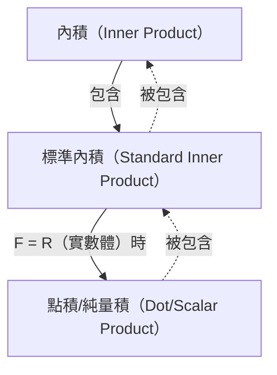

## 先備知識
- [向量與線性組合](/posts/vectors-and-linear-combinations/)

## 內積

一般的 $F$-向量空間中的**內積(inner product)**定義如下。

> **內積(inner product)與內積空間(inner product space)的定義**  
> 考慮 $F$-向量空間 $\mathbb{V}$。$\mathbb{V}$ 上的**內積(inner product)** $\langle \mathbf{x},\mathbf{y} \rangle$定義為一個函數，將 $\mathbb{V}$ 中任意兩個向量 $\mathbf{x}$ 與 $\mathbf{y}$ 的有序對對應到 $F$ 中的一個純量，並滿足下列條件：
>
> 對任意 $\mathbf{x},\mathbf{y},\mathbf{z} \in \mathbb{V}$ 與任意 $c \in F$，
> 1. $\langle \mathbf{x}+\mathbf{z}, \mathbf{y} \rangle = \langle \mathbf{x}, \mathbf{y} \rangle + \langle \mathbf{z}, \mathbf{y} \rangle$
> 2. $\langle c\mathbf{x}, \mathbf{y} \rangle = c \langle \mathbf{x}, \mathbf{y} \rangle$
> 3. $\overline{\langle \mathbf{x}, \mathbf{y} \rangle} = \langle \mathbf{y}, \mathbf{x} \rangle$（$\overline{\mathbf{z}}$ 為 $\mathbf{z}$ 的共軛複數）
> 4. 當 $\mathbf{x} \neq \mathbf{0}$ 時，$\langle \mathbf{x}, \mathbf{x} \rangle$ 為正數。
>
> 具備內積的 $F$-向量空間 $\mathbb{V}$ 稱為**內積空間(inner product space)**。特別地，當 $F=\mathbb{C}$ 時稱為**複內積空間(complex inner product space)**，當 $F=\mathbb{R}$ 時稱為**實內積空間(real inner product space)**。
{: .prompt-info }

特別地，下述內積稱為**標準內積(standard inner product)**。可驗證標準內積滿足上述四項條件。

> **標準內積(standard inner product)的定義**  
> 對 $F^n$ 中的兩個向量 $\mathbf{x}=(a_1, a_2, \dots, a_n)$、$\mathbf{y}=(b_1, b_2, \dots, b_n)$，$F^n$ 的**標準內積(standard inner product)**定義為
>
> $$\langle \mathbf{x}, \mathbf{y} \rangle = \sum_{i=1}^n a_i \overline{b_i} $$
>
{: .prompt-info }

此處若 $F=\mathbb{R}$，因為實數的共軛複數即其本身，此時的標準內積為 $\sum_{i=1}^n a_i b_i$。特別地，在此情形常以 $\mathbf{x} \cdot \mathbf{y}$ 表記標準內積，並稱為**點積(dot product)**或**純量積(scalar product)**。

> **點積(dot product)/純量積(scalar product)的定義**  
> 對 $\mathbb{R}^n$ 中的 $\mathbf{v}=(v_1, v_2, \dots, v_n)$、$\mathbf{w}=(w_1, w_2, \dots, w_n)$，$\mathbb{R}^n$ 的**點積(dot product)**或**純量積(scalar product)**定義為
>
> $$ \mathbf{v} \cdot \mathbf{w} = \sum_{i=1}^n v_i w_i = v_1 w_1 + v_2 w_2 + \cdots + v_n w_n $$
> 
{: .prompt-info }

> 此處所稱的「純量積（scalar product）」是向量與向量之間的運算；而在[向量與線性組合](/posts/vectors-and-linear-combinations/)中討論的、標量與向量之間的運算「純量乘法（scalar multiplication）」則是另一種不同的運算。由於英文表述也相近，且[依據大韓數學會的韓語術語標準，兩者的韓文譯名甚至完全相同](https://www.kms.or.kr/mathdict/list.html?key=kname&keyword=%EC%8A%A4%EC%B9%BC%EB%9D%BC%EA%B3%B1)，因此請留意不要混淆。
>
> 為避免混淆，下文將儘量以**點積(dot product)**稱呼之。
{: .prompt-warning }

> 在歐幾里得空間中的內積(inner product)即為點積(dot product)，因此在語境不致混淆時，亦常直接以內積稱呼點積。不過嚴格來說，內積是包含點積在內的更一般概念。
{: .prompt-tip }

## 向量的長度/範數

對 $\mathbb{R}^n$ 中的向量 $\mathbf{v}=(v_1, v_2, \dots, v_n)$，$\mathbf{v}$ 的歐幾里得長度可由點積定義如下：

$$ \| \mathbf{v} \| = \sqrt{\mathbf{v} \cdot \mathbf{v}} = \left[ \sum_{i=1}^n |v_i|^2 \right]^{1/2} = \sqrt{v_1^2 + v_2^2 + \cdots + v_n^2} $$

更一般地，在任意內積空間中，向量的**長度(length)**或**範數(norm)**定義為

$$ \| \mathbf{x} \| = \sqrt{\langle \mathbf{x}, \mathbf{x} \rangle} $$

在一般內積空間中，向量範數滿足下列重要性質。

> **定理**  
> 對 $F$-內積空間 $\mathbb{V}$、任意向量 $\mathbf{x}, \mathbf{y} \in \mathbb{V}$ 以及純量 $c \in F$，有：
> 1. $\\|c\mathbf{x}\\| = \|c\| \cdot \\|\mathbf{x}\\|$
> 2. 下列兩式成立：
>    - $\\|\mathbf{x}\\| = 0 \iff \mathbf{x}=\mathbf{0}$
>    - $\\|\mathbf{x}\\| \geq 0 \ \forall \mathbf{x}$
> 3. **柯西－施瓦茲不等式(Cauchy-Schwarz inequality)**：$\| \langle \mathbf{x}, \mathbf{y} \rangle \| \leq \\|\mathbf{x}\\| \cdot \\|\mathbf{y}\\|$（等號當且僅當 $\mathbf{x}$ 與 $\mathbf{y}$ 之一是另一者的純量倍）
> 4. **三角不等式(triangle inequality)**：$\\| \mathbf{x} + \mathbf{y} \\| \leq \\|\mathbf{x}\\| + \\|\mathbf{y}\\|$（等號當且僅當 $\mathbf{x}$ 與 $\mathbf{y}$ 之一是另一者的純量倍，且兩者方向相同）
{: .prompt-info }

## 向量間的夾角與單位向量

長度為 1 的向量稱為**單位向量(unit vector)**。此外，對 $\mathbb{R}^n$ 中的兩個向量 $\mathbf{v}=(v_1, v_2, \dots, v_n)$、$\mathbf{w}=(w_1, w_2, \dots, w_n)$，有 $\mathbf{v} \cdot \mathbf{w} = \\|\mathbf{v}\\| \cdot \\|\mathbf{w}\\| \cos\theta$，據此可求出 $\mathbf{v}$ 與 $\mathbf{w}$ 之間的夾角 $\theta$（$0 \leq \theta \leq \pi$）。

$$ \theta = \arccos{\frac{\mathbf{v} \cdot \mathbf{w}}{\|\mathbf{v}\| \cdot \|\mathbf{w}\|}} $$

當 $\mathbf{v} \cdot \mathbf{w} = 0$ 時，稱兩向量**垂直(perpendicular)**或**正交(orthogonal)**。

> 當兩向量 $\mathbf{v}$ 與 $\mathbf{w}$ 垂直時，
>
> $$ \begin{align*}
> \| \mathbf{v} + \mathbf{w} \|^2 &= (\mathbf{v} + \mathbf{w}) \cdot (\mathbf{v} + \mathbf{w}) \\
> &= \mathbf{v} \cdot \mathbf{v} + \mathbf{v} \cdot \mathbf{w} + \mathbf{w} \cdot \mathbf{v} + \mathbf{w} \cdot \mathbf{w} \\
> &= \mathbf{v} \cdot \mathbf{v} + \mathbf{w} \cdot \mathbf{w} \\
> &= \|\mathbf{v}\|^2 + \|\mathbf{w}\|^2.
> \end{align*} $$
>
{: .prompt-tip }

將其推廣至任意內積空間如下。

> **定義**  
> 考慮內積空間 $\mathbb{V}$。對 $\mathbb{V}$ 中的向量 $\mathbf{x}, \mathbf{y}$，若 $\langle \mathbf{x}, \mathbf{y} \rangle = 0$，則稱兩向量**正交(orthogonal)**或**垂直(perpendicular)**。此外，
> 1. 對 $\mathbb{V}$ 的子集 $S$，若 $S$ 中任意兩個彼此不同的向量皆相互正交，則稱 $S$ 為**正交集(orthogonal set)**。
> 2. 對 $\\|\mathbf{x}\\|=1$ 的向量 $\mathbf{x} \in \mathbb{V}$，稱為**單位向量(unit vector)**。
> 3. 若 $\mathbb{V}$ 的子集 $S$ 為正交集，且元素全為單位向量，則稱 $S$ 為**正交歸一集(orthonormal set)**。
{: .prompt-info }

集合 $S = \{ \mathbf{v}_1, \mathbf{v}_2, \dots \}$ 為正交歸一集的充要條件為 $\langle \mathbf{v}\_i, \mathbf{v}\_j \rangle = \delta\_{ij}$。對向量乘以非零純量不影響正交性。

對任意非零向量 $\mathbf{x}$，$\cfrac{\mathbf{x}}{\\|\mathbf{x}\\|}$ 為單位向量。如此將非零向量乘以其長度的倒數以得到單位向量的過程稱為**正規化(normalizing)**。
